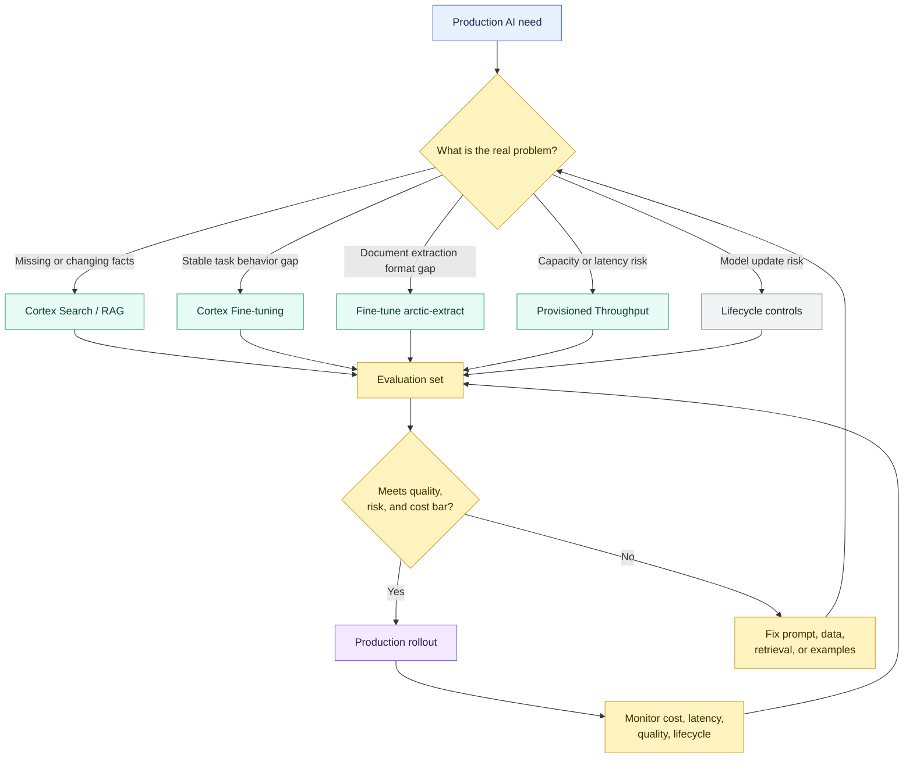

# Cortex Fine-tuning, Provisioned Throughput, and Model Lifecycle

> [!abstract] Consultant lens
> **What it is:** Advanced Cortex operations for customized and capacity-managed model use.
>
> **Why it matters:** Know when normal prompting or RAG is enough, and when production AI needs tuning, reserved throughput, or lifecycle governance.

## Executive Summary

- **What it is:** Snowflake Cortex capabilities for fine-tuning supported models, reserving managed inference throughput, and controlling model changes over time.
- **Why it matters:** Production AI is not just prompts. Some workloads need task-specific behavior, predictable capacity, approved models, evaluation evidence, and a migration plan when models change or retire.
- **Mental model:** **Prompting/RAG is the default. Fine-tuning changes model behavior. Provisioned Throughput reserves capacity. Model lifecycle controls stop production AI from drifting silently.**
- **Best used when:** A proven AI workload has stable demand, repeatable quality gaps, or throughput/latency requirements that normal inference cannot satisfy.
- **Avoid or reconsider when:** The use case is still exploratory, the facts are missing, the prompt is vague, the retrieval layer is weak, or demand has not been measured.

## What It Can Do

- Fine-tune supported Cortex LLMs using `prompt` and `completion` examples from Snowflake tables or views.
- Fine-tune `arctic-extract` document extraction models with Snowflake Datasets, then use the tuned model with `AI_EXTRACT`.
- Save fine-tuned models as governed model objects in Snowflake, with privileges and model artifacts.
- Track fine-tuning jobs with `CREATE`, `SHOW`, `DESCRIBE`, and `CANCEL` actions through `SNOWFLAKE.CORTEX.FINETUNE`.
- Reserve managed inference capacity for supported models using Provisioned Throughput Units, or PTUs.
- Improve production planning around model availability, deprecation, region support, and behavior changes.
- Build regression testing and approval gates around model, prompt, source-data, and retrieval changes.

## What It Cannot Do

- Make bad examples, inconsistent labels, vague instructions, or weak evaluation datasets reliable.
- Replace RAG when the issue is missing or changing knowledge.
- Guarantee that a tuned model keeps working if the underlying base model is removed.
- Eliminate the need for human review in regulated, client-impacting, legal, credit, compliance, or operational decisions.
- Make reserved throughput economical before workload volume and request shape are understood.
- Remove region, access-control, cost, licensing, acceptable-use, and model-risk considerations.
- Replace a broader MLOps or model-risk framework for high-impact production systems.

## Core Concepts

| Concept | Meaning | Why it matters |
|---|---|---|
| Fine-tuning | Training a supported base model further on reviewed task examples | Useful when task behavior needs to become more consistent |
| PEFT | Parameter-efficient fine-tuning | Customizes behavior without training a foundation model from scratch |
| Base model | The original supported model being fine-tuned | Fine-tuned models depend on the base model remaining available |
| Prompt/completion pair | Example input and desired output for LLM fine-tuning | Shows the model how to respond for a stable task |
| `arctic-extract` | Snowflake document extraction model family used by `AI_EXTRACT` | Relevant for repeated document extraction formats |
| Snowflake Dataset | Versioned dataset object used for `arctic-extract` fine-tuning | Gives document fine-tuning a reproducible training/validation input |
| Evaluation set | Representative test cases with reviewed expected outputs | Proves whether tuning improves the workload before promotion |
| Provisioned Throughput | Reserved managed inference capacity for supported Cortex models | Helps stabilize production API traffic and predictable high-volume workloads |
| PTU | Provisioned Throughput Unit | Unit used to size reserved inference capacity |
| Model lifecycle | Model maturity, update, legacy, deprecation, and end-of-life status | Prevents surprise breakage when models change |
| Regression test | Repeatable test suite run before and after model/prompt/source changes | Protects production quality |
| Rollback plan | Approved path back to a prior prompt, model, search service, or workflow | Required when AI behavior regresses |

## How It Works (Simple Flow)

1. Prove the use case with normal prompting, structured outputs, Cortex Search/RAG, `AI_EXTRACT`, or other managed AI functions first.
2. Build a representative evaluation set with reviewed expected outputs, edge cases, and failure examples.
3. Diagnose the real bottleneck: missing facts, poor prompt, weak retrieval, unstable document format, task behavior gap, latency, throughput, or model lifecycle risk.
4. If facts are missing or changing, improve retrieval, source curation, or semantic modeling rather than fine-tuning.
5. If behavior is inconsistent on a stable repeated task, prepare training and validation data and create a fine-tuning job.
6. If capacity is the problem, measure request volume, token shape, latency, and concurrency before reserving Provisioned Throughput.
7. Promote only after regression tests, cost estimates, access grants, region checks, review thresholds, and rollback plans are approved.
8. Monitor quality, cost, latency, throughput, model availability, deprecation notices, and user feedback after release.

## Visuals



## Readable Snippets

### Fine-tune a supported LLM

```sql
-- Training and validation queries must return prompt and completion columns.
SELECT SNOWFLAKE.CORTEX.FINETUNE(
  'CREATE',
  'client_note_style_model',
  'mistral-7b',
  'SELECT prompt, completion FROM ai_training.client_note_train',
  'SELECT prompt, completion FROM ai_training.client_note_validation',
  '{"max_epochs": 3}'
);
```

### Check and use a fine-tuning job

```sql
-- List jobs in the account.
SELECT SNOWFLAKE.CORTEX.FINETUNE('SHOW');

-- Inspect a specific job.
SELECT SNOWFLAKE.CORTEX.FINETUNE(
  'DESCRIBE',
  'ft_6556e15c-8f12-4d94-8cb0-87e6f2fd2299'
);

-- Use the resulting fine-tuned model for inference.
SELECT AI_COMPLETE(
  'client_note_style_model',
  'Rewrite this operational note into the approved client-service format: ...'
);
```

### Fine-tune `arctic-extract` for document extraction

```sql
-- Representative shape only.
-- Training/validation dataset versions contain File, Prompt, and Response columns.
SELECT SNOWFLAKE.CORTEX.FINETUNE(
  'CREATE',
  '@risk_ai.doc_models.counterparty_extract_model',
  'arctic-extract',
  'snow://dataset/training_ds/versions/2',
  'snow://dataset/validation_ds/versions/4',
  '{"max_epochs": 3}'
);
```

```sql
-- Use a fine-tuned arctic-extract model with AI_EXTRACT.
SELECT AI_EXTRACT(
  model => 'risk_ai.doc_models.counterparty_extract_model',
  file => TO_FILE('@risk_docs.contracts', 'client_agreement.pdf')
);
```

### Reserve Provisioned Throughput

```sql
-- Provisioned Throughput is capacity planning, not model quality improvement.
GRANT CREATE PROVISIONED THROUGHPUT ON ACCOUNT
  TO ROLE ai_platform_admin;

CREATE PROVISIONED THROUGHPUT analyst_assistant_pt
  CLOUD_PROVIDER = 'aws'
  MODEL = 'llama3.1-8B'
  PTUS = 64
  TERM_START = '2026-09-01'
  TERM_END = '2026-10-01';

DESCRIBE PROVISIONED THROUGHPUT analyst_assistant_pt;
```

### Monitor fine-tuning training cost

```sql
SELECT *
FROM snowflake.account_usage.cortex_fine_tuning_usage_history
WHERE start_time >= DATEADD('day', -30, CURRENT_TIMESTAMP())
ORDER BY start_time DESC;
```

## Important Terms

| Term | Meaning |
|---|---|
| Fine-tuning | Teaching a supported model a stable behavior pattern from examples |
| Prompt engineering | Improving instructions and examples at inference time, without changing the model |
| RAG | Retrieving current context before generation, without changing the model |
| Structured output | Requesting responses in a controlled schema or JSON-like shape |
| Training dataset | Examples used to adapt the model |
| Validation dataset | Held-out examples used to measure training progress |
| Training loss | Signal that shows how well the model fits training examples |
| Validation loss | Signal that helps detect whether training generalizes beyond the training examples |
| Trained tokens | Input tokens multiplied by training epochs, used for fine-tuning cost |
| PTU | Reserved capacity unit for Provisioned Throughput |
| Lifecycle status | Preview, GA, Legacy, or End of Life style maturity/support signal |
| Model deprecation | Notice that a model should be migrated away from before it becomes unavailable |

## Consultant Talking Points

- **Client question this answers:** "Do we need to fine-tune the model, reserve throughput, or just improve the prompt/RAG setup?"
- **Trade-offs to mention:** Fine-tuning and reserved throughput add control, but also cost, evaluation burden, governance work, and lifecycle ownership.
- **Risk or governance angle:** Fine-tuned models and high-volume AI services need owners, approved data, access control, test sets, cost monitoring, migration plans, and rollback.
- **Cost/performance angle:** Fine-tuning costs depend on trained tokens and epochs; fine-tuned inference has AI function cost; Provisioned Throughput charges for allocated PTUs even if usage is lower.

## Bank Example

A bank has a compliance document assistant and a KYC extraction pipeline.

| Need | Better Snowflake pattern | Why |
|---|---|---|
| Analysts ask questions over policies and procedures | Cortex Search/RAG | Policies change; keep facts in governed documents |
| The assistant answers in the wrong format | Prompt templates or structured outputs first | Cheaper and easier than fine-tuning |
| The assistant still fails a stable house-style rewrite task | Fine-tune a supported LLM | Stable behavior can be learned from reviewed examples |
| KYC forms have repeated layouts and extraction mistakes | Fine-tune `arctic-extract` | Improves repeated document extraction behavior |
| Hundreds of analysts use the assistant every morning | Provisioned Throughput if measured demand justifies it | More predictable capacity for production traffic |
| A model is marked legacy or deprecated | Lifecycle migration with regression tests | Prevents silent production breakage |
| Extracted outputs affect compliance evidence | Human review and audit trail | AI accelerates, but humans own high-impact decisions |

## Where This Fits

| Situation | Recommend |
|---|---|
| Missing or changing facts | Cortex Search/RAG, semantic models, or better source curation |
| Output format is inconsistent | Prompting, examples, structured outputs, then evaluate |
| Stable repeated language task still underperforms | Cortex Fine-tuning if supported |
| Stable repeated document extraction underperforms | Fine-tune `arctic-extract` and use with `AI_EXTRACT` |
| Workload has unpredictable early adoption | Standard serverless inference first |
| Workload has predictable high-volume API traffic | Provisioned Throughput after measuring request/token shape |
| Model changes could break production | Regression suite, lifecycle tracking, and rollback plan |
| Model is preview-only | Treat as evaluation unless business accepts faster change risk |
| AI output affects regulated decisions | Human review, deterministic policy checks, observability, and model-risk process |

## Common Pitfalls

- Fine-tuning because the model lacks facts that should live in retrieval, tables, or governed documents.
- Fine-tuning before fixing bad prompts, vague task definitions, poor source data, or weak extraction schemas.
- Training on inconsistent examples created by different reviewers without a gold-standard rubric.
- Using demo examples as the evaluation set and then overestimating production quality.
- Forgetting that fine-tuned models depend on the underlying base model remaining available.
- Ignoring that cross-region inference does not support fine-tuned models; inference must be planned around the model object's region.
- Reserving Provisioned Throughput before demand, token volume, latency, and concurrency are measured.
- Forgetting that Provisioned Throughput does not auto-renew and stops after the term expires.
- Treating lower training loss as proof that the model is safe or business-correct.
- Skipping cost showback for training jobs, fine-tuned inference, PTUs, storage, and supporting warehouses.
- Promoting model/prompt changes without regression tests, review thresholds, and rollback.

## When to Recommend What (Decision Table)

| Situation | Recommend | Why | Watch-outs |
|---|---|---|---|
| Missing facts, policies, or current knowledge | Cortex Search/RAG | Keeps knowledge external and fresh | Retrieval quality, citations, access filters |
| Weak output format on a simple task | Prompting, examples, structured output | Lowest operational overhead | May not solve deeper behavior issues |
| Stable repeated classification/summarization/rewrite task still fails | Cortex Fine-tuning | Can improve behavior from examples | Needs high-quality labeled data and evals |
| Repeated document extraction over known forms/contracts fails | Fine-tune `arctic-extract` | Improves extraction for specific formats/domains | Dataset quality and human validation |
| High-volume API workload has predictable usage | Provisioned Throughput | Reserves inference capacity | PTU cost is charged for allocation, not actual usage |
| Early AI experiment | Standard AI functions and small eval sets | Fast learning with low commitment | Do not over-engineer capacity or tuning |
| Model is preview, legacy, or approaching deprecation | Lifecycle migration plan | Avoids breakage when model changes | Requires regression suite and owner |
| AI is used in regulated workflow | Human review plus governance controls | Reduces operational and compliance risk | Slower delivery and more evidence needed |

## Related Topics

- [[01 Snowflake/05 Advanced Analytics and AI/Advanced Analytics and AI Overview]]
- [[01 Snowflake/05 Advanced Analytics and AI/33 Cortex AI Functions]]
- [[01 Snowflake/05 Advanced Analytics and AI/37 Cortex Search and RAG]]
- [[01 Snowflake/05 Advanced Analytics and AI/39 AI Governance, Guardrails, Observability, and Cost]]
- [[01 Snowflake/05 Advanced Analytics and AI/41 Feature Store and ML Operations]]
- [[01 Snowflake/06 Cost Management and Operations/44 Credit Consumption Model]]

## Related Decision Notes

- [[80 Comparisons and Decision Notes/Decision Notes/Snowflake/Decisions - Choosing a Snowflake AI and ML Pattern]]

## Questions

- Is the quality gap caused by missing context, model behavior, data quality, retrieval quality, or unclear instructions?
- Is the task stable enough that examples today will still be valid next month?
- Who owns the gold-standard evaluation set and review rubric?
- Which base model is approved, available in the required region, and suitable for production?
- What demand pattern justifies Provisioned Throughput instead of standard managed inference?
- What happens when the base model becomes legacy or reaches end of life?
- Which outputs require human review before downstream use?
- How will training cost, inference cost, PTU cost, latency, failures, and quality be monitored?

## Sources To Revisit

- [Snowflake Docs: Cortex Fine-tuning](https://docs.snowflake.com/en/user-guide/snowflake-cortex/cortex-finetuning)
- [Snowflake Docs: FINETUNE CREATE](https://docs.snowflake.com/en/sql-reference/functions/finetune-create)
- [Snowflake Docs: Fine-tuning arctic-extract models](https://docs.snowflake.com/en/user-guide/snowflake-cortex/arctic-extract-finetuning)
- [Snowflake Docs: Provisioned Throughput](https://docs.snowflake.com/en/user-guide/snowflake-cortex/provisioned-throughput)
- [Snowflake Docs: CREATE PROVISIONED THROUGHPUT](https://docs.snowflake.com/en/sql-reference/sql/create-provisioned-throughput)
- [Snowflake Docs: Snowflake AI and ML model lifecycle policy](https://docs.snowflake.com/en/guides-overview-ai-features)
- [Snowflake Docs: Models and regional availability for Cortex AI Functions](https://docs.snowflake.com/en/user-guide/snowflake-cortex/aisql-regional-availability)
- [Snowflake Docs: CORTEX_FINE_TUNING_USAGE_HISTORY](https://docs.snowflake.com/en/sql-reference/account-usage/cortex_fine_tuning_usage_history)
