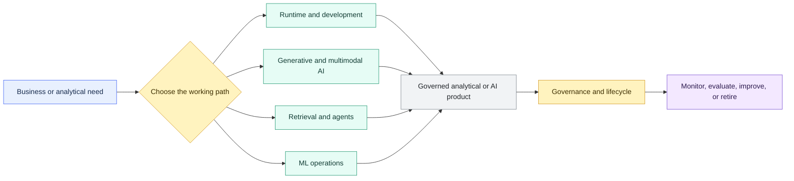

# Advanced Analytics and AI Overview

> [!abstract] Chapter outcome
> Recognize the main Snowflake AI and ML paths, match each one to the right problem, and identify the governance and lifecycle controls needed before production use.

## Topics

**Runtime and development**

- [[01 Snowflake/05 Advanced Analytics and AI/32 Snowpark|32 - Snowpark]]
- [[01 Snowflake/05 Advanced Analytics and AI/36 Snowflake Notebooks|36 - Snowflake Notebooks]]

**Generative and multimodal AI**

- [[01 Snowflake/05 Advanced Analytics and AI/33 Cortex AI Functions|33 - Cortex AI Functions]]
- [[01 Snowflake/05 Advanced Analytics and AI/34 Cortex Analyst|34 - Cortex Analyst]]
- [[01 Snowflake/05 Advanced Analytics and AI/42 Document and Multimodal AI|42 - Document and Multimodal AI]]

**Retrieval and agents**

- [[01 Snowflake/05 Advanced Analytics and AI/37 Cortex Search and RAG|37 - Cortex Search and RAG]]
- [[01 Snowflake/05 Advanced Analytics and AI/38 Cortex Agents and CoWork|38 - Cortex Agents and CoWork]]

**ML operations**

- [[01 Snowflake/05 Advanced Analytics and AI/35 ML Model Registry|35 - ML Model Registry]]
- [[01 Snowflake/05 Advanced Analytics and AI/40 ML Functions for Forecasting, Anomaly Detection, and Classification|40 - ML Functions]]
- [[01 Snowflake/05 Advanced Analytics and AI/41 Feature Store and ML Operations|41 - Feature Store and ML Operations]]

**Governance and lifecycle**

- [[01 Snowflake/05 Advanced Analytics and AI/39 AI Governance, Guardrails, Observability, and Cost|39 - AI Governance, Guardrails, Observability, and Cost]]
- [[01 Snowflake/05 Advanced Analytics and AI/43 Cortex Fine-tuning, Provisioned Throughput, and Model Lifecycle|43 - Cortex Fine-tuning, Provisioned Throughput, and Model Lifecycle]]

## Chapter Map

## Topic Summaries

| Topic | What it unlocks |
|---|---|
| [[01 Snowflake/05 Advanced Analytics and AI/32 Snowpark\|Snowpark]] | DataFrame-based processing that runs close to governed Snowflake data. |
| [[01 Snowflake/05 Advanced Analytics and AI/33 Cortex AI Functions\|Cortex AI Functions]] | Managed AI enrichment through SQL and Python functions. |
| [[01 Snowflake/05 Advanced Analytics and AI/34 Cortex Analyst\|Cortex Analyst]] | Natural-language questions over governed business semantics. |
| [[01 Snowflake/05 Advanced Analytics and AI/35 ML Model Registry\|ML Model Registry]] | Versioned, permissioned deployment and serving of trained models. |
| [[01 Snowflake/05 Advanced Analytics and AI/36 Snowflake Notebooks\|Snowflake Notebooks]] | Governed SQL and Python exploration, prototyping, and scheduled analysis. |
| [[01 Snowflake/05 Advanced Analytics and AI/37 Cortex Search and RAG\|Cortex Search and RAG]] | Retrieval-grounded answers from approved enterprise knowledge. |
| [[01 Snowflake/05 Advanced Analytics and AI/38 Cortex Agents and CoWork\|Cortex Agents and CoWork]] | Multi-step workflows across data, documents, code, and tools. |
| [[01 Snowflake/05 Advanced Analytics and AI/39 AI Governance, Guardrails, Observability, and Cost\|AI Governance]] | Controls for access, safety, quality, residency, monitoring, and spend. |
| [[01 Snowflake/05 Advanced Analytics and AI/40 ML Functions for Forecasting, Anomaly Detection, and Classification\|ML Functions]] | Packaged forecasting, anomaly detection, and classification patterns. |
| [[01 Snowflake/05 Advanced Analytics and AI/41 Feature Store and ML Operations\|Feature Store and ML Operations]] | Reusable features and a governed path from training to monitoring. |
| [[01 Snowflake/05 Advanced Analytics and AI/42 Document and Multimodal AI\|Document and Multimodal AI]] | Structured, searchable outputs from documents, images, audio, and video. |
| [[01 Snowflake/05 Advanced Analytics and AI/43 Cortex Fine-tuning, Provisioned Throughput, and Model Lifecycle\|Cortex model lifecycle]] | Tuning, reserved capacity, and lifecycle decisions for advanced production needs. |

## Consultant Synthesis

| Client need | Start with | Ask before recommending |
|---|---|---|
| Python processing near governed data | Snowpark or Notebooks | Is this exploration, reusable transformation, or production execution? |
| Common AI enrichment | Cortex AI Functions | Can quality, sensitive inputs, and cost be bounded and reviewed? |
| Natural-language analytics | Cortex Analyst | Are metrics, joins, permissions, and evaluation explicit? |
| Answers grounded in enterprise content | Cortex Search and RAG | Is the source content curated, permissioned, and refreshable? |
| Multi-step AI workflow | Cortex Agents | Does the task truly need orchestration beyond SQL, search, or one model call? |
| Common forecasting or classification | ML Functions | Does the packaged pattern fit the risk and explainability requirements? |
| Governed custom ML lifecycle | Feature Store and Model Registry | Who owns features, versions, monitoring, retraining, and retirement? |
| Production AI at scale | Governance and model lifecycle controls | Are safety, residency, latency, capacity, and spend limits defined? |

## How To Use This Area

Start with the chapter map, then follow the path closest to the client problem. Read the governance note alongside any feature that will handle sensitive data or influence a material decision.

## Related Areas

- [[00 Home/Snowflake Learning Map|Snowflake Learning Map]]
- [[01 Snowflake/03 Security and Governance/Security and Governance Overview|Security and Governance Overview]]
- [[01 Snowflake/06 Cost Management and Operations/Cost Management and Operations Overview|Cost Management and Operations Overview]]
- [[01 Snowflake/08 Enterprise Snowflake in Production/Enterprise Snowflake in Production Overview|Enterprise Snowflake in Production Overview]]
