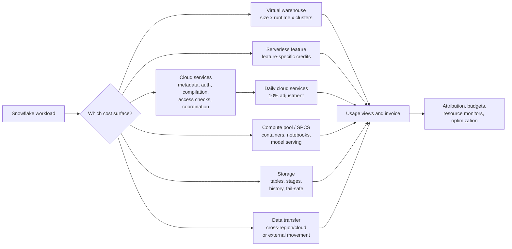

# Credit Consumption Model

> How Snowflake turns compute, storage, serverless services, and data movement into billable usage. Consultant lens: start cost conversations by identifying the cost surface that actually moved.

## Executive Summary

- **What it is:** Snowflake's cost model for compute credits, storage volume, and data transfer usage.
- **Why it matters:** Clients will ask why Snowflake spend changed, whether it is justified, and how to reduce waste without harming workloads.
- **Mental model:** **Do not start with "Snowflake is expensive." Start with "which surface consumed more: warehouse, serverless, cloud services, compute pool, storage, or data transfer?"**
- **Best used when:** Estimating workload cost, diagnosing spend spikes, reconciling invoices, designing budgets, tagging workloads, or explaining why a feature has a separate billing line.
- **Avoid or reconsider when:** Someone wants exact contract pricing from a generic model, business value analysis without usage context, or optimization before attribution is understood.

## What It Can Do

- Explain the main Snowflake cost buckets: compute, storage, and data transfer.
- Show how virtual warehouses consume credits based on warehouse size, running time, and active cluster count.
- Distinguish user-managed warehouse compute from serverless compute, cloud services compute, and compute pools.
- Explain why credits may be consumed even when no obvious warehouse is running.
- Clarify the daily cloud services billing adjustment, where cloud services are billed only above a threshold tied to daily warehouse usage.
- Explain why storage includes visible table data plus retained historical data, stages, Time Travel, Fail-safe, and clone-related retained partitions.
- Identify data-transfer situations that can create cost, especially cross-region or cross-cloud movement.
- Support practical cost investigation using Account Usage views such as `WAREHOUSE_METERING_HISTORY`, `QUERY_HISTORY`, `QUERY_ATTRIBUTION_HISTORY`, `METERING_HISTORY`, and `METERING_DAILY_HISTORY`.
- Help choose the right cost control: warehouse sizing, auto-suspend, resource monitors, budgets, query tags, feature-specific monitoring, or architecture changes.

## What It Cannot Do

- Provide the exact dollar price of a credit; pricing depends on contract type, region, cloud provider, edition, and commercial terms.
- Prove whether spend is valuable or wasteful without knowing the business purpose of the workload.
- Attribute every cost cleanly if teams do not use query tags, dedicated warehouses, naming conventions, or ownership metadata.
- Prevent spend by itself; the model only explains where spend comes from.
- Make serverless or AI-related usage perfectly predictable before workloads run.
- Capture external cloud-provider costs that may appear outside Snowflake's invoice.
- Replace detailed invoice reconciliation when finance needs exact billed amounts, adjustments, taxes, or contract-specific rates.
- Eliminate the need to monitor new features after enabling them.

## Core Concepts

| Concept | Meaning | Why it matters |
|---|---|---|
| Credit | Snowflake's unit for compute consumption | Credits translate compute activity into billable usage; price per credit is contract-specific |
| Virtual warehouse | User-managed compute for SQL, DML, loading, and Snowpark pushdown | Most familiar and often largest controllable compute surface |
| Warehouse size | Compute capacity assigned to a warehouse | Larger sizes consume more credits per hour but may finish suitable workloads faster |
| Runtime | Time a warehouse is running | Suspended warehouses do not consume warehouse credits |
| 60-second minimum | Minimum charge when a warehouse resumes | Frequent short resumes can create waste even with per-second billing |
| Multi-cluster warehouse | Warehouse that can run multiple clusters for concurrency | Credit usage multiplies by active cluster count |
| Serverless compute | Snowflake-managed compute for specific features | Convenient, but spend may appear without a named warehouse running |
| Cloud services compute | Control-plane work such as authentication, metadata, access checks, compilation, optimization, and coordination | Can be consumed by metadata-heavy or high-frequency patterns even when little data is scanned |
| Cloud services adjustment | Daily billing rule where cloud services are charged only above 10% of daily virtual warehouse usage | Consumed cloud services credits are not always fully billable |
| Compute pool / SPCS | Container compute used by Snowpark Container Services workloads | Powers notebooks, model serving, custom services, and other containerized workloads |
| Storage cost | Cost for stored data volume, generally based on average bytes stored | Includes tables, staged files, Time Travel, Fail-safe, and some clone-related retained data |
| Data transfer cost | Cost for data leaving or moving across regions/clouds | Often appears with cross-region replication, unloading, external stages, sharing, or external access patterns |
| Service type | Billing category used in metering views | Helps isolate spend from features such as Snowpipe, Search Optimization, Cortex, or serverless tasks |
| Query attribution | Mapping warehouse credits to queries | Essential for finding which queries, users, tags, or workloads drove warehouse spend |
| Query tag | User-defined tag attached to queries | Makes cost attribution to teams, projects, products, and jobs much easier |

## How It Works (Simple Flow)

1. **A workload runs:** A user, tool, task, notebook, pipeline, app, or Snowflake-managed feature does work.
2. **Snowflake assigns a cost surface:** The work uses a virtual warehouse, serverless compute, cloud services, compute pool, storage, data transfer, or some combination.
3. **Warehouse compute accrues credits:** A warehouse consumes credits while running, based on size, elapsed time, and active clusters.
4. **Serverless features accrue feature-specific credits:** Features such as Snowpipe, Search Optimization, Automatic Clustering, Query Acceleration, Materialized View maintenance, serverless tasks, and Cortex-related services use Snowflake-managed compute.
5. **Cloud services tracks control-plane work:** Query compilation, metadata lookup, access checks, file listing, DDL, and orchestration consume cloud services credits; billing applies only after the daily adjustment.
6. **Storage is measured over time:** Snowflake calculates stored data volume, including retained history and staged files.
7. **Data transfer is measured by movement:** Cross-region, cross-cloud, or external movement can create transfer charges.
8. **Usage views expose the evidence:** Account Usage and Organization Usage views let teams reconcile spend, identify drivers, and design controls.

## Visuals



The first diagnostic move is always to classify the spend before prescribing an optimization.

## Readable Snippets

### Warehouse credit mental math

```text
warehouse credits =
  warehouse credit rate per hour
  x hours running
  x active clusters
```

Example:

```text
Medium warehouse = 4 credits/hour
Runs for 2 hours
Active clusters = 1

Estimated warehouse credits = 4 x 2 x 1 = 8 credits
```

Multi-cluster example:

```text
Medium warehouse = 4 credits/hour
Runs for 1 hour
Active clusters = 3

Estimated warehouse credits = 4 x 1 x 3 = 12 credits
```

Use this as intuition, then confirm with metering views. Actual bills can include adjustments, serverless services, storage, transfer, and contract pricing.

### Find warehouse credit usage

```sql
SELECT
    warehouse_name,
    DATE_TRUNC('day', start_time) AS usage_day,
    SUM(credits_used) AS credits_used
FROM snowflake.account_usage.warehouse_metering_history
WHERE start_time >= DATEADD(day, -30, CURRENT_TIMESTAMP())
GROUP BY warehouse_name, usage_day
ORDER BY usage_day DESC, credits_used DESC;
```

This identifies which warehouses consumed credits. It does not yet prove which queries or teams caused the usage.

### Find cloud services drivers by query type

```sql
SELECT
    query_type,
    SUM(credits_used_cloud_services) AS cloud_services_credits,
    COUNT(*) AS query_count
FROM snowflake.account_usage.query_history
WHERE start_time >= DATEADD(day, -1, CURRENT_TIMESTAMP())
GROUP BY query_type
ORDER BY cloud_services_credits DESC;
```

High cloud services usage often points to metadata-heavy or high-frequency behavior: many tiny queries, `SHOW` commands, `INFORMATION_SCHEMA` polling, DDL/cloning loops, broad file listing, or complex generated SQL.

### Check billed cloud services after the daily adjustment

```sql
SELECT
    usage_date,
    credits_used_cloud_services,
    credits_adjustment_cloud_services,
    credits_used_cloud_services + credits_adjustment_cloud_services AS billed_cloud_services
FROM snowflake.account_usage.metering_daily_history
WHERE usage_date >= DATEADD(month, -1, CURRENT_DATE())
  AND credits_used_cloud_services > 0
ORDER BY billed_cloud_services DESC;
```

Snowflake shows consumed cloud services credits in many places. This query helps separate consumed usage from usage that was actually billed after the daily adjustment.

### Investigate service-type spend

```sql
SELECT
    service_type,
    DATE_TRUNC('day', start_time) AS usage_day,
    SUM(credits_used) AS credits_used
FROM snowflake.account_usage.metering_history
WHERE start_time >= DATEADD(day, -30, CURRENT_TIMESTAMP())
GROUP BY service_type, usage_day
ORDER BY usage_day DESC, credits_used DESC;
```

Use this when warehouse usage looks normal but total compute spend increased. The driver might be serverless, Cortex, Snowpipe, Search Optimization, or another service type.

### Attribute query spend when available

```sql
SELECT
    warehouse_name,
    query_tag,
    user_name,
    SUM(credits_attributed_compute) AS credits_attributed_compute,
    COUNT(*) AS queries
FROM snowflake.account_usage.query_attribution_history
WHERE start_time >= DATEADD(day, -7, CURRENT_TIMESTAMP())
GROUP BY warehouse_name, query_tag, user_name
ORDER BY credits_attributed_compute DESC;
```

Query tags turn cost analysis from archaeology into accounting. Without them, attribution often becomes guesswork.

## Consultant Talking Points

- **Client question this answers:** "Why did our Snowflake bill increase, and what can we do without breaking workloads?"
- **Trade-offs to mention:** Bigger warehouses may reduce elapsed time for suitable workloads, but not every slow query benefits from size. Multi-cluster helps concurrency, not single-query speed. Serverless features reduce operations but move cost into feature-specific billing lines.
- **Risk or governance angle:** Cost control is an ownership problem as much as a technical problem. Use roles, warehouses, query tags, budgets, resource monitors, naming conventions, and feature-level reviews so spend can be attributed and governed.
- **Cost/performance angle:** Optimize the workload shape first: right-size warehouses, suspend idle compute, avoid unnecessary multi-cluster scale-out, reduce inefficient queries, monitor serverless features, and separate batch, interactive, notebook, AI, and production workloads.

## Common Pitfalls

- **Starting with warehouse resizing before attribution:** The spike might be serverless, cloud services, compute pools, storage, or data transfer.
- **Leaving warehouses running:** Missing or overly long auto-suspend settings can waste credits.
- **Using multi-cluster to fix slow queries:** Multi-cluster is primarily a concurrency tool; one slow query usually needs query tuning, data modeling, or warehouse sizing.
- **Ignoring the 60-second minimum:** Frequent resume/suspend patterns for tiny workloads can create disproportionate cost.
- **Treating serverless as invisible:** Features such as Snowpipe, Automatic Clustering, Search Optimization, Materialized Views, Query Acceleration, serverless tasks, and Cortex can create spend without a named warehouse.
- **Confusing consumed and billed cloud services:** Cloud services credits are tracked, but billing applies after the daily 10% adjustment.
- **Creating metadata storms:** Very frequent `SHOW`, `DESCRIBE`, `INFORMATION_SCHEMA`, DDL, cloning, or simple connection-check queries can drive cloud services usage.
- **Using poor file-listing patterns:** Broad `COPY INTO` stage scans or weak path partitioning can spend cloud services on listing files.
- **No query tags:** Without tags, it is harder to attribute spend to teams, tools, products, environments, or jobs.
- **Letting notebooks or compute pools idle:** SPCS and notebook services have their own compute behavior and need cost guardrails.
- **Ignoring storage retention:** Time Travel, Fail-safe, stages, clones, and frequent updates/deletes can keep bytes around after data is no longer visible.
- **Overlooking data transfer:** Cross-region and cross-cloud movement deserves cost review before becoming a default architecture.

## When to Recommend What (Decision Table)

| Situation | Recommend | Why | Watch-outs |
|---|---|---|---|
| Warehouse credits increased | Start with `WAREHOUSE_METERING_HISTORY` and query attribution | Identifies which warehouses and workloads moved | Shared warehouses without query tags obscure ownership |
| One query is slow | Query tuning, data modeling, clustering/search review, or warehouse sizing | Single-query performance is not solved by multi-cluster alone | Upsizing may hide inefficient SQL |
| Many users queue during peak hours | Multi-cluster warehouse or workload separation | Adds concurrency capacity | Cost multiplies with active clusters |
| Warehouses are idle but spend continues | Check serverless, cloud services, compute pools, storage, and transfer | Not all Snowflake spend comes from named warehouses | Feature-specific views may be needed |
| Cloud services usage is high | Look for metadata-heavy and high-frequency patterns | Targets compilation, file listing, DDL, `SHOW`, and information schema behavior | Confirm billed amount after the daily adjustment |
| Serverless feature cost is high | Review feature value and tune feature settings | Serverless costs should be tied to business value | Some features trade manual operations for managed cost |
| Spend cannot be attributed | Add query tags, naming conventions, dedicated warehouses, and budgets | Makes future analysis much easier | Retroactive attribution is limited |
| Storage cost creeps upward | Review retention, stages, table types, clones, and churn | Storage includes historical and staged data | Dropping visible data may not immediately remove retained storage |
| Data transfer cost appears | Review replication, sharing, unloading, external access, and region design | Cross-region/cloud movement can be expensive | Architecture may need locality changes |
| Need alerts or hard stops for warehouse spend | Resource monitors and budgets | Provides visibility and control | Resource monitors do not cover every cost surface equally |

## Related Topics

- [[01 Snowflake/06 Cost Management and Operations/Cost Management and Operations Overview]]
- [[01 Snowflake/01 Core Architecture and Concepts/01 Virtual Warehouses]]
- [[01 Snowflake/01 Core Architecture and Concepts/05 Resource Monitors]]
- [[01 Snowflake/06 Cost Management and Operations/32 Account Usage Views]]
- [[01 Snowflake/06 Cost Management and Operations/33 Warehouse Scheduling and Auto-suspend]]
- [[01 Snowflake/06 Cost Management and Operations/34 Budgets]]
- [[01 Snowflake/05 Advanced Analytics and AI/30 Snowflake Notebooks]]
- [[01 Snowflake/04 Data Engineering/21 Dynamic Tables]]

## Related Decision Notes

- [[80 Comparisons and Decision Notes/Decision Notes/Decisions - Diagnosing Snowflake Spend Increases]]
- [[80 Comparisons and Decision Notes/Decision Notes/Decisions - Choosing a Warehouse Strategy by Workload Type]]
- [[80 Comparisons and Decision Notes/Decision Notes/Decisions - Diagnosing Slow Snowflake Queries]]

## Questions

- Which cost surface increased: warehouse, serverless, cloud services, compute pool, storage, or transfer?
- Is the usage consumed, billed, or adjusted?
- Which account, warehouse, service type, role, user, task, query tag, or application caused the change?
- Did workload volume, query frequency, concurrency, warehouse size, or active cluster count change?
- Did someone enable Search Optimization, Automatic Clustering, Materialized Views, Query Acceleration, serverless tasks, Cortex, Snowpipe, notebooks, or SPCS?
- Are warehouses auto-suspending appropriately?
- Are query tags and warehouse names good enough for attribution?
- Are broad file listings, metadata polling, or high-frequency tiny queries driving cloud services?
- Did retention, clone usage, stages, Time Travel, Fail-safe, replication, or data transfer patterns change?
- Is the increased spend valuable, wasteful, or simply unattributed?

## Sources To Revisit

- [Snowflake Docs: Understanding overall cost](https://docs.snowflake.com/en/user-guide/cost-understanding-overall)
- [Snowflake Docs: Understanding compute cost](https://docs.snowflake.com/en/user-guide/cost-understanding-compute)
- [Snowflake Docs: Exploring compute cost](https://docs.snowflake.com/en/user-guide/cost-exploring-compute)
- [Snowflake Docs: Optimizing cloud services for cost](https://docs.snowflake.com/en/user-guide/cost-optimize-cloud-services)
- [Snowflake Docs: Understanding storage cost](https://docs.snowflake.com/en/user-guide/cost-understanding-data-storage)
- [Snowflake Docs: Understanding data transfer cost](https://docs.snowflake.com/en/user-guide/cost-understanding-data-transfer)
- [Snowflake Docs: Overview of warehouses](https://docs.snowflake.com/en/user-guide/warehouses-overview)
- [Snowflake Docs: Multi-cluster warehouses](https://docs.snowflake.com/en/user-guide/warehouses-multicluster)
- [Snowflake Docs: Service types](https://docs.snowflake.com/en/sql-reference/service-types)
