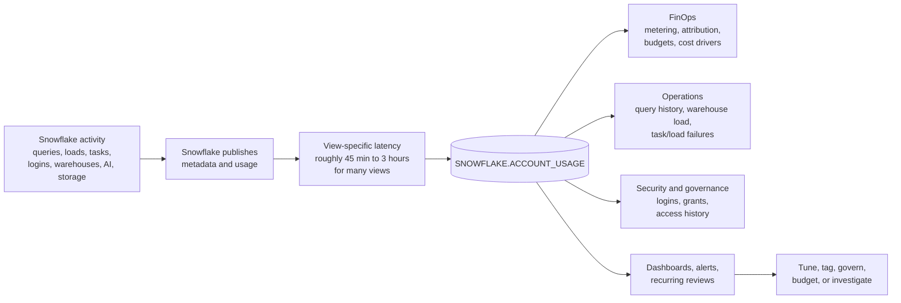

# Account Usage Views

> Historical metadata and usage views in the shared `SNOWFLAKE` database. Consultant lens: Account Usage is the evidence layer behind Snowflake FinOps, operations, security review, and workload diagnosis.

## Executive Summary

- **What it is:** Account Usage Views are Snowflake-provided views in `SNOWFLAKE.ACCOUNT_USAGE` that expose account-level metadata, query history, warehouse usage, storage metrics, logins, access history, tasks, loads, Cortex usage, and other operational telemetry.
- **Why it matters:** They let teams answer "what happened?", "who ran it?", "what cost changed?", "which object was used?", and "what failed?" using SQL instead of only clicking through dashboards.
- **Mental model:** **Account Usage is Snowflake's black box recorder: broad, historical, queryable, and slightly delayed.**
- **Best used when:** Building FinOps dashboards, investigating cost spikes, reviewing query activity, auditing logins/access, monitoring warehouse behavior, analyzing storage, or creating recurring operational reports.
- **Avoid or reconsider when:** You need real-time evidence, full invoice reconciliation, detailed query-profile internals, or clean business ownership in an account that lacks query tags and workload naming conventions.

## What It Can Do

- Show account-level historical metadata and usage metrics from the shared `SNOWFLAKE` database.
- Query historical SQL activity through `QUERY_HISTORY`.
- Attribute warehouse compute credits to queries through `QUERY_ATTRIBUTION_HISTORY`.
- Review warehouse credit usage, load, events, resumes, suspends, resizing, and multi-cluster behavior.
- Break down compute usage by service type through metering views.
- Separate consumed cloud services credits from daily billed cloud services after the adjustment.
- Inspect table-level storage, including active bytes, Time Travel bytes, Fail-safe bytes, and clone-retained bytes.
- Analyze users, roles, grants, logins, tasks, pipes, loads, data transfer, governance activity, and supported Cortex/AI usage.
- Include many dropped objects and deleted metadata records that current-state views may no longer show.
- Support custom dashboards, alerts, cost allocation models, and recurring operational reports.
- Provide longer retention than many Information Schema table functions, commonly up to 365 days for historical views.

## What It Cannot Do

- Provide real-time telemetry; many views have latency from roughly 45 minutes to 3 hours, and some specific views can be delayed longer.
- Retain history forever; many historical views retain data for 365 days.
- Replace Query Profile when the problem needs operator-level execution details and visual plan analysis.
- Reconcile every invoice dollar by itself; contract pricing, currency, organization-level billing views, adjustments, and invoice context may be needed.
- Attribute business ownership cleanly if workloads lack query tags, dedicated warehouses, naming conventions, or application metadata.
- Capture all external cloud-provider costs outside Snowflake.
- Guarantee identical behavior across all views; latency, edition requirements, retention, and available columns vary.
- Remove the sensitivity of telemetry; query text, login history, object metadata, and access history can expose confidential information.

## Core Concepts

| Concept | Meaning | Why it matters |
|---|---|---|
| `SNOWFLAKE` database | Shared Snowflake-provided database imported into each account | Contains metadata, usage, billing, monitoring, and system schemas |
| `ACCOUNT_USAGE` schema | Account-level historical metadata and usage views | Main source for account operations and FinOps SQL |
| Account Usage latency | Delay before data appears in views | Explains why a just-run query may not appear immediately |
| Historical retention | How long view data is retained | Many historical views retain data for 365 days, not forever |
| Information Schema | Current or recent metadata/functions scoped differently from Account Usage | Better for immediate/current checks; shorter history |
| Organization Usage | Organization-level usage and billing views | Better for multi-account cost and currency-level analysis |
| `QUERY_HISTORY` | View of SQL statements, users, roles, warehouses, statuses, and query text | Starting point for "who ran what?" |
| `QUERY_ATTRIBUTION_HISTORY` | Query-level warehouse compute attribution | Helps find expensive warehouse queries, but excludes idle, storage, serverless, AI token, and transfer costs |
| `WAREHOUSE_METERING_HISTORY` | Hourly warehouse credit usage | Shows which warehouses consumed credits |
| `METERING_HISTORY` | Hourly credit usage by service type | Helps detect serverless, Cortex, Snowpipe, Search Optimization, and other non-warehouse spend |
| `METERING_DAILY_HISTORY` | Daily metering including cloud services adjustment | Helps separate consumed cloud services from billed cloud services |
| `TABLE_STORAGE_METRICS` | Table-level storage bytes by category | Shows active, Time Travel, Fail-safe, clone-retained, and dropped-table storage drivers |
| `LOGIN_HISTORY` | Login attempts and related metadata | Useful for security review and adoption monitoring |
| `ACCESS_HISTORY` | Object and column access records | Useful for governance and lineage questions; edition and role access matter |
| Snowflake database roles | Fine-grained roles such as `OBJECT_VIEWER`, `USAGE_VIEWER`, `GOVERNANCE_VIEWER`, and `SECURITY_VIEWER` | Safer than giving broad access to every Account Usage view |
| Query tag | Session-level label attached to queries | Makes Account Usage far more useful for team/project cost attribution |

## How It Works (Simple Flow)

1. **Snowflake activity happens:** Users, tools, tasks, apps, warehouses, serverless features, and security events generate metadata and usage records.
2. **Snowflake publishes telemetry:** Records flow into schemas in the shared `SNOWFLAKE` database, including `ACCOUNT_USAGE`.
3. **Latency applies:** Data appears after a delay that varies by view.
4. **Roles control visibility:** Administrators grant imported privileges or, preferably, specific Snowflake database roles for the required view families.
5. **Analysts query history:** Teams use SQL to inspect queries, credits, storage, logins, roles, tasks, loads, and service usage.
6. **Views are joined carefully:** Cost and operations questions often require joining query history, warehouse metering, query attribution, storage, and service metering.
7. **Findings become controls:** Results drive query tags, budgets, resource monitors, warehouse changes, access reviews, and workload ownership.

## Visuals



Account Usage is not the control itself. It is the evidence layer that tells you where controls are needed.

## Readable Snippets

### Grant focused access to Account Usage views

```sql
USE ROLE ACCOUNTADMIN;

GRANT DATABASE ROLE SNOWFLAKE.USAGE_VIEWER
    TO ROLE FINOPS_ANALYST;

GRANT DATABASE ROLE SNOWFLAKE.OBJECT_VIEWER
    TO ROLE PLATFORM_METADATA_VIEWER;
```

Use Snowflake database roles when possible. They provide narrower access than granting broad imported privileges on the entire `SNOWFLAKE` database.

### Older broad access pattern

```sql
USE ROLE ACCOUNTADMIN;

GRANT IMPORTED PRIVILEGES ON DATABASE SNOWFLAKE
    TO ROLE SYSADMIN;
```

This is simple but broad. It may expose more metadata, query text, usage, and security-relevant information than a team actually needs.

### Find credit usage by service type

```sql
SELECT
    service_type,
    DATE_TRUNC('day', start_time) AS usage_day,
    SUM(credits_used) AS credits_used
FROM snowflake.account_usage.metering_history
WHERE start_time >= DATEADD(day, -30, CURRENT_TIMESTAMP())
GROUP BY service_type, usage_day
ORDER BY usage_day DESC, credits_used DESC;
```

Use this before assuming a cost spike came from warehouses. The driver might be serverless, AI services, Snowpipe, Search Optimization, or another service type.

### Find warehouse credits by warehouse

```sql
SELECT
    warehouse_name,
    DATE_TRUNC('day', start_time) AS usage_day,
    SUM(credits_used) AS credits_used,
    SUM(credits_used_compute) AS compute_credits,
    SUM(credits_used_cloud_services) AS cloud_services_credits
FROM snowflake.account_usage.warehouse_metering_history
WHERE start_time >= DATEADD(day, -30, CURRENT_TIMESTAMP())
GROUP BY warehouse_name, usage_day
ORDER BY usage_day DESC, credits_used DESC;
```

This shows hourly warehouse usage rolled up by day. It does not by itself explain which queries or teams caused the usage.

### Attribute warehouse compute to queries

```sql
SELECT
    warehouse_name,
    user_name,
    query_tag,
    query_id,
    start_time,
    credits_attributed_compute
FROM snowflake.account_usage.query_attribution_history
WHERE start_time >= DATEADD(day, -7, CURRENT_TIMESTAMP())
ORDER BY credits_attributed_compute DESC
LIMIT 50;
```

This is useful for warehouse compute attribution. It excludes idle warehouse time, storage, transfer, cloud services, serverless feature costs, and AI token/service costs.

### Join query cost to query text

```sql
SELECT
    qah.credits_attributed_compute,
    qh.user_name,
    qh.role_name,
    qh.warehouse_name,
    qh.query_tag,
    qh.execution_status,
    qh.start_time,
    qh.query_text
FROM snowflake.account_usage.query_attribution_history qah
JOIN snowflake.account_usage.query_history qh
    ON qah.query_id = qh.query_id
WHERE qah.start_time >= DATEADD(day, -7, CURRENT_TIMESTAMP())
ORDER BY qah.credits_attributed_compute DESC
LIMIT 25;
```

This is the recognizable "who ran the expensive query?" pattern. Remember that query text itself can contain sensitive information.

### Check cloud services after the daily adjustment

```sql
SELECT
    usage_date,
    credits_used_cloud_services,
    credits_adjustment_cloud_services,
    credits_used_cloud_services + credits_adjustment_cloud_services AS billed_cloud_services
FROM snowflake.account_usage.metering_daily_history
WHERE usage_date >= DATEADD(month, -1, CURRENT_DATE())
  AND credits_used_cloud_services > 0
ORDER BY billed_cloud_services DESC;
```

Many views show consumed cloud services credits. This query helps estimate what was billed after Snowflake's daily cloud services adjustment.

### Find table-level storage drivers

```sql
SELECT
    table_catalog,
    table_schema,
    table_name,
    active_bytes,
    time_travel_bytes,
    failsafe_bytes,
    retained_for_clone_bytes,
    deleted
FROM snowflake.account_usage.table_storage_metrics
ORDER BY
    active_bytes
    + time_travel_bytes
    + failsafe_bytes
    + retained_for_clone_bytes DESC
LIMIT 50;
```

This view is useful when storage cost does not match what users see in active tables. Dropped tables and retained historical bytes can still be billable.

### Find failed logins

```sql
SELECT
    event_timestamp,
    user_name,
    client_ip,
    reported_client_type,
    error_code,
    error_message
FROM snowflake.account_usage.login_history
WHERE event_timestamp >= DATEADD(day, -7, CURRENT_TIMESTAMP())
  AND is_success = 'NO'
ORDER BY event_timestamp DESC;
```

Security and platform teams can use this to spot authentication problems, suspicious access attempts, or user onboarding issues.

## Consultant Talking Points

- **Client question this answers:** "How do we see what happened in Snowflake, who caused it, and what it cost?"
- **Trade-offs to mention:** Account Usage gives broad historical evidence, but it is delayed and view-specific. For immediate/current-state checks, use Information Schema, `SHOW`, Snowsight, or specific monitoring interfaces.
- **Risk or governance angle:** Usage telemetry can reveal query text, user behavior, object names, access history, and security events. Grant the minimum Snowflake database roles needed for the job.
- **Cost/performance angle:** Query Account Usage with bounded time filters and selected columns. These views can be large, and the monitoring queries themselves run on a warehouse.

## Common Pitfalls

- **Expecting real-time answers:** Account Usage is delayed; recent activity may not be visible yet.
- **Using only warehouse views for cost analysis:** Serverless features, Cortex/AI, cloud services, compute pools, storage, and transfer can sit outside normal warehouse views.
- **Confusing consumed and billed cloud services:** Use `METERING_DAILY_HISTORY` when the daily adjustment matters.
- **Ignoring query tags:** Without `QUERY_TAG`, cost attribution often degrades into manual detective work.
- **Joining only by names:** Objects can be dropped and recreated with the same name; use internal IDs where appropriate.
- **Forgetting dropped objects:** Account Usage often includes dropped/deleted records; filters must be intentional.
- **Scanning too much history:** Always bound time ranges and avoid `SELECT *` in recurring dashboards.
- **Treating query attribution as complete cost:** It attributes warehouse compute to queries, not storage, transfer, serverless, cloud services, AI token costs, or idle time.
- **Granting broad telemetry access:** Query text, logins, access records, and metadata can be sensitive.
- **Assuming every view has the same latency or columns:** Check view-specific docs, especially for newer services and feature-specific usage views.

## When to Recommend What (Decision Table)

| Situation | Recommend | Why | Watch-outs |
|---|---|---|---|
| Need historical account-level cost and operations data | Account Usage Views | Broad, SQL-queryable, long-retention telemetry | Latency and view-specific limitations |
| Need to see a query that just ran | Snowsight Query History or Information Schema table functions | More immediate than Account Usage | Shorter history and different scope |
| Need multi-account organization spend | Organization Usage views | Designed for cross-account and currency-level reporting | Requires organization-level access and careful time filters |
| Need invoice reconciliation in currency | Organization Usage billing/rate views plus invoice | Includes rates, currency, contract, and adjustments | Contract terms and billing context still matter |
| Need detailed single-query execution diagnosis | Query Profile | Shows operators, pruning, spills, skew, and execution plan details | Not a historical reporting layer by itself |
| Need warehouse credit trend | `WAREHOUSE_METERING_HISTORY` | Shows hourly warehouse credits | Does not attribute usage to queries or include all services |
| Need query-level warehouse attribution | `QUERY_ATTRIBUTION_HISTORY` joined to `QUERY_HISTORY` | Finds expensive queries, users, and tags | Excludes idle time and non-warehouse costs |
| Need storage cost drivers | `TABLE_STORAGE_METRICS` and storage usage views | Shows active and retained storage categories | Storage views may not reconcile exactly to every bill line |
| Need security/governance audit evidence | `LOGIN_HISTORY`, grants views, `ACCESS_HISTORY` where available | Supports review of user activity, access, and object usage | Sensitive data and edition/role requirements |
| Need a managed visual starting point | Snowsight cost/performance dashboards | Faster for exploration and demos | SQL views are better for repeatable custom reports |

## Related Topics

- [[01 Snowflake/06 Cost Management and Operations/Cost Management and Operations Overview]]
- [[01 Snowflake/06 Cost Management and Operations/44 Credit Consumption Model]]
- [[01 Snowflake/06 Cost Management and Operations/46 Warehouse Scheduling and Auto-suspend]]
- [[01 Snowflake/06 Cost Management and Operations/47 Budgets]]
- [[01 Snowflake/02 Performance and Optimization/06 Query Profile]]
- [[01 Snowflake/01 Core Architecture and Concepts/05 Resource Monitors]]
- [[01 Snowflake/03 Security and Governance/12 RBAC Roles and Privileges]]

## Related Decision Notes

- [[80 Comparisons and Decision Notes/Decision Notes/Snowflake/Decisions - Diagnosing Snowflake Spend Increases]]
- [[80 Comparisons and Decision Notes/Comparisons/Snowflake/Comparison - Account Usage Views vs Information Schema]]
- [[80 Comparisons and Decision Notes/Decision Notes/Snowflake/Decisions - Diagnosing Slow Snowflake Queries]]

## Questions

- What decision are we trying to support: cost, performance, security, access review, storage, or operational reliability?
- Is Account Usage fresh enough, or do we need a near-real-time source?
- Which views have the right grain: account, warehouse, query, table, user, role, task, pipe, or service type?
- Are query tags, warehouse names, and role names good enough to attribute usage to teams or products?
- Which roles should see query text, login history, grants, and access history?
- Are we accidentally interpreting consumed credits as billed credits?
- Are dropped objects, recreated names, or retained storage bytes affecting the analysis?
- Should the account-level analysis be promoted to organization-level reporting?
- Which recurring dashboards or alerts should be built from these views?

## Sources To Revisit

- [Snowflake Docs: Account Usage](https://docs.snowflake.com/en/sql-reference/account-usage)
- [Snowflake Docs: QUERY_HISTORY view](https://docs.snowflake.com/en/sql-reference/account-usage/query_history)
- [Snowflake Docs: QUERY_ATTRIBUTION_HISTORY view](https://docs.snowflake.com/en/sql-reference/account-usage/query_attribution_history)
- [Snowflake Docs: WAREHOUSE_METERING_HISTORY view](https://docs.snowflake.com/en/sql-reference/account-usage/warehouse_metering_history)
- [Snowflake Docs: METERING_HISTORY view](https://docs.snowflake.com/en/sql-reference/account-usage/metering_history)
- [Snowflake Docs: METERING_DAILY_HISTORY view](https://docs.snowflake.com/en/sql-reference/account-usage/metering_daily_history)
- [Snowflake Docs: TABLE_STORAGE_METRICS view](https://docs.snowflake.com/en/sql-reference/account-usage/table_storage_metrics)
- [Snowflake Docs: SNOWFLAKE database roles](https://docs.snowflake.com/en/sql-reference/snowflake-db-roles)
