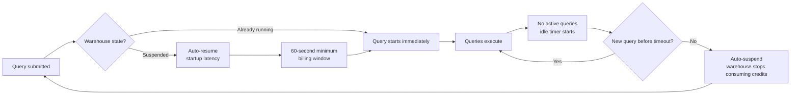

# Warehouse Scheduling and Auto-suspend

> Activity-based lifecycle controls for virtual warehouses. Consultant lens: auto-suspend is one of the simplest warehouse cost levers, but the timeout must match the workload rhythm rather than blindly chasing the lowest value.

## Executive Summary

- **What it is:** Warehouse scheduling and auto-suspend covers how Snowflake virtual warehouses start, stop, auto-resume, auto-suspend, and stay available for workloads.
- **Why it matters:** Warehouses consume credits while running, so idle time can quietly become wasted spend.
- **Mental model:** **Auto-suspend is the idle-cost brake; auto-resume is the convenience switch. The right timeout depends on workload rhythm.**
- **Best used when:** Tuning analyst warehouses, BI warehouses, batch/ELT warehouses, shared service warehouses, or any workload where idle running time needs to be reduced.
- **Avoid or reconsider when:** The workload deliberately needs warm, low-latency, always-available compute; the issue is query inefficiency rather than idle time; or the spend comes from serverless, SPCS, storage, or data transfer rather than virtual warehouses.

## What It Can Do

- Automatically suspend a warehouse after a configured period of inactivity.
- Automatically resume a suspended warehouse when a SQL statement needs it.
- Reduce idle warehouse credit consumption.
- Make ad hoc and scheduled workloads simpler by avoiding manual warehouse start/stop operations.
- Allow different warehouses to have different lifecycle policies based on workload patterns.
- Support manual `RESUME` and `SUSPEND` for admin operations, controlled batch windows, or emergency cost control.
- Expose resume, suspend, resize, and cluster events through `WAREHOUSE_EVENTS_HISTORY`.
- Help identify warehouses that never suspend, lack auto-resume, or suspend/resume too frequently.
- Work with resource monitors, budgets, query tags, and warehouse ownership as part of a broader cost-control model.

## What It Cannot Do

- Eliminate the startup latency of a suspended warehouse.
- Avoid the 60-second minimum billing period each time a warehouse starts or resumes.
- Guarantee lower cost if the warehouse suspends and resumes repeatedly between closely spaced queries.
- Fix inefficient SQL, poor data modeling, excessive scanning, or under-sized warehouses.
- Control serverless feature spend, Cortex usage, compute pools, storage, or data transfer.
- Replace workload separation; one shared warehouse for many patterns is hard to tune well.
- Provide precise second-by-second suspension timing; Snowflake's suspend process is not intended as exact scheduling.
- Guarantee query performance immediately after resume; some workloads may see less benefit from warm cache/state.
- Replace operational ownership, monitoring, resource monitors, or budgets.

## Core Concepts

| Concept | Meaning | Why it matters |
|---|---|---|
| Virtual warehouse | Snowflake compute used for SQL, DML, loading, and Snowpark pushdown | Warehouses consume credits while running |
| Running warehouse | Warehouse currently active and able to execute queries | Consumes warehouse credits even when no query is currently running |
| Suspended warehouse | Warehouse stopped and not consuming warehouse credits | Saves idle spend, but must resume before executing queries |
| `AUTO_SUSPEND` | Seconds of inactivity before Snowflake suspends the warehouse | Main idle-cost control |
| `AUTO_RESUME` | Whether Snowflake automatically starts the warehouse when a query needs it | Reduces user/job friction |
| `INITIALLY_SUSPENDED` | Whether a newly created warehouse starts suspended | Prevents accidental credits immediately after creation |
| 60-second minimum | Minimum billing period on each warehouse start/resume | Repeated resumes can be costly for tiny or bursty workloads |
| Startup latency | Delay while a suspended warehouse resumes before the query starts | Users may feel the first query after idle is slow |
| Cold cache/warm state | Some workloads benefit from recently used warehouse/cache state | Very aggressive suspension can hurt perceived responsiveness |
| Suspend/resume thrashing | Warehouse repeatedly suspends and resumes between closely spaced queries | Can create both latency and unnecessary minimum-billing events |
| Manual suspend/resume | Explicit `ALTER WAREHOUSE ... SUSPEND/RESUME` | Useful for admin windows, emergencies, and strict operating control |
| Warehouse events | History of resume, suspend, resize, and cluster events | Tells you how the warehouse behaves, not just what it costs |
| Workload rhythm | Timing pattern of queries, bursts, gaps, and business hours | Determines whether a 1-minute, 5-minute, or longer timeout makes sense |
| Resource monitor | Warehouse credit guardrail that can notify or suspend | Complements auto-suspend by limiting monthly warehouse blast radius |

## How It Works (Simple Flow)

1. **A query or workload targets a warehouse:** The warehouse may already be running or suspended.
2. **If suspended and auto-resume is enabled, Snowflake resumes it:** The first query waits for startup before execution begins.
3. **Billing minimum applies:** Each start or resume has a 60-second minimum billing period.
4. **Queries run while the warehouse is active:** Additional queries can reuse the same running warehouse.
5. **Inactivity timer begins after work stops:** Snowflake tracks how long the warehouse has been idle.
6. **Auto-suspend fires after the configured timeout:** The warehouse suspends when the inactivity threshold is reached.
7. **Monitoring reveals the pattern:** Account Usage views show credits, events, resumes, suspends, and load history.
8. **Tune by workload:** Adjust timeout, warehouse separation, size, concurrency, resource monitors, or scheduling based on observed behavior.

## Visuals



The trade-off is visible in the loop: shorter timeouts reduce idle time, but they can increase resume latency and repeated 60-second minimums if queries arrive in small bursts.

## Readable Snippets

### Create a cost-conscious analyst warehouse

```sql
CREATE WAREHOUSE analyst_wh
    WAREHOUSE_SIZE = XSMALL
    AUTO_SUSPEND = 300
    AUTO_RESUME = TRUE
    INITIALLY_SUSPENDED = TRUE;
```

This creates a small warehouse, keeps it suspended until needed, resumes automatically for queries, and suspends after 5 minutes of inactivity.

### Adjust an existing warehouse

```sql
ALTER WAREHOUSE analyst_wh SET
    AUTO_SUSPEND = 300
    AUTO_RESUME = TRUE;
```

For most ad hoc and analyst workloads, auto-suspend and auto-resume should usually be enabled together.

### Manually suspend or resume

```sql
ALTER WAREHOUSE analyst_wh SUSPEND;

ALTER WAREHOUSE analyst_wh RESUME;
```

Manual control is useful for admin operations, emergency cost control, or strict batch windows, but should not be the everyday operating model for normal user workloads.

### Find warehouses with auto-suspend disabled

```sql
SHOW WAREHOUSES
  ->> SELECT
        "name" AS warehouse_name,
        "size" AS warehouse_size,
        "auto_suspend" AS auto_suspend
      FROM $1
      WHERE IFNULL("auto_suspend", 0) = 0;
```

An `AUTO_SUSPEND` value of `0` or `NULL` means the warehouse never auto-suspends. That should be intentional and documented.

### Find warehouses without auto-resume

```sql
SHOW WAREHOUSES
  ->> SELECT
        "name" AS warehouse_name,
        "size" AS warehouse_size,
        "auto_resume" AS auto_resume
      FROM $1
      WHERE "auto_resume" = 'false';
```

Auto-resume disabled can be useful for tightly controlled warehouses, but it often creates job failures or user friction if no one owns the manual resume process.

### Inspect resume and suspend behavior

```sql
SELECT
    timestamp,
    warehouse_name,
    event_name,
    event_reason,
    user_name,
    role_name
FROM snowflake.account_usage.warehouse_events_history
WHERE timestamp >= DATEADD(day, -7, CURRENT_TIMESTAMP())
  AND event_reason IN (
      'WAREHOUSE_AUTORESUME',
      'WAREHOUSE_AUTOSUSPEND',
      'WAREHOUSE_RESUME',
      'WAREHOUSE_SUSPEND'
  )
ORDER BY timestamp DESC;
```

Metering tells you credits. Events tell you behavior: manual resumes, automatic resumes, automatic suspends, and possible thrashing.

### Count resume/suspend events by warehouse

```sql
SELECT
    warehouse_name,
    event_reason,
    COUNT(*) AS event_count
FROM snowflake.account_usage.warehouse_events_history
WHERE timestamp >= DATEADD(day, -7, CURRENT_TIMESTAMP())
  AND event_reason IN (
      'WAREHOUSE_AUTORESUME',
      'WAREHOUSE_AUTOSUSPEND',
      'WAREHOUSE_RESUME',
      'WAREHOUSE_SUSPEND'
  )
GROUP BY warehouse_name, event_reason
ORDER BY warehouse_name, event_count DESC;
```

Many auto-resume and auto-suspend events can be a sign that the timeout is too short for the workload's query rhythm.

## Consultant Talking Points

- **Client question this answers:** "How do we stop warehouses from burning credits while idle without frustrating users or breaking jobs?"
- **Trade-offs to mention:** Shorter auto-suspend reduces idle cost, but increases startup latency and can create repeated 60-second minimum charges if queries arrive in bursts. Longer auto-suspend improves responsiveness but burns more idle credits.
- **Risk or governance angle:** Warehouse lifecycle settings should be owned by workload owners, not changed randomly. Pair settings with resource monitors, budgets, query tags, and naming conventions so usage is accountable.
- **Cost/performance angle:** Tune the timeout to the workload rhythm. Five idle minutes on a large warehouse matters much more than five idle minutes on an X-Small warehouse.

## Common Pitfalls

- **Setting `AUTO_SUSPEND = 0` or `NULL` casually:** The warehouse never auto-suspends and can burn credits indefinitely.
- **Thinking the lowest timeout is always best:** Too-low timeouts can cause repeated startup latency and 60-second minimum billing.
- **Ignoring the first-query resume penalty:** Users may wait while the warehouse starts, and some workloads may be less responsive immediately after resume.
- **Turning off auto-resume without a process:** Jobs and users may fail or stall until someone manually resumes the warehouse.
- **Using one shared warehouse for every workload:** BI, ELT, notebooks, ad hoc SQL, and apps have different rhythms and should often have separate warehouses.
- **Letting large warehouses idle:** Idle time is more expensive on larger warehouses.
- **Mistaking multi-cluster for scheduling:** Multi-cluster handles concurrency while a warehouse is running; auto-suspend controls whole-warehouse lifecycle.
- **Not checking events:** Cost views show credits, but warehouse events show whether resumes, suspends, and manual interventions are the real issue.
- **Ignoring business hours and dashboard bursts:** BI workloads often arrive in clusters, so a slightly longer timeout may be cheaper and smoother than constant suspend/resume.
- **Treating auto-suspend as the whole cost strategy:** Serverless features, notebooks/SPCS, Cortex, storage, and data transfer have separate cost surfaces.

## When to Recommend What (Decision Table)

| Situation | Recommend | Why | Watch-outs |
|---|---|---|---|
| Ad hoc analyst warehouse | Auto-suspend around 1-5 minutes with auto-resume enabled | Reduces idle spend while keeping user friction low | First query after idle has startup latency |
| BI dashboard bursts during business hours | Auto-suspend around 5-10 minutes, adjusted to dashboard rhythm | Avoids thrashing between closely spaced dashboard queries | Too long burns idle credits; too short causes lag |
| Batch/ELT job warehouse | Auto-resume enabled and short auto-suspend after job completion | Warehouse runs only around job execution | Very frequent small jobs may hit repeated 60-second minimums |
| Queries arrive every 2-3 minutes | Set timeout longer than the normal gap or redesign workload batching | Avoids constant suspend/resume cycles | Confirm with events and metering, not guesses |
| Large warehouse with sporadic usage | Aggressive auto-suspend and clear ownership | Idle large warehouses waste credits quickly | Resume latency may be visible |
| Low-latency production workload | Longer auto-suspend or deliberate always-on window | Keeps compute warm and avoids first-query delay | Requires strong business justification and monitoring |
| Strictly controlled admin warehouse | `AUTO_RESUME = FALSE` plus manual resume process | Prevents accidental use | Can break jobs if process is unclear |
| Runaway warehouse risk | Resource monitor plus auto-suspend | Auto-suspend handles idle time; monitor limits monthly burn | Resource monitor can interrupt workloads |
| Spend still high after tuning auto-suspend | Investigate query shape, warehouse size, concurrency, serverless, SPCS, storage, and transfer | Idle time may not be the main driver | Do not over-focus on suspend settings |

## Related Topics

- [[01 Snowflake/06 Cost Management and Operations/Cost Management and Operations Overview]]
- [[01 Snowflake/01 Core Architecture and Concepts/01 Virtual Warehouses]]
- [[01 Snowflake/01 Core Architecture and Concepts/05 Resource Monitors]]
- [[01 Snowflake/06 Cost Management and Operations/44 Credit Consumption Model]]
- [[01 Snowflake/06 Cost Management and Operations/45 Account Usage Views]]
- [[01 Snowflake/06 Cost Management and Operations/47 Budgets]]
- [[01 Snowflake/02 Performance and Optimization/06 Query Profile]]

## Related Decision Notes

- [[80 Comparisons and Decision Notes/Decision Notes/Snowflake/Decisions - Diagnosing Snowflake Spend Increases]]
- [[80 Comparisons and Decision Notes/Decision Notes/Snowflake/Decisions - Choosing a Warehouse Strategy by Workload Type]]
- [[80 Comparisons and Decision Notes/Comparisons/Snowflake/Comparison - Virtual Warehouse Size vs Multi-cluster]]

## Questions

- What workload uses this warehouse: ad hoc analytics, BI, ELT, notebooks, app queries, or admin work?
- What is the normal gap between query bursts?
- Is idle time or query execution time the bigger cost driver?
- Does the workload tolerate first-query resume latency?
- How often is the warehouse auto-resuming and auto-suspending?
- Are there repeated 60-second minimum billing events from frequent resumes?
- Should this workload have its own warehouse instead of sharing one with different patterns?
- Is auto-resume disabled intentionally, and who owns manual resume?
- Should a resource monitor or budget protect this warehouse?
- If cost is still high, is the real issue warehouse size, query shape, concurrency, serverless usage, storage, or data transfer?

## Sources To Revisit

- [Snowflake Docs: Overview of warehouses](https://docs.snowflake.com/en/user-guide/warehouses-overview)
- [Snowflake Docs: Warehouse considerations](https://docs.snowflake.com/en/user-guide/warehouses-considerations)
- [Snowflake Docs: CREATE WAREHOUSE](https://docs.snowflake.com/en/sql-reference/sql/create-warehouse)
- [Snowflake Docs: ALTER WAREHOUSE](https://docs.snowflake.com/en/sql-reference/sql/alter-warehouse)
- [Snowflake Docs: Understanding compute cost](https://docs.snowflake.com/en/user-guide/cost-understanding-compute)
- [Snowflake Docs: Cost controls for warehouses](https://docs.snowflake.com/en/user-guide/cost-controlling-controls)
- [Snowflake Docs: WAREHOUSE_EVENTS_HISTORY view](https://docs.snowflake.com/en/sql-reference/account-usage/warehouse_events_history)
