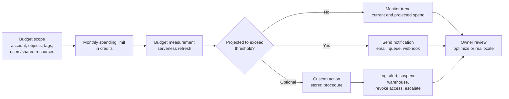

# Budgets

> Forecasting, notification, and accountability layer for Snowflake credit spend. Consultant lens: budgets help teams see and govern spend before it becomes a surprise, but they are not hard stops by default.

## Executive Summary

- **What it is:** Snowflake Budgets define monthly credit spending limits for an account or custom group of supported Snowflake objects, then notify when usage is projected to exceed the limit.
- **Why it matters:** They give clients proactive cost visibility across warehouses, serverless services, AI usage, compute pools, and cost-center scopes.
- **Mental model:** **Budgets say "you are trending over spend." Resource monitors can say "this warehouse stops now."**
- **Best used when:** A client needs monthly spend forecasting, owner notifications, cost-center accountability, AI/serverless monitoring, or a broader FinOps layer beyond warehouse-only controls.
- **Avoid or reconsider when:** The requirement is an immediate hard stop, exact invoice reconciliation, unsupported cost surfaces, or a situation where ownership, tags, notification routes, and escalation paths are not yet designed.

## What It Can Do

- Monitor monthly credit usage against a spending limit.
- Send notifications when projected spend is expected to exceed a configured threshold.
- Track account-level credit usage through the account budget.
- Track custom groups of supported objects through custom budgets.
- Use tags to scope budgets by team, cost center, product, environment, or project.
- Monitor supported services beyond classic warehouse usage, including serverless features, Snowpark Container Services, Query Acceleration, Snowpipe, Automatic Clustering, Search Optimization, and AI/Cortex-related usage where supported.
- Send notifications through email, cloud queues, or webhooks such as Slack, Microsoft Teams, or PagerDuty.
- Use custom actions to call stored procedures when projected or actual spend reaches a threshold.
- Delegate budget monitoring and administration through Snowflake application roles and budget instance roles.
- Support per-user quota patterns for individual monthly or daily credit limits.

## What It Cannot Do

- Act as a hard spending limit by default; budgets primarily forecast and notify.
- Stop every type of Snowflake cost automatically.
- Replace resource monitors when the requirement is native warehouse suspension.
- Replace Account Usage analysis, query tagging, warehouse ownership, or service-level cost attribution.
- Guarantee immediate detection; budgets rely on a refresh interval.
- Eliminate the cost of monitoring; budgets use serverless background tasks and store metadata.
- Cover every Snowflake service equally; supported services and object mappings vary.
- Monitor unsupported costs such as Hybrid table costs.
- Replicate budget instances to target accounts.
- Make custom actions safe automatically; automated stored procedures require careful design and privileges.

## Core Concepts

| Concept | Meaning | Why it matters |
|---|---|---|
| Budget | Snowflake object or account-level construct that tracks credit spend against a monthly limit | Provides proactive spend monitoring |
| Account budget | Budget for all supported credit usage in an account | Broadest account-level guardrail |
| Custom budget | Budget for a selected group of supported objects | Enables team, product, cost-center, or project accountability |
| Spending limit | Monthly credit threshold used for budget monitoring and notifications | Alerting threshold, not a hard stop by default |
| Projection | Forecast of whether current spend pace will exceed the limit | Budgets notify based on expected overrun, not only current spend |
| Notification threshold | Percentage of budget limit that triggers forecast notifications | Lets teams alert earlier than the default |
| Notification integration | Snowflake integration used to send email, queue, or webhook notifications | Required for automated budget notifications through configured channels |
| Custom action | Stored procedure called when actual or projected spend reaches a threshold | Enables automation such as logging, custom alerts, or warehouse suspension |
| Refresh interval | Delay between consumption and budget awareness | Default can be up to 6.5 hours; low-latency budgets can refresh hourly at higher cost |
| Low latency budget | Budget with a one-hour refresh interval | Useful for high-risk spend areas, but more expensive to operate |
| Tag-scoped budget | Budget that includes objects by tag/value pair | Scales better than manually adding every object |
| Direct resource budget | Budget that includes specific objects individually | Useful for small scopes but harder to maintain |
| `APPLYBUDGET` privilege | Privilege required to add or remove objects from a custom budget | Controls which objects can be put under budget tracking |
| Budget roles | Roles such as `BUDGET_ADMIN`, `BUDGET_VIEWER`, custom budget `ADMIN`, and custom budget `VIEWER` | Separates budget management from ordinary account administration |
| Resource monitor | Separate Snowflake object that can notify or suspend warehouses | Better for warehouse circuit-breaker behavior |

## How It Works (Simple Flow)

1. **Define the scope:** Choose account-wide monitoring or a custom group of supported objects.
2. **Set ownership and access:** Grant the required budget roles, `USAGE_VIEWER`, and object privileges.
3. **Set a monthly spending limit:** Express the budget limit in Snowflake credits.
4. **Configure notifications:** Choose email, cloud queue, or webhook destinations and ensure recipients/integrations are valid.
5. **Collect usage data:** Snowflake serverless background tasks gather supported credit usage for the budget scope.
6. **Forecast spend:** Snowflake projects whether current usage is on track to exceed the spending limit.
7. **Notify or act:** Snowflake sends notifications and can optionally call configured custom actions.
8. **Review and refine:** Cost owners inspect budget trends, tune scope/tags, adjust thresholds, and follow escalation paths.

## Visuals



The important distinction: the budget forecasts and notifies first. Any stopping behavior comes from a resource monitor or a carefully designed custom action.

## Readable Snippets

### Activate the account budget

```sql
CALL SNOWFLAKE.LOCAL.ACCOUNT_ROOT_BUDGET!ACTIVATE();

CALL SNOWFLAKE.LOCAL.ACCOUNT_ROOT_BUDGET!SET_SPENDING_LIMIT(1000);
```

This enables the account budget and sets a monthly limit of 1000 credits.

### Create an email notification integration

```sql
USE ROLE ACCOUNTADMIN;

CREATE NOTIFICATION INTEGRATION budgets_notification_integration
    TYPE = EMAIL
    ENABLED = TRUE
    ALLOWED_RECIPIENTS = ('costadmin@example.com');

GRANT USAGE ON INTEGRATION budgets_notification_integration
    TO APPLICATION SNOWFLAKE;
```

Budget email recipients must be verified. The `SNOWFLAKE` application needs permission to use the notification integration.

### Configure account budget notifications

```sql
CALL SNOWFLAKE.LOCAL.ACCOUNT_ROOT_BUDGET!SET_EMAIL_NOTIFICATIONS(
    'budgets_notification_integration',
    'costadmin@example.com'
);

CALL SNOWFLAKE.LOCAL.ACCOUNT_ROOT_BUDGET!SET_NOTIFICATION_THRESHOLD(80);
```

This sends notifications when Snowflake forecasts that spend will exceed 80% of the budget limit.

### Create a custom budget

```sql
USE SCHEMA budgets_db.budgets_schema;

CREATE SNOWFLAKE.CORE.BUDGET finance_budget();

CALL finance_budget!SET_SPENDING_LIMIT(500);

CALL finance_budget!SET_EMAIL_NOTIFICATIONS(
    'budgets_notification_integration',
    'finance-owner@example.com'
);
```

Custom budgets are useful when each team, product, or cost center needs its own spending accountability.

### Add resources to a custom budget

```sql
CALL finance_budget!ADD_RESOURCE(
    SYSTEM$REFERENCE(
        'WAREHOUSE',
        'FINANCE_WH',
        'SESSION',
        'APPLYBUDGET'
    )
);

CALL finance_budget!ADD_RESOURCE(
    SYSTEM$REFERENCE(
        'DATABASE',
        'FINANCE_ANALYTICS',
        'SESSION',
        'APPLYBUDGET'
    )
);
```

Directly adding objects is simple for small scopes. For larger estates, tag-based budgets usually scale better.

### Add a custom action

```sql
CALL budgets_db.budgets_schema.finance_budget!ADD_CUSTOM_ACTION(
    SYSTEM$REFERENCE(
        'PROCEDURE',
        'ops_db.cost_controls.alert_team(string, string, string)'
    ),
    ARRAY_CONSTRUCT(
        'finance-owner@example.com',
        'Budget Alert',
        'Finance budget is projected to exceed threshold'
    ),
    'PROJECTED',
    75
);
```

Custom actions can call stored procedures when projected or actual spend reaches a threshold. Treat this as automation code: it needs owner, testing, idempotency, and careful privileges.

### Check budget measurement cost

```sql
SELECT
    SUM(credits_used) AS budget_measurement_credits
FROM snowflake.account_usage.serverless_task_history
WHERE task_name = '_MEASUREMENT_TASK'
  AND start_time >= DATEADD(day, -28, CURRENT_TIMESTAMP());
```

Budgets are cost-control tools, but they are not cost-free. Low-latency budgets increase measurement cost.

## Consultant Talking Points

- **Client question this answers:** "How can we know early if Snowflake spend is trending above plan, especially across serverless and AI services?"
- **Trade-offs to mention:** Budgets provide broader forecasting and notifications, while resource monitors provide stronger warehouse-level interruption controls. Use both in mature environments.
- **Risk or governance angle:** Budget scope should align with ownership. Tags, notification recipients, budget roles, custom actions, and escalation paths are governance decisions, not only technical setup.
- **Cost/performance angle:** The default refresh interval is cheaper but less immediate. Low-latency budgets are useful for risky spend areas but can significantly increase the cost of budget monitoring.

## Common Pitfalls

- **Treating budgets as hard limits:** A budget does not automatically stop spend unless custom actions or other controls are configured.
- **Using only an account budget:** Account-wide monitoring is useful, but it does not create team-level accountability.
- **Not using tags:** Manually maintained custom budgets can drift quickly as objects are created, renamed, or retired.
- **Setting notification thresholds too late:** A warning after the overrun is effectively a receipt, not a control.
- **Forgetting refresh latency:** Budgets can lag behind real spend, especially with the default refresh interval.
- **Turning on low latency everywhere:** Hourly refresh is useful but increases budget compute cost.
- **Ignoring budget overhead:** Measurement tasks and metadata storage have their own cost.
- **Assuming every service is covered:** Check supported services and object mappings before promising full coverage.
- **Building unsafe custom actions:** Stored procedures may retry and must be idempotent, limited, tested, and permissioned carefully.
- **Not verifying email recipients:** Budget email setup fails if recipient addresses are not verified.
- **Giving budget admin too broadly:** Budget configuration can affect escalation workflows and automated controls.
- **Not pairing with Account Usage:** Budgets alert; Account Usage explains the drivers.

## When to Recommend What (Decision Table)

| Situation | Recommend | Why | Watch-outs |
|---|---|---|---|
| Account-level spend needs early warning | Account budget | Broad monthly forecast and notification layer | Does not explain every driver by itself |
| Team or cost center needs accountability | Custom budget scoped by tags | Scales with ownership and resource tagging | Tag hygiene matters |
| Small project has a few known resources | Custom budget with direct resources | Simple setup for narrow scope | Directly added resources can drift and may not backfill first-month data |
| Warehouse must stop at a threshold | Resource monitor | Native warehouse suspend behavior | Covers warehouse credits, not every service |
| Serverless, AI, SPCS, or background maintenance needs monitoring | Budgets | Broader supported service coverage than resource monitors | Confirm support for the exact service/object |
| Need Slack/PagerDuty/Teams escalation | Budget notifications or custom action | Routes alerts to operations workflows | Integration setup and testing required |
| Need automated action at spend threshold | Budget custom action | Can call stored procedures on projected or actual thresholds | Automation can be risky; design for retries and least privilege |
| High-risk experimental workload | Low-latency custom budget | Shorter refresh interval improves visibility | Higher measurement cost |
| Finance needs exact invoice reconciliation | Organization Usage billing views and invoice | Budgets are operational controls, not full billing reconciliation | Requires contract/rate context |
| Individual users need credit caps | Per-user quotas | Direct user-level control pattern | Requires clear policy and exception process |

## Related Topics

- [[01 Snowflake/06 Cost Management and Operations/Cost Management and Operations Overview]]
- [[01 Snowflake/01 Core Architecture and Concepts/05 Resource Monitors]]
- [[01 Snowflake/06 Cost Management and Operations/44 Credit Consumption Model]]
- [[01 Snowflake/06 Cost Management and Operations/45 Account Usage Views]]
- [[01 Snowflake/06 Cost Management and Operations/46 Warehouse Scheduling and Auto-suspend]]
- [[01 Snowflake/07 Ecosystem and Integration/50 Notification Integrations and Alerts]]
- [[01 Snowflake/03 Security and Governance/18 Object Tagging]]

## Related Decision Notes

- [[80 Comparisons and Decision Notes/Comparisons/Snowflake/Comparison - Resource Monitors vs Budgets]]
- [[80 Comparisons and Decision Notes/Decision Notes/Snowflake/Decisions - Diagnosing Snowflake Spend Increases]]
- [[80 Comparisons and Decision Notes/Client Scenarios/Snowflake/Scenario - Snowflake Spend Increased but Warehouses Look Normal]]

## Questions

- Is the budget meant for the whole account, a team, a project, a product, or a shared service?
- Which supported services and objects should count against the budget?
- Should the scope be managed by tags or by directly adding objects?
- Who owns the budget limit, notification recipients, and escalation process?
- What threshold gives the owner enough time to act?
- Is the default refresh interval acceptable, or does this workload justify low-latency monitoring?
- Should the response be notification-only, or should a custom action automate something?
- If a custom action is used, is it idempotent, safe to retry, and least-privileged?
- Are budget costs themselves acceptable?
- What Account Usage queries will explain the alert when it fires?

## Sources To Revisit

- [Snowflake Docs: Monitor credit usage with budgets](https://docs.snowflake.com/en/user-guide/budgets)
- [Snowflake Docs: Work with the account budget](https://docs.snowflake.com/en/user-guide/budgets/account-budget)
- [Snowflake Docs: Custom budgets](https://docs.snowflake.com/en/user-guide/budgets/custom-budget)
- [Snowflake Docs: Notifications for budgets](https://docs.snowflake.com/en/user-guide/budgets/notifications)
- [Snowflake Docs: Custom actions for budgets](https://docs.snowflake.com/en/user-guide/budgets/custom-actions)
- [Snowflake Docs: Understand budget costs](https://docs.snowflake.com/en/user-guide/budgets/cost)
- [Snowflake Docs: Using budgets for AI shared resources](https://docs.snowflake.com/en/user-guide/budgets/budget-shared-resources)
