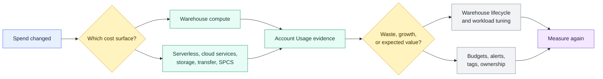

# Cost Management and Operations Overview

> [!abstract] Chapter outcome
> Build a repeatable diagnostic path from a Snowflake spend question to evidence, ownership, and the right control.
>
> By the end, you should be able to identify the cost surface that moved, inspect its usage, tune warehouse lifecycle where relevant, and set proactive budget guardrails.

## Topics

- [[01 Snowflake/06 Cost Management and Operations/44 Credit Consumption Model|44 - Credit Consumption Model]]
- [[01 Snowflake/06 Cost Management and Operations/45 Account Usage Views|45 - Account Usage Views]]
- [[01 Snowflake/06 Cost Management and Operations/46 Warehouse Scheduling and Auto-suspend|46 - Warehouse Scheduling and Auto-suspend]]
- [[01 Snowflake/06 Cost Management and Operations/47 Budgets|47 - Budgets]]

## Chapter Map

The order matters: classify the spend, establish evidence and ownership, apply the relevant control, then measure the result.

## Topic Summaries

| Topic | What it unlocks |
|---|---|
| [[01 Snowflake/06 Cost Management and Operations/44 Credit Consumption Model\|44 - Credit Consumption Model]] | A complete map of warehouse, serverless, cloud services, storage, transfer, and compute-pool spend. |
| [[01 Snowflake/06 Cost Management and Operations/45 Account Usage Views\|45 - Account Usage Views]] | Historical evidence for FinOps, workload diagnosis, security review, and recurring operations. |
| [[01 Snowflake/06 Cost Management and Operations/46 Warehouse Scheduling and Auto-suspend\|46 - Warehouse Scheduling and Auto-suspend]] | Lifecycle controls that balance idle cost, resume latency, and repeated minimum billing. |
| [[01 Snowflake/06 Cost Management and Operations/47 Budgets\|47 - Budgets]] | Forecasting, notifications, ownership, and proactive credit-spend guardrails. |

## Consultant Diagnostic Sequence

1. **Classify the cost surface.** Do not prescribe warehouse tuning for serverless, storage, transfer, or compute-pool spend.
2. **Establish the evidence.** Use the appropriate Account Usage views, billing context, and workload metadata.
3. **Find an accountable owner.** Separate waste from expected growth and justified business value.
4. **Choose the control.** Tune warehouse lifecycle, improve attribution, set budgets and alerts, or address the feature-specific driver.
5. **Measure again.** Confirm that the change reduced waste without damaging latency, reliability, or user outcomes.

## How To Use This Area

Read topic 44 first to learn the cost surfaces, then topic 45 to find the evidence. Topics 46 and 47 cover two different control types: warehouse lifecycle tuning and broader proactive spend governance.

## Related Areas

- [[00 Home/Snowflake Learning Map|Snowflake Learning Map]]
- [[01 Snowflake/02 Performance and Optimization/Performance and Optimization Overview|Performance and Optimization]]
- [[01 Snowflake/04 Data Engineering/Data Engineering Overview|Data Engineering]]
- [[01 Snowflake/08 Enterprise Snowflake in Production/Enterprise Snowflake in Production Overview|Enterprise Snowflake in Production]]
