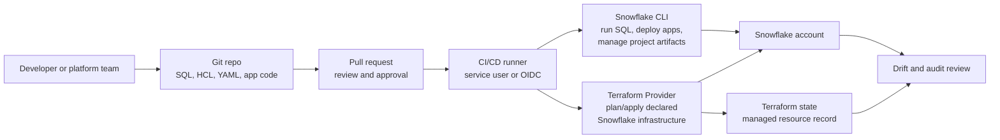

# Snowflake CLI and Terraform Provider

> Developer tooling and infrastructure-as-code for repeatable Snowflake changes. Consultant lens: move production Snowflake work from manual clicks to reviewed, automated, auditable deployment paths.

## Executive Summary

- **What it is:** Snowflake CLI is a command-line tool for developing, managing, and deploying Snowflake work; the Snowflake Terraform Provider is an infrastructure-as-code provider for declaring Snowflake resources such as warehouses, databases, schemas, roles, grants, and related account objects.
- **Why it matters:** These tools turn Snowflake administration and deployment into repeatable, reviewable work instead of tribal knowledge and manual production changes.
- **Mental model:** **CLI runs and deploys. Terraform declares and reconciles. Git and CI/CD make both auditable.**
- **Best used when:** A client needs dev/test/prod consistency, governed RBAC changes, CI/CD deployment, repeatable warehouse/database setup, Snowpark or Streamlit deployment, Native App packaging, or evidence of who changed what.
- **Avoid or reconsider when:** The work is a one-off exploration, the Snowflake feature is newer than provider support, the team cannot protect secrets/state, or the real need is data transformation orchestration rather than infrastructure management.

## What It Can Do

- Run Snowflake commands from a terminal, developer workstation, or CI/CD runner.
- Manage Snowflake connections through `config.toml`, `connections.toml`, command-line parameters, and environment variables.
- Execute SQL files and SQL statements from scripts or pipelines.
- Create, list, describe, and drop many Snowflake objects through `snow object` commands.
- Package and deploy Snowflake projects using `snowflake.yml` project definition files.
- Support developer-centric workloads such as Snowpark functions and procedures, Streamlit apps, Snowflake Native Apps, Snowflake Notebooks, Snowpark Container Services, SQL projects, and Git repository workflows.
- Use first-party CI/CD integrations for common platforms, or run the CLI directly in any CI system that can execute shell commands.
- Authenticate CI/CD pipelines with workload identity federation/OIDC so long-lived passwords or keys are not stored in the CI system.
- Use Terraform to define Snowflake infrastructure as code.
- Generate Terraform plans so reviewers can see intended creates, updates, and deletes before applying changes.
- Manage stable account objects such as warehouses, databases, schemas, tables, roles, grants, integrations, and other supported resources.
- Detect drift when the real Snowflake account no longer matches Terraform state and configuration.
- Use Git pull requests as the approval path for infrastructure and deployment changes.

## What It Cannot Do

- Replace Snowflake architecture, RBAC design, release management, or environment strategy.
- Make manual production changes safe if people continue bypassing the deployment path.
- Guarantee complete feature coverage; the Terraform Provider can lag newer Snowflake features, and provider preview features have their own stability risk.
- Remove the need to secure service users, CI credentials, private keys, OIDC trust relationships, and Terraform state.
- Make Terraform a good fit for every object; high-churn analytical logic, transformation models, and migration-style changes may belong in dbt, SQL migration tooling, or application-specific deployment paths.
- Make Snowflake CLI a state manager; CLI commands execute actions, while Terraform tracks desired state.
- Prevent destructive changes unless review, policy, roles, plan checks, and environment guardrails are designed around it.
- Eliminate privilege complexity; automation identities still need enough access to deploy while staying least-privileged.

## Core Concepts

| Concept | Meaning | Why it matters |
|---|---|---|
| Snowflake CLI | `snow` command-line tool for Snowflake development, deployment, and management | Lets developers and CI/CD pipelines interact with Snowflake without manual UI work |
| `config.toml` | Local/global Snowflake CLI configuration file for connections and logs | Defines how CLI sessions connect to Snowflake |
| `connections.toml` | Shared connection file read by Snowflake CLI and other Snowflake developer tools | Useful when VS Code, Cortex Code, SnowConvert, and CLI should reuse the same connection definitions |
| Environment variable override | Runtime variables such as `SNOWFLAKE_CONNECTIONS_<NAME>_PASSWORD` | Keeps secrets out of committed config files and lets CI/CD inject credentials |
| `snowflake.yml` | Project definition file that describes Snowflake objects being developed | Makes multi-file Snowflake projects deployable and version-controlled |
| Entity | Object definition inside `snowflake.yml`, such as a function, procedure, Streamlit app, Native App package, notebook, SQL project, or SPCS object | Gives the CLI enough structure to deploy the right files and objects |
| CI/CD runner | GitHub Actions, GitLab, Azure DevOps, Jenkins, or similar automation worker | Runs repeatable deployments after review |
| Service user | Non-human Snowflake user used by automation | Separates pipeline access from individual employee accounts |
| Workload identity federation/OIDC | Short-lived identity token flow between CI platform and Snowflake | Recommended CI/CD pattern because it avoids storing long-lived secrets |
| Terraform Provider | Snowflake plugin for Terraform/OpenTofu-style infrastructure-as-code | Lets teams declare Snowflake resources in code |
| HCL | Terraform configuration language | The readable desired-state format for Snowflake infrastructure |
| Plan/apply | Terraform review and execution workflow | Shows intended changes before applying them |
| State | Terraform record of managed resources | Sensitive operational data; required for drift detection and reconciliation |
| Drift | Difference between declared Terraform config/state and the actual Snowflake account | Common when people make manual changes outside the IaC path |
| Provider version | Pinned release of the Snowflake Terraform Provider | Important because resources, behavior, and breaking changes evolve |
| Preview provider feature | Terraform resource/data source marked preview in the provider | Must be explicitly enabled and may change even when the provider major version does not |

## How It Works (Simple Flow)

1. **Put Snowflake work in Git:** SQL scripts, Terraform modules, `snowflake.yml`, app code, and deployment workflows live in a repository.
2. **Define connection and identity:** Developers use local connections; CI/CD uses a service user, preferably with workload identity federation/OIDC.
3. **Review changes:** Pull requests show SQL, YAML, HCL, or app-code changes before they reach shared environments.
4. **Run checks:** Pipelines can lint, test, run `terraform plan`, or validate project structure.
5. **Deploy or reconcile:** Snowflake CLI executes/deploys work; Terraform applies the approved desired-state changes.
6. **Record evidence:** Git history, CI logs, Terraform plans, and Snowflake metadata show what changed, when, and through which identity.
7. **Control drift:** Teams periodically compare declared state to Snowflake reality and decide whether to import, revert, or codify manual changes.

## Visuals



The useful split: **Snowflake CLI is the deployment remote control; Terraform is the desired-state contract.**

## Readable Snippets

### Snowflake CLI connection shape

```toml
default_connection_name = "dev"

[connections.dev]
account = "myorg-myaccount"
user = "deploy_user"
role = "SYSADMIN"
warehouse = "DEV_WH"
database = "DEV_DB"
schema = "PUBLIC"
```

Do not commit passwords or private keys. In CI/CD, inject secrets through environment variables or use workload identity federation where available.

### CLI commands you should recognize

```bash
snow connection test --connection dev
snow sql --connection dev -f deploy/001_create_objects.sql
snow object list warehouse --connection dev
snow streamlit deploy --connection dev
```

These show the CLI as an execution/deployment surface, not as a long-term state tracker.

### `snowflake.yml` project definition shape

```yaml
definition_version: 2

entities:
  sales_app:
    type: streamlit
    identifier: SALES_APP
    stage: app_stage
    main_file: streamlit_app.py
    query_warehouse: APP_WH
    artifacts:
      - streamlit_app.py
      - pages/
```

The exact entity properties depend on the workload. The pattern to recognize is: a project file tells Snowflake CLI what local files and Snowflake objects belong together.

### CI/CD service user with OIDC shape

```sql
CREATE USER cicd_deploy_user
  TYPE = SERVICE
  WORKLOAD_IDENTITY = (
    TYPE = OIDC
    ISSUER = '<ci-platform-issuer>'
    SUBJECT = '<ci-platform-subject>'
  );
```

The issuer and subject come from the CI platform. The service user should receive only the roles needed for deployment.

### Terraform provider and resources

```hcl
terraform {
  required_providers {
    snowflake = {
      source  = "snowflakedb/snowflake"
      version = "~> 2.0"
    }
  }
}

resource "snowflake_database" "analytics" {
  name = "ANALYTICS"
}

resource "snowflake_warehouse" "transforming" {
  name           = "TRANSFORMING_WH"
  warehouse_size = "XSMALL"
  auto_suspend   = 60
  auto_resume    = true
}
```

This is the recognizable IaC pattern: declare the Snowflake objects, review the plan, then apply.

### Terraform workflow

```bash
terraform init
terraform plan
terraform apply
```

In a mature setup, `plan` runs on pull requests and `apply` runs only after approval.

## Consultant Talking Points

- **Client question this answers:** "How do we stop relying on manual Snowflake changes and make deployments repeatable, reviewable, and auditable?"
- **Trade-offs to mention:** Snowflake CLI is flexible for deployment execution; Terraform is stronger for stable desired-state infrastructure. Mature teams often use both.
- **Risk or governance angle:** The automation identity, Terraform state, approval workflow, and manual-change policy are as important as the tools themselves.
- **Cost/performance angle:** These tools do not directly optimize credits, but they prevent costly drift: forgotten warehouses, inconsistent auto-suspend settings, unreviewed grants, and environment mismatch.

## Common Pitfalls

- **Treating CLI and Terraform as interchangeable:** CLI executes and deploys; Terraform tracks desired state.
- **Committing secrets:** `config.toml`, project folders, and CI files can leak credentials if teams are careless.
- **Over-privileging automation users:** A broad `ACCOUNTADMIN` pipeline is convenient but hard to justify in governed environments.
- **Ignoring Terraform state security:** State can reveal sensitive infrastructure metadata and must be stored, encrypted, and access-controlled carefully.
- **Letting manual changes continue:** If admins keep clicking changes into production, Terraform drift becomes a permanent chore.
- **Managing too much with Terraform:** High-churn SQL models, data transformations, and migration sequences can become painful when forced into desired-state IaC.
- **Not pinning provider versions:** Provider behavior changes over time; pin versions and read migration notes before upgrades.
- **Using preview provider features casually:** Provider preview features are disabled by default and may introduce breaking changes.
- **Skipping `terraform plan` review:** The plan is the main safety checkpoint before destructive or broad infrastructure changes.
- **Mixing dev/prod identities poorly:** Local developer access and CI deployment access should be separated clearly.
- **Assuming CI/CD equals governance:** Pipelines help, but policy, ownership, review standards, and emergency-change procedures still need design.

## When to Recommend What (Decision Table)

| Situation | Recommend | Why | Watch-outs |
|---|---|---|---|
| Client needs repeatable warehouses, databases, schemas, roles, and grants | Terraform Provider | Desired-state IaC is well suited to stable infrastructure | Protect state and control manual drift |
| Client needs to deploy SQL scripts, Snowpark, Streamlit, notebooks, Native Apps, or SPCS projects | Snowflake CLI | CLI understands Snowflake developer workflows and project definitions | It executes work; it does not own long-term state |
| Client wants dev/test/prod consistency | Terraform plus Snowflake CLI in CI/CD | Terraform standardizes baseline objects; CLI deploys project artifacts | Environment naming, secrets, and approvals must be designed |
| Client asks for audit evidence of platform changes | Git PRs, CI logs, Terraform plans, and Snowflake metadata | Creates traceable change history | Manual hotfix path must also be documented |
| Client is early-stage and experimenting | Start with CLI and simple SQL scripts | Low ceremony and fast feedback | Do not let prototypes become unmanaged production |
| Client has strict governance and many account-level objects | Terraform modules and least-privileged service users | Scales review and repeatability | Module design and role strategy matter |
| Feature is brand new or provider support is missing | Snowflake CLI or SQL deployment path | Direct Snowflake commands may support features before Terraform | Revisit Terraform support later |
| Team wants data model transformations | dbt, SQL migrations, or Snowflake-native orchestration | Better fit for model dependencies and transformation lifecycles | Terraform should not become the transformation engine |
| Security team rejects long-lived CI secrets | Workload identity federation/OIDC | Short-lived token flow reduces secret storage risk | Requires platform-specific issuer/subject setup |
| Terraform state already disagrees with Snowflake reality | Drift cleanup/import plan | Prevents accidental deletes or recreates | Needs careful inventory and change freeze |

## Related Topics

- [[01 Snowflake/07 Ecosystem and Integration/Ecosystem and Integration Overview]]
- [[01 Snowflake/07 Ecosystem and Integration/49 Git Integration]]
- [[01 Snowflake/07 Ecosystem and Integration/50 Notification Integrations and Alerts]]
- [[01 Snowflake/03 Security and Governance/12 RBAC Roles and Privileges]]
- [[01 Snowflake/03 Security and Governance/18 Object Tagging]]
- [[01 Snowflake/05 Advanced Analytics and AI/32 Snowpark]]
- [[01 Snowflake/05 Advanced Analytics and AI/36 Snowflake Notebooks]]
- [[01 Snowflake/06 Cost Management and Operations/46 Warehouse Scheduling and Auto-suspend]]

## Related Decision Notes

- [[80 Comparisons and Decision Notes/Decision Notes/Decisions - Choosing a Snowflake DevOps and Deployment Pattern]]
- [[80 Comparisons and Decision Notes/Comparisons/Comparison - Snowflake CLI vs Terraform Provider]]
- [[80 Comparisons and Decision Notes/Comparisons/Comparison - dbt Projects on Snowflake vs dbt Platform]]

## Questions

- Which Snowflake objects should be managed as stable infrastructure versus deployed application artifacts?
- Who owns the deployment identity and which roles should it receive?
- Will CI/CD use workload identity federation/OIDC, key-pair authentication, or another approved pattern?
- Where will Terraform state live, and who can read or modify it?
- What is the policy for emergency manual changes in production?
- Which objects should be imported into Terraform before the team starts applying changes?
- Should the client standardize modules for warehouses, roles, grants, databases, schemas, and environments?
- Which workloads need Snowflake CLI project definitions, and which are better handled by dbt or SQL migrations?
- How will provider upgrades and preview features be tested?
- What evidence does audit actually need: Git PRs, CI logs, Terraform plans, Snowflake query history, or all of them?

## Sources To Revisit

- [Snowflake Docs: Snowflake CLI](https://docs.snowflake.com/en/developer-guide/snowflake-cli/index)
- [Snowflake Docs: Configuring Snowflake CLI](https://docs.snowflake.com/en/developer-guide/snowflake-cli/connecting/configure-cli)
- [Snowflake Docs: Managing Snowflake CLI connections](https://docs.snowflake.com/en/developer-guide/snowflake-cli/connecting/configure-connections)
- [Snowflake Docs: Snowflake CLI project definition files](https://docs.snowflake.com/en/developer-guide/snowflake-cli/project-definitions/about)
- [Snowflake Docs: Managing Snowflake objects with Snowflake CLI](https://docs.snowflake.com/en/developer-guide/snowflake-cli/objects/manage-objects)
- [Snowflake Docs: Integrating CI/CD with Snowflake CLI](https://docs.snowflake.com/en/developer-guide/snowflake-cli/cicd/integrate-ci-cd)
- [Snowflake Docs: Snowflake Terraform Provider](https://docs.snowflake.com/en/user-guide/terraform)
- [Terraform Registry: Snowflake Provider](https://registry.terraform.io/providers/snowflakedb/snowflake/latest)
