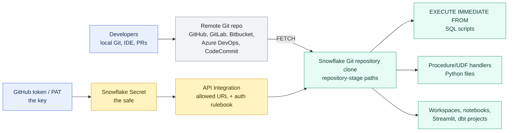

# Git Integration

> [!abstract] Consultant lens
> **What it is:** A connection from remote Git repositories to Snowflake so version-controlled files can be fetched, browsed, referenced, and executed.
>
> **Why it matters:** It brings source-controlled files into Snowflake development workflows while keeping Git—not Snowflake—as the collaboration and history system.

## Executive Summary

- **What it is:** Snowflake Git Integration lets Snowflake synchronize files from a remote Git repository into a Snowflake Git repository clone.
- **Why it matters:** It helps move SQL, Python handlers, notebooks, Streamlit apps, and project files out of local machines or ad hoc Snowsight edits and into version-controlled source code.
- **Mental model:** **Snowflake becomes another Git client.** Developers keep working in GitHub/GitLab/etc.; Snowflake fetches a clone and reads files from it.
- **Best used when:** A client needs source control for SQL scripts, Python procedures, Streamlit apps, notebooks, dbt projects, Workspaces, or Snowflake project files that Snowflake should directly reference.
- **Avoid or reconsider when:** The real requirement is full CI/CD governance, infrastructure desired state, dbt model orchestration, broad Git write workflows, or a repository layout that depends heavily on unsupported Git features such as submodules.

## What It Can Do

- Connect Snowflake to supported Git platforms such as GitHub, GitLab, Bitbucket, Azure DevOps, and AWS CodeCommit.
- Create a Snowflake Git repository clone that includes fetched branches, tags, and commits from the remote repository.
- Fetch updates from the remote repository into Snowflake.
- Browse folders, search files, and copy file paths in Snowsight.
- Reference files from SQL using repository-stage paths such as `@repo/branches/main/...`.
- Execute SQL scripts from Git with `EXECUTE IMMEDIATE FROM`.
- Import files from the repository clone into Snowflake code, including stored procedure and UDF handler files.
- Support Git-aware workflows in Workspaces, Streamlit in Snowflake, and Snowflake Notebooks.
- Allow selected Snowflake features, such as Workspaces, Streamlit apps, and notebooks, to commit and push changes back to the remote repository.
- Support public-repo access, token-based authentication, OAuth-based interactive development, and private network connectivity patterns.

## What It Cannot Do

- Replace GitHub, GitLab, Azure DevOps, or Bitbucket as the main collaboration and pull-request platform.
- Replace Snowflake CLI, Terraform, dbt, or a proper CI/CD release process.
- Automatically fetch every remote change in real time; Snowflake uses its fetched clone until the repository is fetched again.
- Make unreviewed SQL safe simply because it lives in Git.
- Give all Snowflake code full read/write Git behavior; most Snowflake code sees the repository as read-only.
- Support Git submodules.
- Support repositories larger than 2 GB.
- Share Snowflake Git repository clones through data sharing or Snowflake Native App Framework apps.
- Remove the need to manage tokens, secrets, OAuth, network paths, and least-privilege access carefully.

## Core Concepts

| Concept | Meaning | Why it matters |
|---|---|---|
| Remote Git repository | The source repository in GitHub, GitLab, Bitbucket, Azure DevOps, AWS CodeCommit, or compatible custom URL | This remains the source of truth |
| Snowflake Git repository clone | Snowflake object that synchronizes files from the remote repo | Lets Snowflake read source-controlled files |
| Repository stage path | Stage-like path such as `@analytics_repo/branches/main/sql/file.sql` | How Snowflake references Git files |
| Fetch | Operation that updates Snowflake's clone from the remote repository | Snowflake does not automatically know about every remote change until fetched |
| Branch/tag/commit | Git version references exposed inside the Snowflake clone | Lets Snowflake use a specific version of code |
| `EXECUTE IMMEDIATE FROM` | SQL command pattern for running a SQL file from a stage or Git repository clone | Useful for version-controlled SQL scripts |
| API integration | Snowflake integration that defines the allowed Git API endpoint and authentication method | The rulebook for where Snowflake may connect |
| Secret | Snowflake object that stores sensitive credential material such as a token, username/password, OAuth material, or generic sensitive string | The safe that stores the key |
| GitHub token / PAT | Password-like key issued by GitHub for programmatic repository access | Lets Snowflake authenticate to a private repo without using a human password |
| Fine-grained PAT | GitHub token limited to selected owners, repositories, permissions, and expiration | Safer default than broad classic tokens when supported |
| OAuth | Interactive authorization pattern for users working in Snowflake Workspaces | Better fit when humans need to pull/push through Snowflake |
| Public network access | Snowflake connects to the Git server over the public internet | Simple for hosted Git providers |
| Private network access | Snowflake routes Git traffic through a private connectivity path | Needed when the client requires network isolation |
| Write-capable Snowflake features | Workspaces, Streamlit apps, and notebooks can write back to Git in supported flows | Important because most other Snowflake Git usage is read-only |

## How It Works (Simple Flow)

1. **Choose the repository:** Identify the remote Git repo that should be visible to Snowflake.
2. **Choose authentication:** Use no authentication for public quick starts, token-based access for automation/private repos, or OAuth for interactive Workspace users.
3. **Store credentials safely:** If token-based access is used, store the token in a Snowflake Secret rather than hard-coding it.
4. **Create an API integration:** Define which Git URL prefixes Snowflake is allowed to access and which secrets or auth flows are allowed.
5. **Create the Git repository clone:** Create a Snowflake `GIT REPOSITORY` object pointing to the remote repo.
6. **Fetch the repository:** Synchronize branches, tags, and commits into Snowflake.
7. **Use the files:** Reference Git files from SQL, handlers, notebooks, Streamlit, Workspaces, dbt projects, or Snowflake CLI workflows.
8. **Govern the path:** Decide who can fetch, execute files, rotate tokens, approve changes, and push changes back.

## Visuals



The memorable chain: **token = key, secret = safe, API integration = rulebook, Git repository clone = Snowflake's fetched copy.**

## Readable Snippets

### Store a GitHub token in a Snowflake Secret

```sql
CREATE OR REPLACE SECRET my_git_secret
  TYPE = PASSWORD
  USERNAME = 'github-user'
  PASSWORD = '<github-personal-access-token>';
```

A GitHub token is a password-like key. A Snowflake Secret is the safe where Snowflake stores that key. In real deployments, use least privilege, expiration, rotation, and a service-owned token where possible.

### Allow Snowflake to access a Git URL prefix

```sql
CREATE OR REPLACE API INTEGRATION my_git_api_integration
  API_PROVIDER = git_https_api
  API_ALLOWED_PREFIXES = ('https://github.com/my-org')
  ALLOWED_AUTHENTICATION_SECRETS = (my_git_secret)
  ENABLED = TRUE;
```

The API integration constrains where Snowflake can use the secret.

### Create the Snowflake Git repository clone

```sql
CREATE OR REPLACE GIT REPOSITORY analytics_repo
  API_INTEGRATION = my_git_api_integration
  GIT_CREDENTIALS = my_git_secret
  ORIGIN = 'https://github.com/my-org/analytics-repo.git';
```

This creates the Snowflake-side repository clone object.

### Fetch and inspect repository contents

```sql
ALTER GIT REPOSITORY analytics_repo FETCH;

SHOW GIT BRANCHES IN analytics_repo;
SHOW GIT TAGS IN analytics_repo;

LS @analytics_repo/branches/main;
```

Fetching updates Snowflake's clone from the remote repository.

### Execute a SQL file from Git

```sql
EXECUTE IMMEDIATE FROM
  @analytics_repo/branches/main/sql/create_reporting_objects.sql;
```

This is the practical "aha": Snowflake can execute a version-controlled SQL file by path.

### Use a generic secret for other sensitive values

```sql
CREATE OR REPLACE SECRET webhook_token
  TYPE = GENERIC_STRING
  SECRET_STRING = '<sensitive-api-token>';
```

Secrets are a general pattern, not only a Git pattern. They store sensitive values so code and configuration do not need to expose them directly.

## Consultant Talking Points

- **Client question this answers:** "How do we make Snowflake use code from Git instead of copying SQL and Python around manually?"
- **Trade-offs to mention:** Git Integration makes source-controlled files visible inside Snowflake; it is not the same thing as full deployment automation, desired-state infrastructure, or transformation orchestration.
- **Risk or governance angle:** Token ownership, secret rotation, OAuth approval, repository permissions, fetch privileges, and execution roles must be designed deliberately.
- **Cost/performance angle:** Git Integration is not primarily a cost feature, but it reduces operational waste from lost scripts, inconsistent environments, untracked hotfixes, and duplicated code.

## Common Pitfalls

- **Thinking Snowflake sees remote changes instantly:** Snowflake uses its fetched clone until a fetch operation updates it.
- **Using personal tokens casually:** A PAT tied to one employee can break when the person leaves, loses access, or rotates credentials unexpectedly.
- **Using overly broad token permissions:** Snowflake often needs read access to a narrow repo, not broad organization write access.
- **Confusing tokens and secrets:** The token is the key; the secret is where Snowflake stores the key.
- **Hard-coding credentials in SQL or repo files:** This defeats the point of using Secrets.
- **Executing Git files without review:** `EXECUTE IMMEDIATE FROM` can run powerful SQL; pair it with least-privileged roles and code review.
- **Assuming Git Integration replaces CI/CD:** It provides Snowflake access to Git files; release approval and deployment controls still need process.
- **Ignoring unsupported Git features:** Submodules and repositories larger than 2 GB are not supported.
- **Forgetting network constraints:** Public Git access may not satisfy clients with private network requirements.
- **Letting Snowflake become the only place edits happen:** Keep Git collaboration and review habits strong, even when Workspaces, notebooks, or Streamlit can push changes.

## When to Recommend What (Decision Table)

| Situation | Recommend | Why | Watch-outs |
|---|---|---|---|
| SQL scripts should be version-controlled and runnable from Snowflake | Git Integration plus `EXECUTE IMMEDIATE FROM` | Snowflake can execute reviewed files from Git | Execution role still needs guardrails |
| Private GitHub repo must be read by Snowflake | Token-based Git Integration with Snowflake Secret | Stores credential safely and allows controlled repo access | Prefer fine-grained, expiring, service-owned tokens |
| Public demo or Snowflake Labs repo | No-auth Git Integration | Fastest setup for non-sensitive repo access | Not suitable for private code |
| Human users need to work interactively from Workspaces | OAuth-based Git Integration | Better sign-in model for user-driven pull/push | Requires OAuth setup and user governance |
| Strict private network requirement | Private network Git setup | Avoids public internet path | More infrastructure coordination |
| Need repeatable deployment from terminal or CI/CD | Snowflake CLI | Better execution/deployment control | Still benefits from Git as source |
| Need desired-state warehouses, roles, grants, schemas | Terraform Provider | Better for stable infrastructure state | Provider support and state security matter |
| Need transformation model dependencies and tests | dbt | Better for analytics engineering lifecycle | Git Integration may still help source-code visibility |
| Need to store API tokens, webhook values, or credentials | Snowflake Secrets | Keeps sensitive values out of code | Secrets still need access control and rotation |
| Repository uses submodules or is very large | Rework repo layout or use external CI/CD | Snowflake Git has limitations | Avoid promising direct Snowflake Git usage before checking constraints |

## Related Topics

- [[01 Snowflake/07 Ecosystem and Integration/Ecosystem and Integration Overview]]
- [[01 Snowflake/07 Ecosystem and Integration/48 Snowflake CLI and Terraform Provider]]
- [[01 Snowflake/04 Data Engineering/25 dbt on Snowflake]]
- [[01 Snowflake/05 Advanced Analytics and AI/36 Snowflake Notebooks]]
- [[01 Snowflake/05 Advanced Analytics and AI/32 Snowpark]]
- [[01 Snowflake/03 Security and Governance/12 RBAC Roles and Privileges]]

## Related Decision Notes

- [[80 Comparisons and Decision Notes/Decision Notes/Cross-Tool/Decisions - Choosing a Snowflake DevOps and Deployment Pattern]]
- [[80 Comparisons and Decision Notes/Comparisons/Snowflake/Comparison - Snowflake CLI vs Terraform Provider]]
- [[80 Comparisons and Decision Notes/Comparisons/Cross-Tool/Comparison - dbt Projects on Snowflake vs dbt Platform]]

## Questions

- Which repository should be the source of truth for Snowflake code?
- Does Snowflake need read-only access, or do users need to push changes back?
- Should authentication use no auth, token-based auth, OAuth, or private network setup?
- Who owns the GitHub/GitLab token, and what happens when that owner leaves?
- Can a fine-grained personal access token or service-owned credential be used?
- What repository permissions are actually required?
- Who can create, alter, fetch, and use the Git repository clone?
- Which roles may execute SQL files from the repository?
- How will token rotation and secret access be audited?
- Does the repo use submodules, large files, or patterns Snowflake Git does not support?

## Sources To Revisit

- [Snowflake Docs: Using a Git repository in Snowflake](https://docs.snowflake.com/en/developer-guide/git/git-overview)
- [Snowflake Docs: Setting up Snowflake to use Git](https://docs.snowflake.com/en/developer-guide/git/git-setting-up)
- [Snowflake Docs: Working with Git repositories](https://docs.snowflake.com/en/developer-guide/git/git-operations)
- [Snowflake Docs: Examples of using Git with Snowflake](https://docs.snowflake.com/en/developer-guide/git/git-examples)
- [Snowflake Docs: Git in Snowflake limitations](https://docs.snowflake.com/en/developer-guide/git/git-limitations)
- [Snowflake Docs: CREATE GIT REPOSITORY](https://docs.snowflake.com/en/sql-reference/sql/create-git-repository)
- [Snowflake Docs: CREATE SECRET](https://docs.snowflake.com/en/sql-reference/sql/create-secret)
- [GitHub Docs: Managing personal access tokens](https://docs.github.com/en/authentication/keeping-your-account-and-data-secure/managing-your-personal-access-tokens)
- [GitHub Docs: Permissions required for fine-grained personal access tokens](https://docs.github.com/en/rest/authentication/permissions-required-for-fine-grained-personal-access-tokens)
