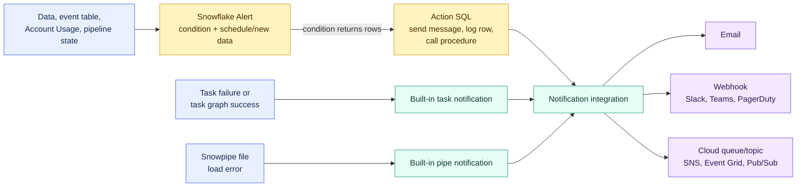

# Notification Integrations and Alerts

> [!abstract] Consultant lens
> **What it is:** Outbound messaging and condition-based actions for Snowflake operations.
>
> **Why it matters:** Alerts decide when something matters; notification integrations decide where the message goes.

## Executive Summary

- **What it is:** Notification integrations are Snowflake objects that send messages to email, webhooks, or cloud queues. Snowflake Alerts are schema-level objects that evaluate conditions and perform actions when those conditions return rows.
- **Why it matters:** They turn important Snowflake events into operational signals: pipeline failures, Snowpipe load errors, data quality exceptions, cost thresholds, SLA misses, and budget notifications.
- **Mental model:** **Alert = the brain that checks a condition. Notification integration = the delivery pipe. Task/Snowpipe notifications = built-in event sources.**
- **Best used when:** A client needs Snowflake to notify people or systems when data, pipeline, cost, or operational conditions need attention.
- **Avoid or reconsider when:** The requirement is full observability, incident management, orchestration, retry logic, or root-cause analysis. Notifications wake people up; they do not replace monitoring design, runbooks, ownership, or dashboards.

## What It Can Do

- Send notifications to cloud messaging services such as Amazon SNS, Microsoft Azure Event Grid, and Google Pub/Sub.
- Send email notifications through Snowflake email notification integrations.
- Send webhook notifications to systems such as Slack, Microsoft Teams, PagerDuty-style endpoints, or custom HTTP endpoints.
- Use `SYSTEM$SEND_SNOWFLAKE_NOTIFICATION` to send messages to multiple destination types from SQL.
- Use `SYSTEM$SEND_EMAIL` for simpler email notification use cases.
- Create Snowflake Alerts that periodically evaluate SQL conditions and run an action when the condition is true.
- Create alerts on a schedule or alerts on new data.
- Use alerts for data quality checks, cost checks, SLA checks, operational checks, and event-table monitoring.
- Configure task error notifications and task graph success notifications through notification integrations.
- Configure Snowpipe error notifications for failed file loads.
- Query notification and alert history for troubleshooting.
- Attach runbook references to alerts so responders know what to do.

## What It Cannot Do

- Replace a full observability or incident management platform.
- Guarantee that every notification is delivered exactly once; Snowflake task and Snowpipe notifications use at-least-once delivery, so duplicate messages are possible.
- Make noisy alerts useful automatically; thresholds, severity, deduplication, and escalation policy still need design.
- Support every destination for every feature. For example, task error notifications use cloud messaging services; Snowflake docs note email and webhook notification integration types are not supported for task error notifications.
- Replace task retry logic, stream processing, orchestration, or data pipeline recovery.
- Guarantee zero-latency detection; scheduled alerts run on their configured cadence and may skip runs if a previous run has not completed.
- Avoid compute cost; alerts use either serverless compute or a warehouse.
- Validate every identifier or expression at alert creation time; some condition/action failures appear only when the alert runs.
- Remove privacy concerns; notification content can contain operational or data details and should not include sensitive regulated data unless explicitly approved.

## Core Concepts

| Concept | Meaning | Why it matters |
|---|---|---|
| Notification integration | Snowflake account object that defines an outbound messaging destination | The reusable pipe from Snowflake to email, queue, or webhook |
| Email integration | Notification integration with `TYPE = EMAIL` | Good for human-readable operational notifications |
| Queue integration | Notification integration with `TYPE = QUEUE` and cloud provider settings | Good for machine-readable operational events |
| Webhook integration | Notification integration with `TYPE = WEBHOOK` | Good for Slack, Teams, PagerDuty-style, or custom HTTP workflows |
| Snowflake Alert | Schema-level object with condition, action, and schedule/new-data trigger | The native way to check data and act when a condition is met |
| Condition | SQL in `IF (EXISTS (...))` | If the condition returns rows, the alert action runs |
| Action | SQL after `THEN` | Can send a notification, insert audit rows, or call a procedure |
| Scheduled alert | Alert that evaluates on an interval or cron expression | Good for periodic checks such as spend, SLA, or data quality |
| Alert on new data | Alert that evaluates when new rows arrive in a table/view/event table | Good for event-table monitoring and newly arrived exceptions |
| Serverless alert | Alert without a specified warehouse | Snowflake manages compute; useful for infrequent checks |
| Warehouse-backed alert | Alert that specifies `WAREHOUSE = ...` | Gives explicit compute control but can incur warehouse start/minimum costs |
| Task notification | Task-level `ERROR_INTEGRATION` or `SUCCESS_INTEGRATION` | Built-in signal for task failures and task graph success |
| Snowpipe notification | Pipe-level `ERROR_INTEGRATION` | Built-in signal for file load failures |
| Notification history | Information Schema table function for sent notification attempts | Helps troubleshoot delivery and duplicate messages |
| Runbook | Alert property pointing to response guidance | Turns "something happened" into "here is what to do" |

## How It Works (Simple Flow)

1. **Choose the event or condition:** Decide whether the signal is a built-in event such as task/Snowpipe failure or a custom SQL condition.
2. **Choose the destination:** Email for people, webhook for chat/incident routing, or cloud queue for downstream systems.
3. **Create the notification integration:** Configure the Snowflake object that can send to the chosen destination.
4. **Attach it to the source:** Use it in an alert action, task `ERROR_INTEGRATION`, task `SUCCESS_INTEGRATION`, pipe `ERROR_INTEGRATION`, budget notification, or direct SQL notification call.
5. **Test the end-to-end path:** Confirm privileges, delivery, payload format, recipient validation, and incident routing.
6. **Resume or enable execution:** Newly created alerts are suspended by default and must be resumed.
7. **Operate the signal:** Review alert history, notification history, noise level, duplicate messages, and runbook quality.

## Visuals



The important consultant distinction: **alerts are decision logic; notification integrations are delivery plumbing.**

## Readable Snippets

### Email notification integration

```sql
CREATE OR REPLACE NOTIFICATION INTEGRATION ops_email_int
  TYPE = EMAIL
  ENABLED = TRUE
  ALLOWED_RECIPIENTS = ('ops@example.com', 'data-platform@example.com');
```

Email recipients must be verified. Use email for human-readable signals, not high-volume machine events.

> [!example]- Direct message-sending patterns
> ### Send an email directly
>
> ```sql
> CALL SYSTEM$SEND_EMAIL(
>   'ops_email_int',
>   'ops@example.com',
>   'Snowflake pipeline warning',
>   'The hourly customer mart pipeline exceeded its expected runtime.'
> );
> ```
>
> This is a direct send. It does not decide when to send; something else must call it.
>
> ### Send a richer notification
>
> ```sql
> CALL SYSTEM$SEND_SNOWFLAKE_NOTIFICATION(
>   SNOWFLAKE.NOTIFICATION.TEXT_HTML('<p>Customer mart exceeded SLA.</p>'),
>   SNOWFLAKE.NOTIFICATION.EMAIL_INTEGRATION_CONFIG(
>     'ops_email_int',
>     'Customer mart SLA warning',
>     ARRAY_CONSTRUCT('ops@example.com'),
>     ARRAY_CONSTRUCT(),
>     ARRAY_CONSTRUCT()
>   )
> );
> ```
>
> `SYSTEM$SEND_SNOWFLAKE_NOTIFICATION` is the broader notification procedure and can target multiple destination types.

### Scheduled alert for a cost threshold

```sql
CREATE OR REPLACE ALERT high_credit_usage_alert
  WAREHOUSE = ops_wh
  SCHEDULE = '30 MINUTE'
  RUNBOOK = 'https://internal.example.com/runbooks/high-snowflake-credits'
  IF (EXISTS (
    SELECT 1
    FROM snowflake.account_usage.warehouse_metering_history
    WHERE warehouse_name = 'TRANSFORMING_WH'
      AND start_time >= DATEADD(hour, -1, CURRENT_TIMESTAMP())
      AND credits_used > 10
  ))
  THEN
    CALL SYSTEM$SEND_EMAIL(
      'ops_email_int',
      'ops@example.com',
      'High Snowflake warehouse usage',
      'TRANSFORMING_WH used more than 10 credits in the last hour.'
    );

ALTER ALERT high_credit_usage_alert RESUME;
```

Newly created alerts are suspended by default. Always remember the `RESUME`.

> [!example]- Additional alert and pipeline-notification patterns
> ### Serverless alert
>
> ```sql
> CREATE OR REPLACE ALERT failed_quality_check_alert
>   SCHEDULE = '15 MINUTE'
>   IF (EXISTS (
>     SELECT 1
>     FROM data_quality.failed_checks
>     WHERE detected_at >= DATEADD(minute, -15, CURRENT_TIMESTAMP())
>   ))
>   THEN
>     INSERT INTO ops.alert_audit(alert_name, detected_at)
>     VALUES ('failed_quality_check_alert', CURRENT_TIMESTAMP());
> ```
>
> Omitting `WAREHOUSE` creates a serverless alert. This can be a better fit for infrequent or lightweight checks.
>
> ### AWS SNS notification integration for tasks or Snowpipe
>
> ```sql
> CREATE OR REPLACE NOTIFICATION INTEGRATION my_notification_int
>   ENABLED = TRUE
>   DIRECTION = OUTBOUND
>   TYPE = QUEUE
>   NOTIFICATION_PROVIDER = AWS_SNS
>   AWS_SNS_TOPIC_ARN = 'arn:aws:sns:us-east-2:111122223333:snowflake_task_alerts'
>   AWS_SNS_ROLE_ARN = 'arn:aws:iam::111122223333:role/snowflake_sns_role';
> ```
>
> The cloud-side setup also needs the cloud topic, policy, IAM role/trust, or equivalent provider configuration.
>
> ### Task error notification
>
> ```sql
> CREATE OR REPLACE TASK refresh_customer_mart
>   WAREHOUSE = transform_wh
>   SCHEDULE = '15 MINUTE'
>   ERROR_INTEGRATION = my_notification_int
>   AS
>     CALL analytics.refresh_customer_mart();
> ```
>
> If the task fails, Snowflake sends a message to the configured cloud messaging service.
>
> ### Task graph success and error notifications
>
> ```sql
> CREATE OR REPLACE TASK root_pipeline_task
>   WAREHOUSE = transform_wh
>   SCHEDULE = 'USING CRON 0 * * * * UTC'
>   ERROR_INTEGRATION = my_notification_int
>   SUCCESS_INTEGRATION = my_notification_int
>   AS
>     CALL pipelines.start_hourly_pipeline();
> ```
>
> For task graphs, specify notification integrations on the root task. Failed child tasks notify through the root task integration. Success notifications apply to successful task graph completion, not every standalone task success.
>
> ### Snowpipe error notification
>
> ```sql
> CREATE OR REPLACE PIPE load_orders_pipe
>   AUTO_INGEST = TRUE
>   ERROR_INTEGRATION = my_notification_int
>   AS
>     COPY INTO raw.orders
>     FROM @raw.orders_stage
>     FILE_FORMAT = (TYPE = CSV SKIP_HEADER = 1);
> ```
>
> Snowpipe error notifications identify the pipe, table, stage/path, file, and error details. They work when `ON_ERROR = SKIP_FILE`, which is the default; Snowflake docs note they are not sent when `ON_ERROR = CONTINUE`.

### Inspect notification history

```sql
SELECT *
FROM TABLE(
  INFORMATION_SCHEMA.NOTIFICATION_HISTORY(
    START_TIME => DATEADD(hour, -24, CURRENT_TIMESTAMP())
  )
)
ORDER BY SENT_TIME DESC;
```

Use notification history when a team says, "Snowflake did not alert us."

## Consultant Talking Points

- **Client question this answers:** "How do we get Snowflake to tell the right person or system when a pipeline, cost threshold, or data quality rule needs attention?"
- **Trade-offs to mention:** Alerts are flexible but require SQL, compute, ownership, and threshold design. Built-in task/Snowpipe notifications are simpler for known events but have destination and payload constraints.
- **Risk or governance angle:** Notification content, recipient lists, webhook secrets, queue permissions, alert owner roles, and runbook links are governance decisions.
- **Cost/performance angle:** Scheduled alerts consume serverless or warehouse compute. Frequent heavy checks can become expensive or noisy.

## Common Pitfalls

- **Forgetting to resume alerts:** Created alerts are suspended by default.
- **Confusing delivery with detection:** A notification integration sends; an alert, task, pipe, budget, or procedure decides when to send.
- **Using the wrong destination:** Email is not always incident routing; webhooks and queues may be better for operational workflows.
- **Assuming task notifications support email/webhooks:** Task error notifications rely on cloud messaging services.
- **Ignoring at-least-once delivery:** Task and Snowpipe notifications can duplicate, so downstream consumers should be idempotent.
- **Alert fatigue:** Too many low-value notifications train people to ignore important ones.
- **No runbook:** An alert without response guidance often becomes noise.
- **Overly expensive checks:** Heavy scheduled queries every few minutes can burn credits.
- **Not testing owner privileges:** Alerts run with the alert owner role's privileges.
- **Expecting creation-time validation:** Some invalid identifiers or expressions fail only when the alert executes.
- **Missing Snowpipe `ON_ERROR` behavior:** Snowpipe error notifications are not sent when `ON_ERROR = CONTINUE`.
- **Cross-cloud assumptions:** Task and Snowpipe cloud messaging must align with supported providers and account/cloud constraints.
- **Sending sensitive data in messages:** Notifications can leave Snowflake and may be retained or processed externally.

## When to Recommend What (Decision Table)

| Situation | Recommend | Why | Watch-outs |
|---|---|---|---|
| Arbitrary SQL/data condition should trigger action | Snowflake Alert | Native condition/action pattern | Requires compute, owner privileges, and `RESUME` |
| A scheduled data quality check should notify ops | Scheduled alert + email/webhook | Simple periodic monitoring | Avoid noisy thresholds |
| New event rows should trigger action | Alert on new data | Runs when new rows arrive | Condition restrictions and change tracking matter |
| Task fails overnight | Task `ERROR_INTEGRATION` | Built-in task failure signal | Cloud queue only; child tasks notify through root task |
| Task graph success should notify downstream system | Root task `SUCCESS_INTEGRATION` | Signals full graph completion | Not for standalone task success notifications |
| Snowpipe fails to load a file | Pipe `ERROR_INTEGRATION` | Built-in file-load failure signal | Needs supported cloud messaging and `ON_ERROR = SKIP_FILE` |
| Team wants Slack/Teams/PagerDuty notification from SQL | Webhook notification integration | Good for operational routing | Manage webhook secrets and payload format |
| Human-readable notification is enough | Email notification integration | Easy to understand and set up | Verified recipients and alert fatigue |
| Machine-readable event should feed another system | Cloud queue/topic notification integration | Better for automation and deduplication | Provider setup and idempotent consumers |
| Spend is trending over plan | Budgets or scheduled alert | Budgets forecast spend; alerts can check custom SQL | Budgets are not hard stops by default |
| Need full incident lifecycle | External observability/incident platform plus Snowflake notifications | Snowflake can emit the signal; external tool manages escalation | Integration design and ownership required |

## Related Topics

- [[01 Snowflake/07 Ecosystem and Integration/Ecosystem and Integration Overview]]
- [[01 Snowflake/04 Data Engineering/20 Streams and Tasks]]
- [[01 Snowflake/04 Data Engineering/22 Snowpipe]]
- [[01 Snowflake/06 Cost Management and Operations/45 Account Usage Views]]
- [[01 Snowflake/06 Cost Management and Operations/47 Budgets]]
- [[01 Snowflake/03 Security and Governance/12 RBAC Roles and Privileges]]

## Related Decision Notes

- [[80 Comparisons and Decision Notes/Decision Notes/Snowflake/Decisions - Choosing a Snowflake Notification Pattern]]
- [[80 Comparisons and Decision Notes/Comparisons/Snowflake/Comparison - Resource Monitors vs Budgets]]
- [[80 Comparisons and Decision Notes/Decision Notes/Snowflake/Decisions - Choosing a Snowflake Ingestion Method]]

## Questions

- Is the signal based on a built-in event, a data condition, a cost threshold, or an external system?
- Who needs to know: human owner, platform team, incident system, or downstream automation?
- Should the destination be email, webhook, cloud queue, or multiple destinations?
- What severity should this notification represent?
- What is the runbook and expected response time?
- How will duplicate notifications be handled?
- Which role owns the alert, and does it have the privileges needed for condition and action SQL?
- How often should the condition run, and what will that cost?
- What metadata or sensitive content will leave Snowflake in the message?
- How will notification delivery be tested and monitored?

## Sources To Revisit

- [Snowflake Docs: Alerts and Notifications overview](https://docs.snowflake.com/en/guides-overview-alerts)
- [Snowflake Docs: Notifications in Snowflake](https://docs.snowflake.com/en/user-guide/notifications/about-notifications)
- [Snowflake Docs: CREATE NOTIFICATION INTEGRATION](https://docs.snowflake.com/en/sql-reference/sql/create-notification-integration)
- [Snowflake Docs: Sending email notifications](https://docs.snowflake.com/en/user-guide/notifications/email-notifications)
- [Snowflake Docs: Sending webhook notifications](https://docs.snowflake.com/en/user-guide/notifications/webhook-notifications)
- [Snowflake Docs: SYSTEM$SEND_SNOWFLAKE_NOTIFICATION](https://docs.snowflake.com/en/user-guide/notifications/snowflake-notifications)
- [Snowflake Docs: Setting up alerts based on data](https://docs.snowflake.com/en/user-guide/alerts)
- [Snowflake Docs: CREATE ALERT](https://docs.snowflake.com/en/sql-reference/sql/create-alert)
- [Snowflake Docs: Set up task error notifications](https://docs.snowflake.com/en/user-guide/tasks-errors)
- [Snowflake Docs: Configure task error notifications](https://docs.snowflake.com/en/user-guide/tasks-errors-integrate)
- [Snowflake Docs: Configure task success notifications](https://docs.snowflake.com/en/user-guide/tasks-success-integrate)
- [Snowflake Docs: Snowpipe error notifications](https://docs.snowflake.com/en/user-guide/data-load-snowpipe-errors)
- [Snowflake Docs: Snowpipe error notifications for Amazon SNS](https://docs.snowflake.com/en/user-guide/data-load-snowpipe-errors-sns)
