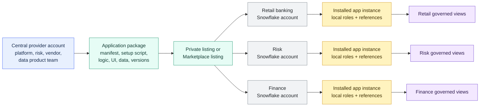

# Native Apps Framework

> [!abstract] Consultant lens
> **What it is:** A framework for packaging and distributing Snowflake-native applications across accounts.
>
> **Why it matters:** Each consumer account retains local control over data, roles, privileges, and governance.

## Executive Summary

- **What it is:** Snowflake Native App Framework lets a provider package Snowflake objects, shared data, SQL logic, procedures/functions, Streamlit UI, and optional Snowpark Container Services into an application that consumers install in their own Snowflake accounts.
- **Why it matters:** It supports the "bring the app to the data" model: distribute standardized logic without forcing every consumer to export data or rebuild the same app manually.
- **Mental model:** **Package once, distribute many times, run locally in each consumer account.** The provider controls the package; each consumer controls installation, privileges, local data binding, and user access.
- **Best used when:** A vendor, data provider, or central platform team needs to distribute the same governed Snowflake-native product across many accounts, departments, subsidiaries, or customers.
- **Avoid or reconsider when:** A simple data share, one-off Streamlit app, dbt project, Terraform module, or dashboard is enough. Native Apps add packaging, versioning, security, support, and lifecycle responsibilities.

## What It Can Do

- Package Snowflake-native application logic and metadata into an application package.
- Distribute apps through private listings or Snowflake Marketplace listings.
- Allow consumers to install an app in their own Snowflake account.
- Include Snowflake objects such as views, functions, stored procedures, schemas, Streamlit apps, and Snowpark logic.
- Include shared data content so data and logic can be distributed together.
- Use application roles to expose app functionality to consumer account roles.
- Use references so consumers can bind approved local tables, views, warehouses, functions, procedures, secrets, or integrations to the app.
- Request account-level privileges such as `CREATE WAREHOUSE`, `CREATE DATABASE`, `EXECUTE TASK`, `CREATE COMPUTE POOL`, and similar app capabilities where supported.
- Support versioning, patches, release channels, testing modes, security scanning, and upgrade workflows.
- Protect provider intellectual property better than sending raw code or SQL scripts to every consumer.
- Add a Streamlit frontend for an in-Snowflake user experience.
- Use Snowpark Container Services for more advanced apps that need containerized services.
- Support internal distribution across business units as well as external distribution to customers.

## What It Cannot Do

- Replace direct shares when the client only needs to distribute data.
- Replace Terraform for infrastructure state or Snowflake CLI for general deployment automation.
- Replace dbt for analytics transformation modeling and tests.
- Make app security automatic; privileges, references, app roles, feature policies, and review workflows still matter.
- Bypass each consumer account's governance model; the consumer decides what local data and privileges the app receives.
- Guarantee broad adoption. Native Apps are real and growing, but more specialized than everyday Snowflake features such as warehouses, tasks, RBAC, sharing, and dbt-style workflows.
- Remove provider responsibilities for support, release management, documentation, testing, observability, and upgrade compatibility.
- Support every Snowflake feature. Known limitations include no temporary tables or stages, no Native App failover for business continuity, unsupported Streamlit features, and other framework-specific constraints.
- Avoid consumer-side costs. Apps that create warehouses, compute pools, services, storage, or data movement can create costs in the consumer account.
- Make raw local data exposure safe by itself. Regulated clients should usually bind apps to governed views instead of raw base tables.

## Core Concepts

| Concept | Meaning | Why it matters |
|---|---|---|
| Provider | Account or organization that builds and publishes the app | Owns package design, releases, support, security posture, and documentation |
| Consumer | Account or organization that installs and uses the app | Controls local install, grants, data bindings, and user access |
| Application package | Provider-side container for app logic, setup script, manifest, versions, patches, and shared content | The distributable product unit |
| Installed application object | Consumer-side app instance created from the package/listing | The local running copy of the app |
| Manifest file | `manifest.yml` file describing setup script, version, artifacts, privileges, references, and configuration | The app contract Snowflake reads during install/upgrade |
| Setup script | SQL script that runs during install or upgrade | Creates app roles, schemas, views, procedures, functions, and other app objects |
| Listing | Private or Marketplace distribution vehicle | Lets providers distribute the package to target consumers |
| Private listing | Listing shared to selected consumers | Best for internal bank departments, subsidiaries, or named customers |
| Marketplace listing | More discoverable public or controlled commercial distribution | Best for productized external offerings |
| Application role | Role created inside the app, such as `app_user`, `app_admin`, or `app_auditor` | Lets consumer account roles receive access to app functionality without matching provider RBAC |
| Consumer account role | Local role in the receiving account | Maps the app into the consumer's own RBAC model |
| Reference | Consumer-approved binding between an app and an existing local object | Lets one app work across accounts with different database/schema/object names |
| Global privilege request | App request for account-level capabilities such as creating warehouses or executing tasks | Must be reviewed carefully in governed environments |
| Automated granting of privileges | `manifest_version: 2` capability where requested privileges are granted during install/upgrade | Convenient but requires strong trust and review |
| Feature policy | Consumer-side control that can restrict what objects an app may create | Useful guardrail for regulated consumers |
| Versioned schema | App schema type that helps manage objects across app versions | Important for upgrade-safe app design |
| Release channel | Mechanism for controlling which version/patch consumers receive | Supports controlled rollout and testing |
| Event sharing / observability | Consumer/provider pattern for logs and events | Needed for support without taking over the consumer account |

## How It Works (Simple Flow)

1. **Provider designs the app:** Decide the product boundary, app roles, required privileges, local data references, UI, logic, and support model.
2. **Provider builds the package:** Create an application package with `manifest.yml`, setup script, artifacts, versions, and optional shared data or containers.
3. **Provider tests and scans:** Test locally, manage versions/patches, and run required security scanning before external publication.
4. **Provider publishes a listing:** Share through a private listing for selected accounts or Marketplace for broader distribution.
5. **Consumer installs the app:** The receiving account creates its own installed application object.
6. **Consumer reviews access:** Inspect requested privileges and references; approve only what is justified.
7. **Consumer binds local objects:** Map app references to approved local tables, views, warehouses, or integrations.
8. **Consumer grants app roles:** Grant app roles to local account roles, such as department analyst, app admin, or auditor roles.
9. **Users operate the app:** Use its Streamlit UI, views, procedures, functions, or generated outputs inside the local Snowflake account.
10. **Provider releases updates:** Versions, patches, and release channels distribute improvements while consumers retain governance over local access.

## Visuals



For a bank, the key pattern is: **the app is standardized, but each account's data bindings and RBAC remain local.**

## Readable Snippets

### Example package file shape

```text
aml_monitor_app/
  manifest.yml
  readme.md
  setup.sql
  streamlit_app.py
```

This is the "software product" side of Native Apps: files plus Snowflake objects plus metadata.

### Minimal manifest shape

```yaml
manifest_version: 2

version:
  name: v1

artifacts:
  readme: readme.md
  setup_script: setup.sql

privileges:
  - CREATE WAREHOUSE:
      description: "Allows the app to create a warehouse for app-managed compute."

references:
  - transactions_view:
      label: "Transactions view"
      description: "Governed consumer view containing approved transaction fields."
      privileges:
        - SELECT
      object_type: VIEW
      multi_valued: false
      register_callback: config.register_single_reference
```

The manifest describes what the app needs. In a bank, keep privilege requests narrow and explain them clearly.

### Setup script with application roles

```sql
CREATE APPLICATION ROLE app_admin;
CREATE APPLICATION ROLE app_user;
GRANT APPLICATION ROLE app_user TO APPLICATION ROLE app_admin;

CREATE OR ALTER VERSIONED SCHEMA app_code;
GRANT USAGE ON SCHEMA app_code TO APPLICATION ROLE app_admin;
GRANT USAGE ON SCHEMA app_code TO APPLICATION ROLE app_user;

CREATE OR REPLACE PROCEDURE app_code.run_monitoring()
  RETURNS STRING
  LANGUAGE SQL
  AS
  $$
    BEGIN
      RETURN 'monitoring complete';
    END;
  $$;

GRANT USAGE ON PROCEDURE app_code.run_monitoring()
  TO APPLICATION ROLE app_user;
```

Application roles are created inside the app. The consumer maps them to local account roles after install.

### Consumer grants app access to local roles

```sql
GRANT APPLICATION ROLE aml_monitor.app_user
  TO ROLE retail_analytics_user;

GRANT APPLICATION ROLE aml_monitor.app_admin
  TO ROLE retail_data_platform_admin;
```

Retail, Risk, and Finance can have different local RBAC. They only need to map their own account roles to the app's application roles.

### Consumer reviews requested access

```sql
SHOW PRIVILEGES IN APPLICATION aml_monitor;
SHOW REFERENCES IN APPLICATION aml_monitor;
```

Use this before approving privileges or binding local data.

### Consumer binds a governed local view to an app reference

```sql
CALL aml_monitor.config.register_single_reference(
  'transactions_view',
  'ADD',
  SYSTEM$REFERENCE(
    'VIEW',
    'RETAIL_DB.GOVERNED_VIEWS.TRANSACTIONS_V',
    'PERSISTENT',
    'SELECT'
  )
);
```

This is the multi-account magic: each consumer account binds the same app reference to its own approved local object.

### Grant an account-level privilege to an app only when justified

```sql
GRANT EXECUTE TASK ON ACCOUNT
  TO APPLICATION aml_monitor;
```

Treat account-level app privileges like production access requests. They need justification, ownership, and auditability.

## Consultant Talking Points

- **Client question this answers:** "How do we distribute the same Snowflake-native tool across many accounts or customers while preserving each account's security boundary?"
- **Trade-offs to mention:** Native Apps are more powerful than data sharing because they package logic and UI, but they bring app lifecycle, privilege, support, upgrade, and observability responsibilities.
- **Risk or governance angle:** Consumers control local grants and references; providers control package design and releases. In regulated environments, bind apps to governed views, not raw base tables.
- **Cost/performance angle:** App usage can consume consumer warehouses, serverless compute, storage, data transfer, or compute pools. Clarify who pays and how usage will be monitored.

## Common Pitfalls

- **Using Native Apps when a data share is enough:** If there is no reusable logic, UI, or product workflow, direct sharing is simpler.
- **Treating the app as cross-account superpower:** Each installed app runs in a consumer account and must be granted local privileges and references.
- **Requesting broad privileges:** `CREATE WAREHOUSE`, `MANAGE WAREHOUSES`, `CREATE DATABASE`, `CREATE COMPUTE POOL`, and similar privileges need strong justification.
- **Binding raw tables directly:** Banks should usually expose governed views with masking, row access, and approved columns.
- **Ignoring each account's RBAC differences:** Application roles solve app access, but each account still needs a local mapping process.
- **Weak upgrade strategy:** App versions, patches, release channels, non-versioned application roles, and reference changes can break consumers if not handled carefully.
- **No support model:** Providers need docs, runbooks, observability, event sharing, and upgrade communication.
- **Assuming broad adoption:** Native Apps are real and useful, but not as everyday as warehouses, tasks, RBAC, sharing, or dbt workflows.
- **Forgetting consumer-side costs:** Apps with warehouses, tasks, containers, or large queries can create local spend.
- **Ignoring framework limitations:** Temporary tables/stages, failover support, some Streamlit features, and some ML functions have Native App limitations.
- **Overlooking security scans and marketplace review:** External distribution requires more process than internal scripts.
- **Making references unstable:** Removing or changing reference definitions across versions can break consumer installs.

## When to Recommend What (Decision Table)

| Situation | Recommend | Why | Watch-outs |
|---|---|---|---|
| One known account needs live read-only data | Direct share | Simpler and lower ceremony | No packaged app logic or UI |
| Many consumers need a documented data product | Private listing or Marketplace listing | Better onboarding, terms, metadata, and distribution | Still mostly data-product focused |
| Consumers need data plus packaged logic/UI | Snowflake Native App | Brings app behavior to the consumer account | App lifecycle and privileges matter |
| Bank wants central risk logic distributed across many Snowflake accounts | Private Native App listing | Standardizes logic while preserving local governance | Use governed views and local RBAC mapping |
| ISV wants to sell a Snowflake-native product | Native App + Marketplace listing | Productizes install, updates, and optional monetization | Provider support and security requirements increase |
| One department needs a simple internal dashboard | Streamlit in Snowflake | Faster and simpler than app packaging | Less suitable for multi-account distribution |
| Platform team wants standard warehouses/roles/schemas | Terraform Provider | Desired-state infrastructure management | Not app distribution |
| Team wants repeatable deployment from Git/CI | Snowflake CLI + Git Integration | Deployment automation, not product packaging | Does not create consumer install workflow |
| App needs consumer local data | Native App references | Consumer chooses the exact local object | Bind to views and keep privileges narrow |
| App needs to create/operate account resources | Requested privileges / feature policies | Allows deeper app behavior | Review account-level privileges carefully |
| Consumer needs strict incident/support visibility | Native App observability/event sharing | Lets provider troubleshoot with controlled signals | Logs/events may contain sensitive context |
| Single-use internal tool | Avoid Native App initially | Packaging overhead likely outweighs benefit | Reassess if many accounts need it |

## Related Topics

- [[01 Snowflake/07 Ecosystem and Integration/Ecosystem and Integration Overview]]
- [[01 Snowflake/01 Core Architecture and Concepts/04 Data Sharing and Marketplace]]
- [[01 Snowflake/07 Ecosystem and Integration/48 Snowflake CLI and Terraform Provider]]
- [[01 Snowflake/03 Security and Governance/12 RBAC Roles and Privileges]]
- [[01 Snowflake/03 Security and Governance/13 Row Access Policies]]
- [[01 Snowflake/03 Security and Governance/14 Column-level Masking Policies]]

## Related Decision Notes

- [[80 Comparisons and Decision Notes/Decision Notes/Snowflake/Decisions - Choosing a Snowflake Sharing Pattern]]
- [[80 Comparisons and Decision Notes/Comparisons/Snowflake/Comparison - Native App vs Streamlit vs Direct Share]]
- [[80 Comparisons and Decision Notes/Client Scenarios/Snowflake/Scenario - Bank Wants to Distribute a Governed Snowflake App Across Accounts]]

## Questions

- Is the client sharing data, packaged logic, a UI, a full product workflow, or all of these?
- Is the app for internal distribution, named customers, or Marketplace?
- Which account is the provider account and which accounts are consumers?
- What application roles should the app expose?
- How will each consumer map application roles to local account roles?
- What local data objects does the app need, and can those be governed views instead of raw tables?
- Which global privileges does the app request, and why?
- Should consumers use feature policies to limit what the app can create?
- Who pays for app compute, storage, and container costs?
- How will provider releases, patches, and rollback be handled?
- What logs/events can be shared back to the provider without violating policy?
- Is Native Apps adoption mature enough in the organization, or should the first version be a simpler Streamlit/share/CLI pattern?

## Sources To Revisit

- [Snowflake Docs: About Snowflake Native App Framework](https://docs.snowflake.com/en/developer-guide/native-apps/native-apps-about)
- [Snowflake Docs: Snowflake Native App Framework workflow](https://docs.snowflake.com/en/developer-guide/native-apps/native-apps-workflow)
- [Snowflake Docs: Create and manage an application package](https://docs.snowflake.com/en/developer-guide/native-apps/creating-app-package)
- [Snowflake Docs: Create the manifest file for an app](https://docs.snowflake.com/en/developer-guide/native-apps/manifest-overview)
- [Snowflake Docs: Create the setup script](https://docs.snowflake.com/en/developer-guide/native-apps/creating-setup-script)
- [Snowflake Docs: Request references and object-level privileges from consumers](https://docs.snowflake.com/en/developer-guide/native-apps/requesting-refs)
- [Snowflake Docs: Allow access to a consumer account](https://docs.snowflake.com/en/developer-guide/native-apps/ui-consumer-granting-privs)
- [Snowflake Docs: Configure the privileges required by an app](https://docs.snowflake.com/en/developer-guide/native-apps/requesting-auto-privs)
- [Snowflake Docs: Use app specifications to request controlled access](https://docs.snowflake.com/en/developer-guide/native-apps/requesting-app-specs)
- [Snowflake Docs: Use versioned schemas to manage app state](https://docs.snowflake.com/en/developer-guide/native-apps/versioned-schema)
- [Snowflake Docs: Understand limitations in the Snowflake Native App Framework](https://docs.snowflake.com/en/developer-guide/native-apps/limitations)
