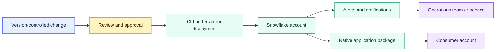

# Ecosystem and Integration Overview

> [!abstract] Chapter outcome
> Understand how Snowflake changes move from source control into governed deployment, how operations emit actionable notifications, and how Snowflake-native applications are packaged for distribution.

## Topics

**Build and deploy**

- [[01 Snowflake/07 Ecosystem and Integration/48 Snowflake CLI and Terraform Provider|48 - Snowflake CLI and Terraform Provider]]

**Source control**

- [[01 Snowflake/07 Ecosystem and Integration/49 Git Integration|49 - Git Integration]]

**Notify and operate**

- [[01 Snowflake/07 Ecosystem and Integration/50 Notification Integrations and Alerts|50 - Notification Integrations and Alerts]]

**Package and distribute**

- [[01 Snowflake/07 Ecosystem and Integration/51 Native Apps Framework|51 - Native Apps Framework]]

## Chapter Map

## Topic Summaries

| Topic | What it unlocks |
|---|---|
| [[01 Snowflake/07 Ecosystem and Integration/48 Snowflake CLI and Terraform Provider\|Snowflake CLI and Terraform]] | Repeatable, reviewed deployment of code, project artifacts, and declared infrastructure. |
| [[01 Snowflake/07 Ecosystem and Integration/49 Git Integration\|Git Integration]] | Controlled access to versioned files from Snowflake workflows. |
| [[01 Snowflake/07 Ecosystem and Integration/50 Notification Integrations and Alerts\|Notifications and Alerts]] | Condition-based operational actions routed to people or external services. |
| [[01 Snowflake/07 Ecosystem and Integration/51 Native Apps Framework\|Native Apps Framework]] | Governed packaging and cross-account distribution of Snowflake-native applications. |

## Consultant Synthesis

| Need | Primary mechanism | Key distinction |
|---|---|---|
| Deploy project code or run repeatable commands | Snowflake CLI | Executes imperative project and object operations. |
| Manage declared Snowflake infrastructure | Terraform Provider | Reconciles managed resources against versioned desired state. |
| Make repository files available in Snowflake | Git Integration | Fetches repository content; Git remains the collaboration system. |
| Detect and route operational conditions | Alerts and notification integrations | The alert decides when; the integration decides where. |
| Distribute governed logic across accounts | Native Apps Framework | Packages a product while preserving consumer-side control. |

## How To Use This Area

Follow the lifecycle from source control to deployment, then study the operational and distribution paths that apply. Keep identity, secrets, environment promotion, ownership, and audit evidence in view throughout.

## Related Areas

- [[00 Home/Snowflake Learning Map|Snowflake Learning Map]]
- [[01 Snowflake/04 Data Engineering/Data Engineering Overview|Data Engineering Overview]]
- [[01 Snowflake/06 Cost Management and Operations/Cost Management and Operations Overview|Cost Management and Operations Overview]]
- [[01 Snowflake/08 Enterprise Snowflake in Production/Enterprise Snowflake in Production Overview|Enterprise Snowflake in Production Overview]]
