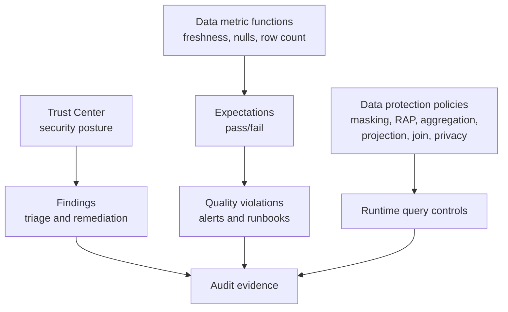

# Trust Center, Data Quality, and Data Protection Policies

> The operating layer for security posture and data trust. Consultant lens: production governance is not only defining controls, but continuously monitoring whether controls and data quality hold up.

## Executive Summary

- **What it is:** Trust Center monitors security posture and findings, data quality checks use data metric functions and expectations, and data protection policies control what users can see or do with sensitive data.
- **Why it matters:** Banks need evidence that Snowflake is configured safely, sensitive data is protected, and critical data is fresh, complete, and reliable.
- **Mental model:** **Trust Center checks the platform; data quality checks the data; policies enforce safe usage at query time.**
- **Best used when:** Establishing platform assurance, monitoring sensitive data controls, setting freshness/completeness checks, or designing privacy-safe sharing.
- **Avoid or reconsider when:** The client wants automated scanners to replace ownership, remediation, and incident response.

## What It Can Do

- Surface security posture findings and recommendations through Trust Center scanners.
- Monitor MFA readiness, over-privileged roles, inactive users, AI security, and other risks depending on enabled scanner packages.
- Use data metric functions to measure freshness, nulls, row counts, duplicates, accepted values, and other quality signals.
- Combine data metric functions with expectations to identify violations.
- Apply data protection policies such as masking, row access, aggregation, projection, join, and privacy policies.
- Notify teams about quality, security, cost, or operational issues when paired with alerts and notification integrations.

## What It Cannot Do

- Automatically decide which data quality thresholds are business-relevant.
- Fix bad pipelines or bad source contracts by itself.
- Replace human triage, remediation, and audit evidence.
- Guarantee every policy is low-cost or low-latency on every table.
- Protect data that was never classified, tagged, governed, or routed through Snowflake controls.

## Core Concepts

| Concept | Meaning | Why it matters |
|---|---|---|
| Trust Center | Snowflake interface and scanner framework for security findings | Helps monitor and reduce account security risks |
| Scanner package | Set of checks that can produce findings | Defines which posture risks are evaluated |
| Data metric function | Function that measures a data quality attribute | Building block for quality checks |
| Expectation | Pass/fail rule applied to a DMF result | Turns a measurement into an actionable quality signal |
| Data protection policy | Query-time governance object | Controls visibility, projection, joins, aggregation, or privacy behavior |
| Finding lifecycle | Triage, remediation, resolved/open status | Creates operating evidence, not just alerts |

## How It Works (Simple Flow)

1. Platform owners enable Trust Center roles, scanners, and notification patterns.
2. Security teams review findings, prioritize risks, and assign remediation.
3. Data owners identify critical tables and define quality expectations.
4. Data metric functions run on a schedule and produce measurements.
5. Expectations or anomaly detection identify data quality issues.
6. Data protection policies enforce runtime controls such as masking, row filtering, aggregation limits, or projection restrictions.
7. Findings and violations feed operational alerts, runbooks, and governance reporting.

## Visuals



## Readable Snippets

```sql
-- Example shape: inspect data quality results for a governed object.
-- Exact functions and views depend on enabled features and privileges.
select *
from table(
  snowflake.local.data_quality_monitoring_results(
    ref_entity_name => 'ANALYTICS.MART.POSITIONS',
    ref_entity_domain => 'TABLE'
  )
);
```

## Consultant Talking Points

- **Client question this answers:** "How do we know Snowflake is secure and the data is reliable enough to use?"
- **Trade-offs to mention:** Automated checks improve coverage, but every finding still needs ownership, prioritization, and remediation.
- **Risk or governance angle:** Quality failures can be governance failures when bad data flows into regulatory reporting, risk models, or client decisions.
- **Cost/performance angle:** Data quality monitoring uses serverless compute. Policies with mapping tables, UDFs, or complex logic can add query overhead.

## Common Pitfalls

- Enabling scanners or quality checks without assigning owners for findings.
- Measuring generic quality signals that no business process cares about.
- Treating data quality as only a pipeline concern instead of a governance concern.
- Applying complex policies broadly without performance testing.
- Ignoring notification fatigue from noisy thresholds.

## When to Recommend What (Decision Table)

| Situation | Recommend | Why | Watch-outs |
|---|---|---|---|
| Security team wants posture visibility | Trust Center | Surfaces findings and recommendations | Needs roles, scanners, and remediation process |
| Critical table must be fresh | DMF freshness check plus alert | Converts freshness into monitored evidence | Define business threshold clearly |
| Sensitive columns may be exposed | Classification, tags, masking, Trust Center | Finds and protects sensitive data | Classification results need review |
| Shared data must not expose row-level details | Aggregation/projection/join/privacy policies | Restricts risky query patterns | Can complicate consumer analytics |
| Data quality issue needs ops response | Alert and notification integration | Routes the signal to humans or systems | Avoid noisy checks without runbooks |

## Related Topics

- [[01 Snowflake/08 Enterprise Snowflake in Production/Enterprise Snowflake in Production Overview]]
- [[01 Snowflake/03 Security and Governance/13 Row Access Policies]]
- [[01 Snowflake/03 Security and Governance/14 Column-level Masking Policies]]
- [[01 Snowflake/03 Security and Governance/15 Data Classification]]
- [[01 Snowflake/07 Ecosystem and Integration/37 Notification Integrations and Alerts]]

## Related Decision Notes

- [[80 Comparisons and Decision Notes/Decision Notes/Decisions - Choosing a Row-Level Data Isolation Strategy]]
- [[80 Comparisons and Decision Notes/Decision Notes/Decisions - Choosing a Snowflake Notification Pattern]]
- [[80 Comparisons and Decision Notes/Comparisons/Comparison - Manual vs Auto Classification]]

## Questions

- Which quality checks belong in Snowflake versus dbt tests or external observability tools?
- Which findings require immediate incident response versus routine remediation?
- How do aggregation, projection, join, and privacy policies fit together with row access and masking?

## Sources To Revisit

- Snowflake Docs: Trust Center - https://docs.snowflake.com/en/user-guide/trust-center/overview
- Snowflake Docs: Introduction to data quality checks - https://docs.snowflake.com/en/user-guide/data-quality-intro
- Snowflake Docs: Data metric functions - https://docs.snowflake.com/en/sql-reference/functions-data-metric
- Snowflake Docs: Manage data protection policies in Snowsight - https://docs.snowflake.com/en/user-guide/data-protection-policies-snowsight
- Snowflake Docs: Privacy in Snowflake - https://docs.snowflake.com/en/guides-overview-privacy
