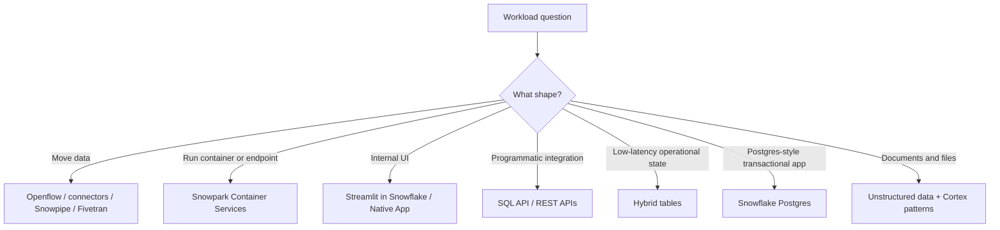

# Platform Extensions and Operational Workloads

> Snowflake beyond the classic analytical warehouse. Consultant lens: know when Snowflake can host ingestion, apps, APIs, containers, unstructured processing, and operational workloads, and when those patterns add too much complexity.

## Executive Summary

- **What it is:** A map of newer or broader Snowflake platform surfaces: Openflow, Snowpark Container Services, Streamlit in Snowflake, SQL/REST APIs, hybrid tables, Snowflake Postgres, unstructured data, and app/runtime patterns.
- **Why it matters:** Clients increasingly ask Snowflake to do more than store and query analytical tables. Consultants need to recognize the boundary between "good Snowflake platform fit" and "use a dedicated app, database, connector, or orchestration platform."
- **Mental model:** **Warehouse for analytics, Openflow/connectors for movement, SPCS for containers, Streamlit/Native Apps for user workflows, APIs for integration, hybrid/Postgres for operational edges.**
- **Best used when:** Evaluating ingestion services, embedded apps, custom APIs, real-time services, low-latency metadata/state tables, or document/unstructured processing.
- **Avoid or reconsider when:** The workload needs a mature external platform, strict portability, unsupported runtime behavior, very high OLTP scale, or ownership the Snowflake team cannot operate.

## What It Can Do

- Use Openflow to connect data sources and destinations through managed flow-based integration patterns.
- Run containerized services and jobs with Snowpark Container Services.
- Build simple data apps and internal tools with Streamlit in Snowflake.
- Expose or execute SQL through Snowflake SQL API and REST APIs.
- Use hybrid tables for low-latency, high-concurrency operational-style queries and lightweight transactional patterns.
- Use Snowflake Postgres for managed Postgres instances directly from Snowflake.
- Process staged unstructured files with directory tables, scoped URLs, UDFs/procedures, external functions, and Cortex-style AI services.

## What It Cannot Do

- Replace every specialized operational database, API platform, workflow engine, or SaaS connector.
- Make container, app, or API operations maintenance-free.
- Avoid cost ownership for compute pools, services, apps, and serverless features.
- Guarantee every feature is available in every region, edition, or account setup.
- Remove security review for network egress, secrets, images, APIs, and external dependencies.

## Core Concepts

| Concept | Meaning | Why it matters |
|---|---|---|
| Openflow | Snowflake integration service built on Apache NiFi concepts | Moves data between sources and destinations with managed connectors/processors |
| Snowpark Container Services | Managed container runtime inside Snowflake | Runs services, jobs, custom runtimes, model endpoints, and app backends |
| Streamlit in Snowflake | In-Snowflake app framework for data apps | Useful for internal data tools close to Snowflake data |
| SQL API / REST APIs | Programmatic HTTP access to Snowflake operations | Lets apps and automation integrate without interactive SQL clients |
| Hybrid table | Row-store optimized Snowflake table for low-latency operational queries | Bridges some transactional and analytical use cases |
| Snowflake Postgres | Managed Postgres instances created and used from Snowflake | Covers Postgres-style transactional needs adjacent to the data platform |
| Unstructured data | Files such as documents, images, audio, and video in stages | Enables file metadata, processing, URLs, and AI workflows |

## How It Works (Simple Flow)

1. Identify the workload shape: ingestion, app UI, API, container service, operational table, Postgres workload, or unstructured file workflow.
2. Decide whether the workload benefits from staying close to Snowflake data and governance.
3. Choose the platform surface: Openflow, SPCS, Streamlit, Native Apps, SQL/REST API, hybrid tables, Postgres, or external tooling.
4. Design identity, RBAC, network access, secrets, runtime ownership, and cost attribution.
5. Deploy through Snowflake CLI, Git, Terraform, or approved platform pipelines where possible.
6. Monitor warehouses, compute pools, serverless services, logs, event tables, API usage, and data movement.
7. Reassess whether the workload should remain inside Snowflake as scale and operational requirements grow.

## Visuals



## Readable Snippets

```sql
-- SQL API and REST APIs are called over HTTPS from applications.
-- Inside Snowflake, the recognition pattern is often that apps/services
-- still execute SQL under a role, warehouse, and governed object model.

select current_role(), current_warehouse(), current_database(), current_schema();

-- Hybrid tables and SPCS are separate operational surfaces with their own
-- design and cost questions. Validate feature support before recommending.
```

## Consultant Talking Points

- **Client question this answers:** "Can Snowflake run this connector, app, API, service, or operational workload?"
- **Trade-offs to mention:** Keeping work inside Snowflake can simplify data locality and governance, but may add Snowflake-specific runtime, cost, and operational constraints.
- **Risk or governance angle:** Containers, APIs, external access, secrets, images, and app permissions need security review like any production platform.
- **Cost/performance angle:** Compute pools, serverless services, hybrid storage, Postgres instances, API-driven workloads, and AI/file processing can cost money outside classic warehouses.

## Common Pitfalls

- Assuming Snowflake is still only warehouse credits and SQL queries.
- Running a service or notebook without compute-pool idle/cost controls.
- Using Streamlit or Native Apps when a normal BI dashboard or data share would be simpler.
- Putting API secrets, external access, or image supply chain decisions outside governance review.
- Treating hybrid tables or Snowflake Postgres as a universal OLTP replacement without checking workload fit.

## When to Recommend What (Decision Table)

| Situation | Recommend | Why | Watch-outs |
|---|---|---|---|
| SaaS/source data movement | Openflow, Fivetran, Snowpipe, or connector pattern | Match the source and latency shape | Compare managed cost, support, and control |
| Custom service close to Snowflake data | SPCS | Keeps runtime near governed data | Requires container, endpoint, security, and cost operations |
| Simple internal data app | Streamlit in Snowflake | Fast app surface for Snowflake data | Not a full app platform for every use case |
| External app needs to run SQL | SQL API or driver | Clean programmatic integration | Auth, role, warehouse, and result handling matter |
| Low-latency metadata/state table | Hybrid table | Better fit than standard table for operational lookups | Not for large analytical scans |
| Postgres-style application need | Snowflake Postgres or external Postgres | Familiar transactional database model | Understand GA limits, regions, ops, and integration pattern |
| Documents or media need processing | Unstructured data features plus Cortex/Snowpark/external functions | Keeps files and metadata governed | File access, scoped URLs, and model governance matter |

## Related Topics

- [[01 Snowflake/08 Enterprise Snowflake in Production/Enterprise Snowflake in Production Overview]]
- [[01 Snowflake/07 Ecosystem and Integration/35 Snowflake CLI and Terraform Provider]]
- [[01 Snowflake/07 Ecosystem and Integration/38 Native Apps Framework]]
- [[01 Snowflake/05 Advanced Analytics and AI/26 Snowpark]]
- [[01 Snowflake/05 Advanced Analytics and AI/30 Snowflake Notebooks]]
- [[01 Snowflake/04 Data Engineering/22 Snowpipe]]
- [[01 Snowflake/04 Data Engineering/23 Snowpipe Streaming]]

## Related Decision Notes

- [[80 Comparisons and Decision Notes/Decision Notes/Decisions - Choosing a Snowflake Ingestion Method]]
- [[80 Comparisons and Decision Notes/Comparisons/Comparison - Warehouse Inference vs SPCS Model Serving]]
- [[80 Comparisons and Decision Notes/Comparisons/Comparison - Snowflake CLI vs Terraform Provider]]

## Questions

- When should Openflow be compared with Fivetran in client recommendations?
- What are the bank's approved rules for container images, external access integrations, and secrets?
- When should an operational workload stay in Snowflake versus move to a dedicated database or app platform?

## Sources To Revisit

- Snowflake Docs: About Openflow - https://docs.snowflake.com/en/user-guide/data-integration/openflow/about
- Snowflake Docs: Snowpark Container Services - https://docs.snowflake.com/en/developer-guide/snowpark-container-services/overview
- Snowflake Docs: About Streamlit in Snowflake - https://docs.snowflake.com/en/developer-guide/streamlit/about-streamlit
- Snowflake Docs: Snowflake SQL API - https://docs.snowflake.com/en/developer-guide/sql-api/index
- Snowflake Docs: Hybrid tables - https://docs.snowflake.com/en/user-guide/tables-hybrid
- Snowflake Docs: Snowflake Postgres - https://docs.snowflake.com/en/user-guide/snowflake-postgres/about
- Snowflake Docs: Introduction to unstructured data - https://docs.snowflake.com/en/user-guide/unstructured-intro
