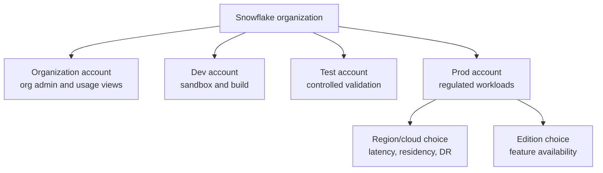

# Organizations, Accounts, Regions, and Editions

> The enterprise boundary of Snowflake. Consultant lens: account topology decides governance, isolation, billing visibility, regional resilience, and which features are available.

## Executive Summary

- **What it is:** Snowflake organizations group the accounts owned by a business entity, while individual accounts host workloads, users, roles, databases, warehouses, and platform features.
- **Why it matters:** In a bank, account design affects environment separation, regulatory boundaries, cost allocation, cross-region design, and operational ownership.
- **Mental model:** **Organization = enterprise control plane; account = workload and governance boundary; region/cloud = locality and resilience choice; edition = feature entitlement.**
- **Best used when:** Designing dev/test/prod, separating business domains, planning multi-region resilience, onboarding subsidiaries, or explaining why a feature is unavailable.
- **Avoid or reconsider when:** A client treats new accounts as a quick fix for messy RBAC, unclear ownership, or weak data product governance.

## What It Can Do

- Provide a central organization-level view of Snowflake accounts.
- Support account creation, account identifiers, organization-level usage views, and cross-account administration.
- Let enterprises separate environments, domains, regions, clouds, or sensitive workloads.
- Enable cross-region/cross-cloud patterns such as sharing, replication, failover, and billing analysis.
- Gate features through Snowflake editions such as Standard, Enterprise, Business Critical, and higher tiers.

## What It Cannot Do

- Automatically produce a good data operating model.
- Replace RBAC, data protection policies, network controls, or naming standards.
- Eliminate data residency and regulatory design work.
- Make every feature available in every edition, region, or cloud.
- Prevent cost sprawl if accounts and warehouses are created without ownership and tagging.

## Core Concepts

| Concept | Meaning | Why it matters |
|---|---|---|
| Organization | First-class Snowflake object linking accounts owned by the business | Enables central account management, billing, usage visibility, sharing, and resilience patterns |
| Organization account | Special account for organization administrators | Used for organization-level tasks and premium usage views |
| Regular account | Account where workloads, users, roles, warehouses, and data live | The usual boundary for development, production, domains, or regions |
| Region and cloud | Physical/service location and cloud provider for an account | Affects latency, residency, availability, replication, and cost |
| Edition | Commercial feature tier | Explains why features such as failover, Access History, or Business Critical controls may or may not be available |

## How It Works (Simple Flow)

1. A company operates inside a Snowflake organization.
2. Organization administrators manage or view accounts from the organization layer.
3. Each account is created in a specific cloud and region.
4. Each account receives an edition and account-level configuration.
5. Platform teams assign roles, warehouses, databases, integrations, network controls, and cost controls inside each account.
6. Organization Usage views and billing views help analyze spend and activity across accounts.
7. Replication, sharing, and listings can connect accounts when business and governance rules allow it.

## Visuals



## Readable Snippets

```sql
-- See the current organization and account context.
select
  current_organization_name() as organization_name,
  current_account_name() as account_name,
  current_region() as region;

-- Organization administrators can inspect accounts.
show accounts;
```

## Consultant Talking Points

- **Client question this answers:** "How should we structure Snowflake across environments, domains, regions, and subsidiaries?"
- **Trade-offs to mention:** More accounts can improve isolation and ownership, but increase governance, replication, identity, cost, and deployment complexity.
- **Risk or governance angle:** Account sprawl without naming, tagging, ownership, and central visibility becomes hard to audit.
- **Cost/performance angle:** Region and cloud choices affect latency, data transfer, replication cost, and sometimes feature availability.

## Common Pitfalls

- Creating accounts before defining ownership, naming, tagging, and access patterns.
- Mixing development experiments and regulated production workloads in the same account without strong isolation.
- Assuming every Snowflake feature is available in every region, cloud, or edition.
- Forgetting that cross-region or cross-cloud designs can create data transfer and operational complexity.
- Treating account separation as a substitute for proper RBAC and data protection.

## When to Recommend What (Decision Table)

| Situation | Recommend | Why | Watch-outs |
|---|---|---|---|
| Small team learning Snowflake | One account with clear role/schema separation | Keeps overhead low | Do not let early shortcuts become production defaults |
| Bank production workload | Dedicated production account | Clearer governance, operations, and change control | Needs controlled promotion path from dev/test |
| Strict regional residency | Region-specific account design | Keeps data and processing close to required jurisdiction | Cross-region sharing and replication need review |
| Many business domains | Account or database-level domain separation | Can align ownership and cost attribution | Too many accounts can fragment data and operations |
| DR requirement | Account topology designed with replication/failover | Resilience depends on target accounts and regions | Business Critical features and runbooks may be required |

## Related Topics

- [[01 Snowflake/08 Enterprise Snowflake in Production/Enterprise Snowflake in Production Overview]]
- [[01 Snowflake/08 Enterprise Snowflake in Production/53 Replication, Failover, Client Redirect, and DR]]
- [[01 Snowflake/06 Cost Management and Operations/45 Account Usage Views]]
- [[01 Snowflake/03 Security and Governance/12 RBAC Roles and Privileges]]
- [[01 Snowflake/01 Core Architecture and Concepts/04 Data Sharing and Marketplace]]

## Related Decision Notes

- [[80 Comparisons and Decision Notes/Decision Notes/Snowflake/Decisions - Choosing a Snowflake Sharing Pattern]]
- [[80 Comparisons and Decision Notes/Decision Notes/Snowflake/Decisions - Choosing a Warehouse Strategy by Workload Type]]

## Questions

- When should a bank split workloads by account, database, schema, or role design?
- How do account identifiers, organization names, and URLs affect client configuration?
- Which features in our learning path depend on Enterprise, Business Critical, or higher editions?

## Sources To Revisit

- Snowflake Docs: Introduction to organizations - https://docs.snowflake.com/en/user-guide/organizations
- Snowflake Docs: Organization accounts - https://docs.snowflake.com/en/user-guide/organization-accounts
- Snowflake Docs: Snowflake editions - https://docs.snowflake.com/en/user-guide/intro-editions
- Snowflake Docs: Organization Usage views - https://docs.snowflake.com/en/sql-reference/organization-usage
