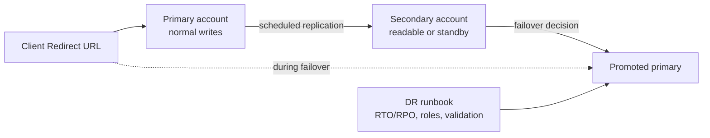

# Replication, Failover, Client Redirect, and DR

> Business continuity for Snowflake accounts and data. Consultant lens: Time Travel fixes recent mistakes; replication and failover keep critical services available when an account, region, or cloud has a serious issue.

## Executive Summary

- **What it is:** Snowflake replication and failover/failback copy selected databases, shares, and account objects to target accounts, while Client Redirect helps clients reconnect to the right account during migration or outage scenarios.
- **Why it matters:** Banks need explicit RTO/RPO thinking, disaster recovery drills, and clarity about which workloads recover first.
- **Mental model:** **Replication prepares the copy; failover promotes it; Client Redirect points clients at it; the DR runbook decides when and how.**
- **Best used when:** Designing regional resilience, business continuity, migration between regions/clouds, or multiple readable secondary environments.
- **Avoid or reconsider when:** The requirement is only recent data recovery from a bad load, where Time Travel, clones, and undrop are usually the first tools.

## What It Can Do

- Replicate databases, shares, and selected account objects across accounts.
- Support replication groups and failover groups with scheduled refresh.
- Promote secondary objects during planned or unplanned failover.
- Support readable secondaries for some use cases.
- Use Client Redirect to reduce client connection changes during failover or migration.
- Support DR drills and cross-region/cross-cloud continuity planning.

## What It Cannot Do

- Provide zero data loss for every workload; replication is asynchronous.
- Automatically reconcile writes that happened after the last replication refresh.
- Replace application-level runbooks and stakeholder decisions.
- Replicate every Snowflake feature or object without limitations.
- Remove cross-region/cloud data transfer, cost, compliance, and latency considerations.

## Core Concepts

| Concept | Meaning | Why it matters |
|---|---|---|
| Replication group | Collection of objects replicated together | Defines what is copied, where, and on what schedule |
| Failover group | Replication group that can be promoted | Enables continuity when the primary environment is unavailable |
| Primary object | Source object accepting normal writes | The authoritative object before failover |
| Secondary object | Replicated target object | Can support reads or be promoted depending on design |
| Client Redirect | Connection URL that can point clients to another account | Reduces emergency client reconfiguration |
| RTO/RPO | Recovery time objective and recovery point objective | Business language for how fast and how complete recovery must be |

## How It Works (Simple Flow)

1. Identify critical databases, account objects, integrations, and data pipeline objects.
2. Define target accounts in appropriate regions or clouds.
3. Create replication or failover groups with a refresh schedule.
4. Monitor lag, refresh status, errors, and costs.
5. Test planned failover during a DR drill.
6. During an incident, decide whether to recover reads, writes, or both.
7. Promote secondary objects and redirect clients according to the runbook.
8. After the incident, reconcile data and plan failback if needed.

## Visuals



## Readable Snippets

```sql
-- Names and schedules vary by implementation.
-- The pattern is: define a group, refresh it, monitor it, and fail over only through a runbook.

show replication groups;
show failover groups;

-- Use history and status views/functions to monitor replication freshness
-- before claiming a DR design is production-ready.
```

## Consultant Talking Points

- **Client question this answers:** "What happens if our primary Snowflake region or account becomes unavailable?"
- **Trade-offs to mention:** Shorter replication intervals reduce potential data loss but may increase cost and operational sensitivity.
- **Risk or governance angle:** DR without tested runbooks is only a diagram. Regulated environments need drills, evidence, roles, and decision owners.
- **Cost/performance angle:** Replication, data transfer, secondary storage, and duplicated services can all affect cost.

## Common Pitfalls

- Confusing Time Travel with disaster recovery.
- Replicating data but forgetting account objects, integrations, users, roles, network policies, tasks, stages, pipes, or Git repositories where relevant.
- Setting a replication interval without agreeing on RTO/RPO with the business.
- Not testing Client Redirect and application connection behavior before an outage.
- Ignoring data reconciliation after a write-side failover.

## When to Recommend What (Decision Table)

| Situation | Recommend | Why | Watch-outs |
|---|---|---|---|
| Bad load or accidental delete | Time Travel / clone / undrop | Fast self-service recovery | Limited retention window |
| Regional outage read continuity | Replicated secondary plus Client Redirect | Restores read access with controlled staleness | Data may lag behind primary |
| Critical write continuity | Failover group and write-side recovery runbook | Allows promoted target to accept writes | Reconciliation and failback are hard |
| Cloud/region migration | Replication plus planned cutover | Reduces downtime and avoids bulk reload | Client, integration, and network config must be tested |
| Compliance asks for DR evidence | DR drill with monitoring and sign-off | Proves the design works | Requires operational discipline |

## Related Topics

- [[01 Snowflake/08 Enterprise Snowflake in Production/Enterprise Snowflake in Production Overview]]
- [[01 Snowflake/08 Enterprise Snowflake in Production/52 Organizations, Accounts, Regions, and Editions]]
- [[01 Snowflake/01 Core Architecture and Concepts/03 Time Travel and Fail-safe]]
- [[01 Snowflake/06 Cost Management and Operations/44 Credit Consumption Model]]
- [[01 Snowflake/07 Ecosystem and Integration/50 Notification Integrations and Alerts]]

## Related Decision Notes

- [[80 Comparisons and Decision Notes/Comparisons/Comparison - Time Travel vs Fail-safe]]
- [[80 Comparisons and Decision Notes/Comparisons/Comparison - Time Travel vs Modeled Historical Data]]

## Questions

- Which workloads need read recovery first, write recovery first, or both?
- What RTO and RPO are actually required by the business?
- Which account objects and pipeline objects must be replicated for the DR environment to be useful?

## Sources To Revisit

- Snowflake Docs: Introduction to business continuity and disaster recovery - https://docs.snowflake.com/en/user-guide/replication-intro
- Snowflake Docs: Introduction to replication and failover across multiple accounts - https://docs.snowflake.com/en/user-guide/account-replication-intro
- Snowflake Docs: Redirecting client connections - https://docs.snowflake.com/en/user-guide/client-redirect
- Snowflake Docs: Backups for disaster recovery and immutable storage - https://docs.snowflake.com/en/user-guide/backups
