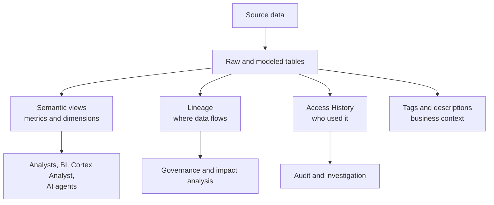

# Horizon Catalog, Lineage, and Access History

> The trust and discovery layer around Snowflake data. Consultant lens: enterprises need to find authoritative data, understand business context, trace lineage, and prove who accessed what.

## Executive Summary

- **What it is:** Snowflake Horizon Catalog brings discovery, semantics, governance, lineage, and policy context together across Snowflake and connected data estates.
- **Why it matters:** In a bank, users and AI agents need trusted context, not just table names. Data teams need evidence for lineage, access, dependencies, and sensitive data propagation.
- **Mental model:** **Catalog tells users what data means; lineage tells where it came from and where it goes; Access History tells who used it.**
- **Best used when:** Building governed data products, investigating report dependencies, auditing sensitive-column usage, enabling self-service analytics, or preparing AI/semantic workflows.
- **Avoid or reconsider when:** The client expects catalog tools to fix poor ownership, ambiguous metric definitions, or undocumented source contracts automatically.

## What It Can Do

- Help users discover governed datasets, metadata, descriptions, and semantic context.
- Support semantic views for business-friendly metrics, dimensions, and relationships.
- Expose lineage between tables, views, columns, and external tools where configured.
- Use Access History to investigate object and column access.
- Use Object Dependencies to understand references between objects.
- Support internal data product discovery and AI context patterns.

## What It Cannot Do

- Invent correct business definitions where stakeholders disagree.
- Guarantee full lineage if external systems are not integrated or lineage is broken.
- Replace data ownership, stewardship, and data product lifecycle management.
- Make bad data trustworthy just because it is cataloged.
- Remove the need for RBAC, masking, row access policies, and data quality controls.

## Core Concepts

| Concept | Meaning | Why it matters |
|---|---|---|
| Horizon Catalog | Snowflake's catalog and governance context layer | Helps people and agents find, understand, and trust data |
| Semantic view | Schema-level business semantic object | Defines logical tables, dimensions, facts, metrics, and relationships |
| Lineage | Flow of data from source to downstream objects | Supports impact analysis, audit, and sensitive-data tracking |
| Access History | Account Usage evidence of object and column access | Helps answer who accessed what and how data moved |
| Object Dependencies | Metadata references between objects | Helps identify what breaks when an object changes |
| Internal Marketplace | Organizational discovery and sharing pattern | Lets teams find governed internal data products |

## How It Works (Simple Flow)

1. Data teams define and document authoritative datasets.
2. Tags, descriptions, classifications, and semantic views add business context.
3. Snowflake tracks object dependencies and access activity through metadata views.
4. Lineage surfaces upstream and downstream relationships.
5. Users, stewards, and AI workflows discover trusted assets through catalog surfaces.
6. Governance teams inspect access, lineage, tags, and policy coverage.
7. Findings feed back into documentation, ownership, data quality, and policy improvements.

## Visuals



## Readable Snippets

```sql
-- Examples vary by edition and privileges.
-- Access History is useful for access and lineage-style questions.
select
  query_id,
  user_name,
  direct_objects_accessed,
  objects_modified,
  query_start_time
from snowflake.account_usage.access_history
where query_start_time >= dateadd('day', -7, current_timestamp())
order by query_start_time desc;
```

## Consultant Talking Points

- **Client question this answers:** "Where did this number come from, who uses it, and can we trust it?"
- **Trade-offs to mention:** Catalog value depends on ownership, naming, descriptions, semantic modeling, and operational adoption.
- **Risk or governance angle:** Sensitive data can spread into derived objects. Lineage and Access History help detect and govern that spread.
- **Cost/performance angle:** Metadata views are powerful but can be large and delayed; filter queries carefully and use the right history source.

## Common Pitfalls

- Treating catalog as a one-time documentation project instead of an operating process.
- Building AI self-service before defining metric ownership and semantic contracts.
- Assuming lineage is complete across external tools without integration.
- Ignoring Access History because RBAC "already says" who could access data.
- Over-linking every dataset without curating authoritative data products.

## When to Recommend What (Decision Table)

| Situation | Recommend | Why | Watch-outs |
|---|---|---|---|
| Users cannot find trusted data | Horizon Catalog and internal marketplace patterns | Improves discovery and context | Requires ownership and curation |
| KPI definitions differ by report | Semantic views and metric governance | Creates a shared business contract | Must align with dbt and BI semantic layers |
| Need impact analysis before changing a table | Lineage and Object Dependencies | Shows downstream usage and references | External lineage may need setup |
| Audit asks who accessed sensitive data | Access History | Provides evidence of object/column access | Edition, retention, and privileges matter |
| AI agents need reliable context | Semantic views, tags, descriptions, lineage | Reduces ambiguity and unsafe answers | AI does not fix weak data contracts |

## Related Topics

- [[01 Snowflake/08 Enterprise Snowflake in Production/Enterprise Snowflake in Production Overview]]
- [[01 Snowflake/05 Advanced Analytics and AI/34 Cortex Analyst]]
- [[01 Snowflake/03 Security and Governance/15 Data Classification]]
- [[01 Snowflake/03 Security and Governance/18 Object Tagging]]
- [[01 Snowflake/06 Cost Management and Operations/45 Account Usage Views]]

## Related Decision Notes

- [[80 Comparisons and Decision Notes/Comparisons/Comparison - Cortex Analyst vs Cortex AI Functions]]
- [[80 Comparisons and Decision Notes/Comparisons/Comparison - dbt Projects on Snowflake vs dbt Platform]]

## Questions

- How should Snowflake semantic views align with dbt models, BI semantic layers, and business KPI catalogs?
- Which lineage evidence is needed for regulatory reporting?
- Who owns descriptions, tags, semantic definitions, and certification status?

## Sources To Revisit

- Snowflake Docs: Snowflake Horizon Catalog - https://docs.snowflake.com/en/user-guide/snowflake-horizon
- Snowflake Docs: Overview of semantic views - https://docs.snowflake.com/en/user-guide/views-semantic/overview
- Snowflake Docs: Data Lineage - https://docs.snowflake.com/en/user-guide/ui-snowsight-lineage
- Snowflake Docs: Access History - https://docs.snowflake.com/en/user-guide/access-history
- Snowflake Docs: Object Dependencies - https://docs.snowflake.com/en/user-guide/object-dependencies
