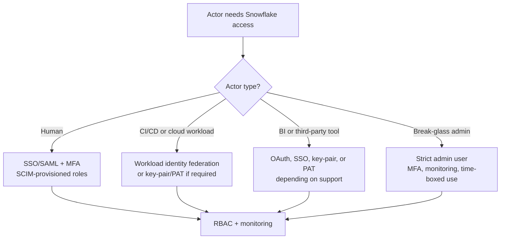

# Authentication and Service Identity Patterns

> How humans, services, tools, and CI/CD safely authenticate to Snowflake. Consultant lens: identity design is a core production control, not a setup detail.

## Executive Summary

- **What it is:** Snowflake supports multiple authentication patterns including SSO/SAML, MFA, SCIM-managed users, OAuth, key-pair authentication, programmatic access tokens, authentication policies, and workload identity federation.
- **Why it matters:** In a bank, long-lived shared secrets, manual users, and broad service roles create audit and incident risk.
- **Mental model:** **Humans use federated identity and MFA; services use purpose-built service identities; CI/CD should prefer short-lived or tightly governed credentials.**
- **Best used when:** Designing enterprise login, CI/CD deployment, service users, tool integrations, API access, or break-glass administration.
- **Avoid or reconsider when:** A team wants to use a shared password user because it is faster than designing proper identity ownership.

## What It Can Do

- Use SSO/federated authentication for human access.
- Use SCIM for automated user and role provisioning.
- Enforce allowed authentication methods and MFA behavior with authentication policies.
- Support OAuth for supported clients and delegated access patterns.
- Support key-pair authentication and programmatic access tokens where appropriate.
- Use workload identity federation for secretless service-to-service authentication from supported workload identities.
- Restrict service users through role design, network policies, and monitoring.

## What It Cannot Do

- Make over-privileged roles safe.
- Fix weak ownership of service accounts.
- Eliminate the need for credential rotation, audit, and deprovisioning when long-lived credentials are used.
- Guarantee every third-party tool supports the preferred authentication method.
- Replace RBAC, query tagging, and cost attribution.

## Core Concepts

| Concept | Meaning | Why it matters |
|---|---|---|
| Federated authentication / SSO | Human login through an identity provider | Centralizes login policy and user lifecycle |
| SCIM | Automated provisioning from identity provider to Snowflake | Reduces manual joiner/mover/leaver risk |
| Authentication policy | Snowflake policy controlling allowed auth methods, MFA, clients, and PAT behavior | Lets administrators enforce account or user-level authentication rules |
| Service user | Non-human Snowflake user for workloads | Should have narrow ownership, roles, and monitoring |
| Key-pair authentication | Private/public key auth pattern | Common for services, but key lifecycle must be managed |
| Programmatic access token | Token-based auth for clients/endpoints | Easier than keys in some tools, but still a secret to govern |
| Workload identity federation | Short-lived workload attestation from cloud/identity provider | Avoids storing long-lived Snowflake credentials |

## How It Works (Simple Flow)

1. Classify the actor: human user, service workload, CI/CD runner, BI tool, app, or emergency admin.
2. Choose the approved authentication method for that actor.
3. Create or provision the user with the correct type, roles, and ownership.
4. Apply authentication policies, network policies, and session/password policies where appropriate.
5. Grant only the minimum required roles and privileges.
6. Monitor login history, credential usage, and service behavior.
7. Rotate, revoke, or disable credentials and users through a documented lifecycle.

## Visuals



## Readable Snippets

```sql
-- Example shape for a service user. Exact syntax and parameters depend on the chosen auth pattern.
create user svc_dbt_prod
  type = service
  default_role = role_dbt_prod_runner
  default_warehouse = wh_dbt_prod
  must_change_password = false;

grant role role_dbt_prod_runner to user svc_dbt_prod;

-- Monitor login behavior through Account Usage.
select user_name, reported_client_type, first_authentication_factor, event_timestamp
from snowflake.account_usage.login_history
where user_name = 'SVC_DBT_PROD'
order by event_timestamp desc;
```

## Consultant Talking Points

- **Client question this answers:** "How should our tools, services, and CI/CD authenticate to Snowflake without creating audit risk?"
- **Trade-offs to mention:** Secretless federation is cleaner when supported, but key-pair auth or PATs may be needed for older tools.
- **Risk or governance angle:** Shared users and long-lived secrets weaken attribution, revocation, and incident response.
- **Cost/performance angle:** Identity itself is not the cost driver, but poor identity design hides ownership of warehouses, tasks, queries, and platform services.

## Common Pitfalls

- Using ACCOUNTADMIN or broad platform roles for CI/CD.
- Letting service users own business objects directly instead of using functional ownership roles.
- Storing private keys, passwords, tokens, or PATs in Git or local config files.
- Assuming MFA for humans solves service authentication risk.
- Not monitoring whether a service user is used from unexpected clients or networks.

## When to Recommend What (Decision Table)

| Situation | Recommend | Why | Watch-outs |
|---|---|---|---|
| Human analyst or engineer | SSO/SAML plus MFA and SCIM role provisioning | Strong enterprise lifecycle and audit | Avoid direct user grants |
| CI/CD runner in supported cloud/platform | Workload identity federation | Avoids long-lived Snowflake secrets | Requires issuer/subject setup and driver support |
| Legacy automation tool | Key-pair auth or PAT with rotation | Practical compatibility path | Treat as sensitive secret and monitor usage |
| Third-party BI tool | OAuth or supported SSO pattern | Better delegated access experience | Tool support varies |
| Emergency administrator | Break-glass user/role with MFA and alerts | Keeps recovery path available | Must be rare, monitored, and reviewed |

## Related Topics

- [[01 Snowflake/08 Enterprise Snowflake in Production/Enterprise Snowflake in Production Overview]]
- [[01 Snowflake/03 Security and Governance/12 RBAC Roles and Privileges]]
- [[01 Snowflake/03 Security and Governance/16 Network Policies and Private Connectivity]]
- [[01 Snowflake/07 Ecosystem and Integration/48 Snowflake CLI and Terraform Provider]]
- [[01 Snowflake/07 Ecosystem and Integration/49 Git Integration]]

## Related Decision Notes

- [[80 Comparisons and Decision Notes/Comparisons/Snowflake/Comparison - Secondary Roles vs Composite Roles]]
- [[80 Comparisons and Decision Notes/Comparisons/Snowflake/Comparison - Snowflake CLI vs Terraform Provider]]

## Questions

- Which tools in the bank support workload identity federation, OAuth, key-pair auth, or PATs?
- How should service users be named, owned, monitored, and decommissioned?
- Which authentication policies should apply at account level versus user level?

## Sources To Revisit

- Snowflake Docs: Overview of authentication - https://docs.snowflake.com/en/user-guide/security-authentication-overview
- Snowflake Docs: Authentication policies - https://docs.snowflake.com/en/user-guide/authentication-policies
- Snowflake Docs: Workload identity federation - https://docs.snowflake.com/en/user-guide/workload-identity-federation
- Snowflake Docs: Key-pair authentication and rotation - https://docs.snowflake.com/en/user-guide/key-pair-auth
- Snowflake Docs: Programmatic access tokens - https://docs.snowflake.com/en/user-guide/programmatic-access-tokens
