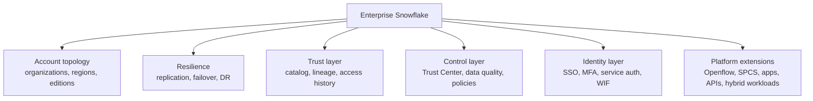

# Enterprise Snowflake in Production Overview

> The bank-scale operating layer around Snowflake: accounts, regions, resilience, identity, catalog, trust, and newer platform surfaces.

## Chapter Summary

This chapter fills the gap between knowing Snowflake features and recognizing how an enterprise runs Snowflake safely. In a regulated bank, the important questions are often not "how do I write the query?" but "which account owns this?", "what happens during a regional outage?", "which identity pattern is approved for service workloads?", "how do we prove sensitive data is protected?", and "when is Snowflake acting as more than a warehouse?"

Treat this chapter as a production-readiness map. The notes are intentionally seed notes for now: enough to create the mental model, sources, and follow-up path, but designed to be expanded one by one during the next learning pass.

## Topics

- [[01 Snowflake/08 Enterprise Snowflake in Production/52 Organizations, Accounts, Regions, and Editions|52 - Organizations, Accounts, Regions, and Editions]]
- [[01 Snowflake/08 Enterprise Snowflake in Production/53 Replication, Failover, Client Redirect, and DR|53 - Replication, Failover, Client Redirect, and DR]]
- [[01 Snowflake/08 Enterprise Snowflake in Production/54 Horizon Catalog, Lineage, and Access History|54 - Horizon Catalog, Lineage, and Access History]]
- [[01 Snowflake/08 Enterprise Snowflake in Production/55 Trust Center, Data Quality, and Data Protection Policies|55 - Trust Center, Data Quality, and Data Protection Policies]]
- [[01 Snowflake/08 Enterprise Snowflake in Production/56 Authentication and Service Identity Patterns|56 - Authentication and Service Identity Patterns]]
- [[01 Snowflake/08 Enterprise Snowflake in Production/57 Platform Extensions and Operational Workloads|57 - Platform Extensions and Operational Workloads]]

## Topic Summaries

### [[01 Snowflake/08 Enterprise Snowflake in Production/52 Organizations, Accounts, Regions, and Editions|52 - Organizations, Accounts, Regions, and Editions]]

Organizations and accounts define the enterprise boundary of Snowflake. This note is about account topology, dev/test/prod separation, region and cloud choices, organization-level usage visibility, and edition-driven feature availability. The consultant lens is to separate workload isolation, governance, billing, resilience, and regulatory constraints before recommending an account structure.

### [[01 Snowflake/08 Enterprise Snowflake in Production/53 Replication, Failover, Client Redirect, and DR|53 - Replication, Failover, Client Redirect, and DR]]

Business continuity is not the same as Time Travel. This note covers replication groups, failover groups, account-object replication, RTO/RPO thinking, Client Redirect, DR drills, and the cost/governance implications of cross-region or cross-cloud resilience.

### [[01 Snowflake/08 Enterprise Snowflake in Production/54 Horizon Catalog, Lineage, and Access History|54 - Horizon Catalog, Lineage, and Access History]]

Horizon Catalog is the broader trust and discovery layer around Snowflake data. This note frames catalog, semantic context, lineage, object dependencies, Access History, and internal marketplace style discovery as the evidence layer that lets humans and AI agents find, understand, and trust data.

### [[01 Snowflake/08 Enterprise Snowflake in Production/55 Trust Center, Data Quality, and Data Protection Policies|55 - Trust Center, Data Quality, and Data Protection Policies]]

This note connects security posture, data quality monitoring, data metric functions, and advanced policies. It extends the earlier security chapter from "define controls" to "operate, monitor, and prove controls over time."

### [[01 Snowflake/08 Enterprise Snowflake in Production/56 Authentication and Service Identity Patterns|56 - Authentication and Service Identity Patterns]]

Authentication design is a production platform concern. This note covers human access, service users, SSO, MFA, authentication policies, OAuth, key-pair auth, programmatic access tokens, workload identity federation, and how to think about secretless CI/CD in a bank.

### [[01 Snowflake/08 Enterprise Snowflake in Production/57 Platform Extensions and Operational Workloads|57 - Platform Extensions and Operational Workloads]]

Snowflake is increasingly a platform for ingestion, apps, APIs, containers, and operational workloads. This note maps Openflow, Snowpark Container Services, Streamlit in Snowflake, SQL/REST APIs, hybrid tables, Snowflake Postgres, and unstructured data handling without going deep into any single one yet.

## Visuals

## Consultant Synthesis

| Client signal | Start with | Why |
|---|---|---|
| "We need separate environments and regional controls." | Organizations, accounts, regions, editions | Account design shapes governance, billing, resilience, and operations. |
| "What happens if the Snowflake region goes down?" | Replication, failover, Client Redirect, DR | Time Travel is recovery from mistakes; replication/failover is continuity. |
| "Which reports or models use this sensitive field?" | Horizon Catalog, lineage, Access History | The answer needs metadata and evidence, not only RBAC. |
| "How do we prove the platform is secure and data is fresh?" | Trust Center, data quality, data protection policies | Banks need continuous posture and data trust controls. |
| "How should CI/CD or services authenticate?" | Authentication and service identity patterns | Long-lived secrets and shared users are audit risks. |
| "Can Snowflake run this app, connector, or low-latency workload?" | Platform extensions and operational workloads | Snowflake may fit, but cost, ownership, and runtime limits decide. |

## What You Should Be Able To Explain

- Why account topology is an architecture decision, not just administration.
- Why disaster recovery is different from Time Travel and Fail-safe.
- Why catalog, lineage, and access history become critical in regulated analytics.
- Why data quality monitoring belongs beside governance, not after it.
- Why service identity patterns matter as much as user RBAC.
- Where Snowflake now extends beyond the classic analytical warehouse model.

## How To Use This Area

Use this note as the hub for the production Snowflake chapter. The global [[00 Home/Snowflake Learning Map|Snowflake Learning Map]] links here, and the topic notes link back here so Graph View stays readable.

## Related Areas

- [[00 Home/Snowflake Learning Map|Snowflake Learning Map]]
- [[01 Snowflake/03 Security and Governance/Security and Governance Overview|Security and Governance]]
- [[01 Snowflake/04 Data Engineering/Data Engineering Overview|Data Engineering]]
- [[01 Snowflake/06 Cost Management and Operations/Cost Management and Operations Overview|Cost Management and Operations]]
- [[01 Snowflake/07 Ecosystem and Integration/Ecosystem and Integration Overview|Ecosystem and Integration]]
- [[80 Comparisons and Decision Notes/Comparisons and Decision Notes Overview|Comparisons and Decision Notes]]
