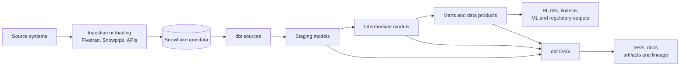

# What dbt Is and Is Not

> dbt is the transformation and analytics-engineering layer: it turns data already in a data platform into tested, documented, dependency-aware analytical models.

## Executive Summary

- **What it is:** dbt is a framework for building, testing, documenting, and deploying data transformations, usually with SQL, inside a cloud data platform such as Snowflake.
- **Why it matters:** It lets analytics and data engineering teams treat SQL transformations more like software: modular code, Git review, dependency management, repeatable builds, tests, documentation, and deployment discipline.
- **Mental model:** Source systems feed a data platform; dbt organizes the transformation logic from raw or source-aligned data into trusted staging models, intermediate models, marts, metrics, and downstream data products.
- **Best used when:** Data already lands in the warehouse or lakehouse and the client needs reliable transformation logic, lineage, quality checks, documentation, and team workflow around analytical models.
- **Avoid or reconsider when:** The problem is ingestion, real-time event processing, operational application logic, general-purpose orchestration, BI visualization, or unclear business rules that have not been agreed.

## What It Can Do

- Transform data that already exists in Snowflake or another supported data platform.
- Organize SQL models into a dependency graph using `ref()` and `source()`.
- Build models in the right order based on dependencies.
- Materialize models as views, tables, incremental tables, ephemeral models, or platform-specific materializations.
- Add data tests, unit tests, source freshness checks, documentation, and exposures.
- Generate artifacts such as `manifest.json`, `run_results.json`, and catalog metadata for lineage, docs, CI, and observability.
- Support development, CI, deployment, and production workflows through dbt Core, the dbt platform, dbt Fusion, or platform-native options such as dbt Projects on Snowflake.
- Help teams make transformation logic reviewable, reusable, and easier to operate.

## What It Cannot Do

- Ingest data from source systems by itself; tools such as Fivetran, Snowpipe, Kafka, APIs, or custom pipelines normally handle extraction and loading.
- Store data or execute warehouse compute independently; Snowflake or another data platform still stores the data and runs the compiled SQL.
- Replace BI tools such as Power BI, Tableau, Looker, or Sigma.
- Automatically determine correct business logic, metric definitions, regulatory rules, or finance sign-off.
- Replace enterprise governance controls such as RBAC, masking policies, row access policies, data classification, retention policy, or audit processes.
- Make inefficient SQL cheap; dbt can structure SQL well, but the warehouse still pays for the queries it runs.
- Eliminate the need for orchestration, observability, incident response, or ownership in production.

## Core Concepts

| Concept | Meaning | Why it matters |
|---|---|---|
| Data platform | The system where data lives and SQL executes, such as Snowflake | dbt controls transformation workflow; the platform still stores data and charges for compute |
| Model | A SQL or Python transformation that produces a dataset | Models are the core building blocks of a dbt project |
| Source | A declared raw or upstream table loaded by another process | Makes upstream data visible, testable, documentable, and available through `source()` |
| `ref()` | A dbt function that references another model | Creates dependencies so dbt can build the DAG and run models in order |
| DAG | Directed acyclic graph: a dependency map with direction and no circular loops | Shows what depends on what, what runs first, and what downstream assets are affected by a change |
| Materialization | The strategy for persisting a model, such as view, table, incremental, or ephemeral | Affects performance, cost, freshness, and operational behavior |
| Test | A data assertion or unit-level check | Turns assumptions into executable checks |
| Artifact | Metadata output from a dbt run, such as manifest or run results | Supports docs, lineage, CI, debugging, and observability |
| Environment | A target context such as dev, CI, staging, or prod | Keeps development, validation, and production builds separated |

## How It Works (Simple Flow)

1. Data lands in Snowflake or another data platform through ingestion tools or platform-native loading.
2. dbt declares upstream tables as `sources` so they can be referenced, tested, documented, and freshness-checked.
3. Developers write modular models that use `source()` for upstream data and `ref()` for other dbt models.
4. dbt parses the project and builds a DAG showing model dependencies.
5. dbt compiles Jinja and SQL into executable platform-specific SQL.
6. The data platform executes the compiled SQL and creates or updates the target objects.
7. dbt runs tests, freshness checks, docs generation, and other commands depending on the job.
8. Teams use artifacts, logs, documentation, lineage, and run results to review, operate, and improve the pipeline.

## Visuals



## Readable Snippets

A dbt model is usually a select statement. `ref()` tells dbt that this model depends on another dbt model:

```sql
with trades as (
    select * from {{ ref('stg_trades') }}
),

instruments as (
    select * from {{ ref('stg_instruments') }}
)

select
    trades.trade_id,
    trades.trade_date,
    instruments.asset_class,
    trades.notional_amount
from trades
left join instruments
    on trades.instrument_id = instruments.instrument_id
```

A source declaration tells dbt about raw data loaded by another tool:

```yaml
sources:
  - name: trading_raw
    database: raw_investment_data
    schema: trading
    tables:
      - name: trades
        loaded_at_field: loaded_at
        freshness:
          warn_after: {count: 30, period: minute}
          error_after: {count: 60, period: minute}
```

## Consultant Talking Points

- **Client question this answers:** "Why do we need dbt if we already have Snowflake?"
- **Trade-offs to mention:** Snowflake is the data platform; dbt is the engineering workflow for transformation code, dependency management, tests, documentation, and deployment. The trade-off is another project/control-plane layer to govern.
- **Risk or governance angle:** dbt improves transparency and repeatability, but it must be paired with approved roles, controlled environments, source ownership, test severity, documentation standards, and audit evidence.
- **Cost/performance angle:** dbt itself does not make queries free. Snowflake still charges for the compiled SQL, tests, full refreshes, incremental merges, and documentation/freshness queries.

## Common Pitfalls

- Treating dbt as "just scheduled SQL" and missing the value of modularity, `ref()` dependencies, tests, docs, environments, and artifacts.
- Expecting dbt to ingest data from source systems. dbt normally transforms data after it has landed in the platform.
- Assuming a green dbt run proves the data is correct. A run can succeed while source data is stale, business logic is wrong, or reconciliation is missing.
- Building too much Jinja or macro abstraction too early, making compiled SQL difficult to inspect and defend.
- Running dbt with overly powerful roles such as account-level admin roles instead of least-privilege development, CI, deployment, and production execution roles.
- Scheduling frequent full builds or broad tests without understanding warehouse cost and downstream freshness requirements.
- Confusing dbt documentation with enterprise governance. Docs help explain models, but they do not replace access controls, data classification, approvals, or regulatory sign-off.

## When to Recommend What (Decision Table)

| Situation | Recommend | Why | Watch-outs |
|---|---|---|---|
| Raw data already lands in Snowflake and teams maintain many analytical SQL transformations | dbt | Adds structure, lineage, tests, docs, and deployment workflow around transformation logic | Needs ownership, standards, and warehouse cost controls |
| Client needs to extract data from SaaS systems, databases, or files | Ingestion tool before dbt | dbt expects data to already be available in the platform | Do not force dbt to solve extraction and loading |
| Client has a few simple transformations owned by one platform team | Snowflake SQL, Tasks, Dynamic Tables, or dbt depending on growth path | A small workload may not need a full dbt operating model immediately | Revisit when transformations, teams, tests, or docs grow |
| Client needs governed marts across risk, finance, reporting, and analytics teams | dbt plus Snowflake governance | dbt handles transformation workflow; Snowflake handles storage, compute, RBAC, and data policies | Align naming, ownership, environments, and production release process |
| Client wants dashboards or self-service visualization | BI tool on top of dbt-modeled data | dbt creates trusted data products; BI tools present them to users | Metric definitions and semantic ownership must be clear |
| Client has unresolved P&L, risk, or regulatory business rules | Facilitate rule definition before heavy implementation | dbt can implement agreed logic, but cannot decide the correct rule | Avoid making disputed logic look authoritative |

## Related Topics

- [[02 dbt/01 Core Concepts and Project Structure/Core Concepts and Project Structure Overview|Core Concepts and Project Structure Overview]]
- [[02 dbt/01 Core Concepts and Project Structure/05 Models ref source and the DAG|Models, ref(), source(), and the DAG]]
- [[02 dbt/01 Core Concepts and Project Structure/07 Sources and Source Freshness|Sources and Source Freshness]]
- [[02 dbt/01 Core Concepts and Project Structure/06 Commands and Artifacts|Commands and Artifacts]]
- [[02 dbt/04 Incremental Processing and Performance/30 Materializations|Materializations]]
- [[01 Snowflake/04 Data Engineering/25 dbt on Snowflake|dbt on Snowflake]]

## Related Decision Notes

- No related decision note yet.

## Questions

- Which team owns transformation logic: data engineering, analytics engineering, platform, or domain teams?
- Where does ingestion stop and dbt ownership begin?
- Which outputs need stronger tests, documentation, contracts, or audit evidence?
- Which environment and role should build development, CI, staging, and production models?
- What is the smallest useful dbt workflow before adding advanced packages, macros, or Mesh patterns?

## Sources To Revisit

- [dbt Docs: What is dbt?](https://docs.getdbt.com/docs/introduction)
- [dbt Docs: SQL models](https://docs.getdbt.com/docs/build/sql-models)
- [dbt Docs: Sources](https://docs.getdbt.com/docs/build/sources)
- [dbt Docs: Data tests](https://docs.getdbt.com/docs/build/data-tests)
- [dbt Docs: Materializations](https://docs.getdbt.com/docs/build/materializations)
- [dbt Docs: Documentation](https://docs.getdbt.com/docs/build/documentation)
