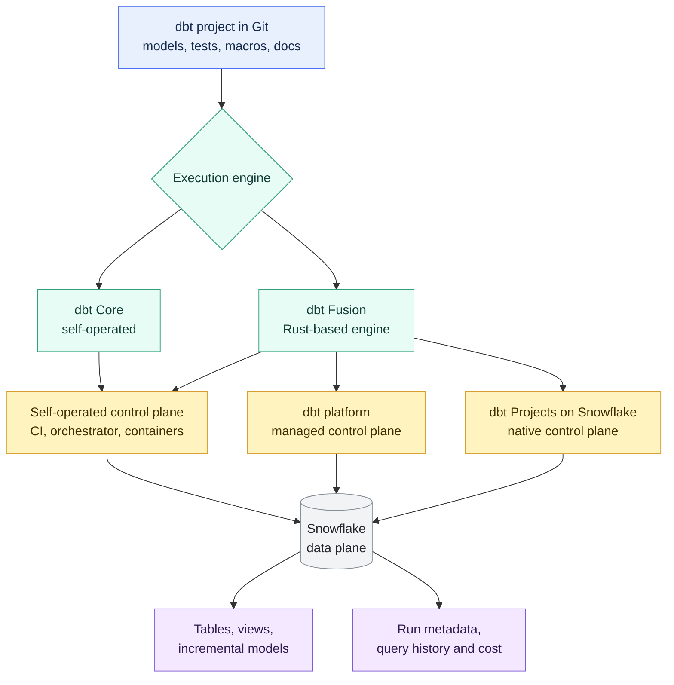

# dbt Core, Fusion, dbt Platform, and dbt Projects on Snowflake

> [!abstract] Mental model
> Separate the project, execution engine, control plane, and Snowflake data plane before making a recommendation.

## Executive Summary

- **What it is:** These are different ways to develop, compile, execute, schedule, monitor, and govern dbt projects. They are related, but they are not the same layer.
- **Why it matters:** Clients often ask, "Should we use dbt Core, Fusion, the dbt platform, or Snowflake-native dbt?" The deeper decision is who owns the dbt operating model; the SQL still runs in the data platform.
- **Mental model:** **Project code is portable. Engines run dbt. Control planes manage workflow. Snowflake executes and stores the data when Snowflake is the warehouse.**
- **Best used when:** A client needs to choose a dbt operating model, compare managed versus self-operated execution, or decide whether Snowflake or dbt Labs should own production dbt operations.
- **Avoid or reconsider when:** The client has not yet defined transformation ownership, data platform strategy, security boundaries, CI/CD standards, or production support responsibilities.

## What It Can Do

- Clarify the difference between the dbt project, engine, control plane, and data platform.
- Explain why the same dbt project can often run in multiple environments.
- Compare self-operated Core or Fusion with the managed dbt platform and Snowflake-native dbt Projects.
- Help clients decide where development, CI, scheduling, monitoring, documentation, artifacts, and alerting should live.
- Support a bank-style governance discussion around SaaS boundaries, metadata exposure, service identities, RBAC, auditability, and production support.
- Reduce confusion between "Fusion" as an engine and "dbt platform" as a managed control plane.
- Explain why Snowflake remains the data plane even when another control plane manages the workflow.

## What It Cannot Do

- Choose a platform by itself without understanding team ownership, security approval, budget, integration needs, and production support model.
- Make a dbt project fully portable if it uses adapter-specific SQL, packages, macros, materializations, or platform-specific configuration.
- Remove the need for Snowflake cost management, warehouse sizing, RBAC, data policies, and query monitoring.
- Guarantee feature parity across dbt Core, Fusion, dbt platform, and dbt Projects on Snowflake.
- Avoid package, adapter, version, and command-support checks before adoption.
- Replace an enterprise orchestrator if the client already requires cross-system dependencies beyond dbt.

## Core Concepts

| Concept | Meaning | Why it matters |
|---|---|---|
| dbt project | The codebase: `dbt_project.yml`, models, tests, macros, packages, sources, snapshots, and docs | This is the most portable layer and should remain in Git |
| dbt engine | The runtime that parses, compiles, validates, and runs the project | dbt Core and Fusion are engine choices |
| dbt Core v1 | Open-source, Python-based dbt engine and CLI | Familiar and widely used; teams operate scheduling, CI, logs, secrets, and upgrades themselves |
| dbt Core v2 | Open-source, Rust-based foundation for the newer dbt runtime family | As of the current docs, still alpha; verify production readiness before recommending |
| dbt Fusion engine | Rust-based dbt engine with faster runtime and richer analysis/developer features | Can power local workflows, editor experiences, the dbt platform, and supported managed environments |
| dbt platform | dbt Labs managed control plane for development, jobs, CI/CD, docs, Catalog, metadata, alerts, and collaboration | Reduces self-operated platform work but introduces a SaaS boundary and subscription model |
| dbt Projects on Snowflake | Snowflake-native dbt project object, execution, scheduling, and monitoring model | Keeps more of the dbt operating surface inside Snowflake |
| Data plane | Where SQL executes and modeled data is stored | With Snowflake, this is still Snowflake regardless of whether dbt Core, Fusion, dbt platform, or Snowflake-native dbt manages the workflow |
| Control plane | The place that manages execution, scheduling, monitoring, CI, artifacts, and collaboration | The main consultant decision is often control-plane ownership |
| Release/version support | The versions, commands, adapters, and features supported in a given environment | Prevents adopting an option that cannot run the client's project safely |

## How It Works (Simple Flow)

1. A team stores a standard dbt project in Git.
2. A developer or service chooses an execution route: self-operated dbt Core/Fusion, dbt platform, or dbt Projects on Snowflake.
3. The chosen engine parses the project, resolves dependencies, compiles Jinja and SQL, and builds the DAG.
4. The chosen control plane starts the run through a local command, CI runner, dbt job, external orchestrator, or Snowflake `EXECUTE DBT PROJECT`.
5. Snowflake executes the compiled SQL and creates or updates the target tables, views, incremental models, or other supported objects.
6. dbt produces logs, artifacts, test results, documentation metadata, and lineage signals.
7. The operating team monitors the run, handles failures, controls access, manages versions, and pays for Snowflake compute.

## Visuals



## Readable Snippets

Self-operated dbt usually looks like normal CLI commands from a local machine, CI runner, container, or orchestrator:

```bash
dbt deps
dbt build --target prod --select tag:daily
dbt test --target prod
dbt docs generate
```

In the dbt platform, the same kinds of commands are normally wrapped in jobs:

```text
Deploy job:
  dbt deps
  dbt build --select tag:daily

CI job:
  dbt build --select state:modified+
```

In dbt Projects on Snowflake, Snowflake can execute a deployed project object:

```sql
EXECUTE DBT PROJECT investment_analytics.dbt_projects.trade_analytics
  ARGS = 'build --target prod --select tag:daily';
```

Snowflake-native projects can pin a supported dbt runtime version:

```sql
CREATE DBT PROJECT investment_analytics.dbt_projects.trade_analytics
  FROM '@investment_analytics.integrations.dbt_git_stage/branches/main'
  DBT_VERSION = '1.10.15'
  DEFAULT_TARGET = 'prod';
```

The version above is illustrative. Always check the currently supported versions in the target Snowflake account before adopting or upgrading.

## Consultant Talking Points

- **Client question this answers:** "Should we run dbt ourselves, use the dbt platform, use Fusion, or run dbt natively in Snowflake?"
- **Trade-offs to mention:** Self-operated dbt gives control but adds operational responsibility. The dbt platform provides a managed experience but adds a SaaS boundary. dbt Projects on Snowflake keeps more operations inside Snowflake but has platform and feature constraints.
- **Risk or governance angle:** In a bank, the decision depends on metadata boundaries, service identities, least-privilege roles, audit evidence, package approval, SaaS review, and incident ownership.
- **Cost/performance angle:** Snowflake still charges for the compiled SQL. The control-plane choice changes scheduling, concurrency, observability, and operational cost, but it does not make heavy models cheap.

## Common Pitfalls

- Treating dbt Core, Fusion, dbt platform, and dbt Projects on Snowflake as interchangeable names for the same thing.
- Assuming "Fusion" means "dbt platform." Fusion is an engine; the dbt platform is a managed service/control plane.
- Assuming "dbt platform" changes where data is processed. With Snowflake, transformation SQL still runs in Snowflake.
- Choosing self-operated dbt Core because it is easy to start, then underestimating ownership of CI, scheduling, secrets, logs, retries, upgrades, and support.
- Choosing the dbt platform without reviewing SaaS approval, metadata exposure, private connectivity, licensing, and operating ownership.
- Choosing dbt Projects on Snowflake without checking supported dbt versions, commands, flags, packages, concurrency limits, and scheduling constraints.
- Running the same production project from multiple control planes, such as dbt platform jobs and Snowflake Tasks, creating duplicate runs and unclear incident ownership.
- Confusing project-object version with dbt runtime version in Snowflake-native dbt.

## When to Recommend What (Decision Table)

| Situation | Recommend | Why | Watch-outs |
|---|---|---|---|
| Small technical team with strong CI/orchestration skills and strict control requirements | Self-operated dbt Core or Fusion | Maximum control over runtime, containers, secrets, schedules, and integration pattern | Team owns upgrades, observability, artifacts, incident response, and support |
| Enterprise analytics engineering team with many contributors | dbt platform | Managed development, CI, jobs, docs/Catalog, metadata, collaboration, and alerting | SaaS boundary, subscription, metadata governance, and platform integration review |
| Snowflake-first client that wants fewer external services | dbt Projects on Snowflake | Native Snowflake RBAC, Tasks, Snowsight, Query History, project objects, and operational metadata | Snowflake-centric, supported runtime and command limits, and not full dbt-platform feature parity |
| Client needs one dbt control plane across several data platforms | dbt platform | Designed for broader dbt-oriented operations across supported platforms | Snowflake-native dbt will not cover non-Snowflake platforms |
| Bank already has enterprise Airflow, Dagster, Control-M, or similar standard | Self-operated dbt or orchestrator-triggered dbt platform/Snowflake runs | Fits existing cross-system dependency model | Define one production owner and avoid duplicate schedulers |
| Client wants faster parsing, richer developer feedback, and newer dbt runtime capabilities | Evaluate Fusion | Fusion can improve developer and runtime experience | Verify adapter support, feature availability, package compatibility, and production readiness |
| Regulated workload where metadata must stay close to Snowflake | dbt Projects on Snowflake, if feature fit is sufficient | Keeps more deployment, execution, logs, and access control inside Snowflake | Confirm security, version, package, command, and concurrency requirements before committing |

## Related Topics

- [[02 dbt/01 Core Concepts and Project Structure/Core Concepts and Project Structure Overview|Core Concepts and Project Structure Overview]]
- [[02 dbt/01 Core Concepts and Project Structure/01 What dbt Is and Is Not|What dbt Is and Is Not]]
- [[02 dbt/01 Core Concepts and Project Structure/05 Models ref source and the DAG|Models, ref(), source(), and the DAG]]
- [[02 dbt/05 Deployment CI CD and Operations/44 Scheduling and Orchestration|Scheduling and Orchestration]]
- [[02 dbt/08 dbt on Snowflake and Finance Patterns/73 dbt on Snowflake Operating Model|dbt on Snowflake Operating Model]]
- [[02 dbt/08 dbt on Snowflake and Finance Patterns/74 dbt Projects on Snowflake vs dbt Platform vs Self-Operated dbt|dbt Projects on Snowflake vs dbt Platform vs Self-Operated dbt]]
- [[01 Snowflake/04 Data Engineering/25 dbt on Snowflake|dbt on Snowflake]]

## Related Decision Notes

- [[80 Comparisons and Decision Notes/Comparisons/Cross-Tool/Comparison - dbt Projects on Snowflake vs dbt Platform]]

## Questions

- Is Snowflake the only strategic analytical platform, or does the client need a dbt control plane across multiple platforms?
- Who owns production dbt operations: analytics engineering, data engineering, platform engineering, or the Snowflake platform team?
- Are project metadata, compiled SQL, logs, and artifacts allowed to leave the Snowflake boundary?
- Which tool owns CI, scheduling, retries, alerts, artifacts, and incident response?
- Which dbt engine and version are approved for the client's packages, adapters, and project features?
- Does the client need dbt platform features such as managed CI, Catalog, Semantic Layer, orchestration, alerts, or collaboration?
- Would a Snowflake-native operating model reduce governance friction, or would it create feature constraints?

## Sources To Revisit

- [dbt Docs: What is dbt?](https://docs.getdbt.com/docs/introduction)
- [dbt Docs: About dbt versions](https://docs.getdbt.com/docs/dbt-versions)
- [dbt Docs: About Fusion](https://docs.getdbt.com/docs/fusion/about-fusion)
- [dbt Docs: Fusion supported features](https://docs.getdbt.com/docs/fusion/supported-features)
- [dbt Docs: Jobs in the dbt platform](https://docs.getdbt.com/docs/deploy/jobs)
- [dbt Docs: Job scheduler](https://docs.getdbt.com/docs/deploy/job-scheduler)
- [Snowflake Docs: dbt Projects on Snowflake](https://docs.snowflake.com/en/user-guide/data-engineering/dbt-projects-on-snowflake)
- [Snowflake Docs: Supported dbt versions for dbt Projects on Snowflake](https://docs.snowflake.com/en/user-guide/data-engineering/dbt-projects-on-snowflake-dbt-core-versions)
- [Snowflake Docs: Supported dbt commands and flags](https://docs.snowflake.com/en/user-guide/data-engineering/dbt-projects-on-snowflake-supported-commands)
- [Snowflake Docs: `EXECUTE DBT PROJECT`](https://docs.snowflake.com/en/sql-reference/sql/execute-dbt-project)
