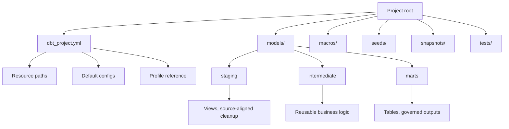

# Project Anatomy and dbt_project.yml

> A dbt project is a structured codebase for transformations; `dbt_project.yml` is the required root configuration file that tells dbt how to operate that codebase.

## Executive Summary

- **What it is:** Project anatomy is the folder and file structure of a dbt project. `dbt_project.yml` is the required project-level configuration file at the root of that structure.
- **Why it matters:** A clean project structure makes transformation logic easier to understand, test, document, review, govern, and operate across teams.
- **Mental model:** **`dbt_project.yml` is the project constitution.** It defines broad defaults and paths; SQL files hold transformation logic; YAML property files describe and test resources; profiles or platform settings handle connections.
- **Best used when:** A team needs a maintainable dbt codebase with clear folders, naming rules, default materializations, source/model organization, and environment-aware behavior.
- **Avoid or reconsider when:** Teams try to put credentials, every test, every column description, or all business logic into `dbt_project.yml`. That file should coordinate the project, not become a dumping ground.

## What It Can Do

- Mark a directory as a dbt project.
- Define the project name, version, config version, and profile reference.
- Tell dbt where to find models, tests, macros, seeds, snapshots, analyses, docs, and other resources.
- Set default configurations for folders or resource groups, such as materialization, schema, tags, grants, or enabled status.
- Apply broad conventions so individual model files do not repeat the same boilerplate.
- Support environment-aware behavior through variables, target-aware Jinja, and platform-specific settings.
- Make the structure of a transformation codebase understandable for developers, reviewers, auditors, and platform teams.

## What It Cannot Do

- Store production credentials safely. Credentials belong in `profiles.yml`, environment variables, dbt platform credentials, Snowflake-native execution context, or a secrets manager.
- Replace model SQL files. Transformation logic should live in models, macros, or other appropriate resources.
- Replace model property YAML files. Descriptions, tests, sources, exposures, contracts, and column-level metadata usually belong near the resource they describe.
- Force good architecture by itself. A project can have a valid `dbt_project.yml` and still have unclear naming, poor layering, or unowned models.
- Solve package governance, CI/CD, orchestration, RBAC, or cost management alone.
- Make folder names meaningful unless the team agrees on conventions and follows them.

## Core Concepts

| Concept | Meaning | Why it matters |
|---|---|---|
| Project root | The folder containing `dbt_project.yml` | dbt uses this file to recognize and operate the project |
| `dbt_project.yml` | Required project-level configuration file | Defines paths, defaults, project identity, and resource-level config hierarchy |
| Project name | The `name:` value in `dbt_project.yml` | Used as the namespace under resource config blocks such as `models:` |
| Profile | The `profile:` value pointing to connection settings | Separates project code from warehouse connection details |
| Resource paths | Settings such as `model-paths`, `seed-paths`, `snapshot-paths`, `test-paths`, and `macro-paths` | Tell dbt where to find project resources |
| Model folder | Usually `models/` | Contains SQL/Python models and nearby YAML property files |
| Property YAML | Files such as `sources.yml`, `schema.yml`, or `marts.yml` | Defines sources, descriptions, tests, contracts, exposures, and other metadata |
| Config inheritance | Broad configs can apply to folders, with more specific configs overriding them | Keeps defaults centralized while allowing exceptions |
| `+` config prefix | Prefix used in `dbt_project.yml` to distinguish configs from folder names | Prevents dbt from confusing a config key with a project subdirectory |
| Layering convention | Common folders such as `staging`, `intermediate`, and `marts` | Makes project intent visible and supports team governance |

## How It Works (Simple Flow)

1. A dbt project starts with a root folder that contains `dbt_project.yml`.
2. `dbt_project.yml` declares the project name, config version, profile, and resource paths.
3. dbt scans the configured folders to find models, macros, seeds, snapshots, tests, sources, and property YAML files.
4. Project-level configs apply broad defaults, such as staging models as views and mart models as tables.
5. More specific configs in subfolders, property YAML files, or model-level `config()` blocks can override broad defaults.
6. dbt parses the project, builds the DAG, compiles SQL/Jinja, and applies the selected materializations.
7. The data platform, such as Snowflake, executes the compiled SQL and creates or updates the target objects.
8. A clean project structure helps humans understand ownership, maturity, dependencies, and operational intent.

## Visuals



## Readable Snippets

A typical project structure:

```text
investment_dbt/
  dbt_project.yml
  packages.yml
  models/
    staging/
      stg_trades.sql
      stg_instruments.sql
      sources.yml
    intermediate/
      int_trade_enriched.sql
    marts/
      fct_trades.sql
      dim_instruments.sql
      marts.yml
  macros/
  seeds/
  snapshots/
  tests/
  analyses/
```

A practical `dbt_project.yml` skeleton:

```yaml
name: investment_dbt
version: "1.0.0"
config-version: 2

profile: investment_dbt

model-paths: ["models"]
seed-paths: ["seeds"]
snapshot-paths: ["snapshots"]
test-paths: ["tests"]
macro-paths: ["macros"]
analysis-paths: ["analyses"]

models:
  investment_dbt:
    staging:
      +materialized: view
      +schema: staging

    intermediate:
      +materialized: view
      +schema: intermediate

    marts:
      +materialized: table
      +schema: marts
```

The `+` prefix marks config keys inside `dbt_project.yml`:

```yaml
models:
  investment_dbt:
    marts:
      +materialized: table
      +tags: ["published", "finance"]
```

Model descriptions and tests usually belong in property YAML near the models:

```yaml
models:
  - name: fct_trades
    description: "One row per booked trade."
    columns:
      - name: trade_id
        data_tests:
          - unique
          - not_null
```

## Consultant Talking Points

- **Client question this answers:** "How should we structure a dbt project so it stays maintainable as more teams and models are added?"
- **Trade-offs to mention:** Broad defaults reduce repetition, but too much hidden configuration can make behavior surprising. Folder structure should reveal ownership and maturity, not just technical convenience.
- **Risk or governance angle:** In a bank, project anatomy supports review, auditability, onboarding, separation of raw/staging/marts, ownership boundaries, and controlled publication of governed outputs.
- **Cost/performance angle:** Defaults such as `+materialized: table` or broad full-refresh patterns can create unnecessary Snowflake cost if applied too widely.

## Common Pitfalls

- Putting credentials or secrets in `dbt_project.yml` instead of using profiles, platform credentials, environment variables, or approved secret management.
- Treating `dbt_project.yml` as the place for every description, test, and business rule.
- Creating vague folders such as `new_models`, `final`, `temp`, or `misc` that hide model purpose.
- Applying broad table materialization defaults that make cheap staging views become expensive persisted objects.
- Overusing folder-level configs so developers cannot easily tell why a model behaves the way it does.
- Forgetting that `+schema` and naming conventions affect where Snowflake objects are created.
- Mixing source-aligned cleanup, business logic, and published marts in the same folder.
- Letting project structure grow organically without periodic review as more domains and teams contribute.

## When to Recommend What (Decision Table)

| Situation | Recommend | Why | Watch-outs |
|---|---|---|---|
| New dbt project for an analytics team | Start with `staging`, `intermediate`, and `marts` folders | Simple structure teaches the main modeling layers early | Avoid too many folders before the project has real complexity |
| Regulated bank project with several domains | Use domain-aware marts plus clear ownership metadata | Makes review, support, and governance easier | Do not create domain silos that duplicate shared dimensions |
| Many models repeat the same config | Put broad defaults in `dbt_project.yml` | Reduces boilerplate and enforces conventions | Keep exceptions visible and documented |
| One model needs unusual behavior | Use model-level or property-level config | Keeps the exception close to the model | Too many exceptions weaken the project convention |
| Source tables need tests, freshness, and descriptions | Put source definitions in property YAML near staging models | Keeps upstream metadata close to where raw data is first used | Source ownership and ingestion ownership must still be clear |
| Team is unsure where credentials belong | Keep credentials out of project code | Reduces secret leakage and environment confusion | Coordinate with dbt platform, CI, Snowflake, or secret-management pattern |

## Related Topics

- [[02 dbt/01 Core Concepts and Project Structure/Core Concepts and Project Structure Overview|Core Concepts and Project Structure Overview]]
- [[02 dbt/01 Core Concepts and Project Structure/01 What dbt Is and Is Not|What dbt Is and Is Not]]
- [[02 dbt/01 Core Concepts and Project Structure/04 Environments Profiles Targets and Credentials|Environments, Profiles, Targets, and Credentials]]
- [[02 dbt/01 Core Concepts and Project Structure/05 Models ref source and the DAG|Models, ref(), source(), and the DAG]]
- [[02 dbt/01 Core Concepts and Project Structure/06 Commands and Artifacts|Commands and Artifacts]]
- [[02 dbt/02 Modeling Patterns and Layering/11 Staging Models|Staging Models]]
- [[02 dbt/02 Modeling Patterns and Layering/16 Naming Conventions and Folder Design|Naming Conventions and Folder Design]]
- [[02 dbt/05 Deployment CI CD and Operations/46 Package Management and Dependency Governance|Package Management and Dependency Governance]]

## Related Decision Notes

- No related decision note yet.

## Questions

- Which folders represent source-aligned cleanup, reusable business logic, and published data products?
- Which configs should be project-level defaults, and which should stay close to individual models?
- Where should tests, descriptions, sources, exposures, and contracts live?
- Which teams or domains own each part of the project?
- What naming and folder conventions would make the project understandable to a new consultant in one hour?
- How should project structure map to Snowflake databases, schemas, roles, and warehouses?

## Sources To Revisit

- [dbt Docs: `dbt_project.yml`](https://docs.getdbt.com/reference/dbt_project.yml)
- [dbt Docs: About dbt projects](https://docs.getdbt.com/docs/build/projects)
- [dbt Docs: Model configurations](https://docs.getdbt.com/reference/model-configs)
- [dbt Docs: Define configs](https://docs.getdbt.com/reference/define-configs)
- [dbt Docs: SQL models](https://docs.getdbt.com/docs/build/sql-models)
