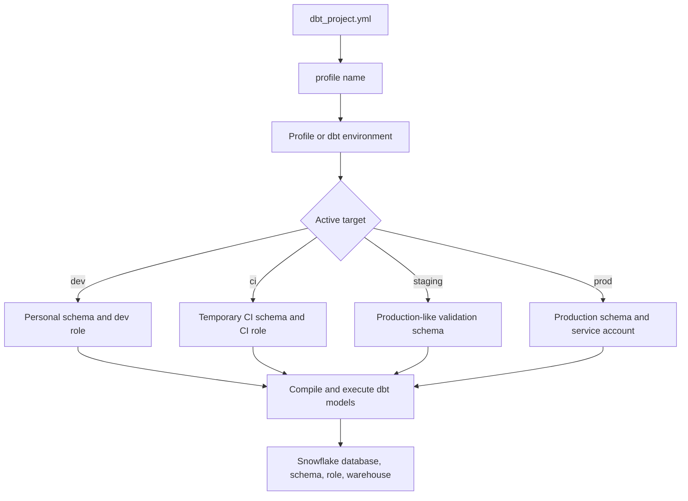

# Environments, Profiles, Targets, and Credentials

> Runtime context for dbt: where dbt connects, what it builds into, which warehouse resources it uses, and whose permissions it acts with.

## Executive Summary

- **What it is:** The dbt connection and runtime layer that separates project code from environment-specific settings such as database, schema, warehouse, role, user, threads, and credentials.
- **Why it matters:** It prevents local development, CI, staging, and production runs from stepping on each other or using the wrong identity.
- **Mental model:** **The project says what to build; the active target says where and how to build it.** Credentials decide who dbt is acting as.
- **Best used when:** A team needs safe dev/prod separation, personal developer schemas, CI validation, production service accounts, controlled Snowflake warehouses, and secret management.
- **Avoid or reconsider when:** Environment settings are being used to change core business logic instead of only changing runtime context, resource routing, or safe development limits.

## What It Can Do

- Point a dbt project to the correct connection profile.
- Define multiple targets such as `dev`, `ci`, `staging`, and `prod`.
- Keep database, schema, role, warehouse, user, thread count, and authentication details outside model SQL.
- Let local development use personal schemas while production jobs use controlled production schemas.
- Support separate credentials for developers, CI jobs, scheduled jobs, and production deployment users.
- Use environment variables so secrets do not need to be stored directly in project files.
- Expose the active runtime context through the `target` Jinja variable.
- Help control Snowflake cost by routing different workloads to different warehouses.

## What It Cannot Do

- Make insecure credentials safe if they are committed to Git or shared casually.
- Replace Snowflake RBAC, network policy, SSO, key rotation, or secret-management controls.
- Guarantee dev/prod isolation if all targets use the same role, database, schema, or warehouse.
- Prevent accidental production runs by itself; teams still need process, permissions, and CI/CD guardrails.
- Make environment-specific business logic safe. If dev and prod calculate different definitions, tests may no longer prove production behavior.
- Solve model design, materialization strategy, or warehouse tuning by itself.

## Core Concepts

| Concept | Meaning | Why it matters |
|---|---|---|
| Environment | A runtime context such as development, CI, staging, or production | Frames where dbt is being executed in the delivery lifecycle |
| Profile | A named connection configuration used by a dbt project | Separates project code from connection details |
| `profiles.yml` | Local CLI/Fusion connection file, often stored in `~/.dbt/` | Defines outputs, targets, credentials, schemas, warehouses, and thread settings for local/self-managed use |
| Target | A named output inside a profile, such as `dev` or `prod` | Decides which connection settings are active for a run |
| Credentials | Authentication and identity details such as user, password, private key, token, role, and account | Determines who dbt acts as and what dbt can access |
| `target` Jinja variable | Runtime object containing active target details such as `target.name`, `target.schema`, `target.database`, and Snowflake-specific values | Lets project code inspect the current runtime context |
| `env_var()` | Jinja function for reading environment variables | Keeps secrets and environment-specific values out of committed code |
| Personal dev schema | A developer-specific schema such as `dbt_alice` or `dbt_shonn` | Prevents developers from overwriting each other's work |
| CI | Continuous Integration: automated validation before merge | Catches broken references, failing tests, and unsafe changes before production |
| Service account | Non-human execution identity for jobs | Makes production execution controlled, auditable, and independent of personal users |
| Warehouse routing | Choosing Snowflake warehouses per target or workload | Controls cost, isolation, concurrency, and performance characteristics |

## How It Works (Simple Flow)

1. dbt starts in a project folder and reads `dbt_project.yml`.
2. `dbt_project.yml` references a profile name using the `profile:` field.
3. dbt resolves that profile through local `profiles.yml`, dbt platform environment settings, or the configured execution context.
4. The profile or environment defines one or more targets, such as `dev`, `ci`, `staging`, and `prod`.
5. dbt chooses the default target unless the run overrides it, for example with `dbt build --target prod`.
6. dbt resolves credentials and environment variables for the active target.
7. dbt compiles the project and exposes active runtime details through `target`.
8. The data platform executes the compiled SQL using the selected database, schema, warehouse, role, and user.

## Visuals



## Readable Snippets

`dbt_project.yml` points the project to a profile name:

```yaml
name: investment_dbt
version: "1.0.0"
config-version: 2

profile: investment_dbt
```

A local Snowflake-oriented profile with separate dev and prod targets:

```yaml
# ~/.dbt/profiles.yml
investment_dbt:
  target: dev
  outputs:
    dev:
      type: snowflake
      account: "{{ env_var('DBT_SNOWFLAKE_ACCOUNT') }}"
      user: "{{ env_var('DBT_DEV_USER') }}"
      password: "{{ env_var('DBT_DEV_PASSWORD') }}"
      role: TRANSFORM_DEV
      warehouse: WH_DBT_DEV_XS
      database: ANALYTICS_DEV
      schema: dbt_shonn
      threads: 4

    prod:
      type: snowflake
      account: "{{ env_var('DBT_SNOWFLAKE_ACCOUNT') }}"
      user: "{{ env_var('DBT_PROD_USER') }}"
      password: "{{ env_var('DBT_PROD_PASSWORD') }}"
      role: TRANSFORM_PROD
      warehouse: WH_DBT_PROD
      database: ANALYTICS_PROD
      schema: marts
      threads: 8
```

Run with the default target:

```bash
dbt build
```

Override the target explicitly:

```bash
dbt build --target prod
```

Use `target` carefully for runtime-aware behavior:

```sql
-- Acceptable for limiting local development cost.
select *
from {{ source('core_banking', 'transactions') }}


limit 1000

```

Avoid making business definitions different by target:

```sql
-- Risky: dev and prod no longer test the same business logic.
select *
from {{ ref('int_trades') }}
where is_regulated_trade = {{ "true" if target.name == "prod" else "false" }}
```

## Consultant Talking Points

- **Client question this answers:** "How do we make sure developers, CI, staging, and production dbt runs do not overwrite each other or use the wrong Snowflake privileges?"
- **Trade-offs to mention:** More environments and roles improve safety, but add setup and operational overhead. Too few environments are simple early on but become risky once multiple people, jobs, or regulated outputs are involved.
- **Risk or governance angle:** In banking, production execution should usually use controlled service accounts and least-privilege roles, while developers use personal credentials and isolated schemas.
- **Cost/performance angle:** Development and CI can usually use smaller warehouses and fewer threads; production may need dedicated warehouses, query tagging, monitoring, and stricter scheduling.

## Common Pitfalls

- Committing real passwords, private keys, or tokens in `profiles.yml`, `.env`, logs, screenshots, or documentation.
- Letting multiple developers build into the same schema, causing confusing overwrites and false test results.
- Giving developer or CI credentials permission to write to production schemas.
- Using one warehouse for local development, CI, scheduled production jobs, and BI, causing cost attribution and concurrency problems.
- Running production from a laptop with a personal user instead of a controlled deployment identity.
- Making model logic change materially by `target.name`, so dev validation no longer proves production behavior.
- Forgetting that `threads` and warehouse size interact; high thread counts on a shared or small warehouse can create cost and queueing surprises.
- Treating dbt environment setup as only a dbt concern instead of coordinating it with Snowflake RBAC, schemas, warehouses, and audit requirements.

## When to Recommend What (Decision Table)

| Situation | Recommend | Why | Watch-outs |
|---|---|---|---|
| One analyst learning dbt locally | Single `dev` target with personal schema | Keeps setup simple and prevents writes to shared outputs | Do not normalize this as the production pattern |
| Several developers on one project | Personal dev schemas and personal credentials | Avoids overwrites and improves auditability | Schema naming needs a convention and cleanup process |
| Pull request validation | CI target with temporary or PR-specific schema | Tests changes before merge without polluting shared schemas | CI role should not have production write access |
| Production scheduled jobs | Prod target or dbt platform production environment with service account | Stable, auditable, controlled execution | Service account needs least privilege and credential rotation |
| Regulated finance environment | Separate dev, CI, staging, and prod roles/schemas, with reviewed promotion | Reduces blast radius and supports audit evidence | More overhead; requires ownership and clear deployment process |
| Expensive local or CI runs | Smaller warehouses, lower threads, sample limits only in dev | Controls exploratory cost | Avoid hiding performance problems that only appear at full scale |
| dbt Platform project | Use platform environments and connection profiles | Centralizes runtime settings, jobs, credentials, and code version behavior | Understand how platform environments map to Core-style targets |
| Self-managed dbt Core/Fusion | Use `profiles.yml`, `env_var()`, CI secrets, and `--target` | Portable and Git-friendly when configured carefully | Keep secrets out of the repo and logs |

## Related Topics

- [[02 dbt/01 Core Concepts and Project Structure/Core Concepts and Project Structure Overview|Core Concepts and Project Structure Overview]]
- [[02 dbt/01 Core Concepts and Project Structure/03 Project Anatomy and dbt_project.yml|Project Anatomy and dbt_project.yml]]
- [[02 dbt/01 Core Concepts and Project Structure/05 Models ref source and the DAG|Models, ref(), source(), and the DAG]]
- [[02 dbt/05 Deployment CI CD and Operations/41 Dev CI Staging and Prod Environments|Dev, CI, Staging, and Prod Environments]]
- [[02 dbt/05 Deployment CI CD and Operations/42 CI Jobs and Slim CI|CI Jobs and Slim CI]]
- [[02 dbt/05 Deployment CI CD and Operations/47 Secrets Service Accounts and RBAC|Secrets, Service Accounts, and RBAC]]
- [[02 dbt/08 dbt on Snowflake and Finance Patterns/75 Snowflake RBAC for dbt|Snowflake RBAC for dbt]]
- [[02 dbt/08 dbt on Snowflake and Finance Patterns/76 Database Schema and Warehouse Strategy|Database, Schema, and Warehouse Strategy]]

## Related Decision Notes

- [[80 Comparisons and Decision Notes/Decision Notes/Decisions - Choosing a dbt Environment and Credential Strategy|Decisions - Choosing a dbt Environment and Credential Strategy]]
- [[80 Comparisons and Decision Notes/Decision Notes/Decisions - Choosing a Snowflake DevOps and Deployment Pattern|Decisions - Choosing a Snowflake DevOps and Deployment Pattern]]

## Questions

- Which environments does the team actually need today: dev, CI, staging, production, or all four?
- Should development isolation happen through personal schemas, separate databases, separate accounts, or a mix?
- Which identity runs production dbt jobs, and who owns its credential rotation?
- Which Snowflake role, warehouse, database, and schema should each target use?
- How are secrets provided locally, in CI, and in dbt platform jobs?
- What prevents a developer or CI job from writing into production?
- Are target-aware branches limited to runtime safety, or are they changing business logic?

## Sources To Revisit

- [dbt Docs: About profiles.yml](https://docs.getdbt.com/docs/local/profiles.yml)
- [dbt Docs: dbt Core environments](https://docs.getdbt.com/docs/local/dbt-core-environments)
- [dbt Docs: dbt environments](https://docs.getdbt.com/docs/dbt-platform-environments)
- [dbt Docs: Deployment environments](https://docs.getdbt.com/docs/deploy/deploy-environments)
- [dbt Docs: About target variables](https://docs.getdbt.com/reference/dbt-jinja-functions/target)
- [dbt Docs: About env_var function](https://docs.getdbt.com/reference/dbt-jinja-functions/env_var)
- [dbt Docs: Snowflake configurations](https://docs.getdbt.com/reference/resource-configs/snowflake-configs)
