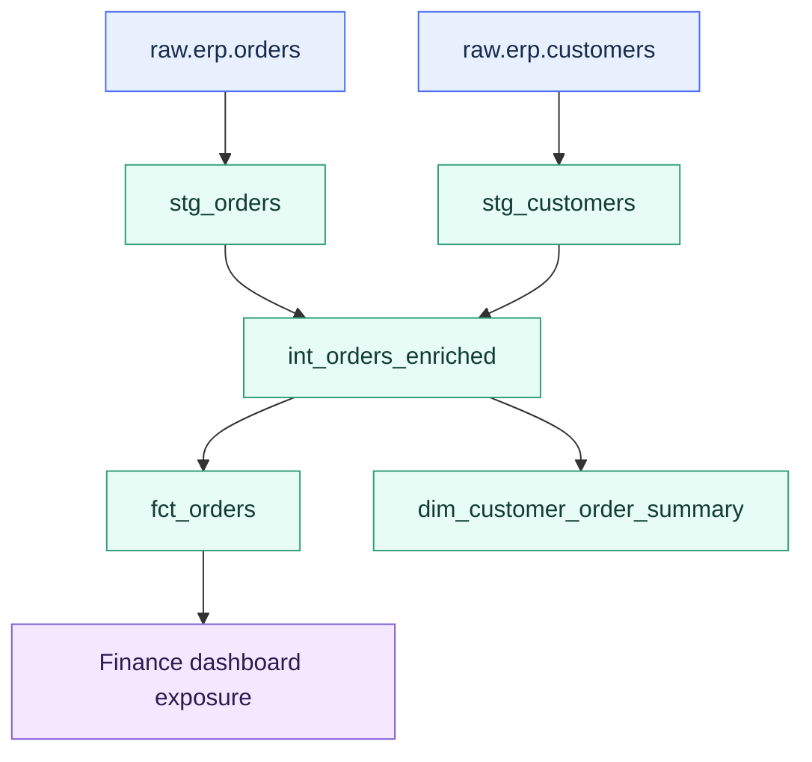

# Models, ref(), source(), and the DAG

> [!abstract] Mental model
> **`source()` is the door into dbt; `ref()` is the wiring inside dbt.** The DAG is the map created by those connections.

## Executive Summary

- **What it is:** The core dependency system in dbt: models contain transformation SQL, `source()` references upstream data that dbt does not create, `ref()` references dbt-managed resources, and the DAG records how everything depends on everything else.
- **Why it matters:** The DAG lets dbt build models in the right order, show lineage, support documentation, run targeted commands, power CI selection, and make impact analysis practical.
- **Mental model:** External inputs enter through `source()`; dbt-managed resources connect through `ref()`.
- **Best used when:** A team wants transformation logic to be modular, testable, documented, environment-aware, and easy to reason about across staging, intermediate, and mart layers.
- **Avoid or reconsider when:** SQL is hard-coded to physical database objects, dependencies are hidden in dynamic SQL, or the team expects the DAG itself to reduce compute without materialization and filtering decisions.

## What It Can Do

- Turn individual SQL model files into a connected transformation graph.
- Use `source()` to declare and reference upstream raw or externally managed tables.
- Use `ref()` to reference dbt models, seeds, and snapshots without hard-coding database and schema names.
- Tell dbt which models must run before other models.
- Resolve references to the correct physical relation for the active target.
- Power lineage views, documentation, impact analysis, and node selection commands.
- Let commands select upstream or downstream resources, such as `+fct_orders` or `stg_orders+`.
- Make code review easier by showing whether a change affects only one model or a wider downstream chain.

## What It Cannot Do

- Automatically reduce compute. `ref()` and `source()` define dependencies; materializations, filters, incremental logic, and query design affect compute.
- Replace good modeling structure. A technically valid DAG can still be confusing, overly tangled, or poorly layered.
- Know about dependencies that are hidden from dbt parsing, such as dynamic SQL that references tables without `ref()` or `source()`.
- Create raw/source tables. Sources describe external data; ingestion tools or warehouse processes still load that data.
- Make circular logic executable; dbt rejects a dependency loop because no valid build order exists.
- Guarantee business correctness. The DAG shows dependencies, not whether the logic is right.

## Core Concepts

| Concept | Meaning | Why it matters |
|---|---|---|
| Model | Usually a `.sql` file containing a `select` statement | The basic unit of transformation logic in dbt |
| Materialization | How dbt turns model SQL into a warehouse object, such as a view, table, incremental table, or ephemeral CTE | Separates logical model code from physical persistence strategy |
| Source | A named upstream table or view loaded outside dbt | Marks the boundary where dbt starts depending on external data |
| `source()` | Jinja function used to reference declared source tables | Adds source lineage and compiles to the correct full source relation |
| `ref()` | Jinja function used to reference dbt-managed models, seeds, or snapshots | Creates model dependencies, compiles to the correct relation, and avoids hard-coded object names |
| DAG | Directed Acyclic Graph: the ordered dependency map dbt builds from references | Lets dbt understand build order, lineage, upstream/downstream impact, and parallelization |
| Node | A resource in the graph, such as a model, source, seed, snapshot, or test | Gives dbt a unit to build, test, document, or select |
| Edge | A dependency from one node to another | Shows that one resource must exist or be evaluated before another |
| Ancestor | An upstream dependency of a selected node | Useful when building everything needed by a final model |
| Descendant | A downstream resource depending on a selected node | Useful for impact analysis and targeted rebuilds |
| Cycle | A dependency loop | Invalid because dbt cannot determine a build order |
| Relation | dbt's representation of a database object name | Allows `ref()` and `source()` to compile differently by environment |

## How It Works (Simple Flow)

1. Raw or externally managed tables are declared as dbt sources in YAML.
2. Staging models usually use `source()` to select from those raw inputs and create clean source-aligned building blocks.
3. Intermediate and mart models use `ref()` to select from other dbt models rather than hard-coded physical table names.
4. During parsing, dbt reads the project and records every visible `source()` and `ref()` dependency.
5. dbt builds a DAG showing the direction of data flow and the required execution order.
6. During compilation, dbt resolves each `source()` and `ref()` into a concrete database object for the active target and environment.
7. During execution, dbt builds or tests selected nodes in dependency order and can run independent branches in parallel.
8. Documentation, lineage, CI selection, and impact analysis reuse the same graph metadata.

## Visuals



## Readable Snippets

Declare raw inputs as sources:

```yaml
# models/staging/erp/sources.yml
sources:
  - name: erp
    database: raw
    schema: erp
    tables:
      - name: orders
      - name: customers
```

Use `source()` at the raw boundary:

```sql
-- models/staging/erp/stg_orders.sql
select
    order_id,
    customer_id,
    cast(order_date as date) as order_date,
    lower(status) as status
from {{ source('erp', 'orders') }}
```

Use `ref()` inside the dbt graph:

```sql
-- models/intermediate/int_orders_enriched.sql
select
    o.order_id,
    o.order_date,
    c.customer_name
from {{ ref('stg_orders') }} as o
left join {{ ref('stg_customers') }} as c
    on o.customer_id = c.customer_id
```

Build a mart from an upstream dbt model:

```sql
-- models/marts/fct_order_daily.sql
select
    order_date,
    count(*) as order_count
from {{ ref('int_orders_enriched') }}
group by 1
```

Avoid hard-coded environment-specific object names:

```sql
-- Avoid this in dbt model code.
select *
from analytics_prod.marts.stg_orders
```

Select by graph relationships:

```bash
dbt build --select stg_orders+
dbt build --select +fct_order_daily
```

## Consultant Talking Points

- **Client question this answers:** "How does dbt know what to build first, what depends on what, and what will break if we change this model?"
- **Trade-offs to mention:** Smaller models make lineage and review easier. Too many tiny models can create a noisy DAG and unnecessary warehouse objects if materialized poorly.
- **Risk or governance angle:** Explicit lineage shows where regulated data came from, which outputs depend on it, and what needs review after an upstream change.
- **Cost/performance angle:** The DAG supports targeted builds and parallel execution, but compute savings come from selection, materializations, incremental filters, and warehouse tuning, not from `ref()` alone.

## Common Pitfalls

- Hard-coding physical relation names instead of using `source()` and `ref()`, which breaks environment separation and hides lineage.
- Using `source()` for dbt-created staging or intermediate models instead of `ref()`.
- Using `ref()` to point at raw tables that are not dbt-managed resources.
- Expecting a staging view referenced by `ref()` to be cached automatically; views can still push work to the underlying raw table.
- Creating circular dependencies where two models wait on each other.
- Hiding references inside dynamic SQL or parse-time branches so dbt cannot reliably detect dependencies.
- Building very wide fan-out from one unstable staging model without understanding downstream blast radius.
- Letting the DAG become a pile of technical dependencies without clear staging, intermediate, and mart boundaries.
- Treating lineage as governance proof by itself; tests, ownership, freshness, and documentation still matter.

## When to Recommend What (Decision Table)

| Situation | Recommend | Why | Watch-outs |
|---|---|---|---|
| Model reads from raw or externally loaded data | Use `source()` | Marks the boundary into dbt and enables source lineage, testing, and freshness | Source definitions must match real warehouse objects |
| Model reads from another dbt model | Use `ref()` | Creates dependency order and compiles to the correct environment-specific relation | Avoid hard-coded database and schema names |
| Staging layer reads raw ERP tables | `source()` in staging models | Keeps raw-to-clean mapping explicit | Do not hide heavy business logic in staging |
| Intermediate or mart layer reads staging | `ref()` | Keeps the internal dbt graph connected | Materialization still determines persistence and compute behavior |
| Need to rebuild everything downstream of a changed model | Use graph selection such as `model_name+` | Uses the DAG for impact-aware builds | Downstream selection can be broad in a highly connected project |
| Need to build a final model and all prerequisites | Use graph selection such as `+model_name` | Ensures upstream dependencies are included | May rebuild more than intended if upstream graph is messy |
| Need source freshness or source-level tests | Declare a source and add source metadata | Connects raw availability to downstream reliability | Freshness is not a replacement for transformation tests |
| Need to reduce repeated compute | Change materialization or incremental filtering, not just `ref()` | The graph defines dependencies; persistence strategy reduces repeated work | Full-refreshes and unfiltered joins can still scan large inputs |

## Related Topics

- [[02 dbt/01 Core Concepts and Project Structure/Core Concepts and Project Structure Overview|Core Concepts and Project Structure Overview]]
- [[02 dbt/01 Core Concepts and Project Structure/03 Project Anatomy and dbt_project.yml|Project Anatomy and dbt_project.yml]]
- [[02 dbt/01 Core Concepts and Project Structure/04 Environments Profiles Targets and Credentials|Environments, Profiles, Targets, and Credentials]]
- [[02 dbt/01 Core Concepts and Project Structure/06 Commands and Artifacts|Commands and Artifacts]]
- [[02 dbt/01 Core Concepts and Project Structure/07 Sources and Source Freshness|Sources and Source Freshness]]
- [[02 dbt/02 Modeling Patterns and Layering/11 Staging Models|Staging Models]]
- [[02 dbt/02 Modeling Patterns and Layering/12 Intermediate Models|Intermediate Models]]
- [[02 dbt/02 Modeling Patterns and Layering/13 Marts and Data Products|Marts and Data Products]]
- [[02 dbt/04 Incremental Processing and Performance/30 Materializations|Materializations]]
- [[02 dbt/04 Incremental Processing and Performance/31 Incremental Models and Unique Keys|Incremental Models and Unique Keys]]

## Related Decision Notes

- No related decision note yet.

## Questions

- Which warehouse objects are true external sources, and which are dbt-managed models?
- Are staging models using `source()` only at the raw boundary?
- Are intermediate and mart models using `ref()` consistently?
- Can a reviewer understand the main flow from source to staging to intermediate to mart?
- Which models have the biggest downstream blast radius?
- Does the DAG reflect business ownership and model maturity, or only technical dependency order?
- Which graph selections should CI and production jobs use?
- Where does compute cost come from: dependency shape, materialization, incremental filtering, or warehouse sizing?

## Sources To Revisit

- [dbt Docs: About ref function](https://docs.getdbt.com/reference/dbt-jinja-functions/ref)
- [dbt Docs: About source function](https://docs.getdbt.com/reference/dbt-jinja-functions/source)
- [dbt Docs: Add sources to your DAG](https://docs.getdbt.com/docs/build/sources)
- [dbt Docs: SQL models](https://docs.getdbt.com/docs/build/sql-models)
- [dbt Docs: About dbt run command](https://docs.getdbt.com/reference/commands/run)
- [dbt Docs: Graph operators](https://docs.getdbt.com/reference/node-selection/graph-operators)
