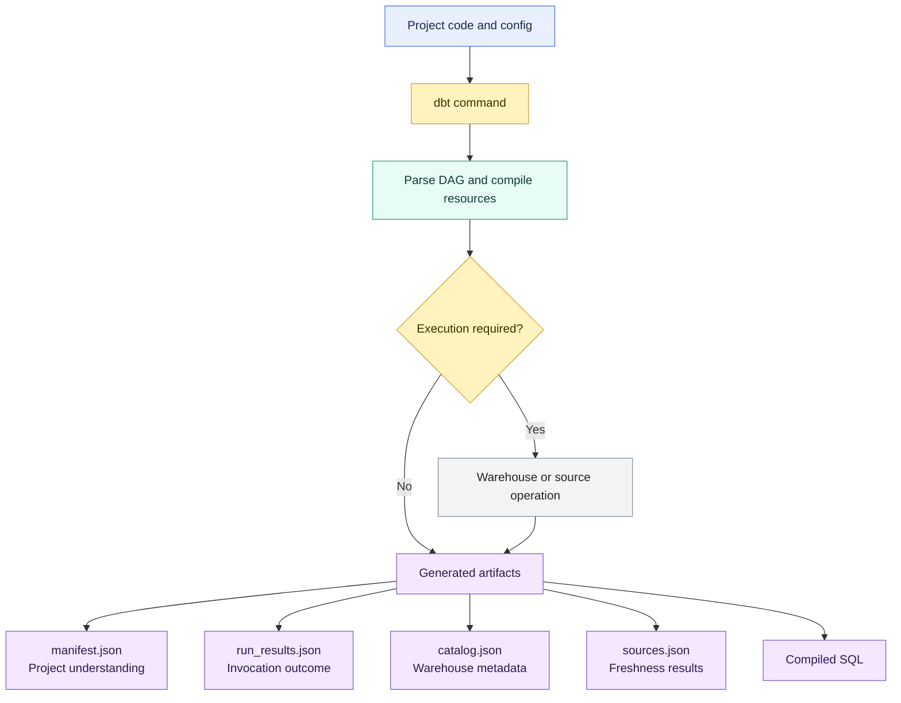

# Commands and Artifacts

> [!abstract] Mental model
> **Commands ask dbt to do work; artifacts show what dbt understood and what happened.**

## Executive Summary

- **What it is:** dbt commands are CLI/platform actions such as `run`, `test`, `build`, `compile`, `deps`, `seed`, `snapshot`, and `source freshness`. Artifacts are generated files such as `manifest.json`, `run_results.json`, `catalog.json`, and `sources.json`.
- **Why it matters:** Commands define the operating workflow, while artifacts make dbt runs inspectable for lineage, debugging, CI, documentation, performance analysis, and audit evidence.
- **Mental model:** The command defines the action; the artifacts preserve machine-readable evidence from it.
- **Best used when:** A team needs repeatable local development, CI checks, production builds, source freshness checks, documentation generation, and reliable troubleshooting evidence.
- **Avoid or reconsider when:** Teams treat dbt as a black-box SQL runner, run production with ad hoc commands, or ignore artifacts that explain failures and runtime behavior.

## What It Can Do

- Build models, run tests, load seeds, take snapshots, check source freshness, and generate documentation metadata.
- Compile Jinja and dbt references into executable warehouse SQL.
- Execute selected parts of the DAG using node selection and graph operators.
- Produce metadata about project structure, lineage, configs, tests, sources, macros, and exposures.
- Record which nodes ran, whether they succeeded or failed, and how long they took.
- Support CI patterns such as building modified models and their dependents.
- Provide inputs for docs sites, observability tools, run history, audit review, and debugging.
- Help isolate whether a problem occurred in parsing, compilation, execution, source freshness, or the warehouse.

## What It Cannot Do

- Make bad model SQL correct; commands operate the project but do not validate business meaning by themselves.
- Replace orchestration, scheduling, alerting, incident management, or warehouse monitoring.
- Guarantee low cost; selection, materialization, incremental logic, test design, and warehouse sizing still matter.
- Preserve artifacts forever unless the platform, CI system, or storage process saves them.
- Capture every operational detail in one file; different artifacts answer different questions.
- Make artifacts safe to share blindly. They can contain model names, relation names, compiled SQL, metadata, timings, and failure details.
- Replace source freshness, tests, documentation, or ownership discipline; artifacts report what dbt saw and did.

## Core Concepts

| Concept | Meaning | Why it matters |
|---|---|---|
| Command | An action invoked through dbt CLI, dbt platform jobs, or programmatic invocation | Defines what dbt should parse, compile, run, test, or generate |
| Invocation | One execution of a dbt command | Produces logs and artifacts for that specific run |
| `dbt run` | Builds SQL/Python models | Useful for transformation-only work, but it does not run tests, seeds, or snapshots |
| `dbt test` | Runs data tests and unit tests | Validates assumptions about models, sources, snapshots, and seeds |
| `dbt build` | Runs models, tests, seeds, snapshots, and supported project resources in DAG order | Often the safer default for CI and production because build and validation are connected |
| `dbt compile` | Parses the project and writes compiled SQL without executing models | Helps inspect what SQL dbt would send to the warehouse |
| `dbt deps` | Installs package dependencies | Makes package-managed macros/models available before parsing/building |
| `dbt seed` | Loads CSV seed files into the warehouse | Useful for small controlled reference data |
| `dbt snapshot` | Captures historical changes from mutable source data | Tracks slowly changing records over time |
| `dbt source freshness` | Checks freshness rules for declared sources | Shows whether upstream data arrived within expected windows |
| `dbt docs generate` | Generates documentation artifacts and catalog metadata | Powers dbt documentation and column/type visibility |
| Artifact | A generated file under `target/` or an equivalent platform artifact store | Provides machine-readable evidence from parsing, compiling, running, or cataloging |
| `manifest.json` | Full project graph and resource metadata | Core artifact for lineage, docs, state comparison, and selection |
| `run_results.json` | Status, timing, and adapter response for executed nodes | Useful for debugging, performance history, and failure analysis |
| `catalog.json` | Warehouse metadata about relations and columns | Enriches documentation with column types and table/view metadata |
| `sources.json` | Source freshness results | Records freshness status for configured sources |
| Compiled SQL | SQL files generated from dbt model SQL and Jinja | Helps debug relation resolution, macros, and warehouse errors |

## How It Works (Simple Flow)

1. A developer, CI job, scheduler, or dbt platform job invokes a dbt command.
2. dbt reads the project, resolves configuration, parses resources, and builds the DAG.
3. Commands such as `compile`, `run`, `build`, `test`, `seed`, `snapshot`, or `source freshness` decide which work to perform.
4. dbt compiles Jinja, `ref()`, and `source()` into concrete SQL for the active target.
5. If the command executes work, the warehouse runs the compiled SQL or dbt performs the relevant test/freshness operation.
6. dbt writes logs and artifacts such as `manifest.json`, `run_results.json`, `catalog.json`, compiled SQL, or `sources.json`.
7. Humans and tools use those artifacts for docs, lineage, CI comparison, debugging, performance analysis, and audit review.

## Visuals



## Readable Snippets

Common local development flow:

```bash
dbt deps
dbt compile --select stg_orders
dbt build --select stg_orders+
```

Inspect what dbt compiled:

```bash
dbt compile --select int_orders_enriched
```

Example model SQL:

```sql
select *
from {{ ref('stg_orders') }}
```

Compiled SQL may resolve to an environment-specific relation:

```sql
select *
from analytics_dev.dbt_shonn.stg_orders
```

Common CI-style command:

```bash
dbt build --select state:modified+
```

Freshness-aware production pattern:

```bash
dbt source freshness
dbt build
dbt docs generate
```

Artifact shorthand:

```text
manifest.json     = what dbt understood about the project
run_results.json  = what happened during this invocation
catalog.json      = what the warehouse says about documented relations
sources.json      = whether configured sources were fresh
```

## Consultant Talking Points

- **Client question this answers:** "What should our dbt jobs actually run, and where do we look when something fails?"
- **Trade-offs to mention:** `dbt run` is narrow and fast for model-only work. `dbt build` is broader and often better for controlled CI or production because it ties building to validation.
- **Risk or governance angle:** Artifacts show what dbt parsed, which nodes ran, what failed, and which lineage existed at run time. They help with audits but should be handled as internal metadata.
- **Cost/performance angle:** Commands can limit scope with selectors, but cost is mainly driven by selected nodes, materializations, incremental filters, test queries, warehouse size, threads, and full-refresh behavior.

## Common Pitfalls

- Using `dbt run` in production and forgetting that tests, seeds, snapshots, and freshness checks are separate unless `dbt build` or explicit commands are used.
- Treating `dbt build` as "always better" without considering test cost, snapshot cost, or the right selectors for CI.
- Not running `dbt deps` before jobs that depend on packages.
- Ignoring `dbt compile` when debugging; many issues are easier to see in compiled SQL than in templated model code.
- Committing `target/` artifacts or compiled files to Git when they are generated outputs.
- Losing artifacts after CI or production runs, making later incident review and performance diagnosis harder.
- Assuming `run_results.json` contains every project node; it only reports executed nodes for that invocation.
- Sharing artifacts externally without reviewing sensitive metadata, model names, relation names, compiled SQL, and failure messages.
- Running broad commands such as `dbt build` or `--full-refresh` without understanding DAG scope and Snowflake cost impact.

## When to Recommend What (Decision Table)

| Situation | Recommend | Why | Watch-outs |
|---|---|---|---|
| Developer wants to check generated SQL | `dbt compile --select <model>` | Shows how Jinja, `ref()`, and `source()` resolve | Does not prove the SQL succeeds in the warehouse |
| Developer changed one model and wants quick validation | `dbt build --select <model>+` | Builds and tests the changed model and downstream impact | Scope can grow if the model has many descendants |
| Need to build models only | `dbt run` | Narrow and direct for model execution | Does not run tests, seeds, snapshots, or freshness checks |
| CI pull request validation | `dbt build --select state:modified+` | Focuses validation on changed resources and dependents | Requires prior artifacts/state comparison setup |
| Production transformation job | `dbt source freshness` plus `dbt build` | Checks upstream availability and then builds/tests project resources | Decide whether stale sources should block, warn, or route alerts |
| Project uses packages | `dbt deps` before parse/build steps | Ensures package dependencies are installed | Pin package versions and review package governance |
| Small controlled lookup CSV changed | `dbt seed --select <seed>` or include in `dbt build` | Loads seed data into the warehouse | Seeds are not a good home for large, sensitive, or frequently changing data |
| Need slowly changing history | `dbt snapshot` or include snapshots in `dbt build` | Captures changes in mutable source records | Snapshot schedule and storage growth need ownership |
| Need docs metadata | `dbt docs generate` | Produces docs/catalog artifacts | Docs are only as good as descriptions, tests, and source metadata |
| Debugging failed run | Inspect logs, compiled SQL, and `run_results.json` | Separates compile errors, SQL errors, failed tests, and runtime issues | Preserve artifacts before CI cleanup deletes them |

## Related Topics

- [[02 dbt/01 Core Concepts and Project Structure/Core Concepts and Project Structure Overview|Core Concepts and Project Structure Overview]]
- [[02 dbt/01 Core Concepts and Project Structure/03 Project Anatomy and dbt_project.yml|Project Anatomy and dbt_project.yml]]
- [[02 dbt/01 Core Concepts and Project Structure/04 Environments Profiles Targets and Credentials|Environments, Profiles, Targets, and Credentials]]
- [[02 dbt/01 Core Concepts and Project Structure/05 Models ref source and the DAG|Models, ref(), source(), and the DAG]]
- [[02 dbt/01 Core Concepts and Project Structure/07 Sources and Source Freshness|Sources and Source Freshness]]
- [[02 dbt/01 Core Concepts and Project Structure/08 Seeds and Static Reference Data|Seeds and Static Reference Data]]
- [[02 dbt/01 Core Concepts and Project Structure/09 Snapshots and Historical Change Tracking|Snapshots and Historical Change Tracking]]
- [[02 dbt/01 Core Concepts and Project Structure/10 Documentation Lineage and Exposures|Documentation, Lineage, and Exposures]]
- [[02 dbt/05 Deployment CI CD and Operations/42 CI Jobs and Slim CI|CI Jobs and Slim CI]]
- [[02 dbt/05 Deployment CI CD and Operations/45 Artifacts Logs and Run Results|Artifacts, Logs, and Run Results]]

## Related Decision Notes

- No related decision note yet.

## Questions

- Which command should developers run locally before opening a pull request?
- Which command should CI run for changed models and their dependents?
- Which production jobs should run source freshness, build, docs generation, or artifact upload?
- Where are artifacts stored after CI and production runs?
- Which artifacts are needed for debugging, audit, docs, observability, and Slim CI?
- Are generated files such as `target/` ignored in Git?
- Which commands could become unexpectedly expensive on Snowflake?
- What should happen when freshness checks or tests fail: warn, fail, skip downstream, or alert?

## Sources To Revisit

- [dbt Docs: dbt Command reference](https://docs.getdbt.com/reference/dbt-commands)
- [dbt Docs: About dbt build command](https://docs.getdbt.com/reference/commands/build)
- [dbt Docs: About dbt run command](https://docs.getdbt.com/reference/commands/run)
- [dbt Docs: List of dbt commands](https://docs.getdbt.com/category/list-of-commands)
- [dbt Docs: About dbt artifacts](https://docs.getdbt.com/reference/artifacts/dbt-artifacts)
- [dbt Docs: Manifest JSON file](https://docs.getdbt.com/reference/artifacts/manifest-json)
- [dbt Docs: Run results JSON file](https://docs.getdbt.com/reference/artifacts/run-results-json)
- [dbt Docs: Catalog JSON file](https://docs.getdbt.com/reference/artifacts/catalog-json)
- [dbt Docs: Sources JSON file](https://docs.getdbt.com/reference/artifacts/sources-json)
