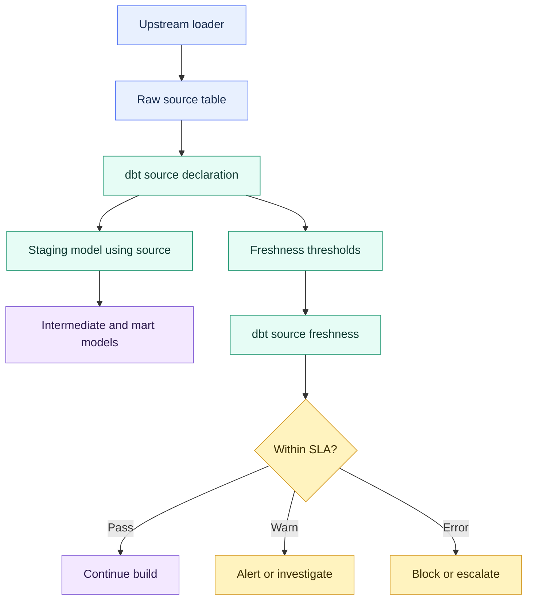

# Sources and Source Freshness

> [!abstract] Mental model
> Sources are the front door into the dbt DAG. Freshness checks whether data arrived on time at that door.

## Executive Summary

- **What it is:** A source is dbt's named reference to externally loaded data, usually a raw table or view. Source freshness checks whether that input is current enough.
- **Why it matters:** A dbt model can succeed while using stale data. Sources and freshness make the raw-data boundary visible, testable, documented, and easier to operate.
- **Mental model:** **Sources are the front door into the dbt DAG; freshness is the arrival-time check at that door.**
- **Best used when:** Raw data arrival affects dashboards, reconciliations, regulatory reporting, daily finance processes, or downstream data products.
- **Avoid or reconsider when:** The table is static, historical-only, or manually updated without a clear SLA. Also reconsider checks that add scan cost without useful operational signal.

## What It Can Do

- Declare raw or externally managed tables as named dbt sources.
- Let models reference upstream data with `source()` instead of hard-coded database and schema names.
- Add source lineage to dbt documentation and the DAG.
- Attach descriptions, tags, metadata, tests, and ownership context to upstream inputs.
- Configure source freshness thresholds with `warn_after` and `error_after`.
- Use a load timestamp, custom freshness query, or supported warehouse metadata to determine recency.
- Write freshness results to `sources.json`.
- Help separate "the dbt model failed" from "the upstream data was late."

## What It Cannot Do

- Load raw data into the warehouse. Ingestion still belongs to Fivetran, Snowpipe, application replication, custom ELT, streaming tools, or other upstream processes.
- Prove data is correct, complete, reconciled, or business-valid.
- Guarantee every expected file, row, or event arrived unless paired with completeness checks.
- Replace data tests, row-count checks, reconciliation models, observability, alerts, or incident response.
- Fix late upstream data; it only detects and reports staleness.
- Define an unclear ingestion SLA. The team still needs agreed arrival times and acceptable delays.
- Avoid all cost risk. Freshness queries over very large sources can be expensive if configured poorly.

## Core Concepts

| Concept | Meaning | Why it matters |
|---|---|---|
| Source | A named upstream data source declared in YAML | Marks external data as an explicit input to the dbt DAG |
| Source table | A table or view inside a source block | Represents a specific raw/upstream relation such as `orders` or `customers` |
| `source()` | Jinja function for referencing a declared source table | Avoids hard-coded object names and creates source lineage |
| Raw layer | Warehouse area where externally loaded data lands | Usually the starting point for staging models |
| Loader | Metadata describing how the source is loaded, such as Fivetran, Snowpipe, or a custom job | Helps humans understand upstream ownership and operational path |
| `identifier` | Optional physical table name when the dbt source name should differ from the warehouse object name | Lets dbt use clean logical names while pointing to messy source-system names |
| Source freshness | dbt check that compares the latest load timestamp to configured thresholds | Shows whether upstream data arrived recently enough |
| `loaded_at_field` | Column used to identify when source data was loaded or synced | Common way to calculate freshness |
| `loaded_at_query` | Custom SQL for determining the latest load timestamp | Useful when freshness needs custom logic or no single column works well |
| `warn_after` | Threshold where dbt reports a freshness warning | Flags lateness without necessarily failing the workflow |
| `error_after` | Threshold where dbt reports a freshness error | Indicates the source is too stale for the configured expectation |
| Freshness filter | Optional condition applied to the freshness query | Can reduce scan cost or focus freshness on relevant records |
| `sources.json` | Artifact written by `dbt source freshness` | Stores source freshness results for later inspection |

## How It Works (Simple Flow)

1. An upstream process loads data into raw tables or views in the warehouse.
2. The dbt project declares those upstream relations as sources in a YAML properties file.
3. Staging models use `source()` to reference those declared source tables.
4. dbt adds the sources to the DAG so lineage shows where dbt-managed transformations begin.
5. Freshness configuration defines the expected arrival window, usually using `loaded_at_field` or `loaded_at_query`.
6. `dbt source freshness` checks the latest load timestamp against `warn_after` and `error_after`.
7. dbt reports pass, warning, or error freshness status and writes results to `sources.json`.
8. Jobs, alerts, and reviewers use the result to publish the data or investigate a delay.

## Visuals



## Readable Snippets

Declare sources:

```yaml
# models/staging/erp/sources.yml
sources:
  - name: erp
    database: raw
    schema: erp
    loader: fivetran
    tables:
      - name: orders
      - name: customers
```

Use the source in a staging model:

```sql
-- models/staging/erp/stg_orders.sql
select
    order_id,
    customer_id,
    cast(order_date as date) as order_date,
    status,
    _fivetran_synced as loaded_at
from {{ source('erp', 'orders') }}
```

Configure freshness for a source:

```yaml
sources:
  - name: erp
    database: raw
    schema: erp
    config:
      loaded_at_field: _fivetran_synced
      freshness:
        warn_after: {count: 1, period: hour}
        error_after: {count: 3, period: hour}
    tables:
      - name: orders
      - name: customers
```

Override freshness for one table:

```yaml
sources:
  - name: erp
    database: raw
    schema: erp
    config:
      loaded_at_field: _fivetran_synced
      freshness:
        warn_after: {count: 12, period: hour}
        error_after: {count: 24, period: hour}
    tables:
      - name: orders
        config:
          freshness:
            warn_after: {count: 1, period: hour}
            error_after: {count: 3, period: hour}
      - name: country_codes
        config:
          freshness: null
```

Run freshness checks:

```bash
dbt source freshness
dbt source freshness --select source:erp.orders
```

Use freshness before a production build:

```bash
dbt source freshness
dbt build
```

Freshness answers this question:

```text
max(loaded_at) is 45 minutes ago -> pass
max(loaded_at) is 2 hours ago    -> warning
max(loaded_at) is 5 hours ago    -> error
```

## Consultant Talking Points

- **Client question this answers:** "Did our upstream data arrive on time, or did dbt successfully build models from stale inputs?"
- **Trade-offs to mention:** Freshness checks are useful for operational sources, but noisy on static, irregular, or poorly timestamped data. Too many checks create alert fatigue.
- **Risk or governance angle:** In finance and banking, source freshness helps separate "the report ran" from "the report used current approved inputs."
- **Cost/performance angle:** Freshness checks usually query `max(loaded_at_field)`. On huge tables, use a suitable load timestamp, partition-friendly field, warehouse metadata where available, custom query, or filter to avoid unnecessary scans.

## Common Pitfalls

- Using a business event timestamp such as `trade_date` or `order_date` when freshness should use an ingestion timestamp such as `_loaded_at`, `_fivetran_synced`, or `batch_loaded_at`.
- Treating freshness as a completeness check. A source can be fresh but missing rows, files, accounts, or late-arriving corrections.
- Applying one freshness threshold to every table in a source system, including static lookup tables and historical archives.
- Forgetting that warning and error thresholds need business meaning, not arbitrary round numbers.
- Running freshness checks over very large tables without a suitable timestamp, metadata strategy, or filter.
- Letting stale-source warnings appear in logs without alerting, ownership, or a response path.
- Assuming source freshness means downstream marts are current; downstream jobs can still fail, skip, or use stale intermediate tables.
- Hard-coding raw table names in staging models, which bypasses source lineage and freshness metadata.
- Not documenting the upstream loader and owner, making incidents harder to route.

## When to Recommend What (Decision Table)

| Situation | Recommend | Why | Watch-outs |
|---|---|---|---|
| Staging model reads externally loaded raw data | Declare a source and use `source()` | Makes the dbt DAG start point explicit | Source definitions must match real database/schema/table names |
| Core daily reporting depends on source arrival | Add freshness with `warn_after` and `error_after` | Detects late upstream data before downstream users rely on it | Agree whether stale sources should warn, fail, or alert |
| Intraday or operational feed | Use stricter freshness thresholds | Timeliness is part of the business value | Avoid alert fatigue if upstream SLA is not actually that strict |
| Static lookup table | Usually skip freshness or set `freshness: null` | Recency is not meaningful for rarely changing data | Consider tests for allowed values or uniqueness instead |
| Source has messy physical table names | Use `identifier` with a cleaner source/table name | Keeps dbt code readable while pointing to the real object | Document the mapping so operators can find the physical table |
| Huge source table | Use reliable load timestamp, `loaded_at_query`, metadata-based freshness, or a filter | Reduces unnecessary freshness scan cost | Confirm the result still represents real source arrival |
| Freshness failure before production build | Investigate upstream ingestion before blaming dbt models | Separates late input from transformation failure | Decide whether to block publication or publish with warning |
| Need full data quality confidence | Pair freshness with tests, reconciliation, row-count checks, and observability | Freshness only checks recency | More checks need ownership and cost awareness |

## Related Topics

- [[02 dbt/01 Core Concepts and Project Structure/Core Concepts and Project Structure Overview|Core Concepts and Project Structure Overview]]
- [[02 dbt/01 Core Concepts and Project Structure/05 Models ref source and the DAG|Models, ref(), source(), and the DAG]]
- [[02 dbt/01 Core Concepts and Project Structure/06 Commands and Artifacts|Commands and Artifacts]]
- [[02 dbt/01 Core Concepts and Project Structure/08 Seeds and Static Reference Data|Seeds and Static Reference Data]]
- [[02 dbt/02 Modeling Patterns and Layering/11 Staging Models|Staging Models]]
- [[02 dbt/03 Testing Documentation and Data Quality/21 Generic Singular and Custom Data Tests|Generic, Singular, and Custom Data Tests]]
- [[02 dbt/03 Testing Documentation and Data Quality/23 Source Freshness and SLA Monitoring|Source Freshness and SLA Monitoring]]
- [[02 dbt/03 Testing Documentation and Data Quality/29 Data Quality Strategy in Regulated Environments|Data Quality Strategy in Regulated Environments]]
- [[02 dbt/05 Deployment CI CD and Operations/45 Artifacts Logs and Run Results|Artifacts, Logs, and Run Results]]

## Related Decision Notes

- No related decision note yet.

## Questions

- Which raw tables are true upstream sources for the dbt project?
- Which sources have real arrival-time expectations from the business?
- Which column or query should represent data arrival time?
- Which freshness failures should warn, fail the job, or trigger an incident?
- Which sources are static or irregular enough that freshness would be misleading?
- Who owns upstream ingestion when freshness fails?
- Should source freshness run before every production build or on a separate monitoring cadence?
- How should source freshness results be preserved and reviewed?

## Sources To Revisit

- [dbt Docs: Add sources to your DAG](https://docs.getdbt.com/docs/build/sources)
- [dbt Docs: Source properties](https://docs.getdbt.com/reference/source-properties)
- [dbt Docs: Source freshness property](https://docs.getdbt.com/reference/resource-properties/freshness)
- [dbt Docs: About source function](https://docs.getdbt.com/reference/dbt-jinja-functions/source)
- [dbt Docs: dbt source command](https://docs.getdbt.com/reference/commands/source)
- [dbt Docs: Sources JSON file](https://docs.getdbt.com/reference/artifacts/sources-json)
