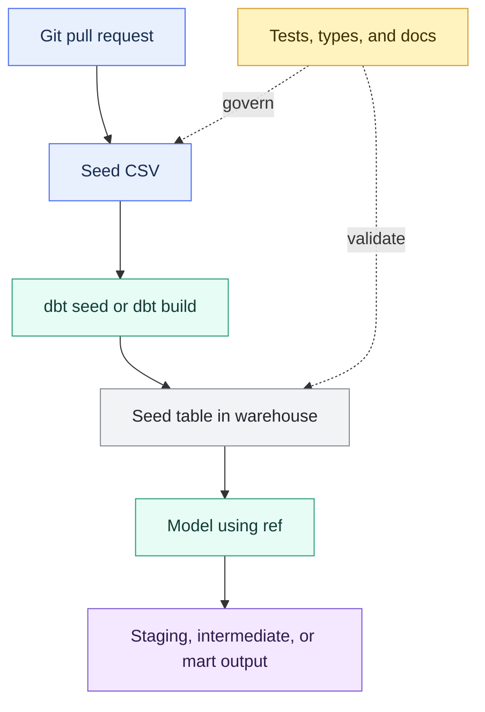

# Seeds and Static Reference Data

> [!abstract] Mental model
> A seed is a small, controlled lookup table in Git—not an ingestion pipeline.

## Executive Summary

- **What it is:** A seed is a CSV file in a dbt project that dbt can load into the warehouse as a table with `dbt seed`, then reference in models with `ref()`.
- **Why it matters:** Seeds keep small reference datasets beside transformation code. This makes them version-controlled, reviewable, reproducible, testable, and reusable across environments.
- **Mental model:** **A seed is a tiny controlled lookup table in Git, not an ingestion pipeline.**
- **Best used when:** The data is small, stable, non-sensitive, and useful as reference logic, such as country codes, static mappings, risk bands, test fixtures, or slow-changing business categories.
- **Avoid or reconsider when:** The data is large, frequently changing, sensitive, owned outside analytics engineering, or needs stronger controls than Git review.

## What It Can Do

- Load CSV files from the dbt project's seed paths into the warehouse as tables.
- Let downstream models reference seed tables using `ref()`.
- Keep small reference mappings under version control.
- Make business mappings visible in pull requests instead of hiding them in long `case` statements.
- Support descriptions, tests, column metadata, tags, and configuration through YAML.
- Provide reproducible lookup data for dev, CI, and production environments.
- Support small test fixtures or controlled example data.
- Help standardize stable labels, categories, region mappings, and code descriptions.

## What It Cannot Do

- Replace source systems, ingestion pipelines, master data management, or data governance tools.
- Handle large or frequently changing datasets well.
- Safely store sensitive customer, account, employee, entitlement, secret, or regulatory override data without strong governance controls.
- Provide row-level operational audit history beyond Git commits and warehouse load artifacts.
- Automatically resolve conflicts when many business users want to edit mappings at the same time.
- Preserve correct data types unless seed configuration is reviewed; type inference can surprise you.
- Replace tests or reconciliation. A seed can still contain wrong mappings.
- Act like a dynamic source table. It changes only when the CSV changes and dbt reloads it.

## Core Concepts

| Concept | Meaning | Why it matters |
|---|---|---|
| Seed | A CSV file in the dbt project that dbt can load as a table | Useful for small static reference data stored with project code |
| Static reference data | Stable lookup or mapping data used by models | Helps avoid hard-coded business mappings in SQL |
| `seed-paths` | Project setting that tells dbt where seed CSV files live | Defaults to `seeds/`, but can be customized |
| `dbt seed` | Command that loads seed CSVs into the warehouse | Creates or updates seed tables so models can use them |
| `ref()` | Jinja function used to reference a loaded seed table | Seeds are dbt-managed resources, so models should use `ref()`, not `source()` |
| Seed table | The warehouse table created from a seed CSV | Lets models join against the reference data |
| Seed properties | YAML metadata for seed descriptions, tests, columns, and configs | Makes seeds documentable and testable |
| `column_types` | Seed config for declaring warehouse column types | Prevents type inference surprises such as leading zeroes becoming numbers |
| `quote_columns` | Seed config that controls quoted column names | Important on Snowflake because quoted identifiers can create case-sensitive behavior |
| `--full-refresh` | Flag that forces a clean seed reload | Useful after structural changes or when seed tables need to be rebuilt |
| Data test | Test applied to a seed, such as uniqueness or accepted values | Helps catch broken mappings before downstream models use them |

## How It Works (Simple Flow)

1. A small CSV file is placed in the dbt project's seed directory, such as `seeds/country_codes.csv`.
2. Optional seed properties and configs define descriptions, tests, column types, quoting, tags, and docs behavior.
3. A developer or job runs `dbt seed`; `dbt build` can also include the selected seed.
4. dbt loads the CSV into the warehouse as a table in the active target schema.
5. Downstream models reference the seed table with `ref('country_codes')`.
6. dbt records the seed as a node in the DAG, so lineage, selection, docs, and tests can include it.
7. When the CSV changes, the change goes through Git review and the seed is reloaded in the relevant environments.

## Visuals



## Readable Snippets

A small seed file:

```csv
country_code,country_name,region
NO,Norway,Europe
SE,Sweden,Europe
DK,Denmark,Europe
US,United States,North America
```

Load all seeds or one seed:

```bash
dbt seed
dbt seed --select country_codes
dbt seed --select country_codes --full-refresh
```

Reference a seed from a model:

```sql
select
    c.customer_id,
    c.country_code,
    cc.country_name,
    cc.region
from {{ ref('stg_customers') }} as c
left join {{ ref('country_codes') }} as cc
    on c.country_code = cc.country_code
```

Replace a hard-coded mapping:

```sql
-- Avoid growing this into a long business mapping.
case
    when product_code in ('A1', 'A2') then 'Retail'
    when product_code in ('B1', 'B2') then 'Corporate'
end as product_family
```

Use a seed instead:

```csv
product_code,product_family
A1,Retail
A2,Retail
B1,Corporate
B2,Corporate
```

Configure seed column types and tests:

```yaml
# seeds/properties.yml
seeds:
  - name: branch_codes
    description: "Small controlled mapping of branch code to branch name."
    config:
      column_types:
        branch_code: varchar
        branch_name: varchar
    columns:
      - name: branch_code
        data_tests:
          - unique
          - not_null
      - name: branch_name
        data_tests:
          - not_null
```

Why `column_types` matters:

```csv
branch_code,branch_name
001,Oslo
002,Bergen
```

## Consultant Talking Points

- **Client question this answers:** "Should this small mapping live in dbt as a seed, in a source table, in SQL logic, or in a governed master-data process?"
- **Trade-offs to mention:** Seeds are simple and reviewable, but they move data ownership into Git. This suits small controlled mappings, not operational, sensitive, or frequently edited data.
- **Risk or governance angle:** In banking, seeds should not become a backdoor for customer data, account lists, regulatory overrides, entitlements, sanctions data, or manually maintained production controls.
- **Cost/performance angle:** Seeds are usually cheap because they are small. Cost risk appears when teams misuse seeds for large data, reload them unnecessarily, or join poorly designed mappings into high-volume transformations.

## Common Pitfalls

- Using seeds for large datasets that should be loaded by an ingestion pipeline.
- Putting sensitive data in CSV files committed to Git.
- Treating seeds as editable business spreadsheets without ownership, review, or approval workflow.
- Letting type inference corrupt codes, such as `001` becoming `1`.
- Using `quote_columns` casually on Snowflake and creating case-sensitive column references that surprise model authors.
- Hiding important business decisions in a seed without descriptions, tests, or approval context.
- Forgetting to run `dbt seed` or include seeds in `dbt build` after changing a CSV.
- Referencing a seed with `source()` instead of `ref()`.
- Allowing a seed mapping to drift from a source system of record or master-data process.
- Using seeds where a data test, macro, or documented model would be clearer.

## When to Recommend What (Decision Table)

| Situation | Recommend | Why | Watch-outs |
|---|---|---|---|
| Small stable lookup such as country codes | Seed | Simple, reviewable, and reproducible | Configure column types for codes |
| Small business mapping owned by analytics engineering | Seed with tests and descriptions | Easier to review than long SQL `case` statements | Confirm business approval path |
| Test fixture or example dataset | Seed | Predictable small input for development or testing | Keep it obviously non-production |
| Frequently changing operational data | Source or ingested table | Operational data should be loaded from its system of record | Needs freshness and data quality checks |
| Large reference dataset | Source table or governed dimension | Better suited to warehouse loading and ownership controls | Avoid bloating Git and slow seed loads |
| Sensitive list such as customer IDs, account IDs, entitlements, sanctions, or employees | Governed source or controlled data-management process | Sensitive data needs stronger access, audit, and update controls | Do not put it in project CSVs by default |
| Mapping changes require formal sign-off | Governed source, workflow, or seed with strict PR controls | Approval evidence matters | Git review may not be enough in regulated settings |
| Simple one-off display label mapping | Seed or small dimension model | Keeps SQL cleaner and mapping visible | If it grows or changes often, promote it out of seeds |
| Codes with leading zeroes or mixed types | Seed with explicit `column_types` | Avoids type inference mistakes | Test key uniqueness and not-null behavior |
| Mapping should vary by environment | Usually avoid seed differences; use clear config or source strategy | Seeds should be reproducible across environments | Environment-specific CSVs can hide behavior differences |

## Related Topics

- [[02 dbt/01 Core Concepts and Project Structure/Core Concepts and Project Structure Overview|Core Concepts and Project Structure Overview]]
- [[02 dbt/01 Core Concepts and Project Structure/05 Models ref source and the DAG|Models, ref(), source(), and the DAG]]
- [[02 dbt/01 Core Concepts and Project Structure/06 Commands and Artifacts|Commands and Artifacts]]
- [[02 dbt/01 Core Concepts and Project Structure/07 Sources and Source Freshness|Sources and Source Freshness]]
- [[02 dbt/02 Modeling Patterns and Layering/11 Staging Models|Staging Models]]
- [[02 dbt/02 Modeling Patterns and Layering/13 Marts and Data Products|Marts and Data Products]]
- [[02 dbt/03 Testing Documentation and Data Quality/21 Generic Singular and Custom Data Tests|Generic, Singular, and Custom Data Tests]]
- [[02 dbt/03 Testing Documentation and Data Quality/29 Data Quality Strategy in Regulated Environments|Data Quality Strategy in Regulated Environments]]
- [[02 dbt/05 Deployment CI CD and Operations/40 Git Workflow and Pull Requests|Git Workflow and Pull Requests]]

## Related Decision Notes

- [[80 Comparisons and Decision Notes/Comparisons/dbt/Comparison - Seeds vs Managed Reference Tables|Comparison - Seeds vs Managed Reference Tables]]

## Questions

- Is the data small, stable, non-sensitive, and genuinely reference-like?
- Who owns the mapping, and who approves changes?
- Should this live in Git, a source system, a governed dimension table, or a master-data process?
- Are seed column types explicitly configured where inference could be risky?
- Which tests should protect the seed from duplicate keys, nulls, or invalid values?
- Should the seed be included in normal `dbt build` jobs?
- Does the seed contain any confidential, regulated, or client-identifying data?
- What happens if a seed change needs rollback?

## Sources To Revisit

- [dbt Docs: Add seeds to your DAG](https://docs.getdbt.com/docs/build/seeds)
- [dbt Docs: About dbt seed command](https://docs.getdbt.com/reference/commands/seed)
- [dbt Docs: Seed configurations](https://docs.getdbt.com/reference/seed-configs)
- [dbt Docs: Seed properties](https://docs.getdbt.com/reference/seed-properties)
- [dbt Docs: column_types](https://docs.getdbt.com/reference/resource-configs/column_types)
- [dbt Docs: quote_columns](https://docs.getdbt.com/reference/resource-configs/quote_columns)
- [dbt Docs: seed-paths](https://docs.getdbt.com/reference/project-configs/seed-paths)
