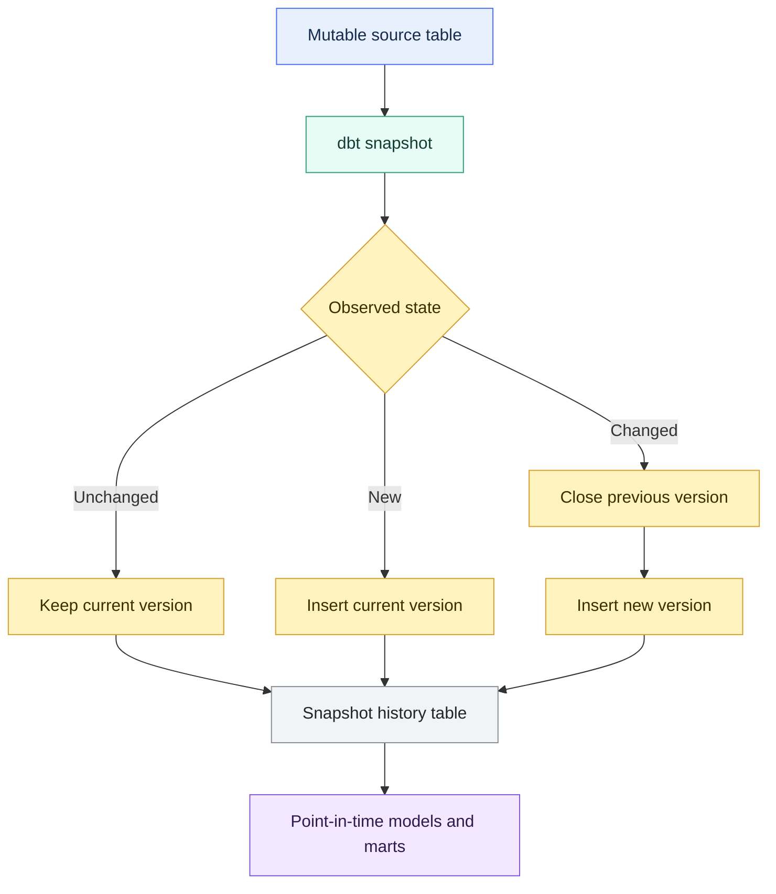

# Snapshots and Historical Change Tracking

> [!abstract] Mental model
> A source table shows the current state. A snapshot preserves the states dbt observed over time.

## Executive Summary

- **What it is:** A dbt snapshot is a historical table maintained by dbt that records changes to mutable records over time using a stable key and a change-detection strategy.
- **Why it matters:** Many source systems overwrite records. Without snapshots, previous statuses, risk ratings, addresses, and other changing attributes can disappear from analytics history.
- **Mental model:** **A source table shows current state; a snapshot shows observed versions of that state over time.**
- **Best used when:** A source table stores only the latest record state, changes matter analytically, and the project needs SCD2-style history for dimensions or reference entities.
- **Avoid or reconsider when:** The source already has a complete event log, every change must be captured, the table is huge and volatile, or no reliable key or change signal exists.

## What It Can Do

- Preserve prior versions of changing source records.
- Add validity-window columns such as `dbt_valid_from` and `dbt_valid_to`.
- Track current and historical versions of slowly changing dimensions.
- Use a `timestamp` strategy when the source has a reliable `updated_at` column.
- Use a `check` strategy when dbt must compare selected columns to detect change.
- Reference snapshot tables in downstream models with `ref()`.
- Support point-in-time analysis, current-record filtering, and historical joins.
- Optionally handle hard deletes with configured behavior.
- Help explain when a change became visible to the analytics layer.

## What It Cannot Do

- Capture changes that happen and revert between snapshot runs. Snapshots only observe source state when they run.
- Replace a true event log, CDC stream, audit table, or source-system history table.
- Prove the exact legal or business-effective time of a change unless the source data contains that meaning.
- Work safely without a stable and truly unique `unique_key`.
- Detect changes reliably if `updated_at` is missing, late, incorrectly maintained, or not updated when important fields change.
- Avoid storage growth; snapshots add rows as records change.
- Make historical joins simple by itself. Multiple SCD2 tables require careful valid-from/valid-to logic.
- Automatically migrate existing snapshot tables when configs such as `hard_deletes`, `dbt_valid_to_current`, or custom meta columns are added.

## Core Concepts

| Concept | Meaning | Why it matters |
|---|---|---|
| Snapshot | dbt resource that records historical versions of selected records | Preserves change history from mutable inputs |
| Mutable source | A source table where records can be updated or overwritten | Creates risk of losing prior analytical state |
| Historical change tracking | Maintaining previous versions of records over time | Supports point-in-time reporting and audit-style analysis |
| SCD Type 2 | Slowly changing dimension pattern with one row per version of an entity | Common mental model for dbt snapshots |
| `unique_key` | Stable key used to match the same business entity across runs | Required so dbt knows which current row maps to which historical record |
| `strategy` | Method dbt uses to detect whether a row changed | Determines whether dbt looks at `updated_at` or compares column values |
| `timestamp` strategy | Detects changes using an `updated_at` column | Recommended when the source timestamp is reliable |
| `check` strategy | Detects changes by comparing selected `check_cols` | Useful when there is no reliable update timestamp |
| `dbt_valid_from` | Timestamp when a snapshot row version became valid | Start of the observed validity window |
| `dbt_valid_to` | Timestamp when a snapshot row version stopped being valid | End of the observed validity window; current rows are usually `NULL` by default |
| `dbt_scd_id` | dbt-generated identifier for a snapshot row version | Used internally to manage versioning |
| `dbt_updated_at` | Timestamp dbt used for change tracking | Helps understand what timestamp drove the snapshot version |
| `hard_deletes` | Config controlling how deleted source records are handled | Important when missing rows should be tracked as deletions |
| `dbt_valid_to_current` | Config that sets a future-date value for current rows instead of `NULL` | Can simplify range joins and BI filters |

## How It Works (Simple Flow)

1. A dbt snapshot is defined over a source, staging model, or other relation.
2. The snapshot config declares a `unique_key` and a change-detection `strategy`.
3. On the first `dbt snapshot` run, dbt creates a snapshot table with the current records plus snapshot metadata columns.
4. On later runs, dbt compares the current input rows with the existing latest snapshot versions.
5. If a new record appears, dbt inserts it as a current version.
6. If an existing record changes, dbt closes the old version by setting `dbt_valid_to`, then inserts a new current version.
7. Downstream models use `ref()` to query current rows or point-in-time historical versions.
8. The schedule of `dbt snapshot` determines how often dbt can observe and preserve source changes.

## Visuals



## Readable Snippets

Modern YAML-style snapshot using the timestamp strategy:

```yaml
# snapshots/properties.yml
snapshots:
  - name: customer_snapshot
    relation: source('crm', 'customers')
    config:
      schema: snapshots
      unique_key: customer_id
      strategy: timestamp
      updated_at: updated_at
```

Snapshot using the check strategy:

```yaml
snapshots:
  - name: account_risk_snapshot
    relation: ref('stg_accounts')
    config:
      schema: snapshots
      unique_key: account_id
      strategy: check
      check_cols:
        - risk_rating
        - account_status
        - segment
      updated_at: updated_at
```

Run all snapshots or one snapshot:

```bash
dbt snapshot
dbt snapshot --select customer_snapshot
```

Snapshots can also run as part of a broader build:

```bash
dbt build --select customer_snapshot
```

Query current snapshot rows:

```sql
select *
from {{ ref('customer_snapshot') }}
where dbt_valid_to is null
```

Query the version valid on a specific date:

```sql
select *
from {{ ref('customer_snapshot') }}
where to_date('2026-01-15') >= dbt_valid_from
  and (
    to_date('2026-01-15') < dbt_valid_to
    or dbt_valid_to is null
  )
```

Illustrative result:

```text
customer_id | status  | dbt_valid_from | dbt_valid_to
1           | active  | 2026-01-01     | 2026-01-05
1           | churned | 2026-01-05     | null
```

## Consultant Talking Points

- **Client question this answers:** "If the source system overwrites records, how can we still report what the value used to be?"
- **Trade-offs to mention:** Snapshots provide useful SCD2-style history, but only for states observed at each run—not every event.
- **Risk or governance angle:** In banking, snapshots can support questions such as "what was the customer risk rating when this report ran?", but should not be oversold as legal audit logs unless source timing and controls support that claim.
- **Cost/performance angle:** Snapshot cost grows with source size, change frequency, check-column complexity, run cadence, and downstream joins over historical rows.

## Common Pitfalls

- Snapshotting tables without a truly unique and stable `unique_key`.
- Using the `timestamp` strategy when `updated_at` does not change for all relevant business updates.
- Using `check_cols: all` on wide or frequently changing tables without understanding cost and schema-change behavior.
- Assuming snapshots capture every change event; they only capture states observed when the snapshot runs.
- Running snapshots too infrequently for the business question, then discovering intermediate states were missed.
- Running snapshots too frequently on huge volatile tables when CDC or an event log would be more appropriate.
- Forgetting that deleted source rows are ignored by default unless hard-delete behavior is configured intentionally.
- Joining multiple snapshot tables on key alone instead of aligning validity windows.
- Treating `dbt_valid_from` as the legal business-effective date when it may only reflect source `updated_at` or snapshot observation timing.
- Changing snapshot configs on an existing table without planning migration and validation.

## When to Recommend What (Decision Table)

| Situation | Recommend | Why | Watch-outs |
|---|---|---|---|
| Source table stores only latest customer/account state | dbt snapshot | Preserves prior versions for history | Requires stable key and reliable change detection |
| Source has reliable `updated_at` | Timestamp strategy | Simpler and more schema-change tolerant | Confirm `updated_at` changes for all relevant updates |
| No reliable update timestamp | Check strategy with selected columns | Detects changes by comparing values | Avoid `check_cols: all` unless justified |
| Need every event or every intra-day state transition | Source CDC, audit log, or event table | Snapshots can miss changes between runs | dbt snapshot can still model history downstream |
| Need current-state dimension only | Model or incremental model | Simpler and cheaper than historical tracking | Historical questions will not be answerable later |
| Need point-in-time dimensional history | Snapshot plus downstream SCD2-aware model | Supports as-of reporting | Range joins need careful testing |
| Source records can be deleted | Configure `hard_deletes` intentionally | Makes deletion behavior explicit | New configs may require migration for existing snapshots |
| Very large and frequently changing table | Reconsider snapshot scope or use upstream CDC/incremental pattern | Snapshot tables and comparisons can become expensive | Filter, narrow columns, or capture history upstream |
| Need easier current-row range joins | Consider `dbt_valid_to_current` | Replaces current-row `NULL` with a future date | Existing snapshot tables need careful migration |
| Client asks about Snowflake Time Travel as history | Model history explicitly with snapshots or historical models | Time Travel is recovery history, not durable business history | Link retention, governance, and reporting requirements |

## Related Topics

- [[02 dbt/01 Core Concepts and Project Structure/Core Concepts and Project Structure Overview|Core Concepts and Project Structure Overview]]
- [[02 dbt/01 Core Concepts and Project Structure/05 Models ref source and the DAG|Models, ref(), source(), and the DAG]]
- [[02 dbt/01 Core Concepts and Project Structure/06 Commands and Artifacts|Commands and Artifacts]]
- [[02 dbt/01 Core Concepts and Project Structure/07 Sources and Source Freshness|Sources and Source Freshness]]
- [[02 dbt/02 Modeling Patterns and Layering/13 Marts and Data Products|Marts and Data Products]]
- [[02 dbt/02 Modeling Patterns and Layering/19 Late-arriving Data Corrections and Restatements|Late-arriving Data Corrections and Restatements]]
- [[02 dbt/04 Incremental Processing and Performance/31 Incremental Models and Unique Keys|Incremental Models and Unique Keys]]
- [[02 dbt/04 Incremental Processing and Performance/35 Snapshots vs Incremental Models vs Dynamic Tables|Snapshots vs Incremental Models vs Dynamic Tables]]
- [[01 Snowflake/01 Core Architecture and Concepts/03 Time Travel and Fail-safe|Time Travel and Fail-safe]]

## Related Decision Notes

- [[80 Comparisons and Decision Notes/Comparisons/dbt/Comparison - Snapshots vs Incremental Models|Comparison - Snapshots vs Incremental Models]]
- [[80 Comparisons and Decision Notes/Comparisons/Cross-Tool/Comparison - Time Travel vs Modeled Historical Data|Comparison - Time Travel vs Modeled Historical Data]]

## Questions

- Which source records are mutable and analytically important?
- Does the source have a stable unique key?
- Does `updated_at` reliably change for every relevant update?
- Is the business asking for observed analytics history or complete event/audit history?
- How often must snapshots run to avoid missing important intermediate states?
- Should hard deletes be ignored, invalidated, or tracked as new deleted records?
- How much storage and compute growth should the team expect?
- Which downstream models need current rows versus point-in-time rows?

## Sources To Revisit

- [dbt Docs: Add snapshots to your DAG](https://docs.getdbt.com/docs/build/snapshots)
- [dbt Docs: Snapshot configurations](https://docs.getdbt.com/reference/snapshot-configs)
- [dbt Docs: strategy](https://docs.getdbt.com/reference/resource-configs/strategy)
- [dbt Docs: updated_at](https://docs.getdbt.com/reference/resource-configs/updated_at)
- [dbt Docs: hard_deletes](https://docs.getdbt.com/reference/resource-configs/hard-deletes)
- [dbt Docs: dbt_valid_to_current](https://docs.getdbt.com/reference/resource-configs/dbt_valid_to_current)
- [dbt Docs: snapshot_meta_column_names](https://docs.getdbt.com/reference/resource-configs/snapshot_meta_column_names)
