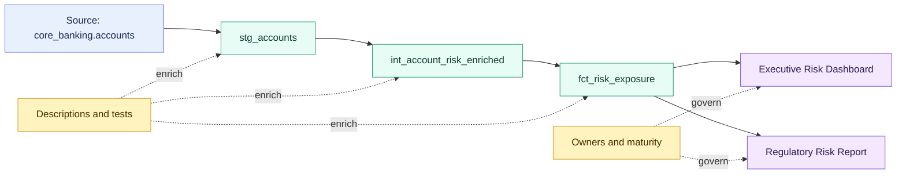

# Documentation, Lineage, and Exposures

> [!abstract] Mental model
> Documentation explains the asset. Lineage explains the flow. Exposures explain why the flow matters.

## Executive Summary

- **What it is:** dbt metadata describing models, columns, sources, tests, owners, dependencies, and downstream uses. Documentation lives mostly in YAML and docs blocks, lineage comes from the DAG, and exposures declare important external consumers.
- **Why it matters:** It turns SQL files into a searchable knowledge layer for impact analysis, onboarding, governance, debugging, and trust.
- **Mental model:** **Documentation explains the asset. Lineage explains the flow. Exposures explain why the flow matters.**
- **Best used when:** A team needs analysts, engineers, reviewers, auditors, and business users to understand what data means, where it came from, who owns it, and which outputs depend on it.
- **Avoid or reconsider when:** Documentation is treated as a one-time writing exercise, lineage is expected to prove correctness, or exposures are added for every minor downstream use until the graph becomes noise.

## What It Can Do

- Add model, column, source, seed, snapshot, test, and exposure descriptions.
- Show upstream and downstream dependencies based on `ref()`, `source()`, tests, metrics, and exposures.
- Generate docs/catalog metadata through dbt artifacts such as `manifest.json` and `catalog.json`.
- Help users inspect grain, purpose, ownership, tests, columns, and dependencies.
- Link dbt outputs to dashboards, applications, reports, notebooks, ML jobs, reverse ETL syncs, and regulatory outputs.
- Support impact analysis before changing a model.
- Help CI or operators select resources upstream of important exposures.
- Reduce tribal knowledge by keeping business definitions close to transformation code.

## What It Cannot Do

- Guarantee the data is correct. Documentation and lineage describe assets; tests and validation check assumptions.
- Detect every dependency outside dbt unless it is declared or integrated.
- Stay accurate without maintenance during code, model, source, dashboard, and ownership changes.
- Replace an enterprise catalog, BI catalog, access review process, or data governance operating model.
- Explain hidden dependencies caused by hard-coded relation names, dynamic SQL, manual extracts, or unregistered BI usage.
- Prove regulatory compliance by itself. It supports evidence, but controls, approvals, tests, lineage, and ownership must align.
- Automatically infer business meaning from SQL names.
- Make noisy or low-quality documentation useful merely because it exists.

## Core Concepts

| Concept | Meaning | Why it matters |
|---|---|---|
| Documentation | Human-readable descriptions and metadata for dbt resources | Explains what assets mean and how they should be used |
| Description | Markdown text on models, columns, sources, seeds, snapshots, exposures, and other resources | Captures grain, assumptions, definitions, and business context |
| Docs block | Reusable markdown block referenced with `doc()` | Keeps repeated definitions consistent |
| Catalog | Metadata about warehouse relations and columns | Enriches docs with column types, relation info, and warehouse-visible details |
| Lineage | Upstream/downstream graph of dbt resources and declared dependencies | Shows data flow and impact of changes |
| DAG | Directed acyclic graph created from `ref()`, `source()`, tests, exposures, and other relationships | The structural basis for lineage |
| Exposure | dbt resource representing a downstream use of dbt outputs | Extends lineage beyond marts into dashboards, reports, apps, or ML jobs |
| `depends_on` | Exposure property listing the dbt resources an exposure uses | Connects important downstream assets to the dbt graph |
| Owner | Person, team, or group accountable for a resource or exposure | Makes operational questions routeable |
| Maturity | Exposure classification such as low, medium, or high | Helps prioritize important downstream uses |
| `manifest.json` | Artifact containing project graph, resource metadata, descriptions, and exposures | Powers lineage, docs, state comparison, and metadata integrations |
| `catalog.json` | Artifact containing warehouse metadata about documented relations and columns | Powers catalog-style column and relation detail |
| `persist_docs` | Config that can write descriptions as database comments where supported | Makes some dbt documentation visible in the warehouse |

## How It Works (Simple Flow)

1. Developers define models, sources, seeds, snapshots, and tests using `ref()`, `source()`, YAML properties, and model SQL.
2. They add descriptions, column documentation, ownership metadata, tags, and reusable docs blocks where useful.
3. Important downstream uses are declared as exposures with type, owner, maturity, URL, description, and `depends_on` references.
4. dbt parses the project and builds the DAG from declared dependencies.
5. dbt generates artifacts such as `manifest.json` and, when docs/catalog generation runs, `catalog.json`.
6. dbt docs, catalogs, and metadata tools use those artifacts to show descriptions, lineage, columns, tests, and exposures.
7. Developers and consultants use that metadata for onboarding, impact analysis, incident diagnosis, audit support, and change review.

## Visuals



## Readable Snippets

Document a model and its columns:

```yaml
models:
  - name: fct_trades
    description: "One row per booked trade, enriched with instrument and counterparty context."
    columns:
      - name: trade_id
        description: "Unique identifier for the booked trade."
        data_tests:
          - unique
          - not_null

      - name: trade_amount
        description: "Trade notional amount in reporting currency."
```

Use a reusable docs block:

```markdown


Trade notional amount converted to the reporting currency using the approved daily FX rate.


```

Reference the docs block in YAML:

```yaml
models:
  - name: fct_trades
    columns:
      - name: trade_amount
        description: "{{ doc('trade_amount') }}"
```

Declare an exposure:

```yaml
exposures:
  - name: executive_risk_dashboard
    label: Executive Risk Dashboard
    type: dashboard
    maturity: high
    url: https://bi.example.com/risk-dashboard
    description: "Executive dashboard for daily credit and market risk exposure."
    depends_on:
      - ref('fct_risk_exposure')
      - ref('dim_counterparty')
    owner:
      name: Risk Analytics
      email: risk_analytics@example.com
```

Select resources upstream of an exposure:

```bash
dbt test --select "+exposure:executive_risk_dashboard"
dbt ls --select "+exposure:*"
```

Generate documentation and catalog metadata:

```bash
dbt build
dbt docs generate
```

## Consultant Talking Points

- **Client question this answers:** "Can we understand what this data means, where it came from, who owns it, and which dashboards or reports depend on it?"
- **Trade-offs to mention:** Documentation close to code is reviewable and trustworthy, but requires discipline. Too little creates tribal knowledge; too much low-quality text creates noise.
- **Risk or governance angle:** Lineage and exposures help identify which regulated reports, dashboards, or business processes are affected by upstream changes, but they are only as complete as the declared dependencies.
- **Cost/performance angle:** Documentation itself is usually low-cost. The practical cost benefit is operational: faster debugging, safer change review, fewer unnecessary broad rebuilds, and clearer ownership.

## Common Pitfalls

- Writing descriptions that repeat the column name instead of explaining business meaning, grain, inclusion rules, or caveats.
- Documenting only marts while ignoring source assumptions and staging cleanup logic.
- Treating lineage as proof that the data is correct.
- Forgetting exposures, so lineage stops at a mart and hides the dashboard, report, or ML job that actually matters.
- Creating exposures for every small ad hoc analysis, making the graph noisy.
- Assigning generic or outdated owners that no one can contact during an incident.
- Letting documentation drift after model logic, source behavior, or dashboard usage changes.
- Hard-coding relation names instead of using `ref()` and `source()`, which hides lineage from dbt.
- Assuming dbt automatically knows every BI dashboard or downstream consumer without declarations or integrations.
- Sharing docs artifacts externally without reviewing sensitive model names, business definitions, relation names, or metadata.

## When to Recommend What (Decision Table)

| Situation | Recommend | Why | Watch-outs |
|---|---|---|---|
| Model is used by analysts or BI | Add model and column descriptions | Makes business meaning discoverable | Include grain, filters, and exclusions, not only labels |
| Same definition appears in several places | Use docs blocks and `doc()` | Keeps definitions consistent | Avoid over-abstracting one-off text |
| Need to understand impact of a model change | Use lineage from `ref()` and `source()` | Shows upstream and downstream dependencies | Hidden hard-coded dependencies will be missing |
| Dashboard or report depends on dbt marts | Add an exposure | Extends lineage to business consumption | Keep exposures curated to meaningful outputs |
| Regulated or executive output depends on dbt | Exposure with owner, maturity, URL, and clear description | Helps incident routing and change review | Ownership must be real and maintained |
| Need docs/catalog metadata in deployment | Run docs/catalog generation in staging or production workflow | Keeps metadata current | Artifacts must be stored and surfaced somewhere useful |
| Warehouse users need comments | Consider `persist_docs` | Pushes descriptions into database comments where supported | Confirm adapter support and governance expectations |
| Team wants enterprise-wide discovery | Combine dbt docs/catalog with broader catalog or BI metadata | dbt has strong transformation metadata | It may not cover all non-dbt assets or access workflows |
| Lineage is noisy or misleading | Improve model structure, naming, and exposure curation | Metadata is only useful when the graph reflects real workflows | Do not solve with links alone |

## Related Topics

- [[02 dbt/01 Core Concepts and Project Structure/Core Concepts and Project Structure Overview|Core Concepts and Project Structure Overview]]
- [[02 dbt/01 Core Concepts and Project Structure/05 Models ref source and the DAG|Models, ref(), source(), and the DAG]]
- [[02 dbt/01 Core Concepts and Project Structure/06 Commands and Artifacts|Commands and Artifacts]]
- [[02 dbt/01 Core Concepts and Project Structure/07 Sources and Source Freshness|Sources and Source Freshness]]
- [[02 dbt/02 Modeling Patterns and Layering/13 Marts and Data Products|Marts and Data Products]]
- [[02 dbt/03 Testing Documentation and Data Quality/21 Generic Singular and Custom Data Tests|Generic, Singular, and Custom Data Tests]]
- [[02 dbt/03 Testing Documentation and Data Quality/24 Documentation Blocks and Catalog|Documentation Blocks and Catalog]]
- [[02 dbt/03 Testing Documentation and Data Quality/25 Exposures|Exposures]]
- [[02 dbt/03 Testing Documentation and Data Quality/29 Data Quality Strategy in Regulated Environments|Data Quality Strategy in Regulated Environments]]
- [[02 dbt/05 Deployment CI CD and Operations/45 Artifacts Logs and Run Results|Artifacts, Logs, and Run Results]]

## Related Decision Notes

- No related decision note yet.

## Questions

- Which dbt models are important enough to document deeply?
- What is the grain, owner, SLA, and intended use of each mart?
- Which dashboards, reports, ML jobs, or regulatory outputs should be declared as exposures?
- Are descriptions reviewed when model logic changes?
- Which dependencies are hidden because they use hard-coded relation names or external tools?
- Which docs/catalog artifacts are generated and stored after production jobs?
- Should descriptions be persisted as warehouse comments?
- Who is accountable when an exposure breaks or receives stale data?

## Sources To Revisit

- [dbt Docs: About documentation](https://docs.getdbt.com/docs/build/documentation)
- [dbt Docs: Add exposures to your DAG](https://docs.getdbt.com/docs/build/exposures)
- [dbt Docs: About the doc function](https://docs.getdbt.com/reference/dbt-jinja-functions/doc)
- [dbt Docs: description property](https://docs.getdbt.com/reference/resource-properties/description)
- [dbt Docs: About dbt docs commands](https://docs.getdbt.com/reference/commands/cmd-docs)
- [dbt Docs: Manifest JSON file](https://docs.getdbt.com/reference/artifacts/manifest-json)
- [dbt Docs: Catalog JSON file](https://docs.getdbt.com/reference/artifacts/catalog-json)
- [dbt Docs: persist_docs](https://docs.getdbt.com/reference/resource-configs/persist_docs)
