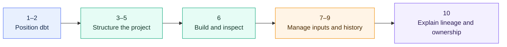

# Core Concepts and Project Structure Overview

> Build the dbt mental model: what it does, how a project is organized, and how models, sources, environments, commands, and artifacts fit together.

> [!abstract] Chapter outcome
> You should be able to explain the dbt workflow end to end, recognize its main project components, and identify where platform, governance, and operating-model decisions sit.

## Topics

- [[02 dbt/01 Core Concepts and Project Structure/01 What dbt Is and Is Not|01 - What dbt Is and Is Not]]
- [[02 dbt/01 Core Concepts and Project Structure/02 dbt Core Fusion dbt Platform and dbt Projects on Snowflake|02 - dbt Core, Fusion, dbt Platform, and dbt Projects on Snowflake]]
- [[02 dbt/01 Core Concepts and Project Structure/03 Project Anatomy and dbt_project.yml|03 - Project Anatomy and dbt_project.yml]]
- [[02 dbt/01 Core Concepts and Project Structure/04 Environments Profiles Targets and Credentials|04 - Environments, Profiles, Targets, and Credentials]]
- [[02 dbt/01 Core Concepts and Project Structure/05 Models ref source and the DAG|05 - Models, ref(), source(), and the DAG]]
- [[02 dbt/01 Core Concepts and Project Structure/06 Commands and Artifacts|06 - Commands and Artifacts]]
- [[02 dbt/01 Core Concepts and Project Structure/07 Sources and Source Freshness|07 - Sources and Source Freshness]]
- [[02 dbt/01 Core Concepts and Project Structure/08 Seeds and Static Reference Data|08 - Seeds and Static Reference Data]]
- [[02 dbt/01 Core Concepts and Project Structure/09 Snapshots and Historical Change Tracking|09 - Snapshots and Historical Change Tracking]]
- [[02 dbt/01 Core Concepts and Project Structure/10 Documentation Lineage and Exposures|10 - Documentation, Lineage, and Exposures]]

## Chapter Map

## Topic Summaries

| Topic | What it unlocks |
|---|---|
| [[02 dbt/01 Core Concepts and Project Structure/01 What dbt Is and Is Not|01 - What dbt Is and Is Not]] | Separates transformation workflow from ingestion, storage, BI, orchestration, and governance. |
| [[02 dbt/01 Core Concepts and Project Structure/02 dbt Core Fusion dbt Platform and dbt Projects on Snowflake|02 - Core, Fusion, Platform, and Snowflake]] | Compares execution engines and control planes without losing sight of where SQL runs. |
| [[02 dbt/01 Core Concepts and Project Structure/03 Project Anatomy and dbt_project.yml|03 - Project Anatomy and dbt_project.yml]] | Explains the folders, configuration, and conventions that make a project maintainable. |
| [[02 dbt/01 Core Concepts and Project Structure/04 Environments Profiles Targets and Credentials|04 - Environments, Profiles, Targets, and Credentials]] | Connects environment separation to warehouses, secrets, and role design. |
| [[02 dbt/01 Core Concepts and Project Structure/05 Models ref source and the DAG|05 - Models, ref(), source(), and the DAG]] | Establishes the core mental model for dependencies, build order, and lineage. |
| [[02 dbt/01 Core Concepts and Project Structure/06 Commands and Artifacts|06 - Commands and Artifacts]] | Shows how dbt builds, validates, and records what happened. |
| [[02 dbt/01 Core Concepts and Project Structure/07 Sources and Source Freshness|07 - Sources and Source Freshness]] | Connects upstream data availability to downstream reliability. |
| [[02 dbt/01 Core Concepts and Project Structure/08 Seeds and Static Reference Data|08 - Seeds and Static Reference Data]] | Defines the narrow, controlled use case for versioned static data. |
| [[02 dbt/01 Core Concepts and Project Structure/09 Snapshots and Historical Change Tracking|09 - Snapshots and Historical Change Tracking]] | Introduces history capture for mutable source records. |
| [[02 dbt/01 Core Concepts and Project Structure/10 Documentation Lineage and Exposures|10 - Documentation, Lineage, and Exposures]] | Turns project metadata into shared context about lineage, use, and ownership. |

## How To Use This Area

Follow the topics in order for a first pass. Later, use the table as a quick reference and jump directly to the concept you need.

The global [[02 dbt/dbt Learning Map|dbt Learning Map]] links here, and each topic links back to this hub so Graph View stays readable.

## Related Areas

- [[02 dbt/dbt Learning Map|dbt Learning Map]]
- [[02 dbt/02 Modeling Patterns and Layering/Modeling Patterns and Layering Overview|Next: Modeling Patterns and Layering]]
