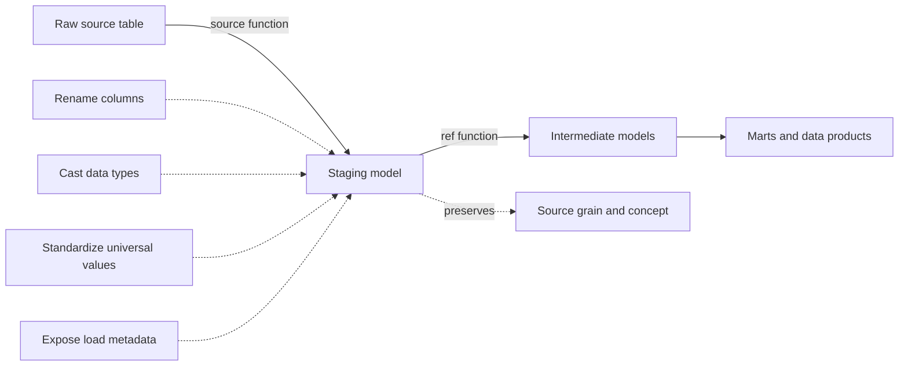

# Staging Models

> Staging models turn raw source tables into clean, consistently named, typed, source-aligned building blocks without introducing substantial business logic.

## Executive Summary

- **What it is:** A staging model is usually the first dbt-managed model built from one externally loaded source table. It standardizes the table while preserving its source concept and grain.
- **Why it matters:** Without a governed staging layer, developers repeatedly rename, cast, clean, and interpret the same raw fields in different ways. Staging makes those universal decisions once and gives downstream models a stable entry point.
- **Mental model:** **Raw data speaks the source system's language; staging translates it into clean analytics language.** Staging models are the atoms used to build richer intermediate models and marts.
- **Best used when:** Raw tables have cryptic names, unreliable types, source-specific flags, ingestion metadata, or cleaning steps that every downstream use case should inherit.
- **Avoid or reconsider when:** The proposed logic joins business entities, aggregates data, changes the grain, combines source systems, or applies accounting, risk, regulatory, or departmental definitions. That logic usually belongs downstream.

## What It Can Do

- Create one clean, reusable dbt entry point for a raw source table.
- Reference externally managed data with `source()` and make the raw-to-dbt boundary visible in lineage.
- Rename source-specific columns into clear, consistent names.
- Cast strings and loosely typed fields into reliable dates, timestamps, numerics, and booleans.
- Standardize universal representations such as casing, whitespace, flags, units, and ingestion metadata.
- Apply basic computations or categories that every downstream consumer should use.
- Document and test technical assumptions such as grain, key uniqueness, nullability, and accepted codes.
- Reduce duplicated cleaning logic and inconsistent interpretations downstream.

## What It Cannot Do

- Load data into the warehouse; ingestion remains the responsibility of Fivetran, Snowpipe, replication, streaming, or other upstream pipelines.
- Prove that data is complete, reconciled, correctly booked, or business-valid.
- Replace intermediate models for joins, reusable business transformations, or complex preparation.
- Replace marts for governed business entities, dimensions, facts, and metrics.
- Resolve unclear source semantics or ownership simply by renaming columns.
- Safely hide invalid, deleted, or duplicated records without an explicit and auditable rule.
- Guarantee good performance merely because it is materialized as a view.

## Core Concepts

| Concept | Meaning | Why it matters |
|---|---|---|
| Source-conformed | The model still represents a concept as supplied by one source system | Keeps the boundary between external source meaning and internal business meaning clear |
| One-to-one source pattern | Normally one staging model directly references one source table | Provides one governed entry point and predictable lineage for each raw table |
| Preserved grain | The staging model normally keeps the source table's row-level meaning | Prevents early loss of detail and makes downstream reasoning safer |
| `source()` boundary | Staging models use `source()` to read declared raw tables | Shows where dbt-managed transformation begins and avoids hard-coded relation names |
| `ref()` downstream | Intermediate models and marts use `ref()` to consume staging models | Ensures downstream logic reuses the standardized version rather than bypassing it |
| Universal transformation | Cleaning or standardization every downstream consumer should inherit | The main test for whether logic belongs in staging |
| Business logic | Rules whose answer depends on an accounting policy, domain definition, report, or analytical purpose | Usually belongs in intermediate models or marts rather than staging |
| Base model | An optional raw-facing helper used when a clean staging concept requires a small join or union | Makes justified exceptions explicit instead of turning every staging model into a mixed-purpose model |
| Staging view | The common default materialization for a thin staging model | Avoids storing another copy while exposing current source data |

## How It Works (Simple Flow)

1. An upstream loader writes a source-system table into a raw warehouse area.
2. The dbt project declares the table as a source in a YAML properties file.
3. One staging model uses `source()` to reference that raw table.
4. The model renames columns, casts types, standardizes universal values, and exposes useful ingestion metadata.
5. The transformation normally preserves the source rows, grain, and source-aligned meaning.
6. Tests and documentation record technical expectations such as the model's grain and key behavior.
7. Intermediate models and marts use `ref()` to build on the standardized staging model.
8. Materialization is usually a view, but measured cost, latency, and query complexity can justify another choice.

## Visuals



## Readable Snippets

Declare the upstream source:

```yaml
# models/staging/trading/_trading__sources.yml
sources:
  - name: trading
    database: raw
    schema: trading
    loader: fivetran
    tables:
      - name: order_hdr
```

Create the standardized staging model:

```sql
-- models/staging/trading/stg_trading__orders.sql
with source as (

    select *
    from {{ source('trading', 'order_hdr') }}

),

renamed_and_cast as (

    select
        ord_no                         as order_id,
        cpty_cd                        as counterparty_code,
        to_date(trade_dt, 'YYYYMMDD')  as trade_date,
        cast(notional_amt as number(18, 2))
                                       as notional_amount,
        upper(ccy)                     as currency_code,
        cancel_flg = 'Y'               as is_cancelled,
        _fivetran_synced               as loaded_at
    from source

)

select * from renamed_and_cast
```

Give the staging folder a materialization default:

```yaml
# dbt_project.yml
models:
  investment_bank:
    staging:
      +materialized: view
```

Document and test technical expectations:

```yaml
models:
  - name: stg_trading__orders
    description: Clean, source-aligned representation of trading orders.
    columns:
      - name: order_id
        description: Source-system order identifier.
        data_tests:
          - not_null
          - unique

      - name: currency_code
        data_tests:
          - not_null
          - accepted_values:
              arguments:
                values: ['EUR', 'GBP', 'NOK', 'USD']
```

Recommended multi-source folder pattern:

```text
models/
└── staging/
    ├── trading/
    │   ├── _trading__sources.yml
    │   ├── stg_trading__orders.sql
    │   └── stg_trading__executions.sql
    └── crm/
        ├── _crm__sources.yml
        └── stg_crm__customers.sql
```

## Consultant Talking Points

- **Client question this answers:** "Where do we standardize raw source data once so every downstream team starts from the same technical interpretation?"
- **Trade-offs to mention:** Thin, predictable staging models improve reuse and lineage, but add another layer of warehouse objects. Overly rigid one-to-one rules can also become awkward when a source requires delete handling, deduplication, or unioning of identical tables.
- **Risk or governance angle:** Staging creates an auditable mapping between raw fields and standardized fields. In regulated environments, avoid silently repairing missing values, removing deleted records, or discarding duplicates without an approved rule and traceable evidence.
- **Cost/performance angle:** Views avoid additional storage and rebuilds, but repeatedly evaluating complex or deeply nested views can consume Snowflake compute. Change materialization only after measuring the workload and understanding freshness consequences.

## Common Pitfalls

- Putting joins in ordinary staging models, which mixes source concepts and makes lineage and grain harder to understand.
- Aggregating in staging and losing row-level detail that later reconciliation, audit, or analytical use cases need.
- Adding report-specific or departmental logic, causing the supposedly shared staging layer to embed one consumer's interpretation.
- Letting downstream models bypass staging and read raw tables directly, which recreates inconsistent cleaning logic.
- Grouping staging folders by loader or department rather than source system, obscuring source ownership and encouraging duplicate definitions.
- Filtering `_fivetran_deleted` records automatically without deciding whether audit, history, or reconciliation processes need to see them.
- Deduplicating without documenting why duplicates occur, which record wins, and whether discarded records remain traceable.
- Using `select *` as the final projection, allowing unexpected source columns and schema changes to leak downstream. A `select *` source CTE can aid readability, but the final projection should normally be explicit.
- Defaulting every staging model to a physical table for perceived speed, increasing build time, storage, and freshness complexity without performance evidence.
- Treating successful staging tests as proof of business correctness; technical uniqueness and accepted values do not prove that a trade, balance, or posting is correct.

## When to Recommend What (Decision Table)

| Situation | Recommend | Why | Watch-outs |
|---|---|---|---|
| One raw table needs reusable renaming and type cleanup | One thin staging model using `source()` | Creates a consistent dbt entry point while preserving lineage | Keep its grain and source concept intact |
| Transformation is required for every use case of the source table | Put it in staging | Applies the rule once and prevents repeated code | Confirm it is genuinely universal rather than merely common today |
| Logic joins orders, executions, customers, or other entities | Move it to an intermediate model | Joins create a new combined concept and can change row counts | Define join keys, grain, and duplicate behavior explicitly |
| Logic aggregates trades to desk-day totals | Move it to an intermediate model or mart | Aggregation changes the grain and removes atomic detail | Choose placement based on whether it is reusable preparation or a published business output |
| Logic implements accounting, risk, or regulatory policy | Put it downstream, usually in intermediate or mart models | The rule is business-conformed rather than source-conformed | Document ownership, approval, effective dates, and change control |
| Source has soft-delete metadata | Expose a clear deletion flag in staging; filter downstream by default | Preserves auditability and lets consumers choose the correct population | A universal, approved deletion rule may justify filtering earlier |
| Raw duplicates are caused by ingestion mechanics | Consider a documented base or staging deduplication pattern | Technical cleanup may be necessary before safe reuse | Preserve evidence, define the winning record, and test the result |
| Several identical regional or sharded tables represent one source concept | Consider base models followed by an explicit unioned staging model | Produces one usable component without hiding the exception | Confirm schemas, provenance columns, and ownership are consistent |
| Thin staging logic with normal downstream use | Materialize as a view | Simple, current, and storage-efficient | View chains still consume compute when queried |
| Very large or expensive staging logic is repeatedly evaluated | Measure, then consider table or incremental materialization | Persistence may reduce repeated compute | Adds build, storage, freshness, recovery, and operational concerns |

## Related Topics

- [[02 dbt/02 Modeling Patterns and Layering/Modeling Patterns and Layering Overview|Modeling Patterns and Layering Overview]]
- [[02 dbt/01 Core Concepts and Project Structure/03 Project Anatomy and dbt_project.yml|Project Anatomy and dbt_project.yml]]
- [[02 dbt/01 Core Concepts and Project Structure/05 Models ref source and the DAG|Models, ref(), source(), and the DAG]]
- [[02 dbt/01 Core Concepts and Project Structure/07 Sources and Source Freshness|Sources and Source Freshness]]
- [[02 dbt/02 Modeling Patterns and Layering/12 Intermediate Models|Intermediate Models]]
- [[02 dbt/02 Modeling Patterns and Layering/13 Marts and Data Products|Marts and Data Products]]
- [[02 dbt/02 Modeling Patterns and Layering/16 Naming Conventions and Folder Design|Naming Conventions and Folder Design]]
- [[02 dbt/04 Incremental Processing and Performance/30 Materializations|Materializations]]

## Related Decision Notes

- No related decision note yet. The layer-placement framework should be revisited after Intermediate Models and Marts have been studied.

## Questions

- What is the exact grain of each source table and does the staging model preserve it?
- Which renames, casts, and standardizations are truly universal for every downstream use case?
- Are any joins, aggregations, filters, or business definitions being introduced too early?
- Should deleted or invalid records remain visible for audit and reconciliation?
- If duplicates exist, are they source defects, ingestion artifacts, or legitimate multiple events?
- Which technical tests should define the staging model's expected grain and value domains?
- Does the default view materialization perform acceptably on Snowflake, or is there measured evidence for persistence?
- Who owns source semantics and approves changes to standardized field mappings?

## Sources To Revisit

- [dbt Docs: Staging - Preparing atomic building blocks](https://docs.getdbt.com/best-practices/how-we-structure/2-staging)
- [dbt Docs: How we structure our dbt projects](https://docs.getdbt.com/best-practices/how-we-structure/1-guide-overview)
- [dbt Docs: About source function](https://docs.getdbt.com/reference/dbt-jinja-functions/source)
- [dbt Docs: About ref function](https://docs.getdbt.com/reference/dbt-jinja-functions/ref)
- [dbt Docs: Materializations](https://docs.getdbt.com/docs/build/materializations)
- [dbt Docs: Model configurations](https://docs.getdbt.com/reference/model-configs)
