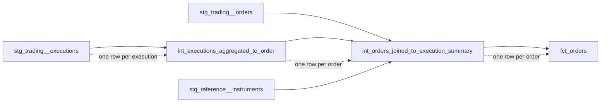

# Intermediate Models

> Intermediate models are internal, purpose-built transformation steps that prepare clean staging data for consumer-facing marts.

## Executive Summary

- **What it is:** An intermediate model sits between staging models and marts. It performs a clearly named transformation such as joining, aggregating, re-graining, pivoting, deduplicating, or isolating complex logic.
- **Why it matters:** Intermediate models keep marts readable, make grain changes and difficult rules visible, create useful testing boundaries, and make complex transformations easier to troubleshoot.
- **Mental model:** **Staging models are ingredients, intermediate models are preparation steps, and marts are finished dishes.**
- **Best used when:** A transformation deserves its own name, grain definition, tests, reuse boundary, ownership boundary, or performance boundary.
- **Avoid or reconsider when:** The logic is a small, readable, single-use CTE or the project can move clearly from staging directly to marts. Intermediate layers are optional, not a maturity badge.

## What It Can Do

- Join related staging or intermediate models into a richer concept.
- Aggregate or fan out records to a new, explicitly defined grain.
- Isolate window functions, pivots, deduplication, effective-dated joins, and other complex operations.
- Break an unreadable mart into smaller steps with single, understandable purposes.
- Provide a testable boundary before several components are assembled into a final mart.
- Reuse a purposeful transformation without copying SQL into multiple downstream models.
- Make join cardinality, unmatched-record handling, and grain changes easier to inspect.
- Create a performance boundary when expensive logic needs to be persisted after measurement.

## What It Cannot Do

- Replace staging models as the governed entry point for raw source tables.
- Replace marts as stable, documented, consumer-facing business interfaces.
- Make incorrect business logic correct merely by splitting it into smaller models.
- Prevent row multiplication unless grains and join cardinalities are explicitly controlled.
- Eliminate the need to document rule ownership, effective dates, exceptions, and reconciliation behavior.
- Guarantee reuse; an overly generic intermediate model can create coupling and become hard to change.
- Guarantee better performance; extra views, tables, and model boundaries can increase compute and operational complexity.
- Serve as a stable BI contract by default. Intermediate models are normally implementation details that may change during refactoring.

## Core Concepts

| Concept | Meaning | Why it matters |
|---|---|---|
| Purpose-built step | A model performs one transformation that can be stated clearly | Keeps the DAG and SQL understandable |
| Re-graining | Changing data from one grain to another, such as executions to orders | Grain changes are high-risk and should be visible and testable |
| Structural simplification | Splitting a large set of joins or operations into coherent components | Keeps marts readable without creating arbitrary one-model-per-CTE sprawl |
| Business-conformed direction | Models begin moving away from source-system structure toward shared business concepts | Explains why intermediate folders are often grouped by business concern rather than source system |
| Verb-based naming | Names describe the operation, such as `aggregated_to_order` or `deduplicated` | Communicates intent even before someone reads the SQL |
| Implementation detail | A model used to construct a final product rather than consumed directly | Supports safe refactoring and controlled discoverability |
| Ephemeral materialization | dbt injects the intermediate model as a CTE into downstream SQL | Avoids a warehouse object but can reduce inspectability and expand compiled SQL |
| Restricted intermediate schema | Views or tables live outside consumer-facing schemas with limited permissions | Improves troubleshooting without presenting internals as trusted products |
| Model access | dbt controls which models may use `ref()` across groups or projects | Helps prevent unintended dependencies, but is separate from Snowflake grants |

## How It Works (Simple Flow)

1. Staging models provide clean, source-aligned inputs with known technical grains.
2. A downstream requirement reveals a meaningful transformation step, such as aggregating executions to order grain.
3. The team creates an intermediate model with a name that states the entity and operation.
4. The model joins, aggregates, pivots, deduplicates, or applies one coherent piece of complex logic.
5. Documentation and tests record the output grain, key behavior, join assumptions, and important exceptions.
6. Additional intermediate models or marts use `ref()` to consume the prepared result.
7. The intermediate model remains internal rather than becoming a dashboard or application contract.
8. Its materialization is chosen from ephemeral, view, table, or incremental based on inspectability, reuse, cost, and measured performance.

## Visuals



## Readable Snippets

Aggregate executions to order grain before joining them to orders:

```sql
-- models/intermediate/trading/int_executions_aggregated_to_order.sql
with executions as (

    select *
    from {{ ref('stg_trading__executions') }}

),

aggregated as (

    select
        order_id,
        sum(executed_quantity) as total_executed_quantity,
        sum(executed_quantity * execution_price)
            / nullif(sum(executed_quantity), 0)
                                      as weighted_average_execution_price,
        min(executed_at)              as first_executed_at,
        max(executed_at)              as last_executed_at,
        count(*)                      as execution_count
    from executions
    group by order_id

)

select * from aggregated
```

Join two inputs that are now at the same grain:

```sql
-- int_orders_joined_to_execution_summary.sql
with orders as (

    select *
    from {{ ref('stg_trading__orders') }}

),

execution_summary as (

    select *
    from {{ ref('int_executions_aggregated_to_order') }}

),

joined as (

    select
        orders.order_id,
        orders.instrument_id,
        orders.ordered_quantity,
        coalesce(execution_summary.total_executed_quantity, 0)
                                      as total_executed_quantity,
        orders.ordered_quantity
            - coalesce(execution_summary.total_executed_quantity, 0)
                                      as remaining_quantity,
        execution_summary.weighted_average_execution_price
    from orders
    left join execution_summary
        on orders.order_id = execution_summary.order_id

)

select * from joined
```

Use an intermediate schema when warehouse visibility is valuable:

```yaml
# dbt_project.yml
models:
  investment_bank:
    intermediate:
      +materialized: view
      +schema: intermediate
```

Keep a group-specific implementation detail private:

```yaml
models:
  - name: int_executions_aggregated_to_order
    description: One row per order with execution totals and timing.
    config:
      group: trading
      access: private
    columns:
      - name: order_id
        data_tests:
          - not_null
          - unique
```

Recommended naming and folder pattern:

```text
models/
└── intermediate/
    ├── finance/
    │   └── int_ledger_entries_aggregated_to_account_day.sql
    ├── risk/
    │   └── int_positions_enriched_with_risk_factors.sql
    └── trading/
        ├── _int_trading__models.yml
        ├── int_executions_aggregated_to_order.sql
        └── int_orders_joined_to_execution_summary.sql
```

## Consultant Talking Points

- **Client question this answers:** "How do we make complex joins, grain changes, and business preparation understandable and testable without exposing every step to end users?"
- **Trade-offs to mention:** Intermediate models improve readability and control boundaries, but too many small or vaguely named models create DAG sprawl. The layer should emerge from real complexity rather than a mandatory folder template.
- **Risk or governance angle:** In banking, use intermediate boundaries to expose high-risk operations such as deduplication, effective-dated matching, trade-to-position aggregation, FX conversion, and legal-entity allocation. Document grain, unmatched records, rule ownership, and reconciliation expectations.
- **Cost/performance angle:** Ephemeral models reduce warehouse clutter but can generate large compiled SQL and repeated work. Views improve inspection but recompute logic. Tables and incremental models can reduce repeated compute but introduce storage, freshness, rebuild, backfill, and recovery obligations.

## Common Pitfalls

- Creating one dbt model for every small CTE, producing a noisy DAG without meaningful testing, reuse, ownership, or performance boundaries.
- Building an "intermediate swamp" of names such as `int_orders_final_v2` that do not state the transformation or output grain.
- Joining tables before controlling their grains, causing silent row multiplication and overstated amounts.
- Changing grain without documenting and testing the expected output key.
- Combining many unrelated transformations in one intermediate model, recreating the unreadable mart under another name.
- Allowing dashboards and analysts to depend directly on intermediate objects, turning internal implementation details into accidental public contracts.
- Using ephemeral materialization for deeply nested or widely reused logic, leading to oversized compiled queries and difficult Snowflake troubleshooting.
- Persisting every intermediate step as a table, increasing build time, storage, failure points, and stale-data risk without measured benefit.
- Confusing `access: private` with Snowflake permissions; dbt model access governs `ref()` relationships, while warehouse grants govern users and roles.
- Applying critical finance rules without documenting effective dates, null behavior, unmatched populations, and control ownership.

## When to Recommend What (Decision Table)

| Situation | Recommend | Why | Watch-outs |
|---|---|---|---|
| Staging-to-mart SQL is short and clear | Keep the logic in the mart or a readable CTE | Avoids unnecessary model and DAG complexity | Extract it later if complexity or reuse appears |
| A complex step deserves a clear name and test boundary | Create one purpose-built intermediate model | Makes intent, grain, and failure location visible | Do not mix unrelated operations into the same model |
| Inputs have different grains | Re-grain each input explicitly before joining | Prevents accidental row multiplication | Document original and output grains and test the new key |
| The same meaningful transformation is repeated | Create a reusable intermediate model | Centralizes logic and avoids inconsistent copies | Too many downstream dependencies can make an internal model hard to change |
| Logic is small, simple, and lightly reused | Consider ephemeral materialization | Avoids an unnecessary warehouse object | Harder to inspect; complex reuse may duplicate compiled SQL |
| Developers need to query and troubleshoot the result | Use a view in a restricted intermediate schema | Preserves visibility without presenting it as a mart | Deep view chains can increase query complexity and compute |
| Logic is expensive and repeatedly evaluated | Measure, then consider table or incremental materialization | Persistence can reduce repeated compute | Adds freshness, storage, backfill, rebuild, and recovery concerns |
| Only one business group should depend on the model | Assign a group and consider `access: private` | Prevents accidental cross-group `ref()` dependencies | Private models require all legitimate consumers to be in the same group |
| Several groups inside one project should reuse the model | Keep it `protected` and document ownership | Allows project-wide reuse without making it a cross-project public interface | Reuse creates coupling; clarify stability expectations |
| Business users require a stable dataset | Publish a mart instead | Marts are intended to be governed consumer interfaces | Define grain, ownership, tests, documentation, and access expectations |

## Related Topics

- [[02 dbt/02 Modeling Patterns and Layering/Modeling Patterns and Layering Overview|Modeling Patterns and Layering Overview]]
- [[02 dbt/02 Modeling Patterns and Layering/11 Staging Models|Staging Models]]
- [[02 dbt/02 Modeling Patterns and Layering/13 Marts and Data Products|Marts and Data Products]]
- [[02 dbt/02 Modeling Patterns and Layering/14 Dimensional Modeling with dbt|Dimensional Modeling with dbt]]
- [[02 dbt/02 Modeling Patterns and Layering/16 Naming Conventions and Folder Design|Naming Conventions and Folder Design]]
- [[02 dbt/02 Modeling Patterns and Layering/18 Multi-source Conformed Models|Multi-source Conformed Models]]
- [[02 dbt/04 Incremental Processing and Performance/30 Materializations|Materializations]]
- [[02 dbt/06 Governance Semantic Layer and Mesh/51 Model Access|Model Access]]

## Related Decision Notes

- [[80 Comparisons and Decision Notes/Decision Notes/Snowflake/Decisions - Diagnosing Slow Snowflake Queries|Decisions - Diagnosing Slow Snowflake Queries]]
- Revisit whether a dbt layer-placement decision note is warranted after studying Marts and Data Products.

## Questions

- What exact transformation purpose does the model serve, and can its name state that purpose?
- What are the input and output grains?
- Which columns or combinations of columns prove the output grain?
- Can joins multiply rows, and how are unmatched records handled?
- Is the transformation genuinely reusable or only part of one mart's implementation?
- Does the step deserve its own tests, ownership, or troubleshooting boundary?
- Should it be ephemeral, inspectable as a view, or persisted based on measured cost and runtime?
- Who is allowed to reference the model in dbt, and who can query its warehouse object?
- Are finance or regulatory rules documented with ownership, effective dates, and reconciliation controls?
- Would direct consumer use create an unstable dependency that should instead be served by a mart?

## Sources To Revisit

- [dbt Docs: Intermediate - Purpose-built transformation steps](https://docs.getdbt.com/best-practices/how-we-structure/3-intermediate)
- [dbt Docs: How we structure our dbt projects](https://docs.getdbt.com/best-practices/how-we-structure/1-guide-overview)
- [dbt Docs: Model access](https://docs.getdbt.com/docs/mesh/govern/model-access)
- [dbt Docs: Materializations](https://docs.getdbt.com/docs/build/materializations)
- [dbt Docs: Ephemeral materialization](https://docs.getdbt.com/docs/build/materializations#ephemeral)
- [dbt Docs: Custom schemas](https://docs.getdbt.com/docs/build/custom-schemas)
