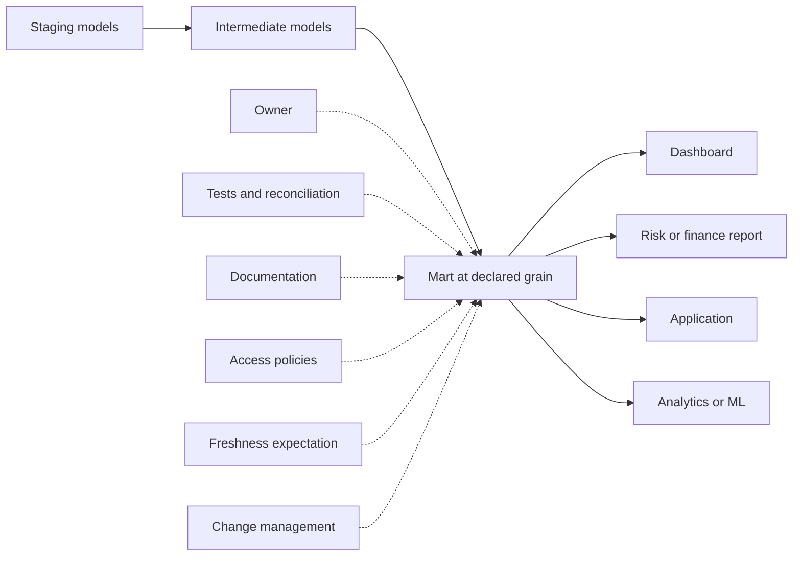

# Marts and Data Products

> Marts are trusted, business-conformed datasets at declared grains; data products add the ownership, controls, documentation, access, and service expectations needed for safe consumption.

## Executive Summary

- **What it is:** A mart is a consumer-facing dbt model representing a recognizable business entity or concept, such as orders, customers, trades, positions, or ledger entries, at an explicit grain. A data product is the mart plus its operational and governance promises.
- **Why it matters:** Marts provide stable interfaces for BI, finance, risk, regulatory reporting, applications, analytics, and other teams. They prevent every consumer from rebuilding joins and redefining core business concepts.
- **Mental model:** **A mart is the finished dataset; a data product is that dataset plus the promises needed to use it safely.**
- **Best used when:** Consumers need a trusted, documented, performant, and comparatively stable business dataset with clear ownership and controlled change.
- **Avoid or reconsider when:** The model is only an internal transformation step, its grain is unclear, its definition duplicates another mart, or it has no identified consumers or ownership.

## What It Can Do

- Publish a business entity or concept at a clear, testable grain.
- Centralize joins, calculations, and definitions that consumers would otherwise repeat inconsistently.
- Present wide, analysis-ready data for BI and analytics when denormalization is appropriate.
- Provide a stable interface for dashboards, applications, ML features, reports, and other dbt projects.
- Attach documentation, tests, ownership, access, contracts, versions, and downstream exposures.
- Materialize frequently queried results to reduce repeated transformation compute.
- Separate governed production outputs from internal staging and intermediate implementation details.
- Support domain ownership across finance, risk, trading, operations, compliance, and other business areas.

## What It Cannot Do

- Become trustworthy merely by living in a `marts/` folder.
- Resolve conflicting business definitions without accountable owners and stakeholder decisions.
- Guarantee business correctness through technical tests alone.
- Safely mix several grains in one model without creating ambiguous measures and duplication risk.
- Replace a semantic or metrics layer when consumers need governed calculations across dimensions and time grains.
- Replace Snowflake RBAC, masking policies, row access policies, warehouse governance, or data-sharing controls.
- Avoid all change risk; public consumers need impact analysis, communication, and sometimes contracts or versions.
- Serve consumers if materialized as ephemeral. An ephemeral model has no Snowflake relation to query or grant.

## Core Concepts

| Concept | Meaning | Why it matters |
|---|---|---|
| Business-conformed | The model is shaped around an agreed business concept rather than a source system | Makes the output meaningful across teams and sources |
| Grain | What one row represents | Determines valid keys, joins, aggregations, and tests |
| Entity mart | A model centered on a noun such as order, customer, instrument, or account | Gives consumers a recognizable and reusable interface |
| Fact | An event, transaction, or measurable activity | Common shape for orders, trades, executions, payments, and ledger entries |
| Dimension | A descriptive business entity | Common shape for customers, accounts, instruments, counterparties, and legal entities |
| Denormalization | Copying useful related attributes into a wider model | Simplifies and can accelerate consumer queries, but duplicates data and controls |
| Consumer contract | A promise about the model's structure and expected behavior | Reduces accidental breaking changes for downstream users |
| Data product | A dataset plus ownership, documentation, quality, access, freshness, lineage, and support expectations | Shifts the focus from producing tables to serving consumers reliably |
| Exposure | A dbt resource representing a downstream dashboard, report, application, or ML use | Extends lineage beyond the mart and improves impact analysis |
| Published interface | A model intentionally safe for durable downstream dependencies | Distinguishes marts from changeable implementation details |

## How It Works (Simple Flow)

1. Stakeholders identify a business entity, use case, and intended consumers.
2. The team declares exactly what one row represents and which business rules define the population.
3. Staging and intermediate models provide cleaned, joined, and correctly re-grained inputs.
4. The mart selects the stable columns, calculations, descriptive context, and identifiers consumers need.
5. Documentation, tests, reconciliation controls, ownership, and access policies establish trust boundaries.
6. The model is materialized as a view, table, or incremental model based on measured performance and operational needs.
7. Exposures and lineage record important dashboards, reports, applications, and processes that depend on it.
8. Mature public interfaces use controlled releases, contracts, or versions when the cost of breaking change justifies them.

## Visuals



## Readable Snippets

Publish one row per trading order:

```sql
-- models/marts/trading/fct_orders.sql
with orders as (

    select *
    from {{ ref('int_orders_joined_to_execution_summary') }}

),

instruments as (

    select *
    from {{ ref('dim_instruments') }}

),

final as (

    select
        orders.order_id,
        orders.account_id,
        orders.instrument_id,
        instruments.instrument_name,
        instruments.asset_class,
        orders.order_date,
        orders.side,
        orders.ordered_quantity,
        orders.total_executed_quantity,
        orders.remaining_quantity,
        orders.weighted_average_execution_price,
        case
            when orders.total_executed_quantity = 0 then 'open'
            when orders.remaining_quantity = 0 then 'filled'
            else 'partially_filled'
        end as order_status
    from orders
    left join instruments
        on orders.instrument_id = instruments.instrument_id

)

select * from final
```

Configure marts as consumer-facing relations:

```yaml
# dbt_project.yml
models:
  investment_bank:
    marts:
      +materialized: table
      +schema: marts
```

Document the grain, ownership, and key expectations:

```yaml
models:
  - name: fct_orders
    description: >
      One row per trading order, enriched with execution totals
      and instrument classification.
    config:
      group: trading
      access: public
    columns:
      - name: order_id
        description: Unique trading-system order identifier.
        data_tests:
          - not_null
          - unique

      - name: order_status
        data_tests:
          - accepted_values:
              arguments:
                values: ['open', 'partially_filled', 'filled']
```

Represent an important downstream consumer:

```yaml
exposures:
  - name: trading_order_monitor
    type: dashboard
    maturity: high
    depends_on:
      - ref('fct_orders')
    owner:
      name: Trading Operations
      email: trading-ops@example.com
```

Organize larger mart areas by business concern:

```text
models/marts/
├── finance/
│   ├── fct_ledger_entries.sql
│   └── fct_pnl_daily.sql
├── risk/
│   ├── fct_position_daily.sql
│   └── fct_risk_measure_daily.sql
├── trading/
│   ├── fct_orders.sql
│   └── fct_executions.sql
└── shared/
    ├── dim_accounts.sql
    ├── dim_counterparties.sql
    └── dim_instruments.sql
```

## Consultant Talking Points

- **Client question this answers:** "Which datasets should analysts, reports, and applications treat as governed business interfaces rather than transformation internals?"
- **Trade-offs to mention:** Wide marts simplify and often accelerate consumption but duplicate descriptive data and controls. Normalized marts preserve reusable relationships but can require more joins or a semantic layer. A mart should optimize for its intended consumers, not follow one universal shape.
- **Risk or governance angle:** In banking, define the reporting population, grain, historical semantics, owner, reconciliation, sensitive-data boundary, and approval process. A technically successful mart can still apply the wrong valuation rule or legal-entity population.
- **Cost/performance angle:** Start simply, often with a view; persist as a table when repeated queries are slow or expensive; use incremental logic only when full rebuilds become a measured problem. Ephemeral is inappropriate for a consumer-facing mart because it creates no queryable relation.

## Common Pitfalls

- Mixing orders, executions, fees, or position lots at different grains and silently overstating measures.
- Creating one mart per dashboard, leading to duplicated logic and inconsistent business definitions.
- Building `finance_orders`, `risk_orders`, and `operations_orders` when all three claim to represent the same underlying order concept.
- Publishing a mart without documenting what one row represents and which key proves that grain.
- Allowing critical accounting, valuation, or regulatory rules to remain ownerless and unexplained inside SQL.
- Treating `not_null` and `unique` tests as proof that balances, populations, or calculations reconcile.
- Copying sensitive customer or counterparty attributes into many wide marts without masking and access review.
- Making every mart incremental before runtime or cost requires it, adding late-arrival, correction, full-refresh, and backfill risk.
- Letting public columns and meanings change without checking exposures, downstream dependencies, contracts, or migration needs.
- Materializing a supposed mart as ephemeral; it will remain a dbt DAG node but will not exist as a Snowflake object for consumers.
- Calling a table a data product without an owner, quality response, freshness expectation, documentation, or support path.

## When to Recommend What (Decision Table)

| Situation | Recommend | Why | Watch-outs |
|---|---|---|---|
| Consumers need a stable business entity | Create a mart with an explicit grain and owner | Provides one governed interface instead of repeated consumer logic | Define population, history, keys, and permitted uses |
| Model is only a construction step for another output | Keep it intermediate | Preserves freedom to refactor implementation details | Do not let dashboards depend on it accidentally |
| Several dashboards use the same entity | Build one reusable entity mart | Reduces duplicated definitions and joins | Different use cases may still need separate aggregates or metrics |
| Departments disagree on a definition | Resolve the shared definition or name genuinely distinct concepts | Avoids department-specific versions of truth | Document why concepts such as statutory and management revenue differ |
| BI users repeatedly perform difficult joins | Consider a wider denormalized mart | Improves usability and reduces repeated compute | Control sensitive fields and historical attribute semantics |
| dbt Semantic Layer will resolve entity relationships | Prefer more normalized, semantic-ready models | Gives MetricFlow flexibility to construct joins and metrics | Requires disciplined entities, dimensions, and semantic definitions |
| Mart is small and inexpensive | Start with a view | Simple, current, and easy to change | Repeated transformations may become expensive as use grows |
| Repeated mart queries are slow or costly | Materialize as a table | Stores the consumer-ready result | Full rebuild time and freshness become operational concerns |
| Full table rebuild is too slow | Consider incremental materialization | Processes only the necessary change window | Design for unique keys, corrections, late arrivals, schema changes, and backfills |
| Other teams or systems depend on the schema | Consider public access, a contract, and managed change | Makes the interface and breaking changes explicit | Governance adds maintenance and should match real dependency risk |
| A breaking schema change is unavoidable | Consider a model version and migration window | Lets consumers move deliberately | Avoid permanent support of unnecessary versions |
| Output supports regulatory or financial reporting | Add reconciliation, evidence retention, ownership, and controlled release | Technical build success is insufficient evidence of correctness | Define tolerances, escalation, reruns, and restatement handling |

## Related Topics

- [[02 dbt/02 Modeling Patterns and Layering/Modeling Patterns and Layering Overview|Modeling Patterns and Layering Overview]]
- [[02 dbt/02 Modeling Patterns and Layering/11 Staging Models|Staging Models]]
- [[02 dbt/02 Modeling Patterns and Layering/12 Intermediate Models|Intermediate Models]]
- [[02 dbt/02 Modeling Patterns and Layering/14 Dimensional Modeling with dbt|Dimensional Modeling with dbt]]
- [[02 dbt/02 Modeling Patterns and Layering/15 Finance Modeling Patterns|Finance Modeling Patterns]]
- [[02 dbt/02 Modeling Patterns and Layering/20 Reconciliation Models|Reconciliation Models]]
- [[02 dbt/04 Incremental Processing and Performance/30 Materializations|Materializations]]
- [[02 dbt/06 Governance Semantic Layer and Mesh/51 Model Access|Model Access]]
- [[02 dbt/06 Governance Semantic Layer and Mesh/52 Model Contracts|Model Contracts]]
- [[02 dbt/06 Governance Semantic Layer and Mesh/53 Model Versions and Deprecation|Model Versions and Deprecation]]
- [[02 dbt/06 Governance Semantic Layer and Mesh/55 Semantic Models and Metrics|Semantic Models and Metrics]]

## Related Decision Notes

- [[80 Comparisons and Decision Notes/Comparisons/dbt/Comparison - Star Schema vs Wide Marts|Comparison - Star Schema vs Wide Marts]]
- [[80 Comparisons and Decision Notes/Decision Notes/dbt/Decisions - Choosing the Right dbt Modeling Layer|Decisions - Choosing the Right dbt Modeling Layer]]
- [[80 Comparisons and Decision Notes/Decision Notes/Snowflake/Decisions - Diagnosing Slow Snowflake Queries|Decisions - Diagnosing Slow Snowflake Queries]]

## Questions

- What exactly does one row represent, and which key proves that grain?
- Which consumers and decisions should the mart support?
- Is this a shared business concept or a use-case-specific output?
- Which rules define the population, measures, historical behavior, and unmatched records?
- Should the design be wide and denormalized or normalized for semantic-layer use?
- Which columns are safe to expose, and which require masking or row-level controls?
- What freshness, quality, reconciliation, and availability expectations apply?
- Who owns the definition and responds when quality checks fail?
- Which dashboards, reports, systems, and projects depend on the model?
- Does measured performance justify a table or incremental model?
- Is the interface important enough to require a contract, version, or migration window?
- What evidence proves that a regulated output is complete, accurate, and produced from approved inputs?

## Sources To Revisit

- [dbt Docs: Marts - Business-defined entities](https://docs.getdbt.com/best-practices/how-we-structure/4-marts)
- [dbt Docs: How we structure our dbt projects](https://docs.getdbt.com/best-practices/how-we-structure/1-guide-overview)
- [dbt Docs: Materializations](https://docs.getdbt.com/docs/build/materializations)
- [dbt Docs: Model access](https://docs.getdbt.com/docs/mesh/govern/model-access)
- [dbt Docs: Model contracts](https://docs.getdbt.com/docs/mesh/govern/model-contracts)
- [dbt Docs: Model versions](https://docs.getdbt.com/docs/mesh/govern/model-versions)
- [dbt Docs: Exposures](https://docs.getdbt.com/docs/build/exposures)
- [dbt Docs: Build metrics](https://docs.getdbt.com/best-practices/how-we-build-our-metrics/semantic-layer-1-intro)
