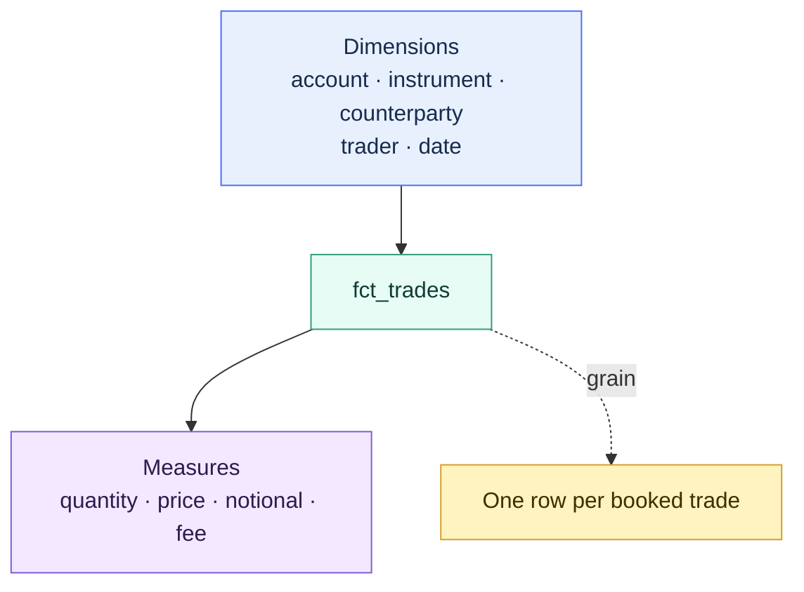

# Dimensional Modeling with dbt

> [!abstract] Mental model
> Facts record events or states; dimensions supply reusable context; grain defines exactly what one row means.

## Executive Summary

- **What it is:** Dimensional modeling organizes analytical data around facts, dimensions, keys, grains, and shared business entities. dbt implements these designs as modular, tested, documented, and version-controlled SQL models.
- **Why it matters:** A dimensional design makes valid joins and aggregations easier to understand, prevents mixed-grain reporting errors, and creates reusable context across trading, finance, risk, and other domains.
- **Mental model:** **Facts record what happened; dimensions describe who, what, where, and when it happened. Grain defines exactly what one row means.**
- **Best used when:** Consumers repeatedly analyze business events or states by shared attributes such as customer, account, instrument, counterparty, legal entity, and date.
- **Avoid or reconsider when:** A small, focused use case is better served by one clearly defined wide mart, or when the organization is adding a complex star schema without concrete consumer, reuse, or governance needs.

## What It Can Do

- Represent business processes as transaction, periodic snapshot, accumulating snapshot, or factless fact tables.
- Provide reusable descriptive context through dimension tables.
- Make model grain, join cardinality, and valid aggregation behavior explicit.
- Standardize shared entities through conformed dimensions.
- Support current-state and point-in-time historical analysis.
- Separate natural business identifiers from analytical surrogate keys.
- Reuse dimensions across facts for consistent cross-domain analysis.
- Give dbt tests, documentation, lineage, contracts, and Semantic Layer definitions a clear modeling foundation.

## What It Cannot Do

- Choose the correct grain or business definition without stakeholder and domain input.
- Prevent double counting if facts are joined at incompatible grains.
- Make a source key globally unique when source systems reuse or corrupt identifiers.
- Turn a hash into data quality, encryption, or anonymization.
- Provide historical truth unless the source or modeling process preserves the required changes.
- Make every numeric value additive across dimensions, time, units, or currencies.
- Resolve conflicting domain classifications without ownership and mapping governance.
- Guarantee that a strict star schema is better than a simpler wide mart for every consumer.

## Core Concepts

| Concept | Meaning | Why it matters |
|---|---|---|
| Grain | The precise meaning of one row | Determines valid keys, joins, tests, and aggregations |
| Fact table | Events, transactions, measurements, or periodic states | Stores business-process activity and measurable values |
| Dimension table | Descriptive context for facts | Enables filtering, grouping, labeling, and shared interpretation |
| Transaction fact | One row per atomic event such as a trade or execution | Preserves maximum detail and analytical flexibility |
| Periodic snapshot fact | One row per entity combination at a regular interval | Represents states such as end-of-day positions or balances |
| Accumulating snapshot fact | One row per process updated as milestones occur | Supports lifecycle and elapsed-time analysis |
| Natural key | Identifier originating in a source or business process | Preserves traceability but may not be globally unique or stable |
| Surrogate key | Deterministic analytical identifier generated from stable inputs | Supports conformance, composite identities, and historical versions |
| Conformed dimension | Shared dimension with consistent meaning across facts and domains | Enables comparable analysis across trading, positions, P&L, and risk |
| Slowly changing dimension | Pattern for handling changing descriptive attributes | Determines whether reporting uses current or historical context |
| Additivity | Rule for whether a measure can be summed across dimensions | Prevents invalid totals for balances, prices, ratios, and mixed currencies |
| Degenerate dimension | Business identifier kept directly in a fact without a separate dimension table | Useful for identifiers such as trade, order, ticket, or invoice number |
| Role-playing dimension | One dimension reused in several roles | A date dimension may represent trade date, settlement date, and maturity date |

## How It Works (Simple Flow)

1. Identify the business process and the questions consumers need to answer.
2. Declare the fact grain before choosing columns or writing joins.
3. Identify the measurable facts and classify their valid aggregation behavior.
4. Identify descriptive dimensions, natural keys, ownership, and required historical behavior.
5. Use staging models to clean source-aligned tables and intermediate models to conform entities, control grains, and perform historical joins.
6. Generate deterministic surrogate keys where source identifiers are composite, overlapping, mutable, or versioned.
7. Publish fact and dimension marts with documented grains, keys, tests, access, and reconciliation controls.
8. Expose the physical models directly through BI-friendly marts or map them into semantic entities, dimensions, measures, and metrics.

## Visuals



## Readable Snippets

State and test the grain of a periodic snapshot fact:

```yaml
models:
  - name: fct_position_daily
    description: One row per account, instrument, and business date.
    data_tests:
      - dbt_utils.unique_combination_of_columns:
          arguments:
            combination_of_columns:
              - account_key
              - instrument_key
              - position_date
```

Generate a deterministic surrogate key for a conformed instrument:

```sql
-- dim_instruments.sql
select
    {{ dbt_utils.generate_surrogate_key([
        'source_system',
        'instrument_id'
    ]) }} as instrument_key,
    source_system,
    instrument_id,
    instrument_name,
    asset_class,
    currency_code,
    issuer_name,
    maturity_date
from {{ ref('int_instruments_conformed') }}
```

Join a fact to the historical dimension version valid at event time:

```sql
-- int_trades_joined_to_customer_history.sql
select
    trades.*,
    customers.customer_version_key,
    customers.risk_rating_at_version
from {{ ref('stg_trading__trades') }} as trades
left join {{ ref('dim_customer_history') }} as customers
    on trades.customer_id = customers.customer_id
   and trades.trade_timestamp >= customers.valid_from
   and trades.trade_timestamp < customers.valid_to
```

Publish an atomic trade fact:

```sql
-- fct_trades.sql
select
    trade_id,
    trade_date,
    account_key,
    instrument_key,
    counterparty_key,
    customer_version_key,
    quantity,
    trade_price,
    trade_currency_code,
    notional_amount,
    fee_amount
from {{ ref('int_trades_dimension_keys_resolved') }}
```

Example dimensional mart layout:

```text
models/marts/
├── trading/
│   ├── fct_trades.sql
│   └── fct_executions.sql
├── positions/
│   └── fct_position_daily.sql
└── shared/
    ├── dim_accounts.sql
    ├── dim_counterparties.sql
    ├── dim_dates.sql
    └── dim_instruments.sql
```

## Consultant Talking Points

- **Client question this answers:** "How should we structure analytical data so users know what one row means, how tables join, and which aggregations are valid?"
- **Trade-offs to mention:** Star schemas promote reusable dimensions and explicit relationships but require consumers to understand joins. Wide marts simplify consumption and can reduce compute but duplicate attributes, historical semantics, and sensitive-data controls.
- **Risk or governance angle:** In banking, establish the transaction or position grain, point-in-time semantics, legal-entity scope, currency treatment, conformed classifications, late-arriving behavior, and reconciliation evidence before publishing a fact.
- **Cost/performance angle:** Snowflake can join facts and dimensions effectively, but repeated joins still consume compute. Denormalize measured high-value paths where it improves usability or performance, rather than copying every attribute everywhere by default.

## Common Pitfalls

- Designing columns and measures before writing the grain statement.
- Joining two facts directly at incompatible grains and multiplying amounts.
- Treating a source identifier as globally unique when several systems reuse it.
- Generating surrogate keys before resolving duplicate natural keys or unstable identity rules.
- Assuming a hash provides encryption, anonymization, or proof of data quality.
- Using current dimension attributes for historical reporting without acknowledging that results will restate.
- Joining a Type 2 dimension by business key only rather than selecting the version valid at event time.
- Treating a dbt snapshot as complete event history; it preserves only the states observed when it runs.
- Summing balances across time, prices, ratios, or amounts in mixed currencies as though they were fully additive.
- Building separate instrument, customer, or account dimensions for each department and losing cross-domain conformance.
- Dropping unmatched facts in inner joins instead of applying a documented unknown-member or exception strategy.
- Copying sensitive dimension attributes into many wide facts without reviewing masking and row-level access.
- Implementing a complex star schema when one well-defined mart would satisfy the actual use case.

## When to Recommend What (Decision Table)

| Situation | Recommend | Why | Watch-outs |
|---|---|---|---|
| Repeated analysis of events by shared descriptive attributes | Fact tables plus conformed dimensions | Reuses context and supports comparable analysis across processes | Establish ownership and consistent keys across domains |
| Small, focused use case with simple consumption | One well-defined wide entity mart | Reduces joins and modeling overhead | Keep the grain explicit and avoid ungoverned duplication |
| Source records atomic business events | Transaction fact | Preserves detail and flexible downstream aggregation | Corrections, cancellations, and versions need explicit handling |
| End-of-day positions, balances, or risk states | Periodic snapshot fact | Represents a state at a regular business interval | Measures are often semi-additive across time |
| Process has milestones updated over time | Accumulating snapshot fact | Supports lifecycle duration and bottleneck analysis | Late milestones and corrections require reliable update logic |
| Source keys overlap across systems or are composite | Deterministic surrogate keys after conformance | Creates a stable analytical join key | Key inputs and null behavior must be governed and consistent |
| Only the latest descriptive state matters | Type 1 dimension | Simple and current | Historical reports will use the latest attributes and may restate |
| Historical attributes must reflect event time | Type 2 dimension with an as-of join | Preserves point-in-time context | Range joins, version keys, overlaps, and gaps require careful testing |
| Mutable source overwrites important history | dbt snapshot or source-provided CDC history | Captures observed prior states for downstream dimensional modeling | Snapshot cadence can miss intermediate changes |
| Multiple facts share instrument, account, or customer context | Conformed dimensions | Enables consistent cross-process analysis | Do not force genuinely distinct concepts into false conformance |
| BI users repeatedly make incorrect joins | Wider mart or governed semantic relationships | Reduces consumer join burden | Denormalization duplicates attributes and security controls |
| dbt Semantic Layer will manage joins and metrics | More normalized, entity-aware marts | Gives MetricFlow flexibility to construct valid relationships | Requires disciplined entity, dimension, measure, and time definitions |
| Regulatory output depends on the model | Governed dimensional mart plus reconciliation and evidence | Makes grain, scope, history, and control ownership explicit | Technical tests alone do not prove regulatory correctness |

## Related Topics

- [[02 dbt/02 Modeling Patterns and Layering/Modeling Patterns and Layering Overview|Modeling Patterns and Layering Overview]]
- [[02 dbt/01 Core Concepts and Project Structure/09 Snapshots and Historical Change Tracking|Snapshots and Historical Change Tracking]]
- [[02 dbt/02 Modeling Patterns and Layering/12 Intermediate Models|Intermediate Models]]
- [[02 dbt/02 Modeling Patterns and Layering/13 Marts and Data Products|Marts and Data Products]]
- [[02 dbt/02 Modeling Patterns and Layering/15 Finance Modeling Patterns|Finance Modeling Patterns]]
- [[02 dbt/02 Modeling Patterns and Layering/18 Multi-source Conformed Models|Multi-source Conformed Models]]
- [[02 dbt/02 Modeling Patterns and Layering/19 Late-arriving Data Corrections and Restatements|Late-arriving Data, Corrections, and Restatements]]
- [[02 dbt/02 Modeling Patterns and Layering/20 Reconciliation Models|Reconciliation Models]]
- [[02 dbt/06 Governance Semantic Layer and Mesh/55 Semantic Models and Metrics|Semantic Models and Metrics]]

## Related Decision Notes

- [[80 Comparisons and Decision Notes/Comparisons/dbt/Comparison - Star Schema vs Wide Marts|Comparison - Star Schema vs Wide Marts]]
- [[80 Comparisons and Decision Notes/Decision Notes/dbt/Decisions - Choosing the Right dbt Modeling Layer|Decisions - Choosing the Right dbt Modeling Layer]]
- [[80 Comparisons and Decision Notes/Comparisons/dbt/Comparison - Snapshots vs Incremental Models|Comparison - Snapshots vs Incremental Models]]

## Questions

- What business process does the fact represent?
- What exactly does one row mean, and which key proves that grain?
- Is the model a transaction, periodic snapshot, accumulating snapshot, or another fact type?
- Which measures are additive, semi-additive, non-additive, or currency-dependent?
- Which natural keys are stable and unique across source systems?
- Is a surrogate key needed, and which stable fields define identity?
- Which dimensions should be conformed across trading, finance, positions, and risk?
- Should changing attributes use current-state or point-in-time semantics?
- If Type 2 history is needed, does the source provide full history or only states dbt can observe?
- How will facts with late or missing dimension members be handled?
- Is a star schema, a wide mart, or a semantic-layer design easiest for the intended consumers?
- Which reconciliations prove fact populations and amounts agree with approved sources?

## Sources To Revisit

- [Kimball Group: Dimensional Modeling Techniques](https://www.kimballgroup.com/data-warehouse-business-intelligence-resources/kimball-techniques/dimensional-modeling-techniques/)
- [dbt Docs: Marts - Business-defined entities](https://docs.getdbt.com/best-practices/how-we-structure/4-marts)
- [dbt Docs: Snapshots](https://docs.getdbt.com/docs/build/snapshots)
- [dbt Docs: Semantic models](https://docs.getdbt.com/docs/build/semantic-models)
- [dbt Docs: Entities](https://docs.getdbt.com/docs/build/entities)
- [dbt Docs: Dimensions](https://docs.getdbt.com/docs/build/dimensions)
- [dbt Labs: dbt_utils generate_surrogate_key](https://github.com/dbt-labs/dbt-utils#generate_surrogate_key-source)
