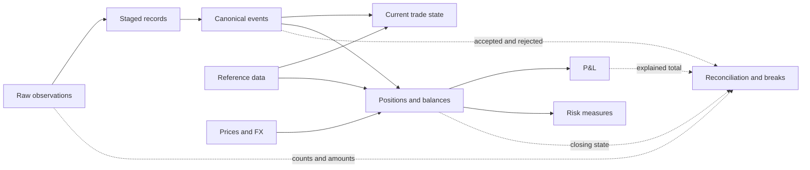

# Finance Modeling Patterns

> Finance models preserve financial events, derive controlled states, apply reference and market data at the correct time, and reconcile important populations and amounts.

## Executive Summary

- **What it is:** A set of reusable patterns for modeling orders, executions, trades, positions, ledger entries, prices, FX, P&L, and risk in dbt.
- **Why it matters:** Financial data can look technically valid while being duplicated, incorrectly signed, converted with the wrong rate, joined to current rather than historical reference data, or missing late corrections.
- **Mental model:** **Events → accepted events → current state → financial outputs → reconciliation.** Preserve enough history and metadata to explain every step.
- **Best used when:** dbt transforms transaction, accounting, position, valuation, risk, or regulatory data that needs clear grain, point-in-time meaning, traceability, and control evidence.
- **Avoid or reconsider when:** Business owners have not agreed on identity, sign, valuation, accounting, FX, restatement, or reconciliation rules. dbt can implement approved rules; it cannot decide the correct financial policy.

## What It Can Do

- Preserve atomic orders, executions, trades, postings, cash movements, and change events.
- Detect repeated deliveries and create one controlled representation of each distinct event.
- Derive current trade state, positions, balances, P&L, and risk outputs.
- Join reference data, prices, and FX rates using explicit as-of rules.
- Standardize sign, currency, units, and identifiers while retaining raw values for traceability.
- Handle late-arriving records, corrections, cancellations, and restatements deliberately.
- Test grains, relationships, allowed values, and important calculation branches.
- Build reconciliation models that explain counts, amounts, breaks, and tolerances.

## What It Cannot Do

- Decide whether a source event, price, FX rate, valuation model, or accounting rule is authoritative.
- Prove business correctness from `unique` and `not_null` tests alone.
- Turn ingestion time into business-effective time automatically.
- Infer one universal sign convention across products and accounting systems.
- Make amounts comparable without currency, unit, rate, and as-of context.
- Recover historical states that were never retained or observed.
- Guarantee that a transaction-derived position equals the institution's approved position source.
- Replace finance, risk, operations, model governance, or regulatory ownership.

## Core Concepts

| Concept | Meaning | Why it matters |
|---|---|---|
| Financial event | An order, execution, trade, posting, cash movement, correction, or cancellation | Atomic history should normally be preserved before state is derived |
| Canonical event | One governed representation of a distinct event after duplicate and conflict handling | Prevents repeated delivery from creating repeated financial effect |
| Current state | Latest effective result after applying event versions in business order | Useful for operational consumption but should remain traceable to history |
| Grain | What one row represents | Distinguishes orders, executions, trades, positions, journal lines, and risk observations |
| Business-effective time | When the business says a record or attribute became valid | Drives financial ordering and point-in-time reporting |
| Load time | When the warehouse received or processed a record | Supports latency and investigation, not necessarily financial truth |
| As-of join | Join to the reference, price, or FX version valid at an event time | Prevents current attributes from silently restating historical outputs |
| Position | Quantity or exposure held at a point in time | A state, often modeled as an account-instrument-date periodic fact |
| Valuation context | Price, FX rate, source, type, timestamp, model, and currency used | Makes market value, P&L, and risk numbers explainable |
| Reconciliation | Proof that counts, populations, and amounts agree across a controlled boundary | Separates successful SQL execution from financially trustworthy output |

## How It Works (Simple Flow)

1. Preserve raw observations, source identifiers, files, batches, and load timestamps.
2. Stage each source table into consistently named and typed records.
3. Canonicalize repeated observations into one accepted event per business identity, while separating conflicts.
4. Apply creations, amendments, cancellations, and corrections in business-effective order to derive current state.
5. Enrich events and states with the reference, price, and FX versions valid for the required as-of time.
6. Build governed facts such as trades, positions, ledger entries, P&L components, and risk measures at declared grains.
7. Reconcile source, accepted, rejected, and published populations and amounts before declaring outputs trustworthy.
8. Preserve breaks, calculation-run metadata, and publication versions so corrections and restatements can be explained.

## Visuals



## Readable Snippets

Canonicalization means one accepted representation of each distinct event:

```sql
-- int_trade_events_ranked.sql
select
    *,
    row_number() over (
        partition by event_id
        order by loaded_at, source_file_name, source_row_number
    ) as occurrence_number,
    count(*) over (
        partition by event_id
    ) as occurrence_count
from {{ ref('stg_trading__trade_events') }}
```

```text
Three identical raw deliveries
            ↓
One canonical event with occurrence_count = 3
            ↓
One financial effect
```

If the same `event_id` has conflicting payloads, do not silently choose a row. Quarantine it or apply an approved precedence rule and retain the evidence.

Make an FX conversion self-explanatory:

```sql
select
    trade_id,
    transaction_amount,
    transaction_currency_code,
    fx_rate,
    fx_rate_type,
    fx_rate_source,
    fx_rate_timestamp,
    transaction_amount * fx_rate as reporting_amount,
    'EUR' as reporting_currency_code
from {{ ref('int_trades_joined_to_fx_rate') }}
```

Represent reconciliation as an explainable equation:

```text
opening position
+ accepted movements
+ approved adjustments
= closing position
```

```sql
with reconciliation as (

    select
        account_id,
        instrument_id,
        opening_quantity + movement_quantity + adjustment_quantity
            - closing_quantity as quantity_break
    from {{ ref('int_position_reconciliation') }}

)

select *
from reconciliation
where abs(quantity_break) > 0.000001
```

## Consultant Talking Points

- **Client question this answers:** "How do we produce finance, position, P&L, and risk outputs that remain traceable through duplicates, late data, corrections, market inputs, and restatements?"
- **Trade-offs to mention:** Keeping atomic events and version history increases storage and modeling work, but greatly improves auditability and safe replay. Current-state-only models are simpler but cannot explain prior states by themselves.
- **Risk or governance angle:** Agree business identity, effective time, price and FX hierarchy, sign rules, reporting population, tolerances, ownership, and publication policy before presenting outputs as controlled finance data.
- **Cost/performance angle:** Large event and time-series models often need incremental processing, but overlap windows, late corrections, full-refresh procedures, and reconciliation must be designed before optimization is considered safe.

## Common Pitfalls

- Confusing orders, executions, trades, and event versions, then joining incompatible grains.
- Applying the same raw event more than once because it arrived in several files or batches.
- Using `select distinct` as a substitute for a documented identity and conflict rule.
- Treating `loaded_at` as the business-effective ordering field.
- Overwriting cancellations and corrections instead of retaining their relationship to prior events.
- Joining current instrument, counterparty, or risk classifications into historical facts without declaring restatement behavior.
- Converting currencies without recording rate direction, type, source, timestamp, and reporting currency.
- Summing values across currencies or units before normalization.
- Assuming all sources share the same buy/sell, debit/credit, or positive/negative convention.
- Publishing a transaction-derived position without reconciling to the approved position or ledger source.
- Reporting one unexplained P&L total rather than controlled components and calculation metadata.
- Treating a passing dbt build or technical tests as proof that financial populations and amounts tie out.
- Keeping only reconciliation status and discarding the break records needed for investigation.

## When to Recommend What (Decision Table)

| Situation | Recommend | Why | Watch-outs |
|---|---|---|---|
| Same event can arrive repeatedly | Preserve observations and canonicalize by business identity | Keeps raw evidence while applying one financial effect | Detect conflicting duplicates separately from exact duplicates |
| Events can be amended or cancelled | Keep versioned events and derive current state | Supports traceability, replay, and historical explanation | Define event ordering and out-of-order behavior |
| Consumers need end-of-day positions or balances | Periodic snapshot fact at an explicit as-of grain | Represents financial state at a controlled interval | Do not sum the same state across dates |
| Reference attributes matter historically | Effective-dated dimension and as-of join | Preserves the context valid when the event occurred | Test gaps, overlaps, late dimensions, and unmatched facts |
| Several prices or FX rates are available | Approved source and fallback hierarchy | Makes valuation repeatable and explainable | Record source, type, direction, timestamp, and stale-data rules |
| Amounts cross currencies | Preserve original and reporting amounts plus conversion metadata | Supports audit and recalculation | Do not overwrite original amounts or hide rounding |
| P&L is business critical | Separate explainable components and calculation runs | Makes totals testable and restatements traceable | Component definitions depend on approved methodology |
| Ledger data supports accounting | Preserve journal-line grain and balancing controls | Enables double-entry reconciliation | Clarify currency, legal-entity, suspense, and tolerance rules |
| Risk results vary by model or scenario | Store as-of time, measure, scenario, model version, and run ID | Prevents risk numbers from losing calculation context | Long versus wide shape depends on volume and usage |
| Late or corrected data is normal | Incremental overlap, controlled replay, and publication versions | Updates affected history without unnecessary full rebuilds | Avoid missing corrections outside the processing window |
| Output supports regulatory or finance reporting | Governed mart plus reconciliation, breaks, and evidence | Technical model success is insufficient proof | Define blocking thresholds, approvals, reruns, and restatement policy |

## Related Topics

- [[02 dbt/02 Modeling Patterns and Layering/Modeling Patterns and Layering Overview|Modeling Patterns and Layering Overview]]
- [[02 dbt/01 Core Concepts and Project Structure/09 Snapshots and Historical Change Tracking|Snapshots and Historical Change Tracking]]
- [[02 dbt/02 Modeling Patterns and Layering/14 Dimensional Modeling with dbt|Dimensional Modeling with dbt]]
- [[02 dbt/02 Modeling Patterns and Layering/18 Multi-source Conformed Models|Multi-source Conformed Models]]
- [[02 dbt/02 Modeling Patterns and Layering/19 Late-arriving Data Corrections and Restatements|Late-arriving Data, Corrections, and Restatements]]
- [[02 dbt/02 Modeling Patterns and Layering/20 Reconciliation Models|Reconciliation Models]]
- [[02 dbt/03 Testing Documentation and Data Quality/21 Generic Singular and Custom Data Tests|Generic, Singular, and Custom Data Tests]]
- [[02 dbt/03 Testing Documentation and Data Quality/22 Unit Tests for SQL Logic|Unit Tests for SQL Logic]]
- [[02 dbt/08 dbt on Snowflake and Finance Patterns/79 Investment Bank Case Study|Investment Bank Case Study]]

## Related Decision Notes

- [[80 Comparisons and Decision Notes/Decision Notes/dbt/Decisions - Choosing the Right dbt Modeling Layer|Decisions - Choosing the Right dbt Modeling Layer]]
- [[80 Comparisons and Decision Notes/Comparisons/dbt/Comparison - Snapshots vs Incremental Models|Comparison - Snapshots vs Incremental Models]]
- [[80 Comparisons and Decision Notes/Comparisons/Cross-Tool/Comparison - Time Travel vs Modeled Historical Data|Comparison - Time Travel vs Modeled Historical Data]]

## Questions

- What uniquely identifies an observation, event, trade, position, posting, and calculation run?
- Which repeated records are exact duplicates, and which are conflicting payloads?
- Which timestamp controls business truth, and which timestamp records arrival?
- How are amendments, cancellations, backdated events, and out-of-order versions applied?
- What is the declared grain of every financial fact?
- Which reference, price, and FX versions should apply at each as-of time?
- What do positive and negative values mean for each product and account type?
- Which source is authoritative for positions, balances, P&L, and risk?
- Which counts and amounts must reconcile, at what grain and tolerance?
- Which failures warn, quarantine, block publication, or require approval?
- How are reruns, restatements, and originally published results preserved?

## Sources To Revisit

- [dbt Docs: Data tests](https://docs.getdbt.com/docs/build/data-tests)
- [dbt Docs: Unit tests](https://docs.getdbt.com/docs/build/unit-tests)
- [dbt Docs: Incremental models](https://docs.getdbt.com/docs/build/incremental-models)
- [dbt Docs: Snapshots](https://docs.getdbt.com/docs/build/snapshots)
- [dbt Docs: Marts - Business-defined entities](https://docs.getdbt.com/best-practices/how-we-structure/4-marts)
- [Kimball Group: Dimensional Modeling Techniques](https://www.kimballgroup.com/data-warehouse-business-intelligence-resources/kimball-techniques/dimensional-modeling-techniques/)
