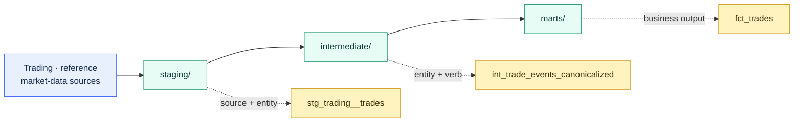

# Naming Conventions and Folder Design

> [!abstract] Mental model
> Names tell you what a model is; folders tell you where it belongs and how the project governs it.

## Executive Summary

- **What it is:** A consistent system for naming models and fields and organizing dbt resources from source-aligned staging through internal transformations to published business outputs.
- **Why it matters:** Clear conventions reduce onboarding time, prevent ambiguous models, make the DAG easier to understand, and keep operational selectors and inherited configs predictable as the project grows.
- **Mental model:** **Staging names the source and entity; intermediate names the transformation; marts name the business output.**
- **Best used when:** Any shared dbt project needs repeatable rules for discoverability, ownership, model placement, physical schemas, and stable public interfaces.
- **Avoid or reconsider when:** The structure adds empty folders, unnecessary nesting, or abstract standards before the project has real complexity. Consistency should remove decisions, not create ceremony.

## What It Can Do

- Make a model's layer, source, entity, and transformation purpose visible from its path and name.
- Prevent project-wide name collisions as new source systems are added.
- Keep source definitions, model properties, tests, and documentation close to relevant SQL.
- Apply default materializations, schemas, tags, grants, or groups by folder.
- Support path, FQN, tag, group, and configuration-based selection in jobs and development.
- Separate internal implementation details from stable, consumer-facing marts.
- Make ownership and domain boundaries easier to recognize.
- Provide a controlled migration path from legacy physical names to clear dbt names.

## What It Cannot Do

- Create good architecture if models are placed in folders without following the intended responsibilities.
- Make two conflicting business definitions consistent merely by naming them similarly.
- Guarantee warehouse security; Snowflake grants and policies remain separate controls.
- Make every source-code folder deserve a separate Snowflake schema.
- Prevent confusing behavior when broad folder configs have many hidden exceptions.
- Safely rename public models without downstream impact analysis and migration.
- Replace model descriptions, grain statements, ownership, tests, or lineage.
- Give separate namespaces to identically named models in different folders; model names must be unique within a dbt project.

## Core Concepts

| Concept | Meaning | Why it matters |
|---|---|---|
| Source-conformed | Structure reflects upstream systems and their entities | Appropriate organizing principle for staging |
| Business-conformed | Structure reflects shared business concepts and ownership | Appropriate organizing principle for intermediate and mart layers |
| Model name | Usually the SQL filename without its extension | Becomes the dbt node name and normally the warehouse identifier |
| Project-wide uniqueness | A model name cannot be reused merely because it is in another folder | Source prefixes prevent collisions such as several `stg_orders` models |
| Layer prefix | Prefix such as `stg_`, `int_`, `fct_`, or `dim_` | Communicates model role and intended stability |
| Source separator | Double underscore between source and entity in staging names | Makes multiword source names unambiguous |
| Verb-based intermediate name | Name that states a purposeful operation | Helps readers understand logic without opening the SQL |
| Config inheritance | Folder-level configs apply to descendants unless overridden | Turns folder design into runtime and warehouse behavior |
| FQN and path selection | dbt can select resources using project, folder, and filename information | Makes structure part of CI, jobs, and developer workflows |
| Alias | Config that changes the physical warehouse identifier without changing the dbt model name | Useful for controlled compatibility, but creates two names to understand |

## How It Works (Simple Flow)

1. Define a small project convention covering layers, sources, business domains, model names, field names, YAML placement, and public interfaces.
2. Organize staging subfolders by source system and name models `stg_<source>__<entities>`.
3. Add intermediate models only when real complexity appears, grouping them by business concern and naming the operation with a verb.
4. Organize marts by domain or ownership and name them as business entities or consistent `fct_` and `dim_` models.
5. Keep source and model property YAML near the SQL it describes.
6. Apply broad defaults through `dbt_project.yml`, keeping unusual exceptions close to the affected model.
7. Use folder-aware selectors and groups deliberately in development, CI, and production jobs.
8. Treat mature public names and paths as governed interfaces and migrate them incrementally when conventions evolve.

## Visuals



## Readable Snippets

A practical finance-oriented model tree:

```text
models/
├── staging/
│   ├── trading/
│   │   ├── _trading__sources.yml
│   │   ├── stg_trading__orders.sql
│   │   └── stg_trading__executions.sql
│   ├── reference/
│   │   └── stg_reference__instruments.sql
│   └── market_data/
│       ├── stg_market_data__prices.sql
│       └── stg_market_data__fx_rates.sql
├── intermediate/
│   ├── trading/
│   │   ├── int_trade_events_canonicalized.sql
│   │   └── int_executions_aggregated_to_order.sql
│   └── finance/
│       └── int_positions_joined_to_market_values.sql
└── marts/
    ├── trading/
    │   ├── fct_orders.sql
    │   └── fct_trades.sql
    ├── finance/
    │   ├── fct_position_daily.sql
    │   └── fct_pnl_daily.sql
    └── shared/
        ├── dim_accounts.sql
        └── dim_instruments.sql
```

Layer-aware model naming:

```text
stg_<source_system>__<plural_entity>
int_<entity>_<transformation_verb>
fct_<plural_event_or_state>
dim_<plural_entity>
```

Useful field conventions:

```text
trade_id                     entity identifier
instrument_key               analytical surrogate key
is_cancelled                 boolean
has_reconciliation_break     boolean
executed_at                  timestamp
settlement_date              business date
notional_amount              amount
notional_currency_code       amount currency
loaded_at                    ingestion timestamp
```

Apply broad behavior by folder:

```yaml
# dbt_project.yml
models:
  investment_bank:
    staging:
      +materialized: view
      +schema: staging

    intermediate:
      +materialized: view
      +schema: intermediate

    marts:
      +materialized: table
      +schema: marts
      +tags: ['published']
```

By default, a custom schema is appended to the target schema. For example, `+schema: staging` with a developer target schema of `alice_dev` normally produces `alice_dev_staging`, not a literal shared `staging` schema. Custom `generate_schema_name` logic can change this, but it must preserve environment isolation.

Use the structure in selection:

```bash
dbt build --select staging+
dbt build --select marts.finance
dbt build --select "marts.finance,tag:nightly"
```

Keep a legacy warehouse identifier while improving the dbt name:

```yaml
models:
  - name: fct_trades
    config:
      alias: trades
```

Downstream dbt code still uses `ref('fct_trades')`, while the warehouse relation is named `trades`.

## Consultant Talking Points

- **Client question this answers:** "How should we organize and name dbt models so a new developer can understand the project and production jobs remain predictable as it grows?"
- **Trade-offs to mention:** More explicit names are longer but reduce ambiguity. Folder-level defaults reduce repetition but can hide behavior. Deep domain structures improve ownership only after model volume and team boundaries justify them.
- **Risk or governance angle:** Public mart names, paths, aliases, groups, and selectors can become production interfaces. In regulated environments, renames require lineage review, controlled deployment, and consumer migration.
- **Cost/performance angle:** A naming convention does not reduce compute directly, but folder configs can. An overly broad `+materialized: table` or incremental default can create unnecessary Snowflake cost and operational state.

## Common Pitfalls

- Creating vague folders such as `misc`, `temp`, `new`, `old`, and `final`.
- Naming models `final_final_v2`, `new_orders`, `table_3`, or `int_data` without explaining their role.
- Using `stg_orders` for several source systems and discovering that folders do not provide model namespaces.
- Organizing staging by department and creating competing cleaned versions of the same source entity.
- Organizing source data by loader, such as one large `fivetran/` folder, instead of the source system it represents.
- Creating deep folder hierarchies before the number of models or ownership boundaries require them.
- Using abbreviations such as `cpty_cd` or `instr_desc` that only source-system specialists understand.
- Encoding environments in model names, such as `fct_trades_prod`; environments should change runtime context, not logical identity.
- Assuming source-code folders must map one-to-one to Snowflake schemas, creating unnecessary grants and operational complexity.
- Using aliases so broadly that dbt names and warehouse names become two unrelated vocabularies.
- Moving folders without checking inherited configs, FQN/path selectors, job definitions, schemas, groups, and tags.
- Renaming mature public marts without exposures, dependency analysis, compatibility planning, or a migration window.

## When to Recommend What (Decision Table)

| Situation | Recommend | Why | Watch-outs |
|---|---|---|---|
| New small dbt project | Start with `staging` and `marts`; add `intermediate` when complexity appears | Keeps the initial project easy to learn | Do not create empty layers merely to match a template |
| Several source systems provide similar entities | One staging subfolder per source and source-qualified model names | Preserves source ownership and prevents name collisions | Use stable source-system names rather than loader names |
| Transformation performs a meaningful internal step | `int_<entity>_<verb>` in the relevant business area | Makes the operation understandable and testable | Avoid extracting every small CTE into a separate model |
| Project deliberately uses dimensional modeling | Consistent `fct_` and `dim_` prefixes | Helps consumers recognize model roles and join patterns | Plain entity names may be clearer in a wide-mart design |
| Project publishes wide entity marts | Clear plural business nouns | Matches consumer language and avoids unnecessary technical prefixes | Grain and ownership must still be explicit |
| One domain has many related models | Add a domain subfolder based on business concern or ownership | Improves navigation, config, group, and job selection | Do not mirror short-lived organization charts too closely |
| Many models share the same configuration | Apply a documented folder-level default | Reduces boilerplate and enforces consistent behavior | Keep exceptions limited and visible |
| One model needs unusual behavior | Configure the exception near the model | Makes the departure easy to find | Many exceptions indicate the folder convention may be wrong |
| Legacy physical relation name must remain stable | Consider `alias` or a compatibility model | Allows code conventions to improve without abrupt consumer breakage | Document both logical and physical names and plan eventual cleanup |
| Existing project has inconsistent names | Migrate incrementally, starting with internal models | Improves quality without a high-risk big-bang rename | Update lineage, selectors, jobs, grants, and consumers together |
| Regulated production project | Govern public names, paths, schemas, groups, and aliases | These affect change control, access, evidence, and operations | Assign owners and require impact analysis for breaking changes |

## Related Topics

- [[02 dbt/02 Modeling Patterns and Layering/Modeling Patterns and Layering Overview|Modeling Patterns and Layering Overview]]
- [[02 dbt/01 Core Concepts and Project Structure/03 Project Anatomy and dbt_project.yml|Project Anatomy and dbt_project.yml]]
- [[02 dbt/02 Modeling Patterns and Layering/11 Staging Models|Staging Models]]
- [[02 dbt/02 Modeling Patterns and Layering/12 Intermediate Models|Intermediate Models]]
- [[02 dbt/02 Modeling Patterns and Layering/13 Marts and Data Products|Marts and Data Products]]
- [[02 dbt/02 Modeling Patterns and Layering/14 Dimensional Modeling with dbt|Dimensional Modeling with dbt]]
- [[02 dbt/05 Deployment CI CD and Operations/42 CI Jobs and Slim CI|CI Jobs and Slim CI]]
- [[02 dbt/06 Governance Semantic Layer and Mesh/50 Groups and Ownership|Groups and Ownership]]
- [[02 dbt/06 Governance Semantic Layer and Mesh/53 Model Versions and Deprecation|Model Versions and Deprecation]]

## Related Decision Notes

- [[80 Comparisons and Decision Notes/Decision Notes/dbt/Decisions - Choosing the Right dbt Modeling Layer|Decisions - Choosing the Right dbt Modeling Layer]]

## Questions

- Can a new developer infer a model's layer, source, entity, and purpose from its name and path?
- Which source systems need their own staging subfolders and prefixes?
- Which intermediate operations deserve named model boundaries?
- Should marts use plain business nouns or `fct_` and `dim_` conventions?
- Which fields need consistent ID, boolean, date, timestamp, amount, currency, and unit suffixes?
- Which folders justify shared materialization, schema, tag, grant, or group configs?
- Which jobs and selectors depend on the current folder structure?
- How should source-code folders map to Snowflake schemas and access boundaries?
- Which dbt and warehouse names differ because of aliases, and is the mapping still useful?
- Which public names require compatibility, versions, or migration windows before they change?

## Sources To Revisit

- [dbt Docs: How we structure our dbt projects](https://docs.getdbt.com/best-practices/how-we-structure/1-guide-overview)
- [dbt Docs: Staging - Preparing atomic building blocks](https://docs.getdbt.com/best-practices/how-we-structure/2-staging)
- [dbt Docs: Intermediate - Purpose-built transformation steps](https://docs.getdbt.com/best-practices/how-we-structure/3-intermediate)
- [dbt Docs: Marts - Business-defined entities](https://docs.getdbt.com/best-practices/how-we-structure/4-marts)
- [dbt Docs: How we style our dbt models](https://docs.getdbt.com/best-practices/how-we-style/1-how-we-style-our-dbt-models)
- [dbt Docs: Node selector methods](https://docs.getdbt.com/reference/node-selection/methods)
- [dbt Docs: Alias configuration](https://docs.getdbt.com/reference/resource-configs/alias)
- [dbt Docs: Custom schemas](https://docs.getdbt.com/docs/build/custom-schemas)
- [dbt Docs: Define configs](https://docs.getdbt.com/reference/define-configs)
