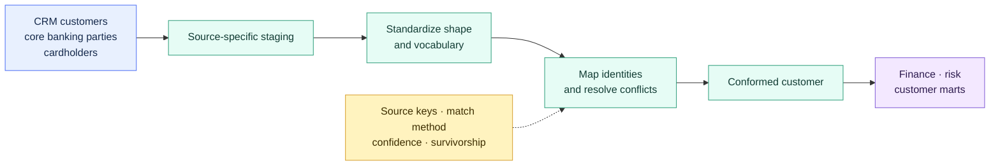

# Multi-source Conformed Models

> [!abstract] Mental model
> Conformance translates several source dialects into one governed business language without hiding lineage or uncertainty.

## Executive Summary

- **What it is:** A shared model whose grain, identifiers, values, and definitions are consistent across multiple sources.
- **Why it matters:** Consumers can analyze customers, accounts, instruments, or events without relearning every source convention.
- **Mental model:** Staging makes each source understandable; conformance makes the sources comparable.
- **Best used when:** Several systems represent the same business entity or process and cross-source reporting is valuable.
- **Avoid or reconsider when:** Identity and shared definitions are unowned or too uncertain to defend.

## What It Can Do

- Standardize names, types, statuses, dates, currencies, and classifications.
- Prevent overlapping source identifiers from colliding.
- Provide reusable entities and dimensions across marts.
- Apply explicit source-precedence and conflict rules.
- Preserve lineage back to each contributing source.

## What It Cannot Do

- Prove that two similar records represent the same real-world entity.
- Decide disputed business definitions without accountable owners.
- Turn genuinely different concepts into one valid concept.
- Replace master-data stewardship or manual resolution of ambiguous matches.
- Guarantee a golden record merely because sources were combined.

## Core Concepts

| Concept | Meaning | Why it matters |
|---|---|---|
| Common grain | Every row represents the same type of business object or event | Prevents accidental duplication and invalid comparisons |
| Canonical vocabulary | Source values are mapped into agreed shared values | Gives consumers consistent definitions |
| Identity crosswalk | Source identifiers are mapped to a conformed business key | Connects records without relying on unsafe ID equality |
| Source precedence | An explicit rule chooses between conflicting attributes | Makes the result explainable and governable |
| Conformed key | Stable analytical identifier built after identity rules are understood | Supports reliable joins across domains |
| Provenance | Source system, source key, timestamps, and matching method are retained | Enables reconciliation and auditability |
| Golden record | A claimed authoritative resolution of an entity | Requires stronger governance than ordinary analytical conformance |

## How It Works (Simple Flow)

1. Stage each source separately and preserve its original identifiers.
2. Declare the target business grain and shared definitions.
3. Standardize source-specific columns and values into a common shape.
4. Map source identities through a governed crosswalk or matching process.
5. Resolve conflicts with documented precedence rules; expose unresolved cases.
6. Build the conformed entity, dimension, or event model.
7. Test uniqueness, mapping integrity, accepted values, and reconciliation to every source.
8. Publish the model to marts while retaining provenance and ownership.

## Visuals



## Readable Snippets

### Protect source identity before resolution

```sql
select
    'crm' as source_system,
    customer_id as source_customer_id,
    {{ dbt_utils.generate_surrogate_key([
        "'crm'", 'customer_id'
    ]) }} as source_record_key,
    customer_name,
    country_code
from {{ ref('stg_crm__customers') }}
```

This prevents ID collisions. It does **not** prove that a CRM customer and a core-banking party are the same person; that requires an identity crosswalk or matching rule.

### Example identity crosswalk

| customer_key | source_system | source_customer_id | mapping_method |
|---|---|---|---|
| `100023` | CRM | `1842` | verified national ID |
| `100023` | CORE | `98411` | verified national ID |

## Consultant Talking Points

- **Client question this answers:** “How do we report consistently across systems that describe the same business?”
- **Trade-offs to mention:** More consistency requires agreed grains, mappings, precedence rules, and ongoing ownership.
- **Risk or governance angle:** Preserve unmatched records and conflicts; do not silently force uncertain matches.
- **Cost/performance angle:** Conform shared entities once and reuse them instead of repeating joins and mappings in every mart.
- **Important distinction:** A conformed analytical model is not automatically an operational master or golden record.

## Common Pitfalls

- Unioning sources because their columns look similar without confirming semantic equivalence.
- Joining directly on overlapping source IDs.
- Hiding precedence rules inside an unexplained `coalesce()`.
- Combining rows with different grains and creating duplication.
- Dropping source keys or provenance after conformance.
- Treating `unknown`, unmatched, and conflicting records as the same condition.
- Generating surrogate keys before resolving unstable or duplicate business identities.
- Allowing each downstream mart to invent its own mappings.

## When to Recommend What (Decision Table)

| Situation | Recommend | Why | Watch-outs |
|---|---|---|---|
| Same event type arrives from several systems | Standardize each source, then `union all` | Preserves every event at a shared grain | Deduplication and source overlap need explicit rules |
| Systems hold complementary attributes for one entity | Identity crosswalk, then controlled joins | Builds a reusable business view | Validate one-to-many relationships before joining |
| Source IDs overlap | Composite source key first | Prevents false matches | This is collision protection, not entity resolution |
| One source is authoritative per attribute | Documented precedence rules | Produces deterministic values | Ownership and effective dates must be explicit |
| Matches are ambiguous | Keep unmatched/conflicted outputs visible | Avoids invented certainty | Requires stewardship or downstream handling |
| Several facts share customer, account, or instrument context | Conformed dimension | Enables comparable cross-process analysis | Do not force distinct concepts together |
| Client needs an operational golden record | Evaluate MDM plus stewardship | Handles authoritative resolution workflows | dbt may supply analytics outputs but not the full operating process |

## Related Topics

- [[02 dbt/02 Modeling Patterns and Layering/Modeling Patterns and Layering Overview|Modeling Patterns and Layering Overview]]
- [[02 dbt/02 Modeling Patterns and Layering/11 Staging Models|Staging Models]]
- [[02 dbt/02 Modeling Patterns and Layering/12 Intermediate Models|Intermediate Models]]
- [[02 dbt/02 Modeling Patterns and Layering/13 Marts and Data Products|Marts and Data Products]]
- [[02 dbt/02 Modeling Patterns and Layering/14 Dimensional Modeling with dbt|Dimensional Modeling with dbt]]
- [[02 dbt/02 Modeling Patterns and Layering/15 Finance Modeling Patterns|Finance Modeling Patterns]]
- [[02 dbt/02 Modeling Patterns and Layering/20 Reconciliation Models|Reconciliation Models]]

## Related Decision Notes

- [[80 Comparisons and Decision Notes/Comparisons/Cross-Tool/Comparison - Conformed Analytical Models vs Master Data Management|Comparison - Conformed Analytical Models vs Master Data Management]]
- [[80 Comparisons and Decision Notes/Decision Notes/dbt/Decisions - Choosing the Right dbt Modeling Layer|Decisions - Choosing the Right dbt Modeling Layer]]
- [[80 Comparisons and Decision Notes/Comparisons/dbt/Comparison - Star Schema vs Wide Marts|Comparison - Star Schema vs Wide Marts]]

## Questions

- What exact business grain should the conformed model represent?
- Which source identifiers refer to the same real-world entity, and how is that proven?
- Which values are equivalent, and who approves the canonical mapping?
- Which source wins for each conflicting attribute, and from what effective date?
- How will unmatched, ambiguous, and conflicting records remain visible?
- What evidence reconciles the conformed model back to every source?
- Is the client asking for an analytical model or a governed golden record?

## Sources To Revisit

- [dbt Labs — How we structure our dbt projects](https://docs.getdbt.com/best-practices/how-we-structure/1-guide-overview)
- [dbt Labs — `source()`](https://docs.getdbt.com/reference/dbt-jinja-functions/source)
- [dbt Labs — `ref()`](https://docs.getdbt.com/reference/dbt-jinja-functions/ref)
- [dbt Labs — dbt-utils `generate_surrogate_key`](https://github.com/dbt-labs/dbt-utils#generate_surrogate_key-source)
