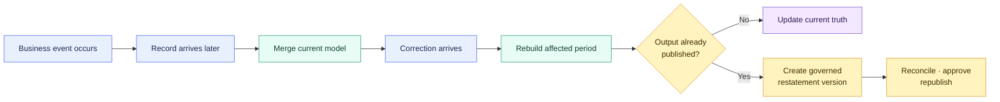

# Late-arriving Data, Corrections, and Restatements

> [!abstract] Mental model
> Separate when an event happened from when it arrived, then preserve both current truth and any governed reporting history.

## Executive Summary

- **What it is:** Patterns for processing old events that arrive late, correcting previously loaded records, and revising previously published results.
- **Why it matters:** Naive incremental filters can silently miss changes, while uncontrolled updates can erase financial reporting history.
- **Mental model:** Track when something happened, when the source changed it, when the warehouse learned it, and when it was published.
- **Best used when:** Sources are mutable, arrival delays occur, or closed-period outputs can be revised.
- **Avoid or reconsider when:** The source lacks reliable identity or change metadata and no reconciliation process exists.

## What It Can Do

- Capture new records whose business date is old.
- Update current-state models when previously loaded records change.
- Preserve observed history or immutable report versions.
- Reprocess only affected keys, dates, or partitions.
- Provide evidence for controlled finance restatements.

## What It Cannot Do

- Guarantee completeness from a short lookback window.
- Reconstruct changes that the warehouse never observed.
- Decide whether a correction may reopen a closed accounting period.
- Turn source freshness into proof that all expected records arrived.
- Make restatements auditable without ownership, approval, reconciliation, and publication controls.

## Core Concepts

| Concept | Meaning | Why it matters |
|---|---|---|
| Event or effective time | When the event happened or value became valid in the business | Determines the business period affected |
| Source update time | When the source says the record last changed | Can identify new and corrected records |
| Load or knowledge time | When the warehouse received the information | Shows when the organization could have known it |
| Late arrival | A newly received record with an older business time | Can fall behind event-date incremental filters |
| Correction | A changed value for an existing business event | Requires a stable key and explicit update/history behavior |
| Restatement | A controlled replacement or new version of a previously published result | Must preserve what was originally reported |
| Lookback window | Deliberate overlap that reprocesses recent source changes | Reduces risk but does not guarantee completeness |
| Reconciliation | Comparison against expected source records and totals | Detects changes outside processing assumptions |

## How It Works (Simple Flow)

1. Preserve business, source-update, load, processing, and publication timestamps where relevant.
2. Define a stable event key and decide whether the target stores current state, change history, or report versions.
3. Select new and changed source rows using reliable change metadata plus a deliberate overlap.
4. Merge current-state corrections or append immutable versions according to the declared model contract.
5. Rebuild affected keys, periods, or partitions when a correction changes downstream aggregates.
6. Reconcile against the authoritative source and detect records outside the expected delay window.
7. For restatements, retain the superseded publication and record reason, approval, version, and run lineage.
8. Monitor late-arrival age, correction volume, unresolved breaks, and downstream adoption of the correct version.

## Visuals



## Readable Snippets

### Current-state model with a lookback

```sql
{{
    config(
        materialized='incremental',
        incremental_strategy='merge',
        unique_key='transaction_id'
    )
}}

select *
from {{ ref('stg_payments__transactions') }}


where source_updated_at >= (
    select dateadd(day, -3, coalesce(max(source_updated_at), '1900-01-01'))
    from {{ this }}
)

```

The overlap reprocesses recent changes, and `unique_key` allows matched rows to be updated. A three-day window still misses changes older than three days unless another replay or reconciliation path catches them.

### Versioned publication

| reporting_period | report_version | published_at | status | amount |
|---|---:|---|---|---:|
| January | 1 | 5 February | superseded | 10,000 |
| January | 2 | 12 February | current | 12,000 |

This supports both “What is correct now?” and “What did we report on 5 February?”

## Consultant Talking Points

- **Client question this answers:** “How do we keep incremental pipelines correct when old data arrives or changes?”
- **Trade-offs to mention:** Wider reprocessing windows improve coverage but increase compute; narrow windows require stronger replay and reconciliation controls.
- **Risk or governance angle:** Closed-period restatements need reason codes, approvals, retained prior versions, and downstream communication.
- **Cost/performance angle:** Prefer targeted key or partition replay over automatic full refreshes when affected scope is known.
- **Important distinction:** dbt snapshots record changes from the time they begin observing a source; they cannot recreate unobserved history.

## Common Pitfalls

- Filtering only on `event_date > max(event_date)`.
- Treating a lookback window as a completeness guarantee.
- Using ingestion time as though it were business-effective time.
- Configuring `unique_key` without testing that it is stable, unique, and non-null.
- Updating closed-period outputs without retaining the prior publication.
- Treating corrections, cancellations, duplicates, and restatements as the same event.
- Assuming a fresh source is complete.
- Rebuilding everything when only a known period or key range changed.
- Recording historical versions without telling consumers which version to use.

## When to Recommend What (Decision Table)

| Situation | Recommend | Why | Watch-outs |
|---|---|---|---|
| Small, predictable delay | Lookback plus `merge` and a tested `unique_key` | Simple and cost-effective | Delays beyond the window remain possible |
| Reliable source change timestamp | Increment from that timestamp with overlap | Captures inserts and corrections | Confirm every source change updates the timestamp |
| Affected keys or periods are identifiable | Targeted replay or partition rebuild | Limits compute while recalculating dependencies | Track replay scope and completion |
| Delay is long or unpredictable | Incremental processing plus scheduled reconciliation/backfill | Balances normal-run efficiency with completeness | Define tolerances and ownership for breaks |
| Only latest operational state matters | Current-state incremental model | Easy for consumers | Prior values are not available from this model |
| Observed row history matters | Snapshot or explicit SCD2 history | Supports point-in-time analysis | Snapshots cannot reconstruct pre-observation history |
| Published finance result changes | Immutable report versions and governed restatement | Preserves as-reported and current truth | Approval, lineage, reconciliation, and consumer cutover are required |
| Dimension arrives after its fact | Unknown member or exception queue, then controlled backfill | Keeps the fact without inventing context | Monitor and resolve unmatched relationships |

## Related Topics

- [[02 dbt/02 Modeling Patterns and Layering/Modeling Patterns and Layering Overview|Modeling Patterns and Layering Overview]]
- [[02 dbt/01 Core Concepts and Project Structure/07 Sources and Source Freshness|Sources and Source Freshness]]
- [[02 dbt/01 Core Concepts and Project Structure/09 Snapshots and Historical Change Tracking|Snapshots and Historical Change Tracking]]
- [[02 dbt/02 Modeling Patterns and Layering/14 Dimensional Modeling with dbt|Dimensional Modeling with dbt]]
- [[02 dbt/02 Modeling Patterns and Layering/15 Finance Modeling Patterns|Finance Modeling Patterns]]
- [[02 dbt/02 Modeling Patterns and Layering/20 Reconciliation Models|Reconciliation Models]]
- [[02 dbt/04 Incremental Processing and Performance/31 Incremental Models and Unique Keys|Incremental Models and Unique Keys]]
- [[02 dbt/04 Incremental Processing and Performance/39 Full Refreshes Backfills and Replay|Full Refreshes Backfills and Replay]]

## Related Decision Notes

- [[80 Comparisons and Decision Notes/Decision Notes/dbt/Decisions - Choosing a Data History and Restatement Pattern|Decisions - Choosing a Data History and Restatement Pattern]]
- [[80 Comparisons and Decision Notes/Comparisons/dbt/Comparison - Snapshots vs Incremental Models|Comparison - Snapshots vs Incremental Models]]

## Questions

- Which timestamps represent business time, source change time, warehouse knowledge, and publication?
- How late can records or corrections arrive, and how is that distribution measured?
- Does each correction update a reliable timestamp and retain a stable event key?
- Should the model expose current truth, observed history, as-reported versions, or more than one?
- Which keys, periods, or partitions must be rebuilt after a correction?
- What reconciliation detects changes outside the normal processing window?
- Who may approve a restatement, and how are downstream consumers moved to the new version?

## Sources To Revisit

- [dbt Labs — Configure incremental models](https://docs.getdbt.com/docs/build/incremental-models)
- [dbt Labs — Incremental strategies](https://docs.getdbt.com/docs/build/incremental-strategy)
- [dbt Labs — Snapshots](https://docs.getdbt.com/docs/build/snapshots)
- [dbt Labs — Source freshness](https://docs.getdbt.com/docs/deploy/source-freshness)
