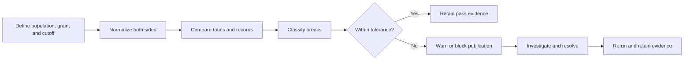

# Reconciliation Models

> Reconciliation models turn “the numbers should agree” into queryable breaks, thresholds, ownership, and durable control evidence.

## Executive Summary

- **What it is:** A model that compares two populations and explains whether their records, counts, balances, or amounts agree.
- **Why it matters:** A successful dbt run proves that SQL executed—not that finance, risk, or regulatory numbers are complete and correct.
- **Mental model:** Expected value minus actual value equals a reconciliation difference, or **break**.
- **Best used when:** Data crosses systems, grains, transformation layers, reporting cutoffs, or controlled publication boundaries.
- **Avoid or reconsider when:** The populations, grain, cutoffs, identity, tolerance, or break owner have not been defined.

## What It Can Do

- Detect missing, extra, duplicated, and mismatched records.
- Compare counts, amounts, balances, or other control totals.
- Classify breaks so they can be investigated and assigned.
- Feed dbt tests, alerts, dashboards, or publication gates.
- Preserve evidence of what passed or failed for each controlled run.

## What It Cannot Do

- Make differently scoped populations comparable without normalization.
- Prove correctness from matching grand totals alone.
- Decide acceptable materiality or tolerance without business ownership.
- Resolve breaks automatically when the source or policy is wrong.
- Replace an operational process for escalation, approval, and remediation.

## Core Concepts

| Concept | Meaning | Why it matters |
|---|---|---|
| Reconciliation contract | Agreed population, grain, identity, cutoff, measures, tolerance, and owner | Defines what “agrees” actually means |
| Control grain | Lowest meaningful level at which values must balance | Prevents offsetting errors from disappearing in a grand total |
| Aggregate reconciliation | Compares counts, sums, balances, or other totals | Fast signal for monitoring |
| Record-level reconciliation | Compares individual records by a stable key | Identifies the records causing a break |
| Break classification | Labels such as missing, extra, duplicate, mismatch, timing, or approved adjustment | Makes failures actionable |
| Tolerance | Approved absolute, relative, count, time, or materiality threshold | Separates acceptable noise from failure |
| Control evidence | Run metadata, cutoffs, totals, breaks, status, and approval retained over time | Supports audit and historical explanation |
| Resolution SLA | Owner, deadline, and escalation for unresolved breaks | Prevents warnings from becoming permanent exceptions |

## How It Works (Simple Flow)

1. Define comparable populations, cutoffs, grain, identity, measures, and ownership.
2. Normalize signs, currencies, precision, timezones, statuses, and other agreed semantics.
3. Compare aggregate control totals at the lowest meaningful control grain.
4. Compare records where needed and classify missing, extra, duplicate, and mismatched rows.
5. Apply explicit tolerances without hiding the underlying break amount or records.
6. Record pass, warning, or failure with run and publication metadata.
7. Alert, block, or publish according to the control policy.
8. Investigate, resolve, rerun, and retain the final evidence.

## Visuals



## Readable Snippets

### Record-level break model

```sql
with source_data as (
    select transaction_id, amount
    from {{ ref('stg_payments__transactions') }}
),

target_data as (
    select transaction_id, amount
    from {{ ref('fct_payments') }}
)

select
    coalesce(s.transaction_id, t.transaction_id) as transaction_id,
    s.amount as source_amount,
    t.amount as target_amount,
    case
        when s.transaction_id is null then 'only_in_target'
        when t.transaction_id is null then 'only_in_source'
        when abs(s.amount - t.amount) > 0.01 then 'value_mismatch'
        else 'matched'
    end as reconciliation_status
from source_data s
full outer join target_data t
    on s.transaction_id = t.transaction_id
```

The `full outer join` exposes records missing from either side. Test both inputs for unique keys first so duplicates do not multiply amounts during comparison.

### Useful evidence fields

```text
reconciliation_name    reporting_period      source_cutoff_at
target_cutoff_at       source_amount         target_amount
difference_amount      tolerance_amount      break_count
status                 dbt_invocation_id     executed_at
approved_by            resolution_status
```

## Consultant Talking Points

- **Client question this answers:** “How can we prove that the transformed numbers tie back to an approved source?”
- **Trade-offs to mention:** Aggregate controls are cheaper; record-level controls provide better diagnosis. Important pipelines usually need both.
- **Risk or governance angle:** Tolerances, blocking thresholds, exceptions, owners, SLAs, evidence retention, and approval must be explicit.
- **Cost/performance angle:** Compare at the necessary grain and scope; persist detailed breaks when useful rather than rescanning all history for every investigation.
- **Important distinction:** A reconciliation model explains evidence; a dbt data test can consume that evidence and turn unacceptable breaks into a failed build.

## Common Pitfalls

- Comparing different populations, business cutoffs, currencies, or status scopes.
- Reconciling only grand totals and missing offsetting errors.
- Using row counts as the only evidence.
- Joining on non-unique keys and multiplying amounts.
- Rounding or applying tolerance before exposing the true difference.
- Keeping only pass/fail status and discarding actionable break records.
- Overwriting earlier reconciliation or publication evidence.
- Creating warnings without an owner, resolution deadline, or escalation path.
- Allowing unexplained material breaks because the pipeline technically succeeded.

## When to Recommend What (Decision Table)

| Situation | Recommend | Why | Watch-outs |
|---|---|---|---|
| Daily completeness monitoring | Aggregate counts and control totals | Cheap early warning | Matching totals can hide offsetting errors |
| A detected break needs diagnosis | Record-level comparison and classification | Identifies missing and mismatched records | Requires stable, unique keys and aligned grain |
| Migration from legacy SQL to dbt | Aggregate plus row-level parity comparison | Proves equivalence and explains differences | Classify intended changes separately from regressions |
| Repeated relation comparisons | Evaluate `audit_helper` | Provides reusable audit macros | Review maintenance, compatibility, security, and version pinning |
| Small expected technical variance | Explicit approved tolerance | Avoids false failures | Retain raw difference and avoid blanket materiality |
| Finance or regulatory publication | Durable run evidence plus blocking thresholds | Protects a controlled release | Define approvals, reruns, restatements, and override policy |
| Timing differences are expected | Warning with owner and SLA | Allows normal operational delay | Escalate overdue or growing breaks |
| Incorrect publication is worse than delay | Blocking reconciliation test or gate | Stops unsafe consumer exposure | Ensure incident ownership and a recovery path |

## Related Topics

- [[02 dbt/02 Modeling Patterns and Layering/Modeling Patterns and Layering Overview|Modeling Patterns and Layering Overview]]
- [[02 dbt/02 Modeling Patterns and Layering/13 Marts and Data Products|Marts and Data Products]]
- [[02 dbt/02 Modeling Patterns and Layering/15 Finance Modeling Patterns|Finance Modeling Patterns]]
- [[02 dbt/02 Modeling Patterns and Layering/17 Refactoring Legacy SQL into dbt|Refactoring Legacy SQL into dbt]]
- [[02 dbt/02 Modeling Patterns and Layering/18 Multi-source Conformed Models|Multi-source Conformed Models]]
- [[02 dbt/02 Modeling Patterns and Layering/19 Late-arriving Data Corrections and Restatements|Late-arriving Data, Corrections, and Restatements]]
- [[02 dbt/03 Testing Documentation and Data Quality/28 Audit and Migration Validation|Audit and Migration Validation]]
- [[02 dbt/07 Packages Macros and Advanced Reuse/62 Must-Have Utility Packages|Must-Have Utility Packages]]

## Related Decision Notes

- [[80 Comparisons and Decision Notes/Decision Notes/dbt/Decisions - Choosing the Right dbt Modeling Layer|Decisions - Choosing the Right dbt Modeling Layer]]

## Questions

- What exact population, business cutoff, and grain should reconcile?
- Which key reliably identifies the same record on both sides?
- Which counts, balances, amounts, and classifications must agree?
- Could errors offset at a higher aggregation level?
- Which differences are expected, and who approved the tolerance?
- Which breaks warn, which block publication, and which require approval?
- Who investigates unresolved breaks, within what SLA?
- How long must reconciliation results and publication evidence be retained?

## Sources To Revisit

- [dbt Labs — Data tests](https://docs.getdbt.com/docs/build/data-tests)
- [dbt Labs — Data test configurations](https://docs.getdbt.com/reference/resource-configs/severity)
- [dbt Labs — Store data test failures](https://docs.getdbt.com/reference/resource-configs/store_failures)
- [dbt Labs — audit_helper](https://github.com/dbt-labs/dbt-audit-helper)
