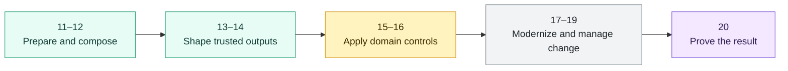

# Modeling Patterns and Layering Overview

> How dbt projects shape raw source data into reliable analytical models, marts, and finance-ready data products.

> [!abstract] Chapter outcome
> You should be able to design a layered dbt model, declare grain and ownership, and explain how controlled data products handle conformance, corrections, and reconciliation.

## Topics

- [[02 dbt/02 Modeling Patterns and Layering/11 Staging Models|11 - Staging Models]]
- [[02 dbt/02 Modeling Patterns and Layering/12 Intermediate Models|12 - Intermediate Models]]
- [[02 dbt/02 Modeling Patterns and Layering/13 Marts and Data Products|13 - Marts and Data Products]]
- [[02 dbt/02 Modeling Patterns and Layering/14 Dimensional Modeling with dbt|14 - Dimensional Modeling with dbt]]
- [[02 dbt/02 Modeling Patterns and Layering/15 Finance Modeling Patterns|15 - Finance Modeling Patterns]]
- [[02 dbt/02 Modeling Patterns and Layering/16 Naming Conventions and Folder Design|16 - Naming Conventions and Folder Design]]
- [[02 dbt/02 Modeling Patterns and Layering/17 Refactoring Legacy SQL into dbt|17 - Refactoring Legacy SQL into dbt]]
- [[02 dbt/02 Modeling Patterns and Layering/18 Multi-source Conformed Models|18 - Multi-source Conformed Models]]
- [[02 dbt/02 Modeling Patterns and Layering/19 Late-arriving Data Corrections and Restatements|19 - Late-arriving Data, Corrections, and Restatements]]
- [[02 dbt/02 Modeling Patterns and Layering/20 Reconciliation Models|20 - Reconciliation Models]]

## Chapter Map

## Topic Summaries

| Topic | What it unlocks |
|---|---|
| [[02 dbt/02 Modeling Patterns and Layering/11 Staging Models\|11 - Staging Models]] | Standardizes raw data into clean, typed, source-aligned building blocks. |
| [[02 dbt/02 Modeling Patterns and Layering/12 Intermediate Models\|12 - Intermediate Models]] | Isolates reusable joins and business logic without exposing every step to consumers. |
| [[02 dbt/02 Modeling Patterns and Layering/13 Marts and Data Products\|13 - Marts and Data Products]] | Turns modeled data into trusted outputs with clear ownership and service expectations. |
| [[02 dbt/02 Modeling Patterns and Layering/14 Dimensional Modeling with dbt\|14 - Dimensional Modeling with dbt]] | Establishes facts, dimensions, grain, keys, and reusable analytical context. |
| [[02 dbt/02 Modeling Patterns and Layering/15 Finance Modeling Patterns\|15 - Finance Modeling Patterns]] | Connects financial events, states, reference data, valuation, and controls. |
| [[02 dbt/02 Modeling Patterns and Layering/16 Naming Conventions and Folder Design\|16 - Naming Conventions and Folder Design]] | Makes project structure communicate purpose, ownership, and configuration. |
| [[02 dbt/02 Modeling Patterns and Layering/17 Refactoring Legacy SQL into dbt\|17 - Refactoring Legacy SQL into dbt]] | Provides a controlled path from opaque SQL estates to modular dbt models. |
| [[02 dbt/02 Modeling Patterns and Layering/18 Multi-source Conformed Models\|18 - Multi-source Conformed Models]] | Combines source systems into governed entities while preserving traceability. |
| [[02 dbt/02 Modeling Patterns and Layering/19 Late-arriving Data Corrections and Restatements\|19 - Late-arriving Data, Corrections, and Restatements]] | Handles delayed facts and backdated change without losing reporting history. |
| [[02 dbt/02 Modeling Patterns and Layering/20 Reconciliation Models\|20 - Reconciliation Models]] | Makes agreement, breaks, thresholds, and evidence queryable and operational. |

## How To Use This Area

Follow the topics in order for a first pass. Later, use the table as a quick reference and jump directly to the modeling decision you need.

The global [[02 dbt/dbt Learning Map|dbt Learning Map]] links here, and each topic links back to this hub so Graph View stays readable.

## Related Areas

- [[02 dbt/dbt Learning Map|dbt Learning Map]]
- [[02 dbt/01 Core Concepts and Project Structure/Core Concepts and Project Structure Overview|Previous: Core Concepts and Project Structure]]
- [[02 dbt/03 Testing Documentation and Data Quality/Testing Documentation and Data Quality Overview|Next: Testing Documentation and Data Quality]]
