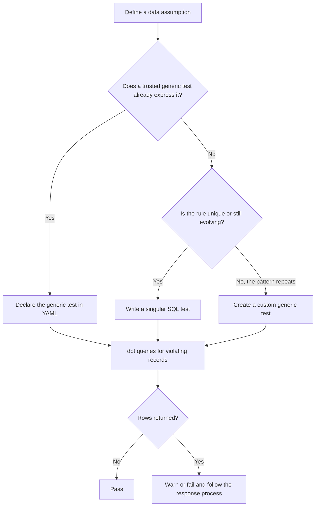

# Generic, Singular, and Custom Data Tests

> dbt data tests turn quality rules into SQL queries that return the records violating an assertion.

## Executive Summary

- **What it is:** Data tests validate models, sources, seeds, and snapshots by querying for records that break an expected rule.
- **Why it matters:** They make important data assumptions executable, repeatable, and visible in the dbt project instead of leaving them as undocumented knowledge.
- **Mental model:** A data test is an **anti-query**: write SQL that finds the bad records. Zero returned rows means the test passes.
- **Best used when:** A technical or business rule can be expressed as a repeatable SQL assertion and its failure has a defined response.
- **Avoid or reconsider when:** The rule should prevent invalid writes, needs controlled test inputs, measures freshness, or has no owner or operational response. Use constraints, unit tests, freshness checks, or broader controls as appropriate.

## What It Can Do

- Validate key assumptions such as uniqueness, non-null values, accepted domains, and referential integrity.
- Express specific business controls such as ledger reconciliation or invalid lifecycle combinations.
- Reuse organization-specific rules through custom generic tests.
- Run against models, sources, seeds, and snapshots as part of development and production workflows.
- Return or store failing records for diagnosis and audit support.
- Warn or fail based on configured severity and failure thresholds.

## What It Cannot Do

- Prevent invalid records from entering the warehouse by itself.
- Guarantee that a database constraint is enforced; for example, `relationships` detects unmatched keys after querying the data.
- Prove transformation logic is correct for controlled edge cases; that is the role of [[02 dbt/03 Testing Documentation and Data Quality/22 Unit Tests for SQL Logic|unit tests]].
- Prove that upstream data arrived on time; use source freshness and SLA monitoring.
- Correct bad data or decide who must respond to a failure.
- Replace ownership, alerting, incident handling, reconciliation sign-off, or retained control evidence.

## Core Concepts

| Concept | Meaning | Why it matters |
|---|---|---|
| Failing-record query | The test query returns records that violate the assertion | Zero rows means pass; returned rows mean warn or fail |
| Generic data test | A reusable, parameterized test invoked from YAML | Provides consistent rules across many resources and columns |
| Built-in generic test | One of dbt's `unique`, `not_null`, `accepted_values`, or `relationships` tests | Covers common structural assumptions with little custom code |
| Package test | A generic test supplied by a package such as `dbt_utils` | Can avoid custom maintenance, but adds dependency and governance considerations |
| Singular data test | One SQL file containing one specific assertion | Fits unique, multi-table, or complex business rules |
| Custom generic test | A reusable generic test defined by the team using a `` block | Standardizes a recurring organization-specific rule |
| Data test vs unit test | Data tests inspect actual built data; unit tests exercise model logic against controlled inputs | They answer different quality questions and should complement each other |
| Severity and threshold | Configuration determines whether and when returned failures warn or error | Turns detection into appropriate operational behavior |

## How It Works (Simple Flow)

1. Identify a meaningful assumption, such as "`order_id` is unique" or "payments reconcile to orders."
2. Choose a built-in or package generic test when the pattern already exists.
3. Write a singular SQL test when the assertion is specific, complex, or still evolving.
4. Promote repeated singular patterns into a custom generic test only when reuse is genuine.
5. dbt compiles the test into a `select` query that searches for violating records.
6. dbt executes the query when selected through `dbt test` or a build workflow.
7. Zero returned rows passes; returned rows warn or fail according to configuration.
8. The team investigates, contains, remediates, and retains evidence according to the rule's operational importance.

## Visuals



## Readable Snippets

### Built-in generic tests

```yaml
models:
  - name: orders
    columns:
      - name: order_id
        data_tests:
          - unique
          - not_null

      - name: status
        data_tests:
          - accepted_values:
              arguments:
                values: [placed, shipped, completed, returned]

      - name: customer_id
        data_tests:
          - relationships:
              arguments:
                to: ref('customers')
                field: customer_id
```

`data_tests:` is the clearer modern name. The older `tests:` key remains supported as an alias, but do not use both keys on the same resource.

### Singular reconciliation test

Store a one-off assertion such as this in `tests/assert_order_payment_reconciliation.sql`. The file is the test and should not be declared as a generic test in model YAML.

```sql
select
    o.order_id,
    o.paid_amount,
    sum(p.amount) as calculated_payment_amount
from {{ ref('fct_orders') }} as o
left join {{ ref('fct_payments') }} as p
    on o.order_id = p.order_id
group by
    o.order_id,
    o.paid_amount
having o.paid_amount != sum(p.amount)
```

Only non-reconciling orders are returned, so zero rows means the rule holds.

### Custom generic test

Define a repeated organization-specific rule under `tests/generic/` or `macros/`:

```sql


select *
from {{ model }}
where {{ column_name }} < {{ minimum }}
   or {{ column_name }} > {{ maximum }}


```

Invoke it like any other generic test:

```yaml
columns:
  - name: credit_score
    data_tests:
      - between_values:
          arguments:
            minimum: 300
            maximum: 850
```

## Consultant Talking Points

- **Client question this answers:** "How do we turn our data-quality expectations into repeatable controls inside dbt?"
- **Trade-offs to mention:** Generic tests are consistent and easy to scale, singular tests express richer business rules, and custom generic tests reduce duplication but create shared code that needs ownership.
- **Risk or governance angle:** A test becomes a meaningful control only when the rule, owner, severity, alert route, remediation process, and evidence retention are defined. Stored failures may contain sensitive data and need governed access and retention.
- **Cost/performance angle:** Every test invocation becomes a warehouse query. Large uniqueness checks, reconciliations, and broadly applied generic tests can scan or aggregate substantial Snowflake data, so test placement and frequency should reflect risk.

A useful client message is: **tests detect exceptions; the surrounding operating model determines what happens next.**

## Common Pitfalls

- Writing SQL that returns valid records rather than the records that disprove the assertion.
- Creating a custom generic test before checking built-in tests or trusted packages.
- Generalizing every one-off business rule immediately, creating awkward abstractions and unclear arguments.
- Copying the same singular test repeatedly instead of promoting a proven pattern to a custom generic test.
- Treating `relationships` as an enforced foreign key rather than a detection query.
- Testing only structural rules while omitting important business reconciliations and lifecycle rules.
- Applying expensive full-table tests everywhere without considering Snowflake warehouse cost and runtime.
- Configuring permanent warnings that nobody owns or investigates.
- Storing sensitive failing records in an inadequately secured test-audit schema.
- Changing a shared custom generic test without assessing every model that depends on it.

## When to Recommend What (Decision Table)

| Situation | Recommend | Why | Watch-outs |
|---|---|---|---|
| Primary key must be reliable | Built-in `unique` and `not_null` | Direct, familiar, and visible in YAML | Large uniqueness checks may be expensive |
| Status must use an approved code | Built-in `accepted_values` | Clearly documents the allowed domain | Decide how new legitimate values are introduced |
| Child keys should match a parent model | Built-in `relationships` | Provides a reusable referential-integrity check | Detects rather than enforces; define handling for late-arriving data |
| One model requires a complex financial reconciliation | Singular test | Keeps a specific multi-table business rule explicit | Give it a clear name, owner, severity, and evidence process |
| The same rule recurs across many models | Custom generic test | Centralizes logic and standardizes behavior | Design stable arguments and test the shared implementation |
| A mature package already provides the rule | Package generic test | Avoids unnecessary custom code | Review maintenance, license, version pinning, compatibility, and support ownership |
| The business rule is still changing | Singular test first | Keeps experimentation readable before abstraction | Revisit when duplication becomes real |
| The rule must stop invalid data at write time | Warehouse constraint or ingestion control, plus dbt testing where useful | Enforcement belongs closer to the write path | Snowflake constraint enforcement varies by constraint type |
| Model SQL must be proven against edge-case inputs | Unit test | Tests transformation logic deterministically | This does not validate the quality of actual production data |
| Material banking or regulatory control | Test plus operational control design | Connects detection to accountability and evidence | SQL alone is not a complete control |

## Related Topics

- [[02 dbt/03 Testing Documentation and Data Quality/Testing Documentation and Data Quality Overview|Testing Documentation and Data Quality Overview]]
- [[02 dbt/03 Testing Documentation and Data Quality/22 Unit Tests for SQL Logic|Unit Tests for SQL Logic]]
- [[02 dbt/03 Testing Documentation and Data Quality/27 Test Severity and Failure Handling|Test Severity and Failure Handling]]
- [[02 dbt/03 Testing Documentation and Data Quality/29 Data Quality Strategy in Regulated Environments|Data Quality Strategy in Regulated Environments]]
- [[02 dbt/07 Packages Macros and Advanced Reuse/69 Custom Generic Tests|Custom Generic Tests]]

## Related Decision Notes

- [[80 Comparisons and Decision Notes/Decision Notes/dbt/Decisions - Choosing the Right dbt Quality Control|Decisions - Choosing the Right dbt Quality Control]]
- [[80 Comparisons and Decision Notes/Comparisons/dbt/Comparison - Model Contracts vs Data Tests vs Warehouse Constraints|Comparison - Model Contracts vs Data Tests vs Warehouse Constraints]]

## Questions

- Which quality rules should block publication, and which should only warn?
- Which singular tests have repeated enough to justify a custom generic test?
- Who owns each material test failure and what response time is expected?
- Should failing records be stored, and how should sensitive failures be secured and retained?
- Which tests should run in development, CI, production, or only on a scheduled control cycle?

## Sources To Revisit

- [dbt Developer Hub - Add data tests to your DAG](https://docs.getdbt.com/docs/build/data-tests)
- [dbt Developer Hub - Writing custom generic data tests](https://docs.getdbt.com/best-practices/writing-custom-generic-tests)
- [dbt Developer Hub - Data test properties](https://docs.getdbt.com/reference/resource-properties/data-tests)
