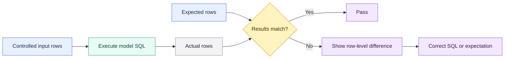

# Unit Tests for SQL Logic

> [!abstract] Mental model
> A dbt unit test asks: given controlled inputs, does this model SQL produce exactly the expected rows?

## Executive Summary

- **What it is:** A unit test replaces a model's upstream inputs with small static fixtures, executes the model SQL, and compares the result with expected rows.
- **Why it matters:** It catches errors in transformation logic before a full production build and makes boundary cases, bug regressions, and critical calculations reviewable in code.
- **Mental model:** **Given** controlled inputs, **when** the model SQL runs, **then** its output must equal the expected result.
- **Best used when:** SQL contains business-specific `case` logic, thresholds, joins, date calculations, regex, window functions, null handling, incremental branches, or previously reported bugs.
- **Avoid or reconsider when:** The test merely proves a warehouse built-in works, needs to inspect real production data, or duplicates simple SQL without covering a meaningful risk.

## What It Can Do

- Validate SQL model behavior against deliberately constructed input rows.
- Exercise boundary values and exceptions that may not yet exist in production data.
- Protect complex or critical models during refactoring.
- Reproduce a reported bug as a permanent regression test.
- Support test-driven development by defining expected behavior before or alongside implementation.
- Test full-refresh and incremental SQL branches using overrides.
- Run quickly in development and CI using small fixtures rather than full production datasets.

## What It Cannot Do

- Validate the quality of actual production records; use [[02 dbt/03 Testing Documentation and Data Quality/21 Generic Singular and Custom Data Tests|data tests]] for that.
- Prove upstream data arrived on time or completely.
- Prove the model performs acceptably at production scale.
- Replace end-to-end reconciliation, integration testing, or user acceptance testing.
- Prove that dbt physically inserted or merged an incremental batch correctly; it tests the model's proposed output batch.
- Cover SQL models outside the current project or every model/materialization pattern supported by dbt.
- Replace ownership, code review, CI enforcement, change approval, or retained control evidence.

## Core Concepts

| Concept | Meaning | Why it matters |
|---|---|---|
| Unit under test | One SQL model in the current dbt project | Keeps the test focused on transformation logic owned by the project |
| `given` | Mock rows supplied for every `ref()` and `source()` used by the model | Makes inputs deterministic and independent of production data values |
| Fixture | Static input or expected data expressed as `dict`, `csv`, or `sql` | Small fixtures make edge cases readable and repeatable |
| `expect` | Rows the model should produce from the fixture inputs | dbt compares actual and expected results and shows differences |
| Boundary case | Value immediately below, at, or above a threshold | Finds `<` versus `<=`, ordering, and truncation defects |
| Regression test | A test reproducing a previously observed defect | Prevents the same bug from silently returning |
| Data test | A failing-record query against actual built data | Complements unit testing by checking real datasets rather than controlled examples |
| Override | A test-specific macro, variable, or environment-value replacement | Enables branches such as `is_incremental()` to be tested deliberately |

## How It Works (Simple Flow)

1. Select a model with business-specific or failure-prone SQL logic.
2. Identify its important normal, boundary, null, and exception cases.
3. Declare the unit test in YAML under a configured model path, normally `models/`.
4. Supply small mock inputs for every `ref()` and `source()` used by the model.
5. State the expected output rows explicitly.
6. dbt substitutes the fixtures for the upstream inputs and executes the model SQL.
7. dbt compares actual and expected rows; a difference fails the test and displays the mismatch.
8. Run the test in development and CI so incorrect logic is caught before full materialization or deployment.

## Visuals



## Readable Snippets

### Model logic to test

```sql
-- models/marts/dim_loan_applications.sql

with applications as (

    select *
    from {{ ref('stg_loan_applications') }}

)

select
    application_id,
    case
        when credit_score is null then 'manual_review'
        when credit_score < 580 then 'high_risk'
        when credit_score < 670 then 'medium_risk'
        else 'standard'
    end as risk_band
from applications
```

### Boundary-focused unit test

Define unit-test YAML under `models/`, not under the `tests/` directory used for data-test SQL.

```yaml
unit_tests:
  - name: test_loan_application_risk_boundaries
    description: Verify credit-score boundary classifications
    model: dim_loan_applications

    given:
      - input: ref('stg_loan_applications')
        rows:
          - {application_id: 1, credit_score: null}
          - {application_id: 2, credit_score: 579}
          - {application_id: 3, credit_score: 580}
          - {application_id: 4, credit_score: 669}
          - {application_id: 5, credit_score: 670}

    expect:
      rows:
        - {application_id: 1, risk_band: manual_review}
        - {application_id: 2, risk_band: high_risk}
        - {application_id: 3, risk_band: medium_risk}
        - {application_id: 4, risk_band: medium_risk}
        - {application_id: 5, risk_band: standard}
```

This fixture attacks the decision boundaries. A change from `< 580` to `<= 580` would incorrectly classify score `580` and fail the test.

### Useful commands

```bash
# Run only unit tests
dbt test --select "test_type:unit"

# Run unit tests for one model
dbt test --select "dim_loan_applications,test_type:unit"

# Run one named unit test
dbt test --select test_loan_application_risk_boundaries

# Create empty parents when relations must exist but full data is unnecessary
dbt run --select "stg_loan_applications" --empty
```

## Consultant Talking Points

- **Client question this answers:** "How can we prove important transformation logic before running it against full production data?"
- **Trade-offs to mention:** Unit tests provide fast, deterministic feedback but add fixtures that must be maintained as model interfaces and business rules change.
- **Risk or governance angle:** Tests for material calculations should trace to an approved rule, cover explicit boundary cases, run as mandatory CI checks, and retain results where control evidence is required.
- **Cost/performance angle:** Small fixtures are cheaper than full builds, so unit tests fit development and CI. dbt recommends avoiding repeated production execution because static fixtures do not gain value from another production run.

A useful client message is: **unit tests prove what the SQL does for known cases; data tests tell us what is happening in the actual data.**

## Common Pitfalls

- Confusing unit tests with data tests and expecting fixtures to reveal production-data anomalies.
- Testing only happy-path values instead of nulls, boundaries, invalid inputs, and previously observed defects.
- Creating large fixtures that are difficult to understand and brittle to maintain.
- Reproducing the model's calculation inside the test rather than writing explicit expected outcomes, allowing the same mistake to exist twice.
- Omitting a `given` input for a `ref()` or `source()` used by the model.
- Placing unit-test YAML under `tests/` instead of under a configured model path.
- Failing to alias table names when unit testing join logic.
- Unit-testing trivial warehouse functions instead of the business logic built around them.
- Running static unit tests in production on every schedule without a clear reason, wasting compute.
- Treating passing unit tests as proof that the production data is complete, reconciled, fresh, or operationally correct.
- For incremental models, expecting the final post-merge table rather than the rows the model proposes to insert or merge.

## When to Recommend What (Decision Table)

| Situation | Recommend | Why | Watch-outs |
|---|---|---|---|
| Complex `case`, regex, date, join, or window logic | Unit test | Controlled rows expose logic defects before full materialization | Choose cases that attack the risky logic |
| Threshold-based risk or regulatory classification | Unit test with below/at/above boundaries | Makes policy boundaries explicit and reviewable | Trace expected results to an approved rule |
| Previously reported transformation bug | Regression unit test | Prevents the same defect from returning | Reproduce the smallest input that triggers the bug |
| Large refactor of critical SQL | Unit tests before and after refactoring | Protects intended behavior while implementation changes | Existing tests must be trustworthy and sufficiently broad |
| Primary key, accepted values, or relationships in actual data | Data test | The question concerns real dataset quality | Configure severity and operational ownership |
| Source arrived late or incompletely | Freshness or ingestion monitoring | Static fixtures cannot observe delivery state | Align thresholds with SLAs and response processes |
| Need proof that two production datasets reconcile | Singular data test or audit comparison | Requires actual result sets, not mocked inputs | Consider cost, tolerances, evidence, and sensitive failures |
| Need confidence under production data volume | Performance and integration testing | Unit fixtures do not represent scale | Use representative environments and warehouse sizing |
| Simple use of a trusted warehouse aggregate | Usually no unit test | Testing Snowflake's implementation adds little value | Test any surrounding custom business behavior instead |

## Related Topics

- [[02 dbt/03 Testing Documentation and Data Quality/Testing Documentation and Data Quality Overview|Testing Documentation and Data Quality Overview]]
- [[02 dbt/03 Testing Documentation and Data Quality/21 Generic Singular and Custom Data Tests|Generic, Singular, and Custom Data Tests]]
- [[02 dbt/03 Testing Documentation and Data Quality/28 Audit and Migration Validation|Audit and Migration Validation]]
- [[02 dbt/04 Incremental Processing and Performance/31 Incremental Models and Unique Keys|Incremental Models and Unique Keys]]
- [[02 dbt/05 Deployment CI CD and Operations/42 CI Jobs and Slim CI|CI Jobs and Slim CI]]

## Related Decision Notes

- [[80 Comparisons and Decision Notes/Decision Notes/dbt/Decisions - Choosing the Right dbt Quality Control|Decisions - Choosing the Right dbt Quality Control]]

## Questions

- Which models contain the most consequential or failure-prone custom SQL logic?
- Which boundaries, null cases, and invalid values are missing from current coverage?
- Which previous production defects should become permanent regression tests?
- Should unit-test success be mandatory before a pull request can merge?
- What execution evidence must be retained for regulated calculations?
- Which incremental models need separate full-refresh and incremental-mode tests?

## Sources To Revisit

- [dbt Developer Hub - Unit tests](https://docs.getdbt.com/docs/build/unit-tests)
- [dbt Developer Hub - Unit test properties](https://docs.getdbt.com/reference/resource-properties/unit-tests)
- [dbt Developer Hub - Unit test inputs](https://docs.getdbt.com/reference/resource-properties/unit-test-input)
- [dbt Developer Hub - Unit test data formats](https://docs.getdbt.com/reference/resource-properties/data-formats)
- [dbt Developer Hub - Unit test overrides](https://docs.getdbt.com/reference/resource-properties/unit-test-overrides)
