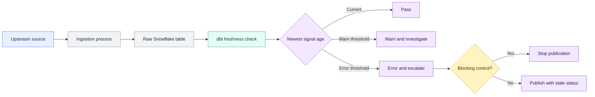
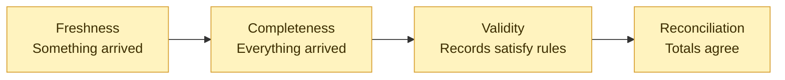

# Source Freshness and SLA Monitoring

> [!abstract] Mental model
> Freshness is the sensor; the SLA process supplies ownership, alerting, gating, recovery, and evidence around it.

## Executive Summary

- **What it is:** dbt source freshness compares the latest configured source timestamp with the check time and evaluates `warn_after` and `error_after` thresholds.
- **Why it matters:** A dbt job can succeed while rebuilding models from stale upstream data. Freshness separates transformation success from source arrival.
- **Mental model:** **Freshness is the sensor; the SLA process is the operating model around the sensor.**
- **Best used when:** Source recency affects operational reporting, executive dashboards, financial close, fraud detection, reconciliation, regulatory reporting, or downstream data products.
- **Avoid or reconsider when:** A source is static, updates irregularly without a meaningful arrival expectation, lacks a trustworthy timestamp, or requires calendar-aware batch monitoring that a simple age threshold cannot express.

## What It Can Do

- Measure the age of the newest source signal using a load timestamp, custom query, or supported warehouse metadata.
- Report pass, warning, or error based on declared recency thresholds.
- Run against all sources or a selected source through `dbt source freshness`.
- Help distinguish a late ingestion pipeline from a failed dbt transformation.
- Gate downstream builds when freshness is executed as a blocking job step.
- Provide freshness results that can feed alerts, dashboards, incident handling, and retained evidence.
- Apply source-level defaults with table-level overrides for different delivery expectations.

## What It Cannot Do

- Prove all expected files, rows, accounts, or events arrived.
- Detect duplicates, invalid values, broken relationships, or incorrect transformations by itself.
- Prove a batch agrees with a source-system count or monetary control total.
- Fix late ingestion or determine who should respond.
- Automatically understand weekends, bank holidays, maintenance windows, or scheduled delivery cutoffs.
- Prove end-to-end latency unless the configured timestamp and control logic measure the intended latency definition.
- Guarantee that a recently altered Snowflake table contains recent business data.

## Core Concepts

| Concept | Meaning | Why it matters |
|---|---|---|
| Freshness age | Check time minus the latest configured timestamp | This is the quantity compared with warning and error thresholds |
| `loaded_at_field` | Column or expression returning the timestamp used for freshness | The selected field defines what "fresh" actually means |
| Ingestion timestamp | Time a record reached the warehouse, such as `_fivetran_synced` or `_loaded_at` | Usually the clearest measure of source-to-warehouse delivery activity |
| Business event timestamp | Time the underlying event occurred | May measure business recency but can false-alarm during legitimate quiet periods |
| `loaded_at_query` | Custom SQL expression for deriving the freshness timestamp | Useful when no single source column expresses arrival correctly |
| `warn_after` | Age after which dbt warns | Signals degradation before the source becomes unacceptable |
| `error_after` | Age after which dbt errors | Marks the configured unacceptable freshness boundary |
| SLA/SLO | Agreed or internal timeliness objective and response expectation | A threshold without ownership and response is only a measurement |
| Check frequency | How often freshness is evaluated | Must be frequent enough to detect and respond before the objective is missed |
| Blocking gate | Freshness failure prevents downstream execution or publication | Appropriate when stale outputs would be misleading or unsafe |
| Monitor-only pattern | Freshness alerts without stopping downstream processing | Appropriate when last-known data remains useful and staleness is disclosed |

## How It Works (Simple Flow)

1. Define what "available on time" means for the business process and downstream consumers.
2. Choose a timestamp that measures the intended signal: ingestion, business activity, or source update.
3. Configure `warn_after` and `error_after` at source or table level.
4. Schedule `dbt source freshness` frequently enough to detect breaches within the response window.
5. dbt calculates the latest timestamp and compares its age with the thresholds.
6. The result passes, warns, or errors and can be preserved in dbt artifacts and run history.
7. The job either continues, blocks, or publishes with a visible warning according to the control design.
8. The assigned team investigates ingestion, communicates impact, recovers or backfills, and retains evidence when required.

## Visuals



Freshness is one layer of a broader trust pattern:



## Readable Snippets

### Practical four-control example

Assume a bank receives transaction batches and a separate control table contains:

| batch_id | batch_date | expected_rows | expected_amount |
|---|---:|---:|---:|
| `2026-07-21` | `2026-07-21` | 100,000 | 25,000,000.00 |

#### 1. Freshness - did something arrive recently?

Configure freshness and basic validity rules on the transaction source:

```yaml
sources:
  - name: core_banking
    database: raw
    schema: core_banking

    tables:
      - name: transactions
        config:
          loaded_at_field: _loaded_at
          freshness:
            warn_after: {count: 30, period: minute}
            error_after: {count: 1, period: hour}

        columns:
          - name: transaction_id
            data_tests:
              - unique
              - not_null

          - name: amount
            data_tests:
              - not_null

          - name: currency_code
            data_tests:
              - accepted_values:
                  arguments:
                    values: [NOK, SEK, DKK, EUR, USD]

          - name: transaction_status
            data_tests:
              - accepted_values:
                  arguments:
                    values: [pending, completed, reversed]

      - name: batch_control
```

```bash
dbt source freshness --select source:core_banking.transactions
```

Conceptually, dbt evaluates:

```sql
select
    max(_loaded_at) as max_loaded_at,
    current_timestamp() as checked_at
from raw.core_banking.transactions
```

#### 2. Completeness - did everything expected arrive?

Create `tests/assert_transaction_batch_row_count.sql`:

```sql
with expected as (

    select batch_id, expected_rows
    from {{ source('core_banking', 'batch_control') }}
    where batch_date >= dateadd(day, -2, current_date)

),

actual as (

    select batch_id, count(*) as actual_rows
    from {{ source('core_banking', 'transactions') }}
    where batch_date >= dateadd(day, -2, current_date)
    group by batch_id

)

select
    expected.batch_id,
    expected.expected_rows,
    coalesce(actual.actual_rows, 0) as actual_rows
from expected
left join actual using (batch_id)
where expected.expected_rows != coalesce(actual.actual_rows, 0)
```

The singular test returns missing or over-delivered batches.

#### 3. Validity - is the received data acceptable?

The YAML above checks that transaction IDs are populated and unique, amounts are present, and currencies and statuses belong to approved domains. Additional business rules can use generic or singular data tests.

#### 4. Reconciliation - does it agree with the control total?

Create `tests/assert_transaction_batch_amount.sql`:

```sql
with expected as (

    select batch_id, expected_amount
    from {{ source('core_banking', 'batch_control') }}
    where batch_date >= dateadd(day, -2, current_date)

),

actual as (

    select batch_id, sum(amount) as actual_amount
    from {{ source('core_banking', 'transactions') }}
    where batch_date >= dateadd(day, -2, current_date)
    group by batch_id

)

select
    expected.batch_id,
    expected.expected_amount,
    coalesce(actual.actual_amount, 0) as actual_amount
from expected
left join actual using (batch_id)
where abs(
    expected.expected_amount
    - coalesce(actual.actual_amount, 0)
) > 0.01
```

The tolerance is illustrative; finance and control owners must approve the actual rule.

This pattern matters because a batch can be fresh but incomplete, complete but invalid, or valid at record level while still failing financial reconciliation.

### Blocking versus monitor-only execution

`dbt build` does not automatically include source freshness.

```bash
# Blocking pattern: a freshness error stops the command sequence
dbt source freshness
dbt build
```

Use a separate freshness job or run freshness after the build when stale last-known data is still useful and the agreed response is alerting rather than blocking.

## Consultant Talking Points

- **Client question this answers:** "Did the source data arrive on time, and what should happen if it did not?"
- **Trade-offs to mention:** Strict thresholds and blocking gates reduce stale-data risk but can increase failed jobs and operational disruption. Monitor-only designs preserve availability but can publish misleading data unless staleness is visible.
- **Risk or governance angle:** Material feeds need an approved SLA/SLO, timestamp definition, owner, alert route, escalation path, recovery procedure, consumer communication, and retained evidence.
- **Cost/performance angle:** Freshness commonly calculates a maximum timestamp. On large Snowflake tables, use a suitable load field, a safe filter, metadata where appropriate, or a custom query while preserving the meaning of the signal.

A useful client message is: **a green dbt build proves SQL execution, not current inputs; a green freshness check proves recency, not completeness or correctness.**

## Common Pitfalls

- Using a business event timestamp while believing it measures ingestion health.
- Assuming a recent record proves the whole batch arrived.
- Defining thresholds without the business delivery schedule, consumer deadline, or response time.
- Checking freshness less frequently than the SLA requires; dbt suggests at least twice the frequency of the shortest SLA as a starting point.
- Assuming `dbt build` runs freshness automatically.
- Applying one threshold to intraday feeds, daily batches, static reference tables, and archives.
- Ignoring time zones, weekends, bank holidays, daylight-saving changes, and maintenance windows.
- Blocking every downstream workflow for low-criticality staleness or never blocking material regulatory outputs.
- Letting warnings accumulate without ownership, alerting, or remediation.
- Using a freshness filter that hides the records needed to calculate the real latest arrival.
- Relying on Snowflake `LAST_ALTERED` without recognizing that DDL and background metadata maintenance can update it.

## When to Recommend What (Decision Table)

| Situation | Recommend | Why | Watch-outs |
|---|---|---|---|
| Reliable ingestion timestamp exists | Use it as `loaded_at_field` | Directly measures warehouse delivery activity | Confirm time zone and semantics |
| Quiet source with irregular business events | Do not use latest event time as a pipeline heartbeat | No event may legitimately occur | Use ingestion metadata or an expected-batch control |
| Snowflake source without a load timestamp | Consider metadata freshness for lower-criticality monitoring | Avoids scanning the source table | `LAST_ALTERED` can change for non-data reasons |
| Complex batch-control process | Use `loaded_at_query` or a dedicated control model | Can represent successful batch completion rather than any row arrival | Keep the logic transparent and supported |
| Daily business-day file | Combine freshness with scheduled checks and business-calendar logic | Continuous age thresholds do not understand delivery windows | Handle holidays and cutoffs explicitly |
| Stale data must never be published | Run freshness as a blocking step before `dbt build` | Stops downstream publication from known-stale inputs | Define recovery and prevent excessive blast radius |
| Last-known data remains useful | Monitor separately and show last-refresh status | Preserves availability | Consumers must be able to see and interpret staleness |
| Material finance or regulatory batch | Combine freshness, completeness, validity, and reconciliation | Covers distinct failure modes | Each control needs ownership, severity, evidence, and cost review |
| Very large source table | Use a reliable load field, safe filter, metadata, or custom query | Reduces scan cost | Optimization must not weaken the signal |

## Related Topics

- [[02 dbt/03 Testing Documentation and Data Quality/Testing Documentation and Data Quality Overview|Testing Documentation and Data Quality Overview]]
- [[02 dbt/01 Core Concepts and Project Structure/07 Sources and Source Freshness|Sources and Source Freshness]]
- [[02 dbt/03 Testing Documentation and Data Quality/21 Generic Singular and Custom Data Tests|Generic, Singular, and Custom Data Tests]]
- [[02 dbt/03 Testing Documentation and Data Quality/29 Data Quality Strategy in Regulated Environments|Data Quality Strategy in Regulated Environments]]
- [[02 dbt/05 Deployment CI CD and Operations/44 Scheduling and Orchestration|Scheduling and Orchestration]]
- [[02 dbt/05 Deployment CI CD and Operations/49 Observability with dbt and Snowflake Metadata|Observability with dbt and Snowflake Metadata]]

## Related Decision Notes

- [[80 Comparisons and Decision Notes/Decision Notes/dbt/Decisions - Choosing the Right dbt Quality Control|Decisions - Choosing the Right dbt Quality Control]]
- [[80 Comparisons and Decision Notes/Comparisons/dbt/Comparison - Freshness vs Completeness vs Validity vs Reconciliation|Comparison - Freshness vs Completeness vs Validity vs Reconciliation]]

## Questions

- Does the chosen timestamp measure ingestion, source updates, or business activity?
- What are the warning, error, and consumer-publication deadlines?
- How frequently must checks run to leave enough response time?
- Which sources should block downstream publication when stale?
- Who owns ingestion recovery, downstream reruns, and consumer communication?
- What completeness and reconciliation controls must accompany freshness?
- How should weekends, holidays, quiet periods, and maintenance windows behave?
- Which artifacts and incident records must be retained as evidence?

## Sources To Revisit

- [dbt Developer Hub - Source freshness](https://docs.getdbt.com/docs/deploy/source-freshness)
- [dbt Developer Hub - Freshness configuration](https://docs.getdbt.com/reference/resource-properties/freshness)
- [dbt Developer Hub - dbt source command](https://docs.getdbt.com/reference/commands/source)
- [dbt Developer Hub - Sources JSON artifact](https://docs.getdbt.com/reference/artifacts/sources-json)
- [dbt Developer Hub - Snowflake source freshness limitation](https://docs.getdbt.com/reference/resource-configs/snowflake-configs#source-freshness-known-limitation)
