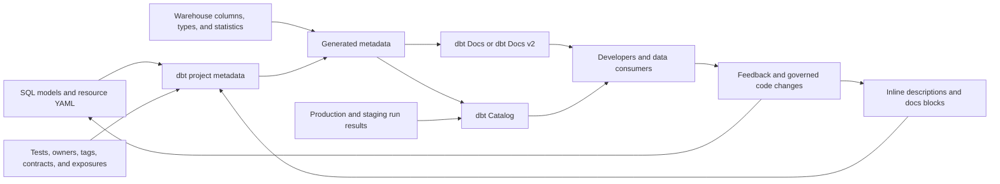

# Documentation Blocks and Catalog

> dbt treats descriptions as version-controlled metadata, documentation blocks as reusable Markdown, and documentation or Catalog interfaces as the discovery layer built from project, warehouse, and run metadata.

## Executive Summary

- **What it is:** dbt resources can have inline YAML descriptions or reusable Markdown docs blocks referenced with `doc()`. Generated dbt Docs and the managed dbt Catalog present those descriptions with SQL, columns, tests, lineage, and execution metadata.
- **Why it matters:** Documentation turns models from technical objects into understandable data products and helps consumers discover the right dataset, interpret it correctly, and assess whether it is trustworthy.
- **Mental model:** **SQL says how data is built; metadata says what it means; Catalog makes that context discoverable.**
- **Best used when:** Models, columns, sources, metrics, and exposures are consumed beyond their original author or carry important business definitions, limitations, ownership, lineage, or control context.
- **Avoid or reconsider when:** Reuse would hide contextual differences, descriptions merely repeat object names, or a catalog is being treated as a substitute for ownership, approval, security, and data-quality processes.

## What It Can Do

- Store model, column, source, seed, snapshot, test, metric, and exposure descriptions in version control.
- Reuse important long-form definitions through named docs blocks.
- Render Markdown alongside model code, lineage, tests, columns, types, and other metadata.
- Introspect warehouse relations so undocumented physical columns still appear in generated documentation.
- Help analysts and developers search for and understand approved resources.
- Surface production-state lineage, health, freshness, usage, and performance context in dbt Catalog when the relevant metadata is generated.
- Make documentation changes reviewable in the same pull request as SQL changes.

## What It Cannot Do

- Guarantee that a description is correct, current, approved, or understood.
- Resolve conflicting business definitions across systems and domains automatically.
- Create real ownership, certification, approval, review cadence, or incident accountability.
- Enforce schemas, access controls, model contracts, data quality, or regulatory rules.
- Ensure all physical columns are meaningfully documented merely because warehouse introspection found them.
- Make sensitive metadata safe to publish without authentication and authorization.
- Turn CI metadata into the applied production state shown by Catalog.

## Core Concepts

| Concept | Meaning | Why it matters |
|---|---|---|
| Inline description | Markdown-capable `description:` text declared in resource YAML | Best for short, resource-specific explanations |
| Docs block | Named Markdown between `` and `` | Supports long-form and genuinely reusable definitions |
| `doc()` | Jinja function that inserts a named docs block into a description | Connects reusable prose to models, columns, and other resources |
| Project metadata | Definitions, descriptions, SQL, tests, owners, tags, and dependencies parsed from the dbt project | Explains intended structure and meaning |
| Warehouse metadata | Physical columns, types, relations, schemas, and available statistics | Connects declared resources to what exists in the warehouse |
| Artifacts | Files such as `manifest.json` and `catalog.json` that carry parsed and introspected metadata | Power documentation, integrations, validation, and automation |
| dbt Docs | Generated documentation experience that can show resources, metadata, and lineage | Provides discovery for dbt Core and self-hosted workflows |
| dbt Docs v2 | Current next-generation open-source catalog experience, documented as alpha | Improves scale, navigation, semantic metadata, APIs, and selected lineage capabilities |
| dbt Catalog | Managed dbt-platform discovery experience built from production or staging metadata | Adds richer search, applied-state lineage, health, usage, performance, and collaboration context |
| Documentation governance | Ownership, approval, review, and change controls around metadata | Determines whether consumers should trust the displayed definition |

## How It Works (Simple Flow)

1. Authors define models and other resources in SQL and YAML.
2. Short explanations remain inline; long or genuinely shared definitions are written as named docs blocks.
3. YAML descriptions reference reusable blocks with `{{ doc('block_name') }}`.
4. dbt parses resources, dependencies, tests, configurations, descriptions, and docs blocks into project metadata.
5. Documentation generation can query warehouse metadata for physical columns, data types, relation details, and available statistics.
6. dbt Docs or Catalog renders the combined metadata as searchable resource pages and lineage views.
7. Production or staging job metadata refreshes Catalog's view of the applied state; CI jobs do not represent production state.
8. Consumers discover resources and raise corrections that should return through code review and governance processes.

## Visuals



## Readable Snippets

### Inline descriptions for concise context

```yaml
models:
  - name: fct_transactions
    description: >
      One row per posted financial transaction. Used for daily
      transaction reporting and account reconciliation.

    columns:
      - name: transaction_id
        description: Unique identifier assigned by the core banking system.
        data_tests:
          - unique
          - not_null

      - name: amount
        description: >
          Posted transaction amount in the currency identified by
          currency_code. Negative values represent reversals.
```

A valuable description should clarify grain, business meaning, interpretation, limitations, or intended use rather than merely expand the object name.

### Reusable documentation block

Create a Markdown file such as `models/docs/financial_terms.md`:

```markdown


The monetary value recorded for a posted transaction.

- The value is expressed in `currency_code`.
- Negative values represent reversals or corrections.
- This is the posted amount, not necessarily the authorized amount.
- For reporting-currency values, use `amount_reporting_currency`.


```

Reference it from resource YAML:

```yaml
models:
  - name: fct_transactions
    columns:
      - name: amount
        description: '{{ doc("transaction_amount") }}'
```

Docs-block names must be unique, can contain letters, numbers, and underscores, and cannot begin with a number.

### Reuse only when meaning is truly shared

```markdown


Identifier for a customer relationship in the core banking platform.

A single natural person or legal entity may have more than one customer
relationship. This identifier must not be interpreted as a unique party ID.


```

This distinction is reusable only where `customer_id` actually carries that meaning. A CRM contact ID or mastered party ID needs a separate contextual definition.

### Generate and inspect documentation

```bash
# Traditional generated documentation workflow
dbt docs generate
dbt docs serve
```

`dbt docs serve` is intended for local or development viewing. Production hosting requires an appropriately secured hosting approach.

Current dbt documentation describes dbt Docs v2 as an alpha experience for dbt Core v2 and the Fusion engine. One documented generation pattern is:

```bash
dbt compile --write-index
dbt docs serve
```

Exact commands and capabilities should be checked against the project's engine and dbt version before implementation.

## Consultant Talking Points

- **Client question this answers:** "How can analysts discover the right data and understand its meaning, lineage, owner, and trust signals without reading every SQL file?"
- **Trade-offs to mention:** Inline descriptions are simple and contextual; docs blocks reduce duplication but can hide domain differences; generated dbt Docs is portable; managed Catalog adds richer production context but introduces plan, metadata, and operating-model considerations.
- **Risk or governance angle:** Critical definitions need approved owners, review cadence, change control, and traceability. Catalog metadata can reveal sensitive object names, business logic, compiled SQL, ownership, and regulatory context, so access must be governed.
- **Cost/performance angle:** Documentation generation may query warehouse information schemas. Cost is usually modest but large environments should review metadata permissions, scanned scope, warehouse usage, and refresh frequency.

A useful client message is: **Catalog is a presentation and discovery layer; governance determines whether its contents are authoritative.**

## Common Pitfalls

- Writing descriptions such as "customer identifier" that add no information beyond the column name.
- Reusing one docs block for concepts that differ across source systems, domains, grains, or regulatory contexts.
- Updating transformation logic without updating its description and limitations in the same pull request.
- Exhaustively documenting low-value staging columns while leaving consumed marts and critical interfaces unclear.
- Assuming an introspected column is properly documented because it appears in the catalog.
- Treating Catalog as the business glossary, approval process, data owner, and control framework all at once.
- Publishing generated documentation without appropriate authentication and authorization.
- Expecting CI-only runs to update Catalog's production state.
- Failing to generate the commands and artifacts needed for test, freshness, column, and run metadata to appear.
- Ignoring descriptions, tests, groups, contracts, exposures, and freshness as complementary trust signals.
- Making a docs block so broad that a small wording change unintentionally changes many resource definitions.
- Treating alpha dbt Docs v2 behavior as a fixed long-term interface without version review.

## When to Recommend What (Decision Table)

| Situation | Recommend | Why | Watch-outs |
|---|---|---|---|
| Short resource-specific explanation | Inline YAML description | Keeps meaning beside the resource definition | Avoid vague text that repeats the name |
| Long formatted explanation | Docs block | Supports readable Markdown outside crowded YAML | Keep the block name unique and discoverable |
| Definition repeated with identical meaning | Shared docs block | Provides one reviewed definition | Confirm the meaning is truly identical in every context |
| Same column name differs by system or domain | Context-specific descriptions or separate blocks | Preserves important distinctions | Do not optimize for reuse at the expense of accuracy |
| Small dbt Core project | Generated dbt Docs | Lightweight and portable discovery | Secure any hosted site and define update ownership |
| Core v2 or Fusion team exploring open catalog tooling | Evaluate dbt Docs v2 | Offers a modern interface and richer metadata direction | It is currently documented as alpha; validate maturity |
| Multiple projects and broad production consumption | Evaluate dbt Catalog | Adds applied-state discovery, lineage, health, usage, and collaboration | Review plan availability, permissions, and metadata-generation workflow |
| Existing enterprise catalog such as Collibra, Alation, or Purview | Define system-of-record boundaries and integrate metadata | Avoids competing definitions and duplicated stewardship | Decide where definitions, ownership, certification, and lineage are authoritative |
| Critical financial or regulatory data product | Combine documentation, ownership, tests, contracts, lineage, and change control | Context plus executable controls provides stronger trust | Documentation alone is not control evidence |
| Documentation backlog is large | Prioritize public models, marts, critical interfaces, and high-use columns | Maximizes consumer value first | Establish measurable coverage and review rules |

## Related Topics

- [[02 dbt/03 Testing Documentation and Data Quality/Testing Documentation and Data Quality Overview|Testing Documentation and Data Quality Overview]]
- [[02 dbt/01 Core Concepts and Project Structure/10 Documentation Lineage and Exposures|Documentation, Lineage, and Exposures]]
- [[02 dbt/03 Testing Documentation and Data Quality/25 Exposures|Exposures]]
- [[02 dbt/05 Deployment CI CD and Operations/45 Artifacts Logs and Run Results|Artifacts, Logs, and Run Results]]
- [[02 dbt/06 Governance Semantic Layer and Mesh/50 Groups and Ownership|Groups and Ownership]]
- [[02 dbt/06 Governance Semantic Layer and Mesh/57 Metadata Lineage and Catalog Strategy|Metadata, Lineage, and Catalog Strategy]]

## Related Decision Notes

- No related decision note yet.

## Questions

- Which resource descriptions are authoritative business definitions rather than technical notes?
- Where does the meaning of a repeated column genuinely remain identical across models?
- Which system is authoritative for glossary terms, ownership, certification, and lineage?
- Who approves and reviews documentation for critical data products?
- Which production or staging jobs generate the metadata Catalog needs?
- What sensitive metadata can each user group discover?
- Should documentation coverage or stale descriptions become a CI or project-governance check?
- Which dbt documentation experience fits the client's engine, operating model, scale, and licensing?

## Sources To Revisit

- [dbt Developer Hub - About documentation](https://docs.getdbt.com/docs/build/documentation)
- [dbt Developer Hub - View documentation](https://docs.getdbt.com/docs/build/view-documentation)
- [dbt Developer Hub - doc Jinja function](https://docs.getdbt.com/reference/dbt-jinja-functions/doc)
- [dbt Developer Hub - dbt docs commands](https://docs.getdbt.com/reference/commands/cmd-docs)
- [dbt Developer Hub - Discover data with Catalog](https://docs.getdbt.com/docs/explore/explore-projects)
- [dbt Developer Hub - Manifest JSON artifact](https://docs.getdbt.com/reference/artifacts/manifest-json)
- [dbt Developer Hub - Catalog JSON artifact](https://docs.getdbt.com/reference/artifacts/catalog-json)
