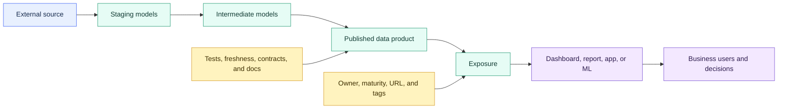

# Exposures

> [!abstract] Mental model
> Models show how data is transformed; exposures show who uses the result and where a failure creates business impact.

## Executive Summary

- **What it is:** An exposure is a downstream use of dbt-managed data represented as a leaf node in the DAG, with dependencies, an owner, a type, and optional business context.
- **Why it matters:** Standard dbt lineage often ends at a mart. Exposures explain why the mart exists, who relies on it, and which business outputs may be affected by a change or failure.
- **Mental model:** **Sources show where data enters dbt, models show how it is transformed, and exposures show where it creates business value or business risk.**
- **Best used when:** A downstream dashboard, regulatory report, notebook, application, reverse-ETL process, or ML workflow is sufficiently important that developers need visible lineage and ownership.
- **Avoid or reconsider when:** The downstream asset is temporary or trivial, nobody will maintain the dependency metadata, or the team expects an exposure to provide monitoring, access control, certification, or column-level usage automatically.

## What It Can Do

- Add downstream business uses as leaf nodes in dbt lineage.
- Declare which models, seeds, sources, or metrics feed an external asset.
- Record a responsible owner, business description, maturity, URL, tags, and custom metadata.
- Improve impact analysis before models are changed or retired.
- Select, run, or test the upstream dbt resources required by an exposure.
- Populate exposure pages and lineage context in generated documentation and dbt Catalog.
- Support manually curated exposures in YAML and automatically discovered downstream exposures for supported integrations.
- Help organize critical outputs by domain, regulatory context, publication status, or internal criticality conventions.

## What It Cannot Do

- Create, refresh, execute, or monitor the downstream dashboard or application.
- Prove that calculations inside a BI tool, notebook, or application are correct.
- Discover every downstream consumer when dependencies are manually declared.
- Guarantee column-level impact from a model-level `depends_on` declaration.
- Enforce Snowflake access controls, application permissions, SLAs, or publication approval.
- Turn `maturity: high` into certification, good data quality, high criticality, or regulatory sign-off.
- Alert an owner or establish operational responsibility merely because contact metadata exists.
- Replace observability, incident response, contracts, tests, reconciliations, or governance processes.

## Core Concepts

| Concept | Meaning | Why it matters |
|---|---|---|
| Exposure | Metadata node representing a downstream use of dbt resources | Extends technical lineage into business impact |
| Leaf node | End point of the declared dbt DAG rather than a transformation dbt builds | Shows the consumer without pretending dbt executes it |
| `depends_on` | List of `ref()`, `source()`, or `metric()` dependencies | Connects the external asset to upstream dbt lineage and selection |
| `owner` | Name or email for the responsible person or team | Gives impact reviews and incidents a contact point |
| `type` | One of `dashboard`, `notebook`, `analysis`, `ml`, or `application` | Organizes exposures by the technical form of consumption |
| `maturity` | Optional `low`, `medium`, or `high` confidence/stability indicator | Describes how established the asset is, not its criticality or approval |
| `url` | Direct link to the actual downstream asset | Connects metadata to the dashboard, notebook, or application users recognize |
| Manual exposure | YAML definition stored and reviewed with project code | Supports curated context and any downstream system, but needs maintenance |
| Automatic exposure | Downstream asset discovered through a supported integration and stored in dbt metadata | Improves coverage but may need curated ownership and business context |
| Exposure selection | Use of `+exposure:<name>` to select its upstream graph | Enables business-output-oriented builds, tests, and investigations |

## How It Works (Simple Flow)

1. Identify a downstream asset important enough to preserve in lineage.
2. Choose the closest exposure type and give it a unique technical name plus a human-friendly label.
3. Declare the models, metrics, seeds, or—more rarely—sources that it depends on.
4. Add an owner, description, URL, maturity, and governance metadata appropriate to its importance.
5. dbt parses the exposure and adds it as a leaf node connected to its upstream dependencies.
6. Documentation and Catalog can display the asset, owner, context, and lineage.
7. Developers use the lineage or `+exposure:<name>` selection to build and test the upstream resources before changes or releases.
8. The team maintains the exposure as downstream dependencies, ownership, stability, or business use changes.

## Visuals



Exposures complete the business-impact path, while the surrounding controls establish whether the data should be trusted and published.

## Readable Snippets

### Banking exposure example

```yaml
exposures:
  - name: daily_liquidity_risk_report
    label: Daily Liquidity Risk Report
    type: dashboard
    maturity: high

    url: https://bi.example.com/dashboards/liquidity-risk

    description: >
      Daily liquidity monitoring used by Treasury and Risk.
      Published each business day before the 08:00 control deadline.

    depends_on:
      - ref('fct_cash_flows')
      - ref('fct_account_balances')
      - ref('dim_legal_entities')
      - metric('liquidity_coverage_ratio')

    owner:
      name: Treasury Data Products
      email: treasury-data@example.com

    config:
      tags:
        - finance
        - regulatory
        - tier_1
      meta:
        criticality: material
        review_frequency: quarterly
```

The exposure records that the report depends on these dbt resources. It does not refresh the report, validate its BI-layer formulas, alert the owner, or approve regulatory publication.

### Maturity is stability, not criticality

```yaml
maturity: low     # Experimental, provisional, or changing rapidly
maturity: medium  # Actively used but still evolving
maturity: high    # Established, widely used, and expected to remain stable
```

Only one value is configured on an exposure. The three-line example above illustrates the intended meanings.

A high-maturity internal dashboard may be low criticality, while a new regulatory report may be highly critical but only medium maturity. Use `meta`, tags, descriptions, and governance processes for criticality, certification, regulatory scope, SLA, and approval state.

### Select the upstream graph

```bash
# Run every dbt model upstream of the exposure
dbt run --select +exposure:daily_liquidity_risk_report

# Test the upstream resources
dbt test --select +exposure:daily_liquidity_risk_report
```

These commands operate on dbt resources upstream of the exposure; they do not refresh or test the external dashboard itself.

### Multiple YAML files are normal

An exposure can live in a dedicated file such as `models/exposures.yml`. dbt projects commonly use multiple property files organized by domain or layer:

```text
models/
├── staging/
│   └── core_banking/
│       ├── _core_banking__sources.yml
│       └── _core_banking__models.yml
├── marts/
│   └── finance/
│       └── _finance__models.yml
├── docs/
│   └── finance_terms.md
└── exposures.yml
```

Docs blocks belong in Markdown files, not YAML. Keep all properties for the same model in one YAML entry rather than splitting its description, columns, and tests across duplicate model declarations.

## Consultant Talking Points

- **Client question this answers:** "If we change or lose this model, which important dashboards, reports, applications, or ML workflows are affected, and who must be involved?"
- **Trade-offs to mention:** Manual exposures provide curated, version-controlled context but require maintenance. Automatic exposures improve discovery coverage but depend on supported integrations and may lack reviewed ownership or business meaning.
- **Risk or governance angle:** Material exposures should connect technical lineage to real business and technical owners, publication deadlines, criticality, regulatory context, incident processes, and change review. Exposure metadata alone does not make those controls operational.
- **Cost/performance angle:** Declaring an exposure creates no warehouse object and little direct compute cost. Running its full upstream graph can be expensive, so selection should be used intentionally for validation, incident response, and release workflows.

A useful client message is: **an exposure records business impact; it does not operate or certify the business output.**

## Common Pitfalls

- Defining an exposure without meaningful `depends_on`, leaving it decorative rather than useful for lineage.
- Assigning an owner that is only a generic mailbox or team label with no real responsibility.
- Treating `maturity: high` as proof of data quality, regulatory approval, certification, or high business criticality.
- Forgetting to update manual dependencies after a dashboard or application changes.
- Linking exposures directly to raw sources when consumers actually rely on governed marts or metrics.
- Creating hundreds of manual exposures for temporary notebooks and ad hoc reports, obscuring the important outputs.
- Assuming model-level exposure lineage identifies every downstream column used.
- Expecting an exposure to monitor, alert, refresh, or test the external system.
- Using tags or `meta` values without a controlled naming convention and agreed meaning.
- Letting exposure YAML live far from the responsible domain with no maintenance process.
- Assuming automatically discovered exposures have the same curated context and review history as manual definitions.

## When to Recommend What (Decision Table)

| Situation | Recommend | Why | Watch-outs |
|---|---|---|---|
| Important dashboard or regulatory output | Curated manual exposure | Makes ownership, business purpose, and upstream impact explicit | Keep dependencies and owner current |
| Supported BI integration with many downstream assets | Automatic discovery plus curation of critical assets | Improves coverage while preserving context for material outputs | Integration metadata may be incomplete or noisy |
| Temporary notebook or one-off analysis | Usually omit or use low maturity only when impact warrants it | Avoids maintenance noise | Promote it if it becomes operational or widely consumed |
| Established, stable dashboard | `maturity: high` | Communicates confidence and stability | Does not imply quality, criticality, or certification |
| New but regulatory-critical report | Appropriate maturity plus separate criticality metadata | Keeps stability distinct from business impact | Add approval, SLA, evidence, and ownership processes outside maturity |
| Need to validate one business output before release | Run or test `+exposure:<name>` | Selects the complete declared upstream graph | It does not validate BI-layer logic or refresh the asset |
| Model change may break downstream columns | Exposure lineage plus column-level lineage or BI metadata | Model-level dependency alone may be insufficient | Validate actual fields and semantic changes |
| Client has no downstream inventory | Start with critical manual exposures, then assess integrations | Creates immediate high-value impact visibility | Do not attempt to inventory everything before producing value |
| Exposure data is sensitive or regulated | Govern Catalog and documentation access | Metadata can reveal systems, logic, ownership, and regulatory context | Exposure metadata does not grant or restrict warehouse access |

## Related Topics

- [[02 dbt/03 Testing Documentation and Data Quality/Testing Documentation and Data Quality Overview|Testing Documentation and Data Quality Overview]]
- [[02 dbt/01 Core Concepts and Project Structure/10 Documentation Lineage and Exposures|Documentation, Lineage, and Exposures]]
- [[02 dbt/03 Testing Documentation and Data Quality/21 Generic Singular and Custom Data Tests|Generic, Singular, and Custom Data Tests]]
- [[02 dbt/03 Testing Documentation and Data Quality/24 Documentation Blocks and Catalog|Documentation Blocks and Catalog]]
- [[02 dbt/06 Governance Semantic Layer and Mesh/50 Groups and Ownership|Groups and Ownership]]
- [[02 dbt/06 Governance Semantic Layer and Mesh/57 Metadata Lineage and Catalog Strategy|Metadata, Lineage, and Catalog Strategy]]

## Related Decision Notes

- No related decision note yet.

## Questions

- Which downstream assets are important enough to preserve as curated exposures?
- Who is accountable for each exposure's business meaning, technical operation, and incident response?
- Does `depends_on` represent the actual current dependency graph?
- Which dimensions belong in `maturity`, tags, `meta`, or an external governance system?
- Which exposure failures should trigger publication blocking or consumer communication?
- Can supported integrations discover additional downstream consumers?
- Is resource-level lineage sufficient, or is column-level usage needed for safe change analysis?
- How will exposure updates become part of release and decommissioning workflows?

## Sources To Revisit

- [dbt Developer Hub - Add exposures to your DAG](https://docs.getdbt.com/docs/build/exposures)
- [dbt Developer Hub - Exposure properties](https://docs.getdbt.com/reference/exposure-properties)
- [dbt Developer Hub - Node selector methods](https://docs.getdbt.com/reference/node-selection/methods#the-exposure-method)
- [dbt Developer Hub - Discover data with Catalog](https://docs.getdbt.com/docs/explore/explore-projects)
