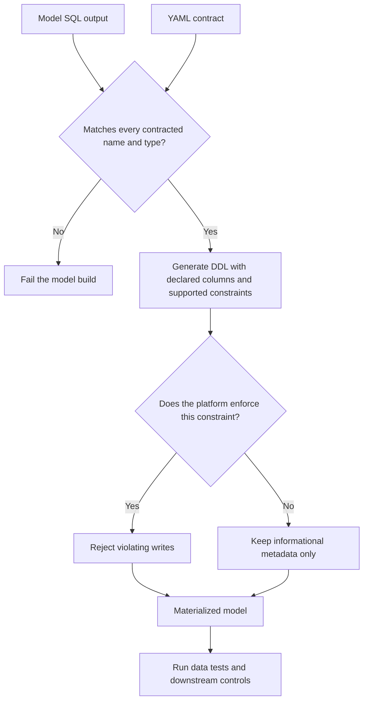

# Model Contracts and Constraints

> Model contracts define the schema consumers can rely on; constraints add data rules whose real protection depends on warehouse and adapter enforcement.

## Executive Summary

- **What it is:** An enforced model contract declares every output column name and data type in YAML. Optional constraints express rules such as non-null, uniqueness, primary keys, and foreign keys for supported table and incremental models.
- **Why it matters:** Contracts fail builds that would unexpectedly change a published interface, while genuinely enforced constraints can prevent invalid records from entering the materialized relation.
- **Mental model:** **A contract defines the shape of the interface; a constraint defines a rule on its contents; a data test inspects the built data for violations.**
- **Best used when:** A stable public model feeds other teams, projects, dashboards, applications, financial controls, regulatory outputs, or any consumer for whom schema changes create material risk.
- **Avoid or reconsider when:** A model is still experimental, its schema intentionally changes often, its materialization is unsupported, or the team assumes an informational Snowflake constraint provides enforcement it does not actually provide.

## What It Can Do

- Require an exact set of output column names and warehouse-compatible data types.
- Fail a model build when its SQL output does not match the declared interface.
- Order materialized columns according to the contract declaration.
- Include supported constraints in generated DDL for table and incremental models.
- Prevent null values where Snowflake and dbt apply an enforced `not_null` constraint.
- Publish key and relationship metadata for catalogs and ERD tooling even when Snowflake does not enforce it.
- Help identify breaking changes when comparing against previous project state.
- Strengthen public-model, cross-team, Mesh, versioning, and exposure boundaries.

## What It Cannot Do

- Detect a changed business definition when column names and types remain unchanged.
- Prove grain, uniqueness, relationships, reconciliation, freshness, or calculation correctness unless another enforced control validates them.
- Make Snowflake standard-table primary, unique, or foreign keys enforce themselves.
- Apply database constraints to views or ephemeral models.
- Contract sources, seeds, snapshots, Python models, or unsupported materializations in the same way as supported SQL models.
- Compare every granular type attribute; dbt does not generally compare details such as all string lengths, precision, and scale during contract comparison.
- Replace data tests, unit tests, documentation, model versions, ownership, or consumer migration.

## Core Concepts

| Concept | Meaning | Why it matters |
|---|---|---|
| Model contract | Declared list of every output column name and data type | Defines the structural interface consumers can expect |
| `contract.enforced` | Configuration that turns the declared interface into a build requirement | A mismatch fails rather than silently changing the model shape |
| Preflight check | dbt comparison of model-query output with the YAML contract | Finds name, type, and column-count mismatches before accepting the build |
| Constraint | Rule such as `not_null`, `unique`, `primary_key`, `foreign_key`, `check`, or `custom` | May prevent invalid data or provide metadata, depending on support |
| Enforced constraint | Warehouse validates the rule during a write | Invalid data causes the operation to fail |
| Informational constraint | Rule is stored as metadata but not checked | Helps lineage, ERD, or optimization but provides no quality guarantee |
| Data test | Query that finds violations in actual built data | Remains essential where constraints are not enforced |
| Breaking contract change | Removed column, changed type, changed constraint, or removed contracted model | Can break downstream consumers and may require a model version |
| Public model | Stable model deliberately consumed beyond its immediate team | Highest-value candidate for contracts |

## How It Works (Simple Flow)

1. Identify a stable model whose structural interface matters to downstream consumers.
2. Declare every output column and its warehouse-compatible data type in model YAML.
3. Enable `contract.enforced: true` and add only constraints whose platform behavior is understood.
4. dbt prepares the model query and performs a preflight comparison against the contract.
5. A missing, extra, renamed, or type-incompatible column fails the build.
6. If the schema matches, dbt includes declared names, types, and supported constraints in the DDL.
7. Snowflake enforces only the constraint types supported for that table and execution path; informational constraints do not validate records.
8. Data tests, unit tests, reconciliation, versions, and change governance cover the quality and semantic guarantees outside the contract.

## Visuals



## Readable Snippets

### Contracted finance model

Keep the SQL output explicit and cast important types deliberately:

```sql
-- models/marts/finance/fct_daily_account_balances.sql

select
    cast(account_id as varchar) as account_id,
    cast(balance_date as date) as balance_date,
    cast(closing_balance as number(38, 2)) as closing_balance,
    cast(currency_code as varchar) as currency_code
from {{ ref('int_daily_account_balances') }}
```

Declare the interface and constraints:

```yaml
models:
  - name: fct_daily_account_balances

    config:
      materialized: table
      contract:
        enforced: true

    constraints:
      - type: primary_key
        columns:
          - account_id
          - balance_date

    columns:
      - name: account_id
        data_type: varchar
        constraints:
          - type: not_null

      - name: balance_date
        data_type: date
        constraints:
          - type: not_null

      - name: closing_balance
        data_type: number(38, 2)
        constraints:
          - type: not_null

      - name: currency_code
        data_type: varchar
        constraints:
          - type: not_null
```

The contract protects the four-column structural interface. On a normal Snowflake standard table, the composite primary key is informational rather than enforced, so duplicates still need a data test.

### Validate an informational composite key

Create `tests/assert_daily_account_balance_grain.sql`:

```sql
select
    account_id,
    balance_date,
    count(*) as record_count
from {{ ref('fct_daily_account_balances') }}
group by
    account_id,
    balance_date
having count(*) > 1
```

This singular data test returns duplicate grain violations that the Snowflake primary-key declaration does not reject.

### Four distinct questions

```text
Contract:
closing_balance must be NUMBER(38,2)

Constraint:
closing_balance must not be NULL

Data test:
account_id + balance_date must be unique in built data

Unit test:
a reversal transaction must reduce the calculated balance correctly
```

### Numeric precision and scale

For financial values, prefer an explicit type:

```yaml
data_type: number(38, 2)
```

An unspecified numeric type can inherit a scale of zero or other platform defaults. Even though dbt does not compare every granular precision and scale detail, the warehouse applies the generated DDL type, so explicit decimal design remains important.

## Consultant Talking Points

- **Client question this answers:** "How do we stop a shared dbt model from changing shape unexpectedly, and which data rules are actually guaranteed by Snowflake?"
- **Trade-offs to mention:** Contracts make interfaces predictable but require every column to be maintained in YAML and make schema changes more deliberate. That structure is valuable for stable public models but burdensome during rapid exploration.
- **Risk or governance angle:** Structural changes should be reviewed against downstream exposures and public consumers. Semantic changes that preserve names and types still require documentation, testing, approval, versioning, and consumer communication.
- **Cost/performance angle:** A truly enforced constraint can avoid some separate validation queries, but only where the warehouse and adapter enforce it. Informational Snowflake constraints do not replace tests, and `RELY` must never be used unless the declared relationship is genuinely true.

A useful client message is: **declare what consumers can rely on, then verify which parts dbt and Snowflake actually guarantee.**

## Common Pitfalls

- Assuming every declared constraint is enforced by Snowflake.
- Treating an informational primary key as proof of uniqueness or a foreign key as proof of referential integrity.
- Contracting every staging model before its interface is stable.
- Forgetting that every output column needs a declared name and data type.
- Using `select *` in a contracted model and being surprised when upstream schema drift introduces extra columns.
- Changing a column's meaning or model grain while keeping the same name and type, allowing the contract to pass.
- Omitting precision and scale for material financial decimals.
- Removing or changing contracted columns without model versioning and consumer migration.
- Replacing uniqueness and relationship tests with unenforced Snowflake constraints.
- Assuming a new native Snowflake constraint feature is already supported through the current dbt adapter.
- Marking an unverified informational relationship as `RELY`, allowing the optimizer to trust false metadata.
- Ignoring the additional YAML maintenance, CI checks, and rollback implications created by governance features.

## When to Recommend What (Decision Table)

| Situation | Recommend | Why | Watch-outs |
|---|---|---|---|
| Experimental staging model | Usually defer the contract | Preserves healthy iteration while the interface changes | Add one when the model becomes a stable boundary |
| Stable mart used by one or more teams | Consider an enforced contract | Prevents accidental structural changes | Every column becomes maintained interface metadata |
| Public model or cross-project dependency | Enforced contract plus access and versioning strategy | Consumers need a predictable interface | Plan breaking changes and deprecation windows |
| Model feeding an application or regulatory exposure | Contract, tests, documentation, and change governance | Structural stability is necessary but insufficient | Include semantic validation, reconciliation, and sign-off |
| Required Snowflake column | `not_null` constraint, with a test where evidence or diagnostics matter | Snowflake enforces `NOT NULL` on standard tables | Constraint failure may be harder to diagnose than stored test failures |
| Snowflake primary, unique, or foreign key | Declare for metadata if useful and retain data tests | Standard-table key constraints are not enforced | Never present metadata as a quality guarantee |
| Business condition such as a permitted range | Data test unless the exact dbt/Snowflake constraint path is verified | dbt can express flexible failing-record queries | Current native and adapter `CHECK` support differ |
| Breaking schema change | Introduce a model version and migration window | Lets consumers adapt without surprise | Coordinate owners and exposures before deprecation |
| Wide model with hundreds of unstable columns | Stabilize or narrow the interface before contracting | Reduces noisy YAML maintenance | A broad public interface is itself a design risk |
| Material financial decimal | Explicit precision and scale in SQL and YAML | Avoids implicit coercion and whole-number defaults | Test rounding and business calculations separately |

## Related Topics

- [[02 dbt/03 Testing Documentation and Data Quality/Testing Documentation and Data Quality Overview|Testing Documentation and Data Quality Overview]]
- [[02 dbt/03 Testing Documentation and Data Quality/21 Generic Singular and Custom Data Tests|Generic, Singular, and Custom Data Tests]]
- [[02 dbt/03 Testing Documentation and Data Quality/25 Exposures|Exposures]]
- [[02 dbt/03 Testing Documentation and Data Quality/29 Data Quality Strategy in Regulated Environments|Data Quality Strategy in Regulated Environments]]
- [[02 dbt/06 Governance Semantic Layer and Mesh/52 Model Contracts|Model Contracts]]
- [[02 dbt/06 Governance Semantic Layer and Mesh/53 Model Versions and Deprecation|Model Versions and Deprecation]]

## Related Decision Notes

- [[80 Comparisons and Decision Notes/Decision Notes/dbt/Decisions - Choosing the Right dbt Quality Control|Decisions - Choosing the Right dbt Quality Control]]
- [[80 Comparisons and Decision Notes/Comparisons/dbt/Comparison - Model Contracts vs Data Tests vs Warehouse Constraints|Comparison - Model Contracts vs Data Tests vs Warehouse Constraints]]

## Questions

- Which models are stable public interfaces rather than implementation details?
- Which declared constraints does the current warehouse and dbt adapter actually enforce?
- Which informational constraints still require data tests?
- What precision, scale, and time-zone semantics must finance interfaces guarantee?
- Which downstream exposures and teams would a breaking contract change affect?
- When should a schema change create a new model version rather than modify the current interface?
- How will semantic changes that preserve the schema be reviewed and approved?
- Is the team ready to maintain full column declarations and respond to contract failures?

## Sources To Revisit

- [dbt Developer Hub - Model contracts](https://docs.getdbt.com/docs/mesh/govern/model-contracts)
- [dbt Developer Hub - Contract configuration](https://docs.getdbt.com/reference/resource-configs/contract)
- [dbt Developer Hub - Constraints](https://docs.getdbt.com/reference/resource-properties/constraints)
- [Snowflake Documentation - Overview of constraints](https://docs.snowflake.com/en/sql-reference/constraints-overview)
