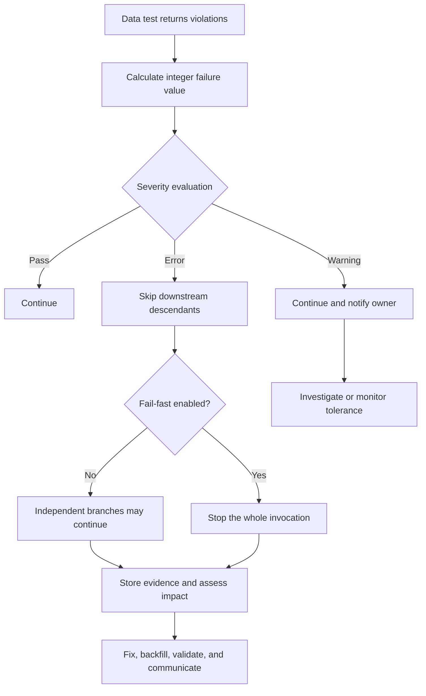

# Test Severity and Failure Handling

> A test defines what is wrong; severity classifies the result; failure handling decides whether the problem merely warns, blocks dependent work, preserves evidence, alerts an owner, or triggers recovery.

## Executive Summary

- **What it is:** dbt data tests can classify a failure count as a pass, warning, or error using `severity`, `warn_if`, and `error_if`. Operational controls then decide how that status affects downstream execution, evidence retention, alerting, remediation, and reruns.
- **Why it matters:** A test only creates value when its response matches business risk. Treating every anomaly as an error creates brittle pipelines; treating every anomaly as a warning allows unreliable data to circulate.
- **Mental model:** **Detection asks "what is wrong?" Severity asks "how serious is it?" Failure handling asks "what happens now, who owns it, and how do we recover?"**
- **Best used when:** A team needs risk-based quality gates for production jobs, CI, shared marts, financial controls, regulatory outputs, or other data products with defined service expectations.
- **Avoid or reconsider when:** Thresholds have no business justification, warnings have no owner, failures cannot be investigated safely, or a raw row count does not represent materiality.

## What It Can Do

- Turn a zero-tolerance test violation into an error.
- Allow a controlled tolerance band that warns before becoming an error.
- Let noncritical tests warn without blocking downstream resources.
- Cause descendants of an errored test to be skipped when tests run inside `dbt build`.
- Stop the entire invocation at the first error with `--fail-fast`.
- Promote warnings to errors in strict environments with `--warn-error` or selective warning options.
- Store current failing rows for diagnosis using `store_failures`.
- Record executed-node status and timing in `run_results.json` for orchestration, reporting, and retained audit evidence.
- Support business-aware failure measures through custom tests or `fail_calc` when raw row count is insufficient.

## What It Cannot Do

- Determine business materiality without an agreed risk rule.
- Send an alert, open an incident, assign an owner, quarantine records, repair data, backfill, or communicate with consumers by itself.
- Roll back a model already materialized before its data test ran.
- Guarantee that warning results are noticed or acted upon.
- Turn `store_failures` into a permanent failure-history table; the current table is replaced on later executions.
- Make it safe to store personally identifiable or financially sensitive failing rows without RBAC, masking, retention, and cleanup controls.
- Replace reconciliation, source freshness, unit tests, observability, runbooks, or incident ownership.
- Apply the same threshold mechanism to every test type: unit tests are normally binary, and source freshness has its own warning and error thresholds.

## Core Concepts

| Concept | Meaning | Why it matters |
|---|---|---|
| Failure count | Integer calculated from records returned by a data test; default is `count(*)` | This is the value compared with warning and error expressions |
| `severity: error` | Evaluate `error_if` first, then `warn_if` if the error condition is false | Allows pass, warning, and error bands in one test |
| `severity: warn` | Skip `error_if` and evaluate only `warn_if` | The test cannot naturally become an error, even if `error_if` is configured |
| `warn_if` | SQL comparison that defines a warning threshold | Supports tolerated but visible deviations |
| `error_if` | SQL comparison that defines an error threshold | Defines the point at which risk becomes unacceptable |
| Error | Test status that can block downstream descendants in `dbt build` | Protects dependent data products from known bad upstream data |
| Warning | Visible test issue that does not block descendants | Appropriate only for explicitly accepted and monitored risk |
| `store_failures` | Persist the current failing rows in an audit relation | Provides diagnostic evidence, but introduces security and retention concerns |
| Fail-fast | Stop the whole invocation on the first run or test error | Provides faster containment but a less complete failure inventory |
| DAG-local blocking | Without fail-fast, failed nodes and descendants stop while independent branches may continue | Limits blast radius while still collecting failures elsewhere |
| `fail_calc` | Custom integer aggregate used instead of the default failing-row count | Can represent duplicated records, scaled rates, or other useful failure measures |
| Materiality | Business significance of a quality failure, not merely its row count | One high-value ledger mismatch may matter more than many immaterial records |
| Failure owner | Named team or person responsible for triage and response | A warning without ownership easily becomes ignored operational noise |

## How It Works (Simple Flow)

1. Define the records that violate the business or technical rule in a generic or singular data test.
2. dbt executes the test and calculates an integer failure value, normally the number of returned rows.
3. With `severity: error`, dbt checks `error_if` first; if false, it checks `warn_if`. With `severity: warn`, it skips `error_if`.
4. dbt assigns pass, warning, or error status and writes execution metadata to its artifacts.
5. In `dbt build`, a warning allows descendants to continue, while an error causes dependent resources to be skipped.
6. If fail-fast is enabled, dbt stops the wider invocation at the first error and attempts to terminate work already in progress.
7. Optional failure storage and orchestration preserve evidence and route the event to the correct owner.
8. The owner assesses impact, fixes or quarantines data, backfills and reruns as needed, validates recovery, and communicates with affected consumers.

## Visuals



## Readable Snippets

### Zero-tolerance control

A missing transaction identifier is unacceptable, and the failing records are useful for investigation:

```yaml
models:
  - name: fct_transactions
    columns:
      - name: transaction_id
        data_tests:
          - not_null:
              config:
                severity: error
                error_if: "!= 0"
                store_failures: true
```

The explicit `error_if` matches dbt's normal nonzero-error default, but documenting it makes the control intent visible.

### Warning band followed by an error

Allow a small, approved tolerance for temporarily unmatched customer relationships:

```yaml
models:
  - name: fct_transactions
    columns:
      - name: customer_id
        data_tests:
          - relationships:
              arguments:
                to: ref('dim_customers')
                field: customer_id
              config:
                severity: error
                warn_if: "> 0"
                error_if: "> 10"
                store_failures: true
```

| Unmatched rows | Result | Operational meaning |
|---:|---|---|
| 0 | Pass | Continue normally |
| 1-10 | Warning | Continue, notify the owner, and monitor the approved tolerance |
| More than 10 | Error | Block descendants and begin remediation |

`severity: error` is required for this three-level pattern. If it were changed to `severity: warn`, dbt would ignore `error_if` and the test could not naturally error.

### Fail-fast execution

```bash
dbt build --fail-fast
```

Without fail-fast, an error blocks its descendants while independent DAG branches may continue. With fail-fast, the first error stops the entire invocation, producing faster containment but less complete diagnostic coverage.

### Promote warnings carefully

```bash
dbt build --warn-error
```

This can promote warnings beyond data tests, including project or deprecation warnings. Prefer selective warning promotion when the intention is narrower than "every dbt warning must fail this job."

### Business-aware failure calculation

Raw returned-row count is not always the right control measure. A custom generic test or `fail_calc` can calculate a meaningful integer, for example the number of duplicated source records rather than the number of duplicate groups:

```yaml
data_tests:
  - duplicate_transaction_groups:
      config:
        fail_calc: >-
          case
            when count(*) > 0 then sum(duplicate_record_count)
            else 0
          end
        warn_if: "> 0"
        error_if: "> 100"
```

`fail_calc` must return an integer. Monetary exposure or failure rates often need a purpose-built test that converts the business measure into a deliberate integer scale and documents what the thresholds mean.

### Failure handling is larger than test configuration

```text
Detect -> Classify -> Gate -> Preserve evidence -> Alert owner
       -> Assess impact -> Repair or quarantine -> Backfill
       -> Validate recovery -> Communicate and close
```

dbt covers detection, classification, DAG-aware gating, and artifacts. Orchestration, observability, ownership, and incident procedures complete the control.

## Consultant Talking Points

- **Client question this answers:** "Which data-quality failures should stop delivery, which can proceed under an approved tolerance, and what should happen after either result?"
- **Trade-offs to mention:** Strict errors reduce the chance of publishing bad downstream data but can lower availability and create brittle jobs. Warnings preserve delivery but can normalize defects unless thresholds, owners, response times, and escalation rules are explicit.
- **Risk or governance angle:** Severity is a risk decision, not merely a developer preference. Material financial, regulatory, privacy, or contractual failures normally need zero or formally approved tolerance, preserved evidence, segregation of duties, and a traceable response.
- **Cost/performance angle:** Every test consumes warehouse resources. Storing failures consumes storage and creates governance work, while repeated retries and broad fail-fast reruns can increase compute. Prioritize controls by consumer impact and schedule less critical profiling appropriately.

A durable severity policy should define:

- the business risk represented by the test;
- the measure used, such as row count, percentage, monetary exposure, or control-total difference;
- the warning and error thresholds and who approved them;
- the affected models, exposures, reports, and service commitments;
- the owner, notification channel, response time, and escalation path;
- whether failed records may be stored and who may access them;
- the recovery, backfill, validation, and consumer-communication procedure;
- an expiry or review date for every temporary tolerance.

The useful rule is: **errors represent unacceptable risk; warnings represent explicitly accepted and monitored risk, not problems the team has chosen to ignore.**

## Common Pitfalls

- Configuring every test as an error and creating a pipeline that frequently stops for immaterial defects.
- Configuring every test as a warning and allowing material data problems to reach consumers.
- Using arbitrary absolute row thresholds without relating them to volume, value, exposure, regulatory impact, or historical behavior.
- Setting `severity: warn` while expecting `error_if` to produce an error.
- Allowing warnings to accumulate without an owner, alert, dashboard, response target, or expiry date.
- Assuming a successful job means warning-level quality problems did not occur.
- Running `dbt run` and then `dbt test` separately and discovering the defect only after models were already published.
- Assuming `dbt build` rolls back the model whose post-build data test failed.
- Enabling `--warn-error` globally and unexpectedly failing jobs for unrelated deprecations or project warnings.
- Using fail-fast when the team needs a complete failure inventory for diagnosis.
- Avoiding fail-fast when immediate containment of a high-risk process is more important than diagnostic completeness.
- Treating a stored-failures table as a historical audit archive even though later runs replace its contents.
- Storing customer, payment, or account data from failing rows without RBAC, masking, retention, and cleanup controls.
- Using row count where a single high-value transaction or a monetary reconciliation gap is the real material risk.
- Alerting the model author but not the business or operations owner responsible for the affected exposure.
- Fixing the immediate data without validating recovery, rerunning dependents, documenting impact, or addressing the root cause.

## When to Recommend What (Decision Table)

| Situation | Recommend | Why | Watch-outs |
|---|---|---|---|
| Null or duplicate key in a critical transaction or ledger model | Error with zero tolerance | Structural corruption can propagate and invalidate downstream results | Store evidence only under appropriate access controls |
| Regulatory or financial control-total mismatch | Error and block publication | The output should not be distributed while materially unreconciled | Measure monetary or control-total impact, not only rows |
| Small amount of expected late-arriving enrichment | Warning band with approved error threshold | Preserves availability while making degradation visible | Define time limit, owner, volume basis, and escalation rule |
| Optional descriptive attribute missing | Warning or periodic monitoring | Consumer impact may be low | Confirm it is genuinely optional for every exposure |
| Experimental internal model | Warning temporarily | Enables learning before the interface stabilizes | Add an expiry date so temporary acceptance does not become permanent |
| Shared production mart | Risk-tiered tests inside `dbt build` | DAG-aware errors protect descendants | The tested model itself may already have materialized |
| High-risk batch requiring immediate containment | `--fail-fast` plus incident routing | Stops additional execution quickly | Provides less complete information and can leave partial execution state |
| Broad quality assessment or migration rehearsal | Continue independent branches without fail-fast | Produces a fuller failure inventory | Do not expose failed outputs to consumers |
| CI where selected warnings must block merge | Selective warning promotion | Enforces policy without converting every warning into failure | Keep warning categories and dbt versions maintained |
| Failing records needed for diagnosis | `store_failures: true` with governed audit schema | Speeds root-cause analysis | Current table is not historical; sensitive data may be exposed |
| Long-term quality evidence required | Archive artifacts and failure history externally | Creates a retained control trail across invocations | Define retention, lineage, security, and immutable evidence requirements |
| Materiality depends on volume or value | Custom test or `fail_calc` with approved measure | Aligns technical status with business risk | Keep calculation integer-based, readable, and independently validated |

## Related Topics

- [[02 dbt/03 Testing Documentation and Data Quality/Testing Documentation and Data Quality Overview|Testing Documentation and Data Quality Overview]]
- [[02 dbt/03 Testing Documentation and Data Quality/21 Generic Singular and Custom Data Tests|Generic, Singular, and Custom Data Tests]]
- [[02 dbt/03 Testing Documentation and Data Quality/22 Unit Tests for SQL Logic|Unit Tests for SQL Logic]]
- [[02 dbt/03 Testing Documentation and Data Quality/23 Source Freshness and SLA Monitoring|Source Freshness and SLA Monitoring]]
- [[02 dbt/03 Testing Documentation and Data Quality/29 Data Quality Strategy in Regulated Environments|Data Quality Strategy in Regulated Environments]]
- [[02 dbt/05 Deployment CI CD and Operations/45 Artifacts Logs and Run Results|Artifacts, Logs, and Run Results]]
- [[02 dbt/05 Deployment CI CD and Operations/48 Incident Response Rollback and Replay|Incident Response, Rollback, and Replay]]
- [[02 dbt/05 Deployment CI CD and Operations/49 Observability with dbt and Snowflake Metadata|Observability with dbt and Snowflake Metadata]]

## Related Decision Notes

- [[80 Comparisons and Decision Notes/Decision Notes/dbt/Decisions - Choosing the Right dbt Quality Control|Decisions - Choosing the Right dbt Quality Control]]

## Questions

- Which failures represent unacceptable business risk, and which have an explicitly accepted tolerance?
- Should a threshold use row count, percentage, monetary exposure, control-total difference, or time duration?
- Who approves thresholds, and how often are they reviewed?
- Which downstream models and exposures must stop after an error?
- Are warning results visible to an owner with a response target and escalation path?
- When is fail-fast preferable to collecting a complete failure inventory?
- What failing data may be stored, where, for how long, and under whose access?
- How will artifacts and failure evidence be retained beyond one invocation?
- What are the repair, quarantine, backfill, rerun, validation, and communication steps?
- Which temporary tolerances have explicit expiry dates?

## Sources To Revisit

- [dbt Developer Hub - severity, error_if, and warn_if](https://docs.getdbt.com/reference/resource-configs/severity)
- [dbt Developer Hub - store_failures](https://docs.getdbt.com/reference/resource-configs/store_failures)
- [dbt Developer Hub - fail_calc](https://docs.getdbt.com/reference/resource-configs/fail_calc)
- [dbt Developer Hub - Failing fast](https://docs.getdbt.com/reference/global-configs/failing-fast)
- [dbt Developer Hub - dbt build](https://docs.getdbt.com/reference/commands/build)
- [dbt Developer Hub - run results JSON artifact](https://docs.getdbt.com/reference/artifacts/run-results-json)
