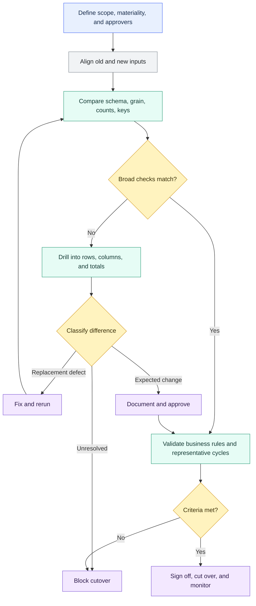

# Audit and Migration Validation

> [!abstract] Mental model
> Compare broadly, investigate material differences, and cut over only when every important difference is fixed or accepted.

## Executive Summary

- **What it is:** A layered comparison of old and new data products using aligned inputs, schema checks, population and key-set checks, row and column diffs, aggregate reconciliation, business controls, parallel runs, and documented sign-off.
- **Why it matters:** Translated SQL and successful execution do not prove equivalent results. A safe migration needs evidence that material outputs, edge cases, operational timing, and downstream consumers behave as approved.
- **Mental model:** **Start broad, drill into differences, classify each material difference, and cut over only when unexplained risk is zero or formally accepted.**
- **Best used when:** Refactoring SQL, replacing a legacy ETL tool, moving warehouses, rebuilding financial models, changing materializations, modifying incremental logic, or migrating a report or regulatory data product.
- **Avoid or reconsider when:** The comparison inputs are not aligned, the legacy result is treated as truth despite known defects, acceptance rules are invented after results appear, or samples are presented as complete proof for a material migration.

## What It Can Do

- Confirm whether old and new relations have the expected structure and grain.
- Compare row counts overall and by date, entity, currency, status, or other important segments.
- Find missing, additional, and duplicate business keys.
- Classify records as identical, added, removed, or modified.
- Identify which columns differ and inspect representative mismatches.
- Reconcile financial totals, balances, volumes, and other control figures.
- Separate intended improvements from legacy defects, replacement regressions, and unresolved policy questions.
- Turn unacceptable differences into dbt data-test failures and cutover gates.
- Preserve repeatable SQL, test results, artifacts, approvals, and exception records as migration evidence.
- Support parallel runs over ordinary and exceptional business cycles before legacy retirement.

## What It Cannot Do

- Prove correctness merely because overall row counts or checksums match.
- Decide that a legacy behavior is correct, intentional, or still required.
- Compare changing systems fairly when they processed different source snapshots, time windows, or late-arriving records.
- Reliably perform row-level comparison without a stable unique and non-null key or another deliberate matching strategy.
- Make technical timestamps, float values, time zones, null semantics, or differently named fields comparable without normalization.
- Replace unit tests for specific SQL rules, data tests on the new output, performance testing, user acceptance, or business sign-off.
- Make sampling sufficient evidence for complete financial or regulatory reconciliation.
- Guarantee that a package macro, result table, or successful dbt command meets the client's audit-evidence standard.
- Define materiality, approve exceptions, communicate impact, execute cutover, or provide rollback by itself.

## Core Concepts

| Concept | Meaning | Why it matters |
|---|---|---|
| Audit validation | Repeatable control showing that data satisfies a defined rule | Produces evidence beyond informal inspection |
| Migration validation | Time-bounded proof that a replacement is safe to cut over | Connects technical comparisons to a go/no-go decision |
| Comparison scope | Exact source snapshot, cutoff, filters, history window, and population included | Different scopes create false discrepancies and false confidence |
| Structural parity | Expected columns, data types, precision, scale, and grain align | Prevents interface and semantic incompatibility |
| Population parity | Expected records exist in both results | Row count alone is insufficient; key membership matters |
| Stable comparison key | Unique and non-null identifier used to align corresponding records | Prevents many-to-many joins and misleading row diffs |
| Row-level diff | Comparison of aligned business attributes for each key | Finds calculation and classification changes hidden by totals |
| Reconciliation | Comparison of counts, amounts, balances, or control totals | Tests business completeness and financial integrity |
| Business invariant | Relationship that must remain true, such as opening plus activity equals closing | Validates meaning even when implementations differ |
| Expected difference | Approved and documented change between old and new behavior | Prevents intentional improvements from being mistaken for defects |
| Unexplained difference | Difference with no validated cause or approval | Material unexplained differences should block cutover |
| Materiality | Business significance of a difference by value, risk, or consumer impact | A single high-value mismatch may outweigh many trivial differences |
| Parallel run | Old and new pipelines operate over the same representative cycles | Exposes timing, late-data, incremental, and period-end behavior |
| Cutover gate | Pre-agreed evidence and approvals required before consumers switch | Converts comparison activity into a controlled decision |
| Rollback readiness | Ability and authority to restore the legacy route or prior state | Limits impact if post-cutover behavior is unacceptable |

## How It Works (Simple Flow)

1. Inventory consumers, contracts, critical calculations, known legacy defects, service commitments, owners, and cutover risk.
2. Define acceptance criteria before comparison: exact-match fields, tolerated measures, materiality thresholds, representative cycles, evidence, approvers, and rollback triggers.
3. Align both paths to the same source snapshot, cutoff time, history window, filters, time zone, and late-arriving-data treatment.
4. Compare structure, grain, overall and segmented counts, duplicates, and key membership.
5. Compare row and column values, then reconcile financial totals and business invariants.
6. Normalize approved technical differences and classify every remaining material difference as intended change, legacy defect, replacement defect, or unresolved question.
7. Repeat the controls through normal days, corrections, late arrivals, month-end or quarter-end, and other relevant cycles.
8. Preserve results and approvals, confirm monitoring and rollback, cut over deliberately, and retire the legacy path only after the agreed stability period.

## Visuals



## Readable Snippets

### Finance control-total comparison

Compare the same posting window and return only groups that do not reconcile:

```sql
-- tests/reconcile_legacy_and_dbt_payments.sql

with legacy as (

    select
        posting_date,
        currency_code,
        count(*) as transaction_count,
        sum(payment_amount) as total_amount
    from legacy_finance.payments
    where posting_date between '2026-06-01' and '2026-06-30'
    group by posting_date, currency_code

),

replacement as (

    select
        posting_date,
        currency_code,
        count(*) as transaction_count,
        sum(payment_amount) as total_amount
    from {{ ref('fct_payments') }}
    where posting_date between '2026-06-01' and '2026-06-30'
    group by posting_date, currency_code

)

select
    coalesce(l.posting_date, r.posting_date) as posting_date,
    coalesce(l.currency_code, r.currency_code) as currency_code,
    l.transaction_count as legacy_count,
    r.transaction_count as replacement_count,
    l.total_amount as legacy_amount,
    r.total_amount as replacement_amount
from legacy l
full outer join replacement r
    using (posting_date, currency_code)
where
    l.transaction_count is distinct from r.transaction_count
    or l.total_amount is distinct from r.total_amount
```

Because a singular data test passes only when it returns zero rows, every result is a posting-date and currency group requiring investigation.

### The comparison ladder for the same model

```text
1. Same columns and business grain?
2. Same overall and daily row counts?
3. Same payment_id population, with no duplicates?
4. Same amount, currency, posting date, and status per payment?
5. Same totals by day, currency, entity, and status?
6. Same reversal, cancellation, correction, and late-arrival behavior?
7. Same downstream report and control outcomes?
```

Matching totals cannot prove matching records: an omitted `+100` transaction and an omitted `-100` transaction cancel in the aggregate. Key-set and row-level checks cover that blind spot.

### Classify row-level differences with `audit_helper`

`audit_helper` is an optional dbt package that generates comparison SQL:

```sql


{{ audit_helper.compare_and_classify_relation_rows(
    a_relation = legacy_relation,
    b_relation = ref('fct_payments'),
    primary_key_columns = ['payment_id'],
    columns = [
        'payment_id',
        'posting_date',
        'currency_code',
        'payment_amount',
        'payment_status'
    ]
) }}
```

The output classifies keys as identical, added, removed, or modified and includes diagnostic samples. The relation macro expects comparable column names; use query-based comparison when fields must first be renamed, filtered, cast, rounded, or time-zone normalized.

Before relying on this comparison, test that `payment_id` is unique and non-null in both populations. A bad join key can make the audit itself misleading.

### Turn comparison output into a gate

An audit macro generates results; it does not necessarily fail a job by itself. Wrap unacceptable results in a singular test:

```sql
{{
    audit_helper.compare_all_columns(
        a_relation = ref('fct_payments'),
        b_relation = api.Relation.create(
            database = 'LEGACY_DB',
            schema = 'FINANCE',
            identifier = 'PAYMENTS'
        ),
        exclude_columns = ['technical_loaded_at'],
        primary_key = 'payment_id'
    )
}}
where not perfect_match
```

The exact failure filter should follow the approved acceptance rule. Pin and review the package version, adapter support, Fusion compatibility, license, security, maintenance activity, and internal support owner before adoption.

### Accepted-differences register

| Difference | Treatment | Evidence and approval |
|---|---|---|
| Technical load timestamp differs | Exclude from business comparison | Technical design record |
| New pipeline stores UTC instead of local time | Normalize before comparison | Approved time-zone mapping |
| Legacy incorrectly included cancelled payments | Expected correction | Defect record and finance-owner approval |
| Decimal scale changes | Compare using explicit rounding or exact approved tolerance | Accounting policy and test results |
| Transaction missing only from the replacement | Unexpected; block cutover | Root-cause investigation required |

Acceptance criteria should be defined before results are known. Do not widen a threshold merely because a mismatch is difficult to fix.

### Where unit tests fit

```text
Unit test:
Given controlled input rows, does the replacement SQL produce the expected result?

Migration audit:
Given aligned real populations, do the legacy and replacement outputs reconcile?
```

Unit tests protect designed rules and edge cases. They complement—but do not replace—comparison of actual migration data.

## Consultant Talking Points

- **Client question this answers:** "What evidence will prove that the replacement is safe to cut over, and who decides whether a difference is acceptable?"
- **Trade-offs to mention:** Exact row-level comparison offers strong evidence but can be costly and noisy. Aggregates and hashes are efficient screening controls but provide limited diagnosis and may hide offsetting errors. Use a layered approach.
- **Risk or governance angle:** Define scope, materiality, approvers, segregation of duties, retained evidence, accepted exceptions, and rollback triggers before validation begins. A developer should not unilaterally approve changes to material finance or regulatory semantics.
- **Cost/performance angle:** Full-history, all-column comparisons can scan large tables repeatedly. Start with schema, segmented aggregates, and key checks; use partition filters, stable snapshots, hashes where appropriate, and targeted row-level drills for differences.

A defensible cutover pack normally includes:

- approved scope, source cutoff, acceptance rules, and materiality;
- old and new code versions and execution identifiers;
- schema, key, row, column, aggregate, and business-control results;
- documented expected differences and unresolved exceptions;
- representative-cycle and performance evidence;
- impacted exposures and consumer acceptance;
- named technical and business approvers;
- monitoring, rollback, post-cutover validation, and legacy-retirement plans.

The most important distinction is: **the legacy output is a comparison baseline, not automatically the truth.** Known legacy defects should be recorded and corrected deliberately rather than reproduced silently or changed without approval.

## Common Pitfalls

- Comparing outputs produced from different source snapshots, cutoffs, filters, or late-arriving populations.
- Checking only total row count and missing offsetting omissions, duplicates, or changed classifications.
- Using a nullable or nonunique comparison key and creating a misleading many-to-many diff.
- Assuming the legacy result is correct simply because it has existed for years.
- Combining platform migration, SQL refactoring, and business-rule redesign without documenting which change caused each difference.
- Ignoring precision, scale, rounding, case, whitespace, null semantics, time zones, and timestamp granularity.
- Excluding difficult columns without a business-approved reason.
- Treating a hash match as the only control or a hash mismatch as sufficient diagnosis.
- Using small samples as final proof for a material or regulated population.
- Validating ordinary daily data but not month-end, quarter-end, reversals, corrections, deletions, history, or late arrivals.
- Tuning tolerances after observing failures rather than from an approved materiality policy.
- Comparing percentages without considering the monetary or customer impact of the mismatched records.
- Running repeated full-table comparisons without partitioning or a cost plan.
- Storing sensitive mismatch rows without appropriate RBAC, masking, retention, and cleanup.
- Assuming `store_failures` provides permanent history; later executions replace the same test's current failure relation.
- Retaining screenshots but not executable SQL, source cutoff, code versions, results, and approval evidence.
- Cutting over without exposure-owner communication, monitoring, rollback authority, or a defined legacy-retirement date.
- Confusing passing unit tests with reconciliation of the actual migrated population.

## When to Recommend What (Decision Table)

| Situation | Recommend | Why | Watch-outs |
|---|---|---|---|
| Small deterministic refactor with identical intended behavior | Exact schema, key, and row comparison | Strongest direct regression evidence | Normalize only genuinely technical fields |
| Large relation requiring quick screening | Segmented counts, control totals, and quick hash comparison | Finds broad issues with lower initial cost | A match does not replace business controls; a mismatch needs diagnosis |
| Differences exist but location is unknown | Column-difference summary followed by targeted row comparison | Narrows investigation efficiently | Use a verified unique and non-null key |
| Renamed, recast, filtered, or redesigned fields | Compare normalized old and new queries | Makes semantics comparable before diffing | Document every normalization so defects are not hidden |
| Finance or regulatory output | Exact key checks, monetary reconciliation, business invariants, parallel run, and formal approval | Produces defensible evidence for material cutover | Cover period-end, corrections, late data, retention, and segregation of duties |
| Known legacy defect should be corrected | Record as expected difference with approved requirement and regression test | Avoids reproducing a known error | Preserve historical-comparability and stakeholder impact decisions |
| New model deliberately changes business meaning | Validate against approved requirements, not only legacy parity | Legacy equivalence would prove the wrong outcome | Separate intended redesign from unexplained implementation differences |
| Incremental pipeline migration | Parallel cycles plus full-refresh and incremental-boundary validation | Static parity can miss merge, deletion, replay, and late-data defects | Test idempotency and backfill behavior |
| No reliable row key exists | Reconcile at defensible aggregate grain and design a matching strategy | Avoids false precision from invalid joins | Record the evidence limitation and strengthen source keys where possible |
| Package use is acceptable | Evaluate and pin `audit_helper` | Provides reusable schema, count, row, and column comparison macros | Review compatibility, maintenance, license, security, and support ownership |
| Long-term recurring control | Convert approved comparisons into dbt tests or reconciliation models | Makes evidence repeatable after migration | Assign severity, owner, alerting, retention, and response process |
| One-time exploratory investigation | Analysis query or audit macro with sampled diagnostics | Fast way to understand differences | Do not confuse exploration with final sign-off evidence |

## Related Topics

- [[02 dbt/03 Testing Documentation and Data Quality/Testing Documentation and Data Quality Overview|Testing Documentation and Data Quality Overview]]
- [[02 dbt/03 Testing Documentation and Data Quality/21 Generic Singular and Custom Data Tests|Generic, Singular, and Custom Data Tests]]
- [[02 dbt/03 Testing Documentation and Data Quality/22 Unit Tests for SQL Logic|Unit Tests for SQL Logic]]
- [[02 dbt/03 Testing Documentation and Data Quality/23 Source Freshness and SLA Monitoring|Source Freshness and SLA Monitoring]]
- [[02 dbt/03 Testing Documentation and Data Quality/27 Test Severity and Failure Handling|Test Severity and Failure Handling]]
- [[02 dbt/02 Modeling Patterns and Layering/17 Refactoring Legacy SQL into dbt|Refactoring Legacy SQL into dbt]]
- [[02 dbt/02 Modeling Patterns and Layering/20 Reconciliation Models|Reconciliation Models]]
- [[02 dbt/05 Deployment CI CD and Operations/45 Artifacts Logs and Run Results|Artifacts, Logs, and Run Results]]

## Related Decision Notes

- [[80 Comparisons and Decision Notes/Decision Notes/dbt/Decisions - Choosing a Legacy SQL-to-dbt Migration Strategy|Decisions - Choosing a Legacy SQL-to-dbt Migration Strategy]]

## Questions

- Is the legacy output trusted, known to contain defects, or merely familiar?
- What exact source snapshot, cutoff, history window, and late-data policy make the two paths comparable?
- What is the grain, and which key is reliably unique and non-null in both systems?
- Which fields require exact equality, normalization, or an approved tolerance?
- Should materiality be measured by record count, percentage, monetary value, customer impact, or regulatory significance?
- Which known differences are expected, and who has authority to approve them?
- Which normal, month-end, correction, deletion, replay, and late-arrival cycles must be covered?
- Which downstream exposures and manual consumers must participate in acceptance?
- What code versions, artifacts, query results, and approvals must be retained?
- What happens when a control fails, and who can authorize cutover, rollback, and legacy retirement?

## Sources To Revisit

- [dbt Labs - dbt-audit-helper repository and usage](https://github.com/dbt-labs/dbt-audit-helper)
- [dbt Package Hub - audit_helper](https://hub.getdbt.com/dbt-labs/audit_helper/latest/)
- [dbt Developer Hub - Data tests](https://docs.getdbt.com/docs/build/data-tests)
- [dbt Developer Hub - Unit tests](https://docs.getdbt.com/docs/build/unit-tests)
- [dbt Developer Hub - store_failures](https://docs.getdbt.com/reference/resource-configs/store_failures)
- [dbt Developer Hub - dbt build](https://docs.getdbt.com/reference/commands/build)
