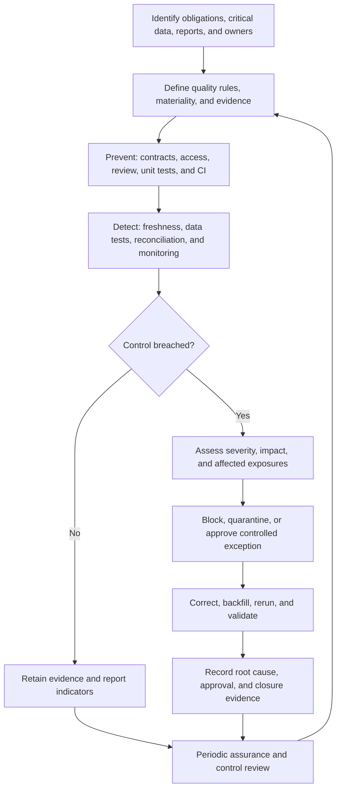

# Data Quality Strategy in Regulated Environments

> Regulated data quality connects critical data to approved rules, accountable owners, automated controls, retained evidence, impact-based escalation, and verified remediation; dbt implements part of this control system but does not create compliance by itself.

## Executive Summary

- **What it is:** A risk-based operating model for identifying critical data, defining acceptable quality, assigning accountability, implementing preventive, detective, and corrective controls, retaining evidence, managing exceptions, and reporting material issues.
- **Why it matters:** A collection of passing dbt tests cannot prove that critical risk, finance, customer, or regulatory data is complete, accurate, timely, traceable, approved, and properly handled when a control fails.
- **Mental model:** **The rule detects a problem; the control defines scope, ownership, execution, evidence, response, and assurance around that rule.**
- **Best used when:** Data supports regulated reporting, financial close, risk decisions, customer treatment, capital or liquidity calculations, privacy obligations, critical operations, or another output whose failure creates legal, supervisory, financial, or reputational risk.
- **Avoid or reconsider when:** The strategy measures success by test count, treats every dataset as equally critical, defines thresholds without business approval, or assumes a technical tool can replace regulatory interpretation and management accountability.

## What It Can Do

- Identify critical data elements, authoritative sources, material data products, and affected reports.
- Define quality across accuracy, integrity, completeness, timeliness, validity, uniqueness, consistency, and adaptability.
- Apply stronger controls, evidence, and oversight to higher-risk data.
- Combine preventive controls such as contracts and CI with detective tests and corrective incident procedures.
- Assign business, stewardship, technical, control, reporting, risk, and assurance responsibilities.
- Connect dbt tests to approved thresholds, severity, alerting, publication gates, and remediation service levels.
- Preserve execution context, results, exceptions, impact assessments, approvals, and recovery evidence.
- Track issues from detection through root cause, correction, backfill, validation, and closure.
- Provide management with meaningful indicators and material exceptions rather than a misleading overall pass rate.
- Make manual adjustments, third-party dependencies, packages, and end-user processes visible within the control scope.

## What It Cannot Do

- Guarantee compliance with a law, regulation, supervisory expectation, or internal policy.
- Decide which regulatory framework applies or interpret legal obligations for the institution.
- Make the dbt development team the appropriate owner of business materiality or regulatory risk.
- Prove accuracy solely through `not_null`, `unique`, or accepted-value tests.
- Provide complete lineage through upstream source systems, manual spreadsheets, BI calculations, exports, or downstream operational processes unless those dependencies are captured elsewhere.
- Create immutable long-term evidence merely by leaving artifacts in dbt's local `target/` directory.
- Supply incident management, segregation of duties, privacy governance, business continuity, disaster recovery, or independent assurance by itself.
- Make stored failing rows safe when they contain personal, account, payment, health, or other sensitive data.
- Eliminate all data defects; regulated quality is risk-based control and transparent remediation, not an unsupported promise of perfect data.
- Replace authoritative legal, compliance, risk, finance, security, privacy, or internal-audit judgment.

## Core Concepts

| Concept | Meaning | Why it matters |
|---|---|---|
| Critical data element | Field whose failure can materially affect a report, calculation, decision, customer, or obligation | Receives stronger definition, lineage, controls, and ownership |
| Authoritative source | Approved system or dataset against which a value or population is reconciled | Prevents teams from validating against an unofficial copy |
| Data owner | Business executive accountable for meaning, quality expectations, and risk acceptance | Materiality and tolerance are business decisions |
| Data steward | Person coordinating definitions, monitoring, issues, and remediation across teams | Keeps governance operational rather than purely documented |
| Technical owner | Team implementing and operating the pipeline and technical controls | Owns reliable execution but not unilateral risk acceptance |
| Control owner | Person accountable for control design and ongoing effectiveness | A test can run successfully while the underlying control is poorly designed |
| Preventive control | Stops or reduces the chance of a defect, such as contract, CI, review, or access restriction | Addresses quality before bad data reaches production |
| Detective control | Finds a defect, such as freshness, reconciliation, or data test | Makes actual quality deviations visible |
| Corrective control | Contains impact and restores reliable data through quarantine, backfill, replay, or restatement | Converts detection into recovery |
| Materiality | Significance by value, exposure, customer impact, duration, reporting effect, or regulatory risk | One critical record can matter more than many low-risk defects |
| Data quality indicator | Repeatable measure of a quality dimension and population | Enables trends, thresholds, and management monitoring |
| Control evidence | Retained proof of rule, scope, version, execution, result, exception, response, and approval | Supports reproducibility, audit, and supervisory challenge |
| Issue register | Governed record of severity, root cause, impact, owner, deadline, remediation, and closure evidence | Prevents unresolved exceptions from disappearing into logs or chat |
| Compensating control | Temporary or alternative control reducing risk when the primary design is deficient | Must be documented, risk-based, monitored, and time-bound |
| Segregation of duties | Separation between implementation, risk acceptance, and independent challenge | Reduces self-approval of material changes or exceptions |
| Control assurance | Periodic assessment that controls are both appropriately designed and operating effectively | Passing executions alone do not prove the control addresses the risk |

## How It Works (Simple Flow)

1. Determine the applicable obligations with legal, compliance, risk, finance, privacy, security, and internal-control stakeholders.
2. Inventory critical data elements, authoritative sources, material reports, transformations, manual adjustments, owners, consumers, and third parties.
3. Define quality dimensions, control objectives, populations, frequencies, materiality, warning and error thresholds, evidence, and escalation rules.
4. Implement layered preventive, detective, and corrective controls across ingestion, transformation, publication, and consumption.
5. Execute controls through governed development, CI, production orchestration, monitoring, and access processes.
6. Retain results and context, then report indicators, material limitations, trends, and affected exposures to the appropriate governance bodies.
7. For a breach, assess severity and impact, contain publication, record the issue, remediate, backfill or restate, rerun controls, and obtain closure approval.
8. Periodically review control design, thresholds, ownership, lineage, packages, evidence retention, stress capability, and recurring root causes.

## Visuals



## Readable Snippets

### Example control register

A dbt test becomes a regulated control only when the surrounding intent and accountability are explicit:

| Field | Example |
|---|---|
| Control ID | `DQ-CR-017` |
| Data product | `fct_credit_exposure` |
| Objective | Ensure every reported exposure maps to an approved legal entity |
| Critical data elements | `exposure_id`, `legal_entity_id`, `exposure_amount`, `reporting_date` |
| Authoritative source | Approved legal-entity master |
| Frequency | Every production reporting build |
| Rule | No unmapped material exposure may reach the regulatory output |
| Materiality | Zero unmapped records for in-scope regulatory population |
| Owner | Credit Risk Data Owner |
| Operator | Risk Analytics Engineering |
| Response | Block dependent exposure, alert owner, create issue, assess impact |
| Evidence | Code version, manifest, run results, failing keys, timestamps, incident and sign-off |
| Retention | Per approved regulatory, records-management, and privacy policy |

The same technical test could have different severity for an exploratory model and a regulatory exposure because control response follows business impact, not SQL syntax.

### Layered controls for a critical credit-exposure model

```yaml
models:
  - name: fct_credit_exposure
    description: Approved daily credit exposure population

    config:
      contract:
        enforced: true

    meta:
      data_owner: credit_risk_data_office
      control_id: DQ-CR-017
      criticality: regulatory

    columns:
      - name: exposure_id
        data_type: varchar
        data_tests:
          - not_null:
              config:
                severity: error
          - unique:
              config:
                severity: error

      - name: legal_entity_id
        data_type: varchar
        data_tests:
          - relationships:
              arguments:
                to: ref('dim_legal_entity')
                field: legal_entity_id
              config:
                severity: error
                error_if: "> 0"
                store_failures: true

      - name: exposure_amount
        data_type: number(38, 2)
        data_tests:
          - not_null:
              config:
                severity: error
```

This protects structure, key integrity, relationships, and required amounts. It still does not prove that the exposure amounts are correct or the population is complete; reconciliation and approved calculation tests must cover those risks.

### Reconcile the critical population

```sql
-- tests/reconcile_credit_exposure_control_totals.sql

with source_control as (

    select
        reporting_date,
        legal_entity_id,
        currency_code,
        count(*) as exposure_count,
        sum(exposure_amount) as exposure_total
    from {{ source('risk_control', 'approved_exposure_totals') }}
    group by reporting_date, legal_entity_id, currency_code

),

dbt_output as (

    select
        reporting_date,
        legal_entity_id,
        currency_code,
        count(*) as exposure_count,
        sum(exposure_amount) as exposure_total
    from {{ ref('fct_credit_exposure') }}
    group by reporting_date, legal_entity_id, currency_code

)

select
    coalesce(s.reporting_date, d.reporting_date) as reporting_date,
    coalesce(s.legal_entity_id, d.legal_entity_id) as legal_entity_id,
    coalesce(s.currency_code, d.currency_code) as currency_code,
    s.exposure_count as source_count,
    d.exposure_count as dbt_count,
    s.exposure_total as source_total,
    d.exposure_total as dbt_total
from source_control s
full outer join dbt_output d
    using (reporting_date, legal_entity_id, currency_code)
where
    s.exposure_count is distinct from d.exposure_count
    or s.exposure_total is distinct from d.exposure_total
```

For a material regulatory control, any permitted tolerance must come from an approved materiality policy rather than developer convenience.

### Control layers

```text
Prevent
  Contracts + unit tests + code review + CI + RBAC + package governance

Detect
  Freshness + completeness + validity + reconciliation + observability

Correct
  Publication block + issue + impact assessment + quarantine/backfill
  + rerun + validation + restatement/communication + closure approval
```

### Evidence chain

```text
Approved control definition
  -> Git commit and reviewed change
  -> dbt manifest and compiled logic
  -> run_results, logs, freshness and test results
  -> stored or governed diagnostic records
  -> orchestration and alert record
  -> issue, impact, remediation and rerun evidence
  -> business/control-owner sign-off
```

Local dbt artifacts and stored-failure tables are not automatically a durable audit archive. Each execution can replace local artifacts, and a test's stored failure relation is replaced by later results, so evidence requiring longer retention needs a governed external store.

### Issue-register record

```text
Issue: DQ-2026-0042
Control: DQ-CR-017
Severity: Critical
Detected: 2026-07-22 05:41 UTC
Affected population: 31 exposures / EUR 48.2m
Affected exposure: Daily Credit Risk Regulatory Report
Containment: Publication blocked
Root cause: Legal-entity reference load missed one source partition
Owner and deadline: Reference Data Operations / 08:00 UTC
Correction: Partition replayed and model backfilled
Validation: Reconciliation and descendant build passed
Closure: Credit Risk Data Owner approved at 09:12 UTC
```

The format varies, but severity, quantitative impact, ownership, deadlines, remediation, and closure evidence should remain visible.

## Consultant Talking Points

- **Client question this answers:** "How do we turn dbt tests into a defensible data-quality control framework for critical reports and decisions?"
- **Trade-offs to mention:** Maximum control everywhere is expensive and slows change; weak uniform controls create hidden risk. Classify data and concentrate stronger prevention, evidence, response, and assurance on material flows.
- **Risk or governance angle:** Management and business owners remain accountable for data quality, definitions, materiality, and accepted risk. Technical teams implement and operate controls, while risk, compliance, privacy, security, and audit provide interpretation and challenge according to the institution's model.
- **Cost/performance angle:** Reconciliation, history-wide tests, row-level diagnostics, evidence storage, and frequent monitoring consume compute and storage. Use risk-tiered frequencies, incremental or partition-aware controls, aggregated screening, and targeted diagnostics without weakening the material control objective.

A regulated control should be able to answer:

- **Risk:** What failure is this control intended to prevent or detect?
- **Scope:** Which population, source cutoff, entities, products, and reporting dates are covered?
- **Rule:** What exact condition passes or fails?
- **Materiality:** What warning and error thresholds are approved, and why?
- **Ownership:** Who operates, remediates, accepts risk, and independently challenges it?
- **Response:** Does failure warn, block, quarantine, escalate, restate, or invoke continuity procedures?
- **Evidence:** What proves the correct version ran against the correct population at the correct time?
- **Assurance:** How is design and operating effectiveness reviewed over time?

Current banking guidance reinforces that this is a management and governance concern, not only a technology concern. BCBS 239 remains a foundational framework for accurate, comprehensive, and timely risk aggregation, with continuing attention to governance, lineage, adaptability, and compensating controls. The ECB's RDARR guide emphasizes management accountability, data-quality indicators, impact analysis, issue registers, remediation, and controlled manual workarounds.

## Common Pitfalls

- Measuring maturity by the number of dbt tests instead of the risks and critical populations they cover.
- Testing nulls and duplicates while omitting accuracy, completeness, reconciliation, and approved business calculations.
- Applying one severity policy to experimental staging data and regulatory outputs.
- Allowing developers to define or widen materiality thresholds without business and control-owner approval.
- Treating warning-level defects as harmless even though nobody monitors, owns, or expires them.
- Reporting an overall pass percentage that hides a single material failed control.
- Marking the job successful when source data was stale, incomplete, or outside the expected cutoff.
- Assuming dbt lineage includes source-system logic, spreadsheets, manual adjustments, BI calculations, file exports, and every downstream consumer.
- Storing sensitive failing rows broadly in development or audit schemas without classification, RBAC, masking, retention, and cleanup.
- Relying on local artifacts or `store_failures` as permanent evidence when later executions overwrite them.
- Retaining evidence without the source cutoff, environment, code version, control definition, or affected population needed to reproduce it.
- Fixing production data manually without dual review, change records, audit trail, and validation.
- Closing an incident when the pipeline reruns without quantifying impact, validating descendants, communicating with consumers, or addressing root cause.
- Leaving compensating controls and temporary exceptions in place without an owner, deadline, review, or remediation plan.
- Installing observability or test packages without maintenance, security, licensing, adapter, Fusion, and support-owner review.
- Treating a vendor tool's dashboard as independent assurance of control effectiveness.
- Ignoring third-party and cloud dependencies that support critical data flows.
- Designing controls for normal daily operation but not stress, crisis, period-end, correction, late-data, and continuity scenarios.
- Applying a broad retention rule to personal failing records without considering purpose limitation, minimization, and storage limitation.
- Assuming regulatory scope and evidence expectations are identical across jurisdictions, entities, products, and reports.

## When to Recommend What (Decision Table)

| Situation | Recommend | Why | Watch-outs |
|---|---|---|---|
| Experimental internal model | Basic tests, ownership, and development controls | Keeps feedback proportionate while design changes | Reclassify before it becomes a shared dependency |
| Stable shared mart | Contracts, data tests, documentation, owner, exposure mapping, and monitored severity | Consumers need a dependable interface and response path | Include semantic changes that schema tests cannot detect |
| Regulatory or material finance output | Critical-data inventory, authoritative-source reconciliation, zero or approved materiality, blocking controls, retained evidence, and formal sign-off | Technical correctness and demonstrable governance are both required | Cover manual adjustments, reporting cutoff, downstream distribution, and restatement |
| Critical source delivery | Freshness plus completeness and validity controls | A recent timestamp alone cannot prove the expected population arrived correctly | Align SLA, cutoff, incident response, and business calendar |
| Material calculation logic | Unit tests, data reconciliation, code review, and change approval | Tests designed behavior before production and verifies actual results afterward | Trace expectations to an approved business rule |
| Sensitive failing records | Minimize stored fields and use governed evidence storage | Reduces diagnostic-data exposure | Apply classification, RBAC, masking, retention, and deletion policy |
| Known unresolved platform weakness | Time-bound compensating control with conservative treatment and remediation plan | Reduces risk while the primary control is repaired | Do not let temporary workarounds become permanent architecture |
| Manual adjustment is unavoidable | Dual review, reason code, before-and-after value, timestamp, approver, and downstream reconciliation | Makes intervention transparent and challengeable | Move material recurring work into controlled systems |
| Long-term control evidence required | Archive artifacts, results, issue records, and approvals in a governed store | Supports reproducibility beyond one dbt invocation | Define immutability, access, retention, legal hold, and privacy behavior |
| Cross-team or Mesh data product | Explicit contract, access, owner, versioning, service expectation, and downstream exposure | Clarifies producer-consumer accountability | Project boundaries do not remove enterprise governance obligations |
| Third-party dbt package or observability vendor | Formal dependency and third-party risk assessment | Reuse can improve controls but introduces external risk | Pin versions and assess license, data access, maintenance, compatibility, exit, and support |
| Recurring data-quality issue | Root-cause remediation and control redesign | Repeated alerts show that detection alone is insufficient | Track trend, cumulative impact, and overdue actions |

## Related Topics

- [[02 dbt/03 Testing Documentation and Data Quality/Testing Documentation and Data Quality Overview|Testing Documentation and Data Quality Overview]]
- [[02 dbt/03 Testing Documentation and Data Quality/23 Source Freshness and SLA Monitoring|Source Freshness and SLA Monitoring]]
- [[02 dbt/03 Testing Documentation and Data Quality/25 Exposures|Exposures]]
- [[02 dbt/03 Testing Documentation and Data Quality/26 Model Contracts and Constraints|Model Contracts and Constraints]]
- [[02 dbt/03 Testing Documentation and Data Quality/27 Test Severity and Failure Handling|Test Severity and Failure Handling]]
- [[02 dbt/03 Testing Documentation and Data Quality/28 Audit and Migration Validation|Audit and Migration Validation]]
- [[02 dbt/05 Deployment CI CD and Operations/45 Artifacts Logs and Run Results|Artifacts, Logs, and Run Results]]
- [[02 dbt/05 Deployment CI CD and Operations/48 Incident Response Rollback and Replay|Incident Response, Rollback, and Replay]]
- [[02 dbt/05 Deployment CI CD and Operations/49 Observability with dbt and Snowflake Metadata|Observability with dbt and Snowflake Metadata]]
- [[02 dbt/06 Governance Semantic Layer and Mesh/50 Groups and Ownership|Groups and Ownership]]
- [[02 dbt/06 Governance Semantic Layer and Mesh/57 Metadata Lineage and Catalog Strategy|Metadata, Lineage, and Catalog Strategy]]
- [[02 dbt/06 Governance Semantic Layer and Mesh/59 Sensitive Data and Regulatory Boundaries|Sensitive Data and Regulatory Boundaries]]
- [[02 dbt/07 Packages Macros and Advanced Reuse/66 Package Governance|Package Governance]]

## Related Decision Notes

- [[80 Comparisons and Decision Notes/Decision Notes/dbt/Decisions - Choosing the Right dbt Quality Control|Decisions - Choosing the Right dbt Quality Control]]
- [[80 Comparisons and Decision Notes/Comparisons/dbt/Comparison - Freshness vs Completeness vs Validity vs Reconciliation|Comparison - Freshness vs Completeness vs Validity vs Reconciliation]]
- [[80 Comparisons and Decision Notes/Comparisons/dbt/Comparison - Model Contracts vs Data Tests vs Warehouse Constraints|Comparison - Model Contracts vs Data Tests vs Warehouse Constraints]]

## Questions

- Which obligations, jurisdictions, entities, products, and reports define the control scope?
- Which data elements and data products are critical, and who approved that classification?
- What is the authoritative source and business grain for each material population?
- Which quality dimensions and business invariants address the actual risk?
- Who owns the data, operates the control, accepts exceptions, and provides independent challenge?
- How are monetary, customer, reporting, duration, and regulatory impacts reflected in materiality?
- Which failures warn, block, quarantine, restate, or activate continuity procedures?
- What evidence is retained, where, for how long, and with what privacy and access controls?
- How are manual workarounds, overrides, spreadsheets, and third-party dependencies controlled?
- Can the organization aggregate and report critical data accurately and promptly during stress or an ad-hoc regulatory request?
- How are recurring issues, overdue remediation, accepted risk, and control effectiveness reported to management?
- How often are scope, lineage, thresholds, owners, packages, and control design reviewed?

## Sources To Revisit

- [Basel Committee on Banking Supervision - BCBS 239 principles](https://www.bis.org/publ/bcbs239.htm)
- [Basel Committee on Banking Supervision - 2026 BCBS 239 implementation themes](https://www.bis.org/publ/bcbs_nl36.htm)
- [ECB Banking Supervision - Guide on effective risk data aggregation and risk reporting](https://www.bankingsupervision.europa.eu/ecb/pub/pdf/ssm.supervisory_guides240503_riskreporting.en.pdf)
- [EUR-Lex - Digital Operational Resilience Act, Regulation EU 2022/2554](https://eur-lex.europa.eu/legal-content/EN/TXT/?uri=CELEX:32022R2554)
- [EUR-Lex - General Data Protection Regulation, Regulation EU 2016/679](https://eur-lex.europa.eu/legal-content/EN/TXT/?uri=CELEX:32016R0679)
- [dbt Developer Hub - Data tests](https://docs.getdbt.com/docs/build/data-tests)
- [dbt Developer Hub - Model contracts](https://docs.getdbt.com/docs/mesh/govern/model-contracts)
- [dbt Developer Hub - Exposures](https://docs.getdbt.com/docs/build/exposures)
- [dbt Developer Hub - Test severity](https://docs.getdbt.com/reference/resource-configs/severity)
- [dbt Developer Hub - store_failures](https://docs.getdbt.com/reference/resource-configs/store_failures)
- [dbt Developer Hub - run results JSON](https://docs.getdbt.com/reference/artifacts/run-results-json)
