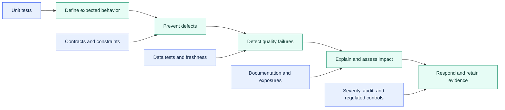

# Testing Documentation and Data Quality Overview

> [!abstract] Chapter outcome
> Build a practical trust layer around dbt with tests, freshness, documentation, contracts, impact visibility, and risk-based quality controls.

## Topics

- [[02 dbt/03 Testing Documentation and Data Quality/21 Generic Singular and Custom Data Tests|21 - Generic, Singular, and Custom Data Tests]]
- [[02 dbt/03 Testing Documentation and Data Quality/22 Unit Tests for SQL Logic|22 - Unit Tests for SQL Logic]]
- [[02 dbt/03 Testing Documentation and Data Quality/23 Source Freshness and SLA Monitoring|23 - Source Freshness and SLA Monitoring]]
- [[02 dbt/03 Testing Documentation and Data Quality/24 Documentation Blocks and Catalog|24 - Documentation Blocks and Catalog]]
- [[02 dbt/03 Testing Documentation and Data Quality/25 Exposures|25 - Exposures]]
- [[02 dbt/03 Testing Documentation and Data Quality/26 Model Contracts and Constraints|26 - Model Contracts and Constraints]]
- [[02 dbt/03 Testing Documentation and Data Quality/27 Test Severity and Failure Handling|27 - Test Severity and Failure Handling]]
- [[02 dbt/03 Testing Documentation and Data Quality/28 Audit and Migration Validation|28 - Audit and Migration Validation]]
- [[02 dbt/03 Testing Documentation and Data Quality/29 Data Quality Strategy in Regulated Environments|29 - Data Quality Strategy in Regulated Environments]]

## Chapter Map

## Topic Summaries

| Topic | What it unlocks |
|---|---|
| [[02 dbt/03 Testing Documentation and Data Quality/21 Generic Singular and Custom Data Tests\|21 - Data Tests]] | Turn data assumptions into repeatable SQL assertions. |
| [[02 dbt/03 Testing Documentation and Data Quality/22 Unit Tests for SQL Logic\|22 - Unit Tests]] | Validate SQL behavior with controlled inputs before production builds. |
| [[02 dbt/03 Testing Documentation and Data Quality/23 Source Freshness and SLA Monitoring\|23 - Freshness and SLAs]] | Separate successful transformation from timely upstream delivery. |
| [[02 dbt/03 Testing Documentation and Data Quality/24 Documentation Blocks and Catalog\|24 - Documentation and Catalog]] | Make definitions, lineage, and ownership discoverable. |
| [[02 dbt/03 Testing Documentation and Data Quality/25 Exposures\|25 - Exposures]] | Connect dbt assets to downstream uses, owners, and business impact. |
| [[02 dbt/03 Testing Documentation and Data Quality/26 Model Contracts and Constraints\|26 - Contracts and Constraints]] | Protect stable producer-consumer interfaces. |
| [[02 dbt/03 Testing Documentation and Data Quality/27 Test Severity and Failure Handling\|27 - Severity and Failure Handling]] | Match quality responses to business risk. |
| [[02 dbt/03 Testing Documentation and Data Quality/28 Audit and Migration Validation\|28 - Audit and Migration Validation]] | Prove that refactors and migrations preserve approved outcomes. |
| [[02 dbt/03 Testing Documentation and Data Quality/29 Data Quality Strategy in Regulated Environments\|29 - Regulated Data Quality]] | Connect technical checks to ownership, evidence, and assurance. |

## How To Use This Area

Start with data tests and unit tests, then move through freshness, documentation, exposures, and contracts. Finish with severity, migration validation, and regulated quality strategy to connect technical controls to operational response.

## Related Areas

- [[02 dbt/dbt Learning Map|dbt Learning Map]]
- [[02 dbt/02 Modeling Patterns and Layering/Modeling Patterns and Layering Overview|Previous: Modeling Patterns and Layering]]
- [[02 dbt/04 Incremental Processing and Performance/Incremental Processing and Performance Overview|Next: Incremental Processing and Performance]]
